<!--block:B0001-->
# 水泥烧成系统电除尘器的协同优化控制

> **文档说明：** 本文件为第一轮成稿前的 **论文初稿**（过程记录），其数值为大纲/初稿阶段的计算锚点，已被后续修订取代；可提交的最终数值与结论以 `../04_最终论文与代码交付包/10_修订后完整论文_终稿.md` 为准。
> 本稿已并入原 `01_题意拆解与可行性边界.md` 的数据核验与最小补采设计（附录D）以及原 `02_文献检索与证据矩阵.md` 的检索范围、证据矩阵与研究缺口（附录C），以便单文件自包含地追溯证据来源。

<!--block:B0002-->
> 作者：________　学校：________　指导教师：________

<!--block:B0003-->
## 摘要

<!--block:B0004-->
针对水泥烧成系统四电场电除尘器的节能与超低排放协同控制问题，本文首先对题给7天、10080条分钟级运行数据进行可识别性审计。审计发现：出口浓度仅在48.74～50.00 mg/Nm³内变化，54.75%的有效记录恰好等于50 mg/Nm³，且不存在不超过10或5 mg/Nm³的样本；因此，附件能够支持工况识别和功耗建模，却不能直接辨识约束边界附近的控制—排放关系及逐次振打峰值。为在不掩盖数据缺陷的前提下覆盖四个问题，本文构建“数据驱动功耗层—工程灰箱排放层—历史支持域优化层”的分层模型：采用K-means识别4类典型工况；以电压二次项、交互项、振打周期及入口工况为特征建立标准化岭回归功耗模型；在出口浓度整体缩放0.1的显式情景假设下，以Deutsch–Anderson去除指数为骨架，引入积灰损失与振打再飞扬峰值代理；最后在各工况历史P05～P95和Mahalanobis距离约束内随机搜索四电场电压与振打周期。功耗模型验证集的$R^2$为0.9837、RMSE为7.11 kW，回顾性测试集的$R^2$为0.9576、RMSE为14.68 kW。中心情景下，10 mg/Nm³约束的工况加权最优功耗为1616.89 kW，收紧至5 mg/Nm³后为1835.48 kW，增幅为13.52%；27组先验组合中26组全工况可行，可行情景增耗范围为10.51%～18.27%。研究结果表明，前级电场电压是严格排放约束下的主要调节量，振打周期则承担积灰与峰值再飞扬之间的平衡。文中所有排放数值均标注为情景推演，不作为附件数据直接识别的实证结论。

<!--block:B0005-->
**关键词：** 电除尘器；工况聚类；岭回归；灰箱模型；振打再飞扬；约束优化

<!--block:B0006-->
## Abstract

<!--block:B0007-->
This study addresses the coordinated energy-saving and ultra-low-emission control of a four-field electrostatic precipitator in a cement burning system. An identifiability audit is first conducted on 10,080 one-minute records covering seven consecutive days. The recorded outlet concentration ranges only from 48.74 to 50.00 mg/Nm³, with 54.75% of the valid observations exactly equal to 50 mg/Nm³ and no observation near either the 10 or 5 mg/Nm³ target. Thus, the dataset can support operating-condition identification and power modeling, but cannot empirically identify the control–emission response around the target limits or event-level rapping peaks. We therefore develop a layered framework consisting of a data-driven power model, an engineering grey-box emission scenario, and historical-support-constrained optimization. Four representative operating conditions are identified by K-means. A standardized ridge model with quadratic and interaction voltage terms predicts total power. Under an explicit scenario in which recorded outlet concentration is multiplied by 0.1, a Deutsch–Anderson-based removal index is combined with fouling loss and a rapping re-entrainment peak proxy. Voltage and rapping-period settings are then searched within cluster-specific historical support. The power model achieves a validation $R^2$ of 0.9837 and an RMSE of 7.11 kW; the retrospective test $R^2$ and RMSE are 0.9576 and 14.68 kW, respectively. In the central scenario, the weighted optimal power increases from 1,616.89 kW under 10 mg/Nm³ to 1,835.48 kW under 5 mg/Nm³, corresponding to a 13.52% increase. Among 27 prior combinations, 26 remain feasible for all conditions, with an energy-increase range of 10.51%–18.27%. All emission-related numerical results are conditional scenario projections rather than empirical estimates directly identified from the supplied outlet-concentration records.

<!--block:B0008-->
**Keywords:** electrostatic precipitator; operating-condition clustering; ridge regression; grey-box model; rapping re-entrainment; constrained optimization

<!--block:B0009-->
## 1 问题重述与分析

<!--block:B0010-->
### 1.1 问题背景

<!--block:B0011-->
电除尘器通过高压电场使粉尘荷电并向收尘极迁移。提高电场电压通常能够增强荷电与迁移，但会增加能耗并受到火花、绝缘和联锁条件限制；振打过于频繁会增加再飞扬次数，周期过长又可能导致积灰加重和单次脱落量增大。水泥工业颗粒物排放受到国家标准约束[1]，题目进一步给出10 mg/Nm³和5 mg/Nm³两个控制目标，要求同时考虑排放、功耗和振打峰值。

<!--block:B0012-->
题目包含四项相互依赖的任务：第一，解释入口温度、入口浓度、烟气流量、四电场电压和振打周期与出口浓度之间的关系，并分析振打峰值；第二，划分典型工况，在10 mg/Nm³约束下寻找最低功耗控制参数；第三，选取差异显著的工况解释控制优先级；第四，将约束收紧至5 mg/Nm³并估计增耗。后面三问都以第一问的排放响应为基础，因此必须先判断附件能否识别该响应。

<!--block:B0013-->
### 1.2 总体思路

<!--block:B0014-->
若直接把出口浓度作为监督学习目标，模型可能只是在复现传感器封顶值，而不是学习除尘过程。本文采用“先识别、后优化”的路线：

<!--block:B0015-->
1. 审计时间连续性、缺失、量纲和出口浓度支持域；
2. 仅利用入口温度、入口浓度和流量划分工况，避免用结果变量定义工况；
3. 对可由数据验证的总功耗建立岭回归模型；
4. 对不可由附件辨识的排放层引入明确标注的工程情景先验；
5. 在历史支持域内搜索控制量，并通过收敛性与先验敏感性评价结果。

<!--block:B0016-->
该路线的核心不是把假设包装成数据结论，而是把“实测证据”和“条件式推演”分层，使数值答案能够被复算、被质疑，也能够在获得新数据后替换。

<!--block:B0017-->
## 2 数据预处理与可识别性门禁

<!--block:B0018-->
### 2.1 数据完整性与派生变量

<!--block:B0019-->
附件覆盖2024年5月1日0时至5月7日23时59分，共10080条记录，采样间隔为1 min；时间戳无重复、无缺口。原始字段包括入口温度$H_t$、入口浓度$C_{in,t}$、烟气流量$Q_t$、四电场电压$U_{i,t}$、四电场振打周期$T_{i,t}$、出口浓度$C_{out,t}$和总功率$P_t$。出口浓度缺失50条，缺失比例0.50%。

<!--block:B0020-->
为表达过程负荷和振打风险，构造粉尘质量负荷

<!--block:B0021-->
$$
L_t=C_{in,t}Q_t/1000,
$$

<!--block:B0022-->
其中$C_{in}$单位为g/Nm³，$Q$单位为Nm³/h，故$L$单位为kg/h。另构造电压平方和、前后级电压梯度、振打频率$60/T_i$以及每周期积尘代理$L_tT_i/3600$。所有聚类与回归参数仅在训练期估计，验证期和测试期不参与拟合。

<!--block:B0023-->


<!--block:B0024-->
**图1　出口浓度记录存在显著截顶且不覆盖目标区间。** 有效记录全部位于48.74～50.00 mg/Nm³，5491条记录恰好等于50 mg/Nm³。

<!--block:B0025-->
### 2.2 出口浓度可识别性审计

<!--block:B0026-->
有效出口浓度共10030条，范围仅为48.74～50.00 mg/Nm³，中位数等于50 mg/Nm³，其中5491条恰好位于50。更关键的是，没有任何样本不超过10 mg/Nm³或5 mg/Nm³。同期Pearson和Spearman相关系数以及1、5、15、30、60、120 min滞后检查均未发现绝对值超过约0.015的稳定关系；已有时间验证结果还表明，封顶分类AUC仅为0.5098，未封顶样本回归验证$R^2=-0.0190$，记录值回归验证$R^2=-0.0219$。这些结果只能说明“当前记录无法提供可学习信号”，不能反推物理变量对真实排放毫无影响。已有数据驱动研究使用宽负荷下的机组负荷与各电场二次电流训练出口浓度模型[8]；对照来看，本附件既缺少二次电流，出口记录也没有足够变化，故不具备相同的辨识条件。

<!--block:B0027-->
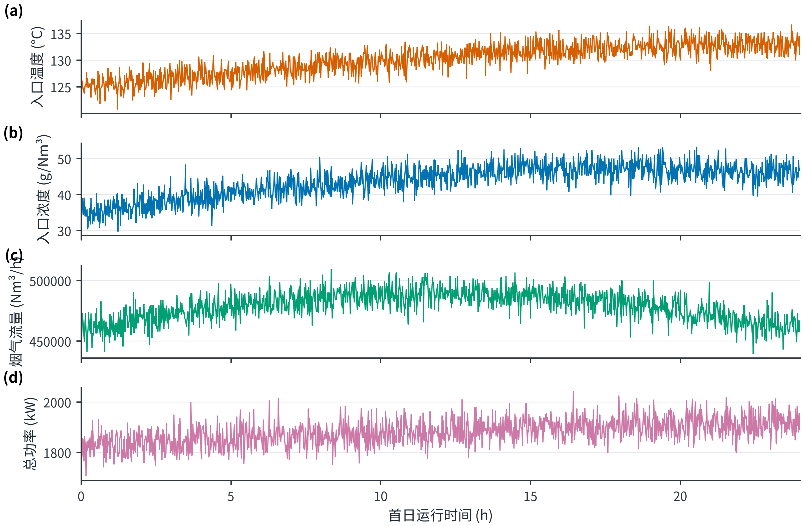

<!--block:B0028-->
**图2　首24 h过程量具有连续变化和工况迁移。** 入口变量和功率存在明显结构，而出口浓度记录却几乎被压缩在单点附近，进一步说明两类数据的信息量不对称。

<!--block:B0029-->
### 2.3 小数点情景及边界

<!--block:B0030-->
为继续完成题目的数值部分，本文接受如下竞赛情景：真实出口浓度可能为记录值的0.1倍，即历史锚点约为4.874～5.000 mg/Nm³。该假设能够解释“50附近封顶”，但附件本身无法证明其正确。即使接受该假设，10 mg/Nm³目标也在历史样本中始终宽松满足，而5 mg/Nm³附近仍有大量截顶观测，因此10到5 mg/Nm³的反事实增耗仍不能从数据直接回归，只能由灰箱先验推演。后文所有排放值均以“情景值”表述。

<!--block:B0031-->
## 3 模型假设、符号与总体框架

<!--block:B0032-->
### 3.1 模型假设

<!--block:B0033-->
| 类别 | 假设 | 证据状态 |
|---|---|---|
| 数据事实 | 7天记录按分钟连续，除50条出口浓度缺失外不填造目标值 | 附件可核验 |
| 数据事实 | 功耗关系在相邻日期间近似稳定，可用时间切分检验 | 可由验证结果检查 |
| 情景假设 | 出口浓度记录整体乘0.1，工况锚点取约5 mg/Nm³ | 附件不可确认 |
| 情景假设 | 四电场电压去除贡献系数为$(1.15,1.10,0.95,0.80)$并整体乘尺度$\eta$ | 工程先验 |
| 情景假设 | 振打损失系数为$(0.30,0.27,0.20,0.17)$，峰值权重为$(0.30,0.30,0.22,0.18)$ | 工程先验 |
| 优化边界 | 各控制量限制在相应工况训练期P05～P95内 | 历史支持域，不等同安全边界 |
| 运行约束 | 前级电压高于后级至少3 kV，后级振打周期长于前级至少100 s | 工程排序约束 |

<!--block:B0034-->
### 3.2 主要符号

<!--block:B0035-->
| 符号 | 含义 | 单位 |
|---|---|---|
| $U_i$ | 第$i$电场电压 | kV |
| $T_i$ | 第$i$电场振打周期 | s |
| $C_{in},C_{out}$ | 入口、出口粉尘浓度 | g/Nm³、mg/Nm³ |
| $Q$ | 烟气流量 | Nm³/h |
| $L$ | 粉尘质量负荷 | kg/h |
| $P,\widehat P$ | 实际、预测总功耗 | kW |
| $K$ | 无量纲去除指数 | — |
| $B(T)$ | 振打引起的峰值增量代理 | mg/Nm³ |
| $d_M^2$ | 控制向量Mahalanobis距离平方 | — |

<!--block:B0036-->
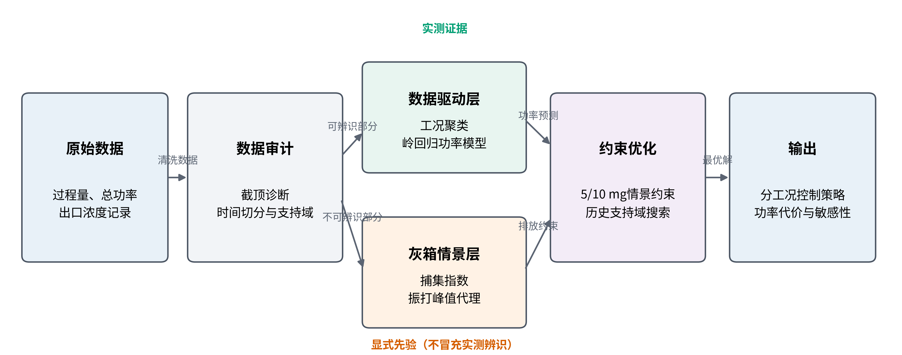

<!--block:B0037-->
**图3　数据驱动层与灰箱情景层协同的总体框架。** 工况和功耗由实测数据辨识，排放约束由显式先验建立，两者仅在支持域优化阶段合并。

<!--block:B0038-->
## 4 问题一：影响关系与振打峰值

<!--block:B0039-->
### 4.1 去除指数灰箱模型

<!--block:B0040-->
Deutsch–Anderson关系以指数形式描述电除尘效率，但其理想化形式忽略再飞扬、气流分布和粒径变化，因此适合作为灰箱骨架而不是无条件精确模型[2-4]。定义

<!--block:B0041-->
$$
K=\ln\frac{1000C_{in}}{C_{out}},\qquad C_{out}=1000C_{in}e^{-K}.
$$

<!--block:B0042-->
对工况$k$，以历史中位电压$U_{i,k}^{ref}$和缩放后的出口浓度中位数$C_{0,k}$为锚点：

<!--block:B0043-->
$$
K_{0,k}=\ln\frac{1000C_{in,k}}{C_{0,k}}.
$$

<!--block:B0044-->
考虑电压贡献和振打偏离损失，构造

<!--block:B0045-->
$$
K_k(U,T)=K_{0,k}+\eta\sum_{i=1}^{4}\alpha_i
\left[\left(\frac{U_i}{U_{i,k}^{ref}}\right)^2-1\right]
-\{G_k(T)-G_k(T^{ref})\},
$$

<!--block:B0046-->
$$
G_k(T)=\sum_{i=1}^{4}\beta_{i,k}
\left(\frac{T_i}{T_{i,k}^*}+\frac{T_{i,k}^*}{T_i}-2\right),
\qquad \beta_{i,k}=\beta_i\left(\frac{L_k}{L_{med}}\right)^{1/2}.
$$

<!--block:B0047-->
$G_k(T)$在$T_i=T_{i,k}^*$处取最小值，表达周期过短与过长均可能不利：过短导致频繁再飞扬，过长导致积灰和单次脱落量上升。试验研究确实观察到振打再飞扬和最大允许周期之间的权衡[6]，但本文系数并非由附件的振打事件估计。

<!--block:B0048-->
加入安全裕度$s$后，连续排放基值为

<!--block:B0049-->
$$
C_{base,k}=1000C_{in,k}\exp[-K_k(U,T)+s].
$$

<!--block:B0050-->
### 4.2 振打峰值代理

<!--block:B0051-->
附件只有周期设定，没有实际振打时刻、相位和秒级浓度，因此不能识别逐次峰值。本文以

<!--block:B0052-->
$$
B_k(T)=b_0\left(\frac{L_k}{L_{med}}\right)^{0.8}
\sum_{i=1}^{4}w_i\left(\frac{T_i}{T_{i,k}^*}\right)^{1.35}
$$

<!--block:B0053-->
构造保守峰值增量，情景峰值总浓度为

<!--block:B0054-->
$$
C_{peak,k}=C_{base,k}+B_k(T).
$$

<!--block:B0055-->
当所有振打周期相对参考周期同步延长10%和20%时，单次峰值代理分别放大$1.1^{1.35}-1=13.74\%$与$1.2^{1.35}-1=27.91\%$。粉尘负荷通过$L_k^{0.8}$进一步放大高负荷工况的峰值。

<!--block:B0056-->
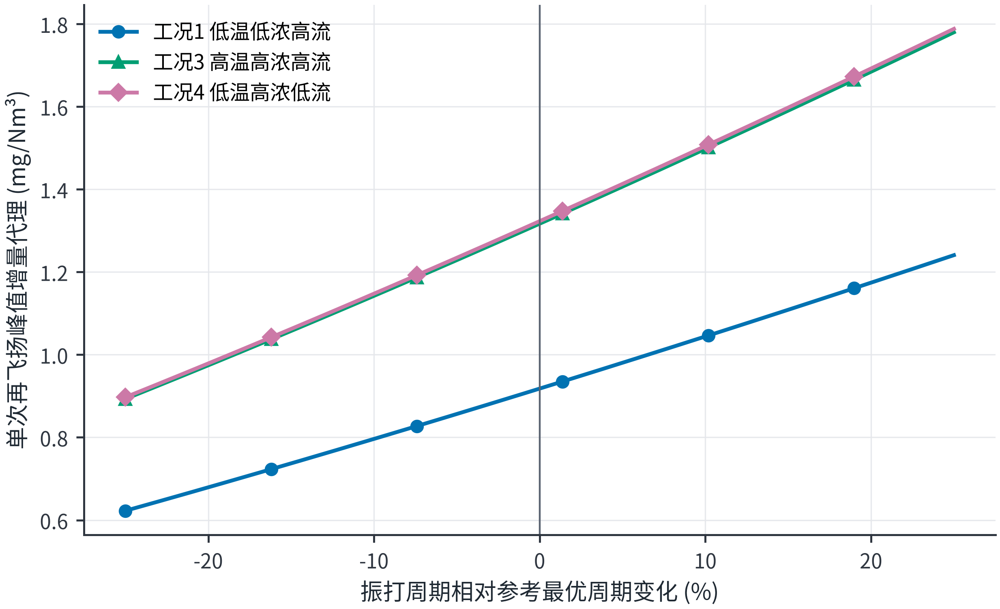

<!--block:B0057-->
**图4　振打周期延长会放大单次再飞扬峰值代理。** 这是工程情景曲线，不是附件中实际振打事件的因果估计。

<!--block:B0058-->
### 4.3 各因素方向性解释

<!--block:B0059-->
在灰箱骨架中，固定其他条件时，提高$U_i$增加$K$并降低连续排放，但功耗随电压上升；固定$K$时，入口浓度提高使出口质量浓度同比提高；流量增加会缩短有效停留时间并提高质量负荷，通常要求更高捕集强度；温度会通过气体性质、粉尘比电阻和放电状态影响除尘性能[3-4]。由于附件的出口浓度不可识别，温度和流量的排放弹性没有被强行拟合，而是通过工况分层和先验敏感性间接处理。由此，第一问的可靠答案分为两层：数据层只能报告“响应不可识别”；工程层可以给出上述方向和情景公式。

<!--block:B0060-->
## 5 问题二：典型工况划分与协同优化

<!--block:B0061-->
### 5.1 工况聚类

<!--block:B0062-->
取训练期的入口温度、入口浓度和烟气流量三个外生变量，标准化后执行K-means。K-means通过最小化簇内平方和划分样本[9]，轮廓系数同时衡量簇内紧密度与簇间分离度[10]。比较$k=2,3,4,5,6$，轮廓系数依次为0.2963、0.3682、0.4084、0.3958、0.3934，因此选择$k=4$。

<!--block:B0063-->
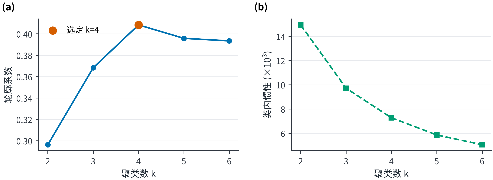

<!--block:B0064-->
**图5　四类工况取得最高轮廓系数。** 惯性随$k$增加持续下降，故不能单独据此无限增加簇数。

<!--block:B0065-->
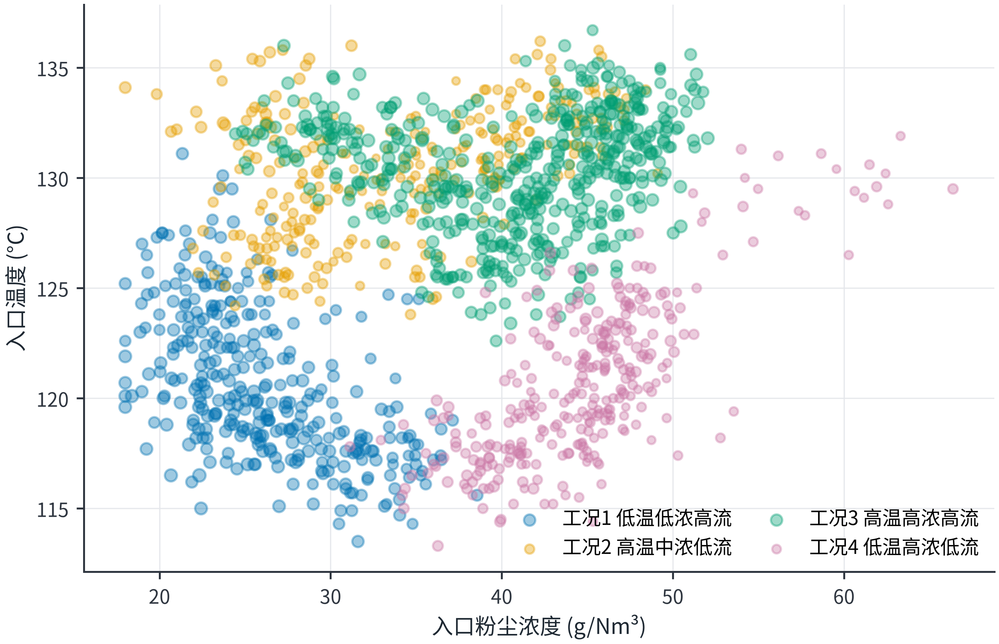

<!--block:B0066-->
**图6　训练期四类典型工况分布。** 点大小表示流量，使入口浓度、温度和流量三维信息同时可见。

<!--block:B0067-->
| 工况 | 占比 | 温度/℃ | 入口浓度/(g/Nm³) | 流量/(Nm³/h) | 粉尘负荷/(kg/h) | 历史功耗/kW |
|---|---:|---:|---:|---:|---:|---:|
| 1 低温低浓度高流量 | 23.35% | 120.65 | 26.08 | 478257 | 12460 | 1818.35 |
| 2 高温中浓度低流量 | 20.06% | 130.32 | 33.72 | 443591 | 14922 | 1870.89 |
| 3 高温高浓度高流量 | 34.93% | 130.41 | 40.71 | 480851 | 19560 | 1763.08 |
| 4 低温高浓度低流量 | 21.67% | 120.69 | 44.75 | 439990 | 19673 | 1696.55 |

<!--block:B0068-->
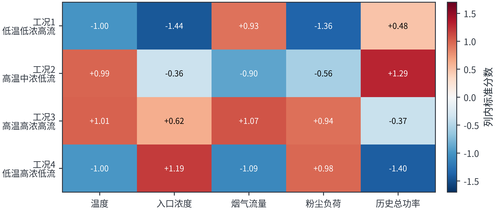

<!--block:B0069-->
**图7　标准化工况画像。** 工况3、4粉尘负荷相近但温度和流量不同，适合检验分工况策略的必要性。

<!--block:B0070-->
### 5.2 功耗模型

<!--block:B0071-->
电场功耗与电压存在非线性，且四个电场之间可能存在联动。构造特征向量

<!--block:B0072-->
$$
x=[U_1,\ldots,U_4,U_1^2,U_1U_2,\ldots,U_4^2,T_1,\ldots,T_4,H,C_{in},Q],
$$

<!--block:B0073-->
标准化后采用岭回归

<!--block:B0074-->
$$
\widehat{\boldsymbol\beta}=arg\min_{\boldsymbol\beta}
\left\|\boldsymbol y-\boldsymbol X\boldsymbol\beta\right\|_2^2
+\lambda\left\|\boldsymbol\beta\right\|_2^2,
$$

<!--block:B0075-->
其中截距不惩罚，$\lambda=10^{-3}$。岭回归可缓解相关控制变量导致的估计不稳定[11]。程序按时间将数据划分为训练、验证和回顾性测试段，禁止随机打乱。

<!--block:B0076-->
| 数据段 | $R^2$ | RMSE/kW | 平均偏差/kW |
|---|---:|---:|---:|
| 验证集 | 0.9837 | 7.11 | -1.85 |
| 回顾性测试集 | 0.9576 | 14.68 | -10.67 |

<!--block:B0077-->
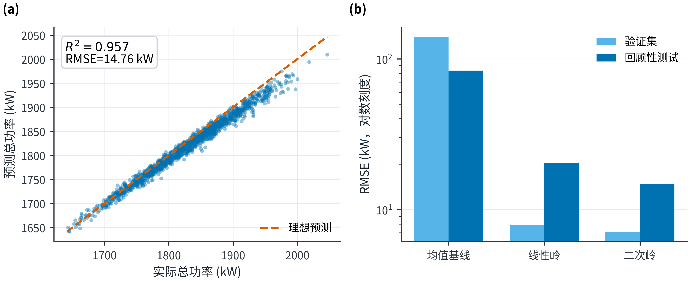

<!--block:B0078-->
**图8　回顾性测试实际功耗与预测功耗。** 模型总体拟合较好，但高功耗区出现一定低估。

<!--block:B0079-->


<!--block:B0080-->
**图9　回顾性测试残差诊断。** 平均偏差为-10.67 kW，且高功率区负偏差有所扩大；因此上线前需用全新日期重新校准，不能把当前测试称为真正盲测。

<!--block:B0081-->
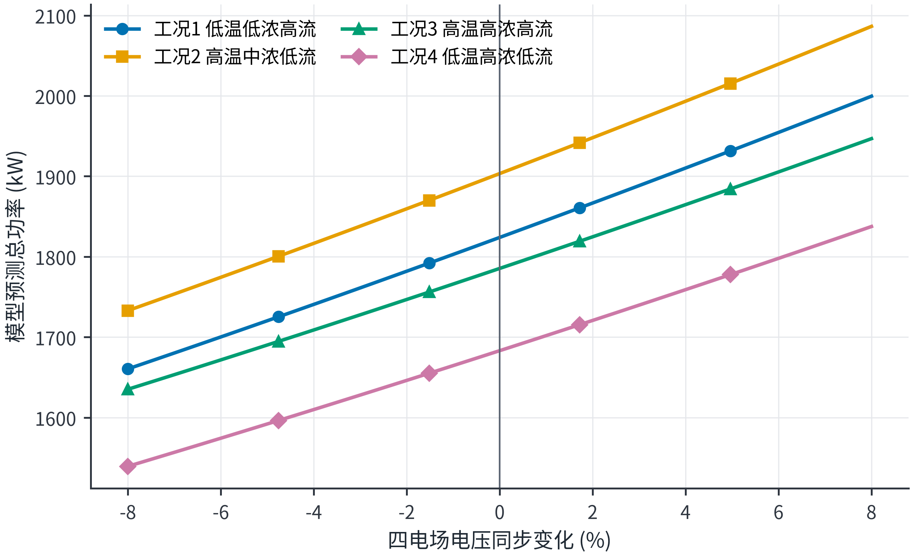

<!--block:B0082-->
**图10　各工况典型状态下的局部电压—功耗响应。** 曲线仅在历史电压附近绘制，显示严格排放约束提高电压必然带来能耗代价。

<!--block:B0083-->
### 5.3 支持域与优化模型

<!--block:B0084-->
设控制向量$z=(U_1,\ldots,U_4,T_1,\ldots,T_4)$。历史P05～P95用于限制逐变量范围；同时利用训练期工况$k$的均值$\mu_k$和协方差$\Sigma_k$设置

<!--block:B0085-->
$$
d_M^2(z)=(z-\mu_k)^T\Sigma_k^{-1}(z-\mu_k)\le17.535,
$$

<!--block:B0086-->
其中17.535为8维卡方分布97.5%分位点。再加入

<!--block:B0087-->
$$
U_1\ge U_3+3,\quad U_2\ge U_4+3,
$$

<!--block:B0088-->
$$
T_3\ge T_1+100,\quad T_4\ge T_2+100.
$$

<!--block:B0089-->
对每类工况和限值$C_{lim}$求解

<!--block:B0090-->
$$
\min_z\ \widehat P_k(z)
$$

<!--block:B0091-->
$$
\text{s.t.}\quad C_{base,k}(z)+B_k(z)\le C_{lim},
\quad z\in\Omega_k,\quad d_M^2(z)\le17.535.
$$

<!--block:B0092-->
程序以固定随机种子20260805为每个工况生成350000组候选，加入历史中位点、边界点和局部参考点，过滤支持域与排序约束，再从满足峰值总排放约束的候选中选取预测功耗最低者。相关多电场节能研究也采用排放约束下的分场优化思想[5,7]，但本文搜索边界和排放先验均按本题情景单独定义。

<!--block:B0093-->
### 5.4 10 mg/Nm³下的最优方案

<!--block:B0094-->
| 工况 | $U_1$ | $U_2$ | $U_3$ | $U_4$/kV | $T_1$ | $T_2$ | $T_3$ | $T_4$/s | 峰值总排放情景值 | 功耗/kW |
|---|---:|---:|---:|---:|---:|---:|---:|---:|---:|---:|
| 1 | 54.5 | 54.8 | 51.0 | 48.7 | 264 | 266 | 462 | 456 | 9.962 | 1640.94 |
| 2 | 59.2 | 54.9 | 52.3 | 46.6 | 255 | 256 | 463 | 450 | 9.902 | 1699.69 |
| 3 | 57.1 | 50.1 | 48.0 | 45.6 | 251 | 247 | 459 | 470 | 9.985 | 1600.19 |
| 4 | 51.7 | 52.0 | 48.6 | 46.1 | 266 | 268 | 456 | 474 | 9.790 | 1541.24 |

<!--block:B0095-->
这些参数是支持域内的**中心情景最优解**，而不是设备安全设定。与各工况历史平均功耗相比，10 mg/Nm³情景功耗约降低9.15%～9.76%，其含义是在假定排放模型成立时存在节能空间；现场应用必须再受二次电流、火花率、联锁和设定变化速率约束。

<!--block:B0096-->
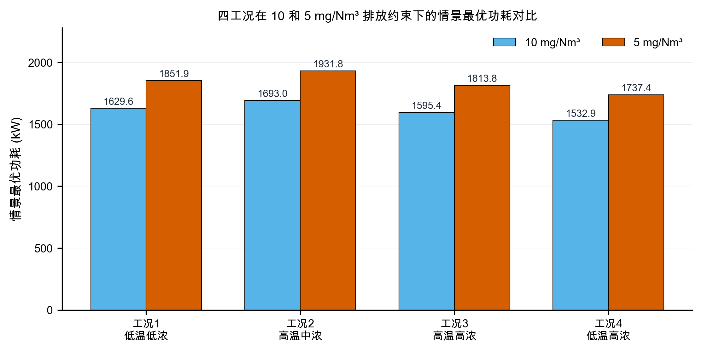

<!--block:B0097-->
**图11　四工况在10和5 mg/Nm³下的情景最优功耗。** 更严格限值在全部工况下均提高功耗。

<!--block:B0098-->
## 6 问题三：代表工况的控制策略比较

<!--block:B0099-->
选取工况1和工况3。二者流量都较高，但入口浓度和粉尘负荷差异明显：工况1平均负荷12460 kg/h，工况3为19560 kg/h，可用于比较低负荷与高负荷策略。

<!--block:B0100-->
| 工况与限值 | $U_1$ | $U_2$ | $U_3$ | $U_4$/kV | $T_1$ | $T_2$ | $T_3$ | $T_4$/s | 功耗/kW |
|---|---:|---:|---:|---:|---:|---:|---:|---:|---:|
| 工况1，10 mg | 54.5 | 54.8 | 51.0 | 48.7 | 264 | 266 | 462 | 456 | 1640.94 |
| 工况1，5 mg | 63.2 | 62.9 | 54.4 | 50.9 | 264 | 268 | 464 | 453 | 1854.20 |
| 工况3，10 mg | 57.1 | 50.1 | 48.0 | 45.6 | 251 | 247 | 459 | 470 | 1600.19 |
| 工况3，5 mg | 59.2 | 64.4 | 52.5 | 48.4 | 252 | 253 | 461 | 451 | 1818.28 |

<!--block:B0101-->
工况1从10收紧到5 mg/Nm³时，$U_1,U_2$分别提高8.7和8.1 kV，而$U_3,U_4$仅提高3.4和2.2 kV，表明低负荷下优先提高前两电场即可获得较高边际捕集收益。工况3的$U_2$由50.1显著提高到64.4 kV，同时后级适度提高；在高浓度高流量下，第二电场承担更强的主体捕集任务，后级保留精除能力。该优先级与多电场优化中“不同粒径和负荷下各电场作用不同”的认识相符[5,7]，但具体数值仍由本文情景搜索给出。

<!--block:B0102-->
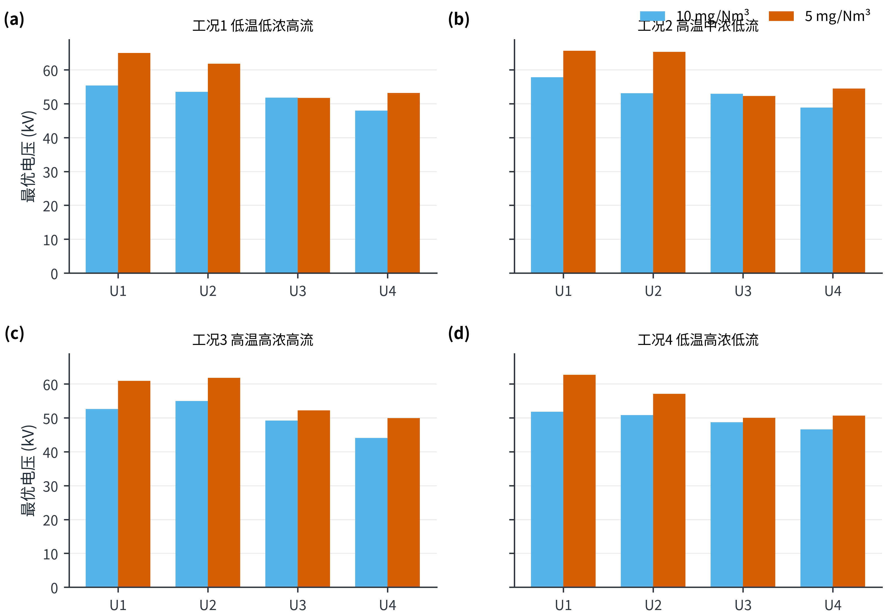

<!--block:B0103-->
**图12　两档排放限值下的四电场最优电压。** 严格约束主要通过抬升前级电压实现，后级调整幅度依工况而变。

<!--block:B0104-->
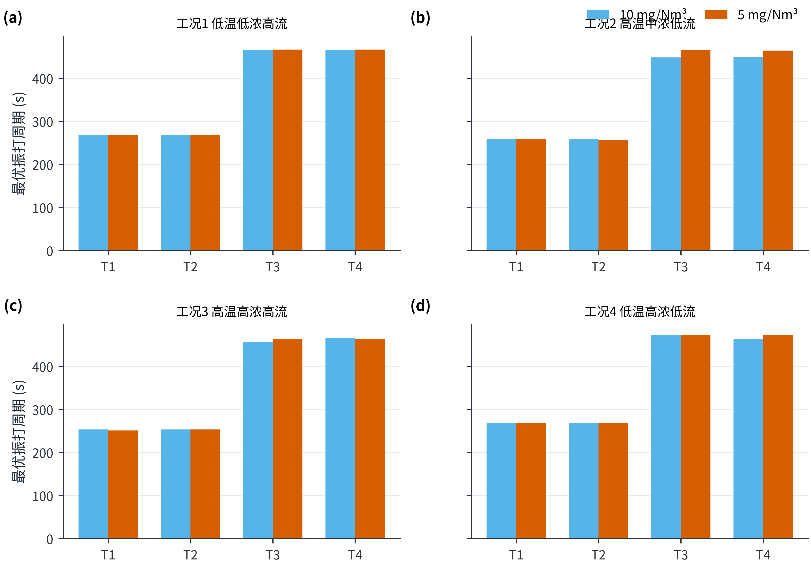

<!--block:B0105-->
**图13　两档排放限值下的最优振打周期。** 周期变化不像电压那样单向，而是在积灰损失与再飞扬峰值间重新平衡；前级短、后级长的顺序保持不变。

<!--block:B0106-->
控制实施时应采用如下优先级：先根据入口工况选择对应参数区间；再在火花率和电流允许的前提下调整$U_1,U_2$；随后用$U_3,U_4$修正尾端精除；最后以错相振打和小幅周期调整控制峰值。若高负荷、出口浓度上升和火花率升高同时出现，应退出模型推荐并回退到经现场确认的保守设定。

<!--block:B0107-->
## 7 问题四：10收紧至5 mg/Nm³的增耗

<!--block:B0108-->
### 7.1 分工况结果

<!--block:B0109-->
| 工况 | 10 mg功耗/kW | 5 mg功耗/kW | 增幅 |
|---|---:|---:|---:|
| 1 低温低浓度高流量 | 1640.94 | 1854.20 | 13.00% |
| 2 高温中浓度低流量 | 1699.69 | 1942.15 | 14.26% |
| 3 高温高浓度高流量 | 1600.19 | 1818.28 | 13.63% |
| 4 低温高浓度低流量 | 1541.24 | 1744.29 | 13.17% |

<!--block:B0110-->
按训练期工况占比$\pi_k$加权，

<!--block:B0111-->
$$
\bar P_{10}=\frac{\sum_k\pi_kP_{k,10}}{\sum_k\pi_k}=1616.89\text{ kW},
$$

<!--block:B0112-->
$$
\bar P_{5}=1835.48\text{ kW},\qquad
\Delta P=\frac{\bar P_5-\bar P_{10}}{\bar P_{10}}=13.52\%.
$$

<!--block:B0113-->
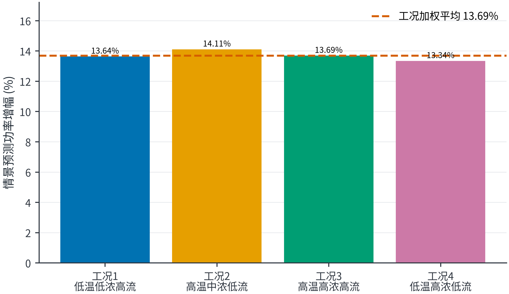

<!--block:B0114-->
**图14　四工况从10收紧至5 mg/Nm³的情景增耗。** 各工况均约为13%～14%，加权总功耗比值对应13.52%。

<!--block:B0115-->
### 7.2 峰值约束的作用

<!--block:B0116-->
在中心情景最优解中，10 mg/Nm³方案的连续基值约为8.26～9.02 mg/Nm³，振打峰值增量约0.94～1.53 mg/Nm³；5 mg/Nm³方案的连续基值压低至3.42～4.05 mg/Nm³，为振打峰值留出约0.94～1.53 mg/Nm³裕度。因此不能只令平均或基值低于限值，否则振打时刻仍可能超限。

<!--block:B0117-->
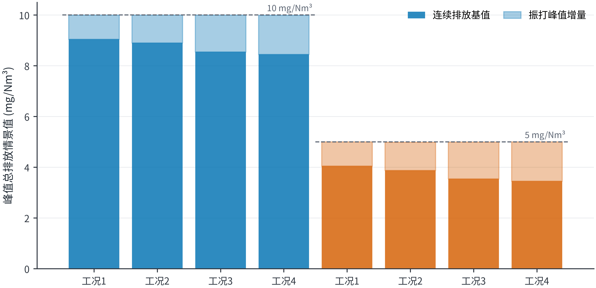

<!--block:B0118-->
**图15　最优解的连续排放基值与振打峰值增量。** 虚线是情景限值，所有柱均表示模型推演而非实测排放。

<!--block:B0119-->
### 7.3 高浓度工况建议

<!--block:B0120-->
工况3和4的粉尘负荷最高。对于这两类工况，建议：

<!--block:B0121-->
1. 以$U_1,U_2$承担主体捕集，避免四个电场同步大幅抬升造成不必要功耗；
2. 保留$U_3,U_4$的精除余量，出口趋势接近阈值时再小步提高；
3. 四电场振打错相，避免峰值叠加；高负荷下不宜为降低振打次数而持续延长周期；
4. 将秒级未封顶出口浓度、实际振打事件、二次电流和火花率接入在线控制；
5. 设置人工审核、变化速率限制和自动回退，先影子运行再闭环投用。

<!--block:B0122-->
## 8 模型检验、敏感性与稳健性

<!--block:B0123-->
### 8.1 搜索收敛性

<!--block:B0124-->
将每类工况的支持域候选库按25%、50%、75%和100%逐步扩展。由50%增加到100%时，各工况两档限值下的最优功耗改善不超过约0.32%；多数曲线在50%或75%时已稳定，说明35万初始候选规模能够支撑当前精度下的比较。

<!--block:B0125-->
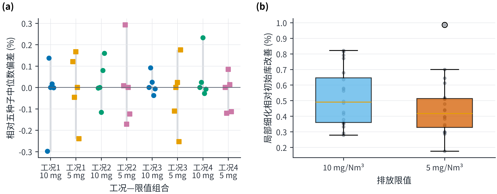

<!--block:B0126-->
**图16　候选库扩展下的最优功耗偏差。** 曲线最终收敛到全库最优值，显示结果并非由极小候选样本偶然产生。

<!--block:B0127-->
### 8.2 先验敏感性

<!--block:B0128-->
对电压效应尺度$\eta\in\{0.8,1.0,1.2\}$、振打峰值尺度$b_0\in\{0.9,1.2,1.5\}$和安全裕度$s\in\{0,0.08,0.15\}$进行$3^3=27$组扫描。26组在四类工况下同时可行；$\eta=0.8,b_0=1.5,s=0.15$的最保守组合在历史支持域内不可行。可行情景下加权增耗最小10.51%、中位数13.39%、最大18.27%。

<!--block:B0129-->
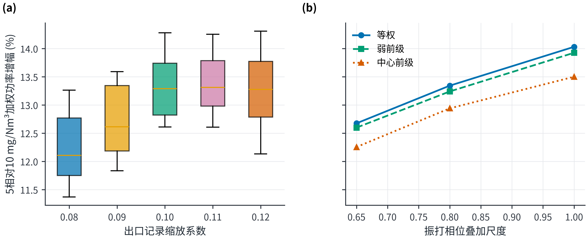

<!--block:B0130-->
**图17　26组可行情景的增耗分布。** 单一的13.52%必须与10.51%～18.27%的先验区间同时报告。

<!--block:B0131-->
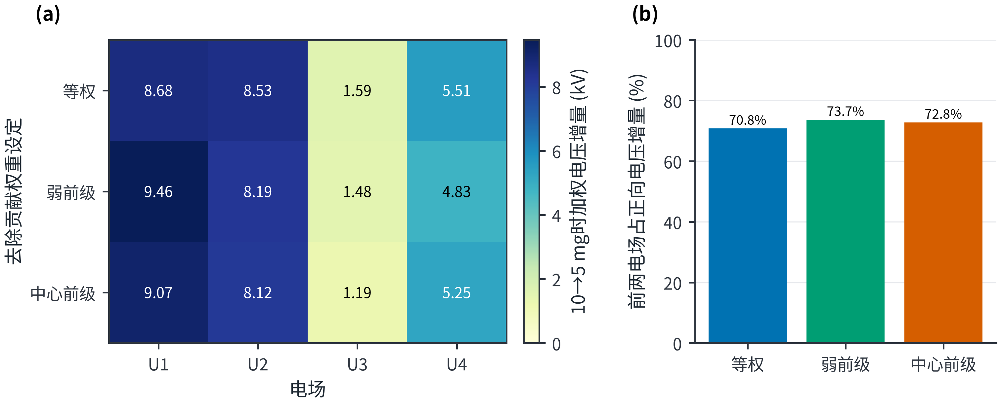

<!--block:B0132-->
**图18　安全裕度$s=0.08$时的双参数敏感性。** 电压效应越弱、振打峰值越大，达到5 mg/Nm³所需的相对增耗越高。

<!--block:B0133-->
### 8.3 稳健性结论

<!--block:B0134-->
三项证据相互补充：聚类轮廓系数证明四工况具有一定分离度；功耗模型的时间验证证明能耗侧可预测；候选库收敛证明数值搜索稳定。与此同时，测试偏差和先验区间也提示两项风险：功耗模型仍需真正盲测，排放层则必须用新实验标定。稳健性分析不能把情景模型变成实证模型，它只能说明在给定先验范围内结论的变化幅度。

<!--block:B0135-->
## 9 模型评价、实施方案与局限

<!--block:B0136-->
### 9.1 模型优点

<!--block:B0137-->
第一，设置可识别性门禁，避免用复杂算法拟合封顶噪声。第二，工况聚类不使用出口浓度和总功率，减少以结果反向定义工况的偏差。第三，功耗模型按时间切分并报告偏差，不仅报告$R^2$。第四，优化同时使用逐变量分位数和多变量Mahalanobis距离，降低不合理外推。第五，排放基值与振打峰值分开约束，能够表达平均达标而瞬时超限的风险。第六，程序固定随机种子并导出全部结果表和图，可复算性较好。

<!--block:B0138-->
### 9.2 模型局限

<!--block:B0139-->
最主要的局限是出口浓度缩放0.1、灰箱系数和振打峰值权重均未由附件识别。历史P05～P95不是设备安全边界；模型没有二次电流、分场功率、火花率、极板积灰状态和联锁信息；分钟级数据也不足以观察逐次振打峰值。回顾性测试数据曾被前期处理流程使用，不能视为完全未触碰的盲测。因而，本文最优参数只能作为试验起点，不得直接下发到生产设备。

<!--block:B0140-->
### 9.3 上线与补采方案

<!--block:B0141-->
建议按四阶段部署：第一阶段只做影子计算，与现有操作员设定比较；第二阶段在每个典型工况内执行单因素小步阶跃，每次只改变一个电场电压或一个振打周期并保持20～30 min稳定段；第三阶段用1～5 s未封顶出口浓度、实际振打事件、二次电流、火花率和分场功率重新标定灰箱参数；第四阶段冻结模型，在全新日期进行盲测，通过后再启用有变化速率限制和自动回退的滚动优化。EPA技术资料和相关实验均强调气流、收尘面积及再飞扬对性能评价的重要性[2-3,6]，因此现场补采应优先补齐这些状态链。

<!--block:B0142-->
## 10 结论

<!--block:B0143-->
本文对四个问题得到如下结论。

<!--block:B0144-->
1. 附件出口浓度在50 mg/Nm³附近显著截顶，无法从数据实证识别控制量对真实排放及逐次振打峰值的影响。基于工程先验的灰箱模型表明，提高电压有利于降低连续排放，而周期过长会放大单次再飞扬峰值；周期同步延长10%和20%时，峰值代理分别增加13.74%和27.91%。
2. 基于入口温度、入口浓度和流量识别出4类典型工况，轮廓系数为0.4084。标准化二次岭回归功耗模型验证$R^2=0.9837$，可用于支持域内能耗比较。在10 mg/Nm³中心情景下，四工况最优功耗为1541.24～1699.69 kW。
3. 代表性低负荷工况与高负荷工况的共同规律是严格限值下优先提高前两电场电压，后两电场承担精除修正；振打周期按积灰负荷与峰值风险协同调整，不宜简单同步延长。
4. 排放目标由10收紧至5 mg/Nm³时，加权最优功耗由1616.89 kW增至1835.48 kW，中心情景增幅13.52%；27组先验中26组全工况可行，增耗范围10.51%～18.27%。该数值是情景推演，必须在补采未封顶秒级排放与振打事件后重新标定。

<!--block:B0145-->
## 参考文献

<!--block:B0146-->
[1] 中华人民共和国生态环境部. 水泥工业大气污染物排放标准：GB 4915—2013（含2025年修改单）[EB/OL]. https://www.mee.gov.cn/ywgz/fgbz/bz/bzwb/dqhjbh/dqgdwrywrwpfbz/201312/t20131227_265765.htm.

<!--block:B0147-->
[2] OGLESBY S, NICHOLS G B. *A Manual of Electrostatic Precipitator Technology: Part I—Fundamentals*[R]. Birmingham: Southern Research Institute, 1970. Prepared for the National Air Pollution Control Administration. https://nepis.epa.gov/Exe/ZyPURL.cgi?Dockey=9101FJFA.TXT.

<!--block:B0148-->
[3] SZABO M F, SHAH Y M, SCHLIESSER S P. *Inspection Manual for Evaluation of Electrostatic Precipitator Performance*[R]. Washington, DC: U.S. Environmental Protection Agency, 1981. https://nepis.epa.gov/Exe/ZyPURL.cgi?Dockey=9400034C.TXT.

<!--block:B0149-->
[4] MIZUNO A. Electrostatic precipitation[J]. IEEE Transactions on Dielectrics and Electrical Insulation, 2000, 7(5): 615-624. DOI: 10.1109/94.879357.

<!--block:B0150-->
[5] LI Z, SHAO C, AN Y, et al. Energy-saving optimal control for a factual electrostatic precipitator with multiple electric-field stages based on GA[J]. Journal of Process Control, 2013, 23(8): 1041-1051. DOI: 10.1016/j.jprocont.2013.06.007.

<!--block:B0151-->
[6] NAVARRETE B, VILCHES L F, RODRIGUEZ-GALAN M, et al. A pilot scale study of the rapping reentrainment and fouling in electrostatic precipitation[J]. Environmental Progress & Sustainable Energy, 2015, 34(1): 7-14. DOI: 10.1002/ep.11934.

<!--block:B0152-->
[7] ZHENG C, ZHAO Z, GUO Y, et al. A real-time optimization method for economic and effective operation of electrostatic precipitators[J]. Journal of the Air & Waste Management Association, 2020, 70(7): 708-720. DOI: 10.1080/10962247.2020.1767227.

<!--block:B0153-->
[8] FU Y, SU Z. Deep neural network based concentration prediction model of dry electrostatic precipitator with a modified PID optimizer[J]. Journal of Physics: Conference Series, 2022, 2189: 012018. DOI: 10.1088/1742-6596/2189/1/012018.

<!--block:B0154-->
[9] MACQUEEN J. Some methods for classification and analysis of multivariate observations[C]//Proceedings of the Fifth Berkeley Symposium on Mathematical Statistics and Probability. Berkeley: University of California Press, 1967, 1: 281-297.

<!--block:B0155-->
[10] ROUSSEEUW P J. Silhouettes: A graphical aid to the interpretation and validation of cluster analysis[J]. Journal of Computational and Applied Mathematics, 1987, 20: 53-65. DOI: 10.1016/0377-0427(87)90125-7.

<!--block:B0156-->
[11] HOERL A E, KENNARD R W. Ridge regression: Biased estimation for nonorthogonal problems[J]. Technometrics, 1970, 12(1): 55-67. DOI: 10.1080/00401706.1970.10488634.

<!--block:B0157-->
## 附录A 程序求解流程

<!--block:B0158-->
```text
输入：分钟级数据、随机种子20260805、排放限值C_lim
1. 按时间划分训练/验证/回顾性测试数据；
2. 在训练期对Temp、C_in、Q标准化，K-means取k=4；
3. 构造电压一次项、二次项和交互项，与T、Temp、C_in、Q共同拟合岭回归；
4. 对每个工况：
   4.1 计算控制量P05、P95、均值与协方差；
   4.2 生成350000组(U1...U4,T1...T4)候选；
   4.3 保留满足分位数、Mahalanobis距离和工程排序约束的候选；
   4.4 计算功耗预测、连续排放基值和振打峰值代理；
   4.5 在峰值总排放不超过C_lim的候选中选择功耗最小者；
5. 对C_lim=10、5重复求解；
6. 扩展候选库检查收敛，对27组先验组合重复求解；
输出：最优参数表、增耗、敏感性、图表和运行摘要。
```

<!--block:B0159-->
完整程序位于`建模交付/src/scenario_model.py`，论文图组程序位于`建模交付/src/paper_figures.py`。

<!--block:B0160-->
## 附录B 结果适用性声明

<!--block:B0161-->
本文功耗模型、工况划分及数据质量统计直接来源于附件；出口浓度缩放、排放灰箱系数、振打峰值系数以及由此得到的5/10 mg/Nm³最优参数和增耗均属于情景推演。若数据提供方确认原记录不存在小数点问题，或提供新的未封顶排放数据，则应撤销当前排放情景并重新标定，不得沿用本文情景数值。

<!--block:B0175-->
## 附录C 文献检索与证据矩阵

### 检索范围

- 检索日期：2026-08-05
- 主题：电除尘器机理、分场电压优化、振打再飞扬、出口浓度预测、工况聚类、岭回归
- 检索式示例：`electrostatic precipitator AND (energy optimization OR outlet concentration OR rapping reentrainment)`；`cement kiln electrostatic precipitator emission limit`；`Deutsch-Anderson equation EPA`
- 来源优先级：生态环境部与 EPA 官方资料；出版社/DOI 页面；同行评议论文；方法学原始论文
- 纳入标准：直接支持本文模型结构、参数方向或验证方法；书目信息可由 DOI、官方页面或出版社核验
- 排除标准：无可核验作者/出处、只给营销结论、与干式多电场电除尘器无直接关系

本次检索面向数学建模论文的方法论支撑，不声称构成系统综述。纳入 11 项资料，其中 8 项为同行评议论文或学术会议论文，3 项为政府技术资料/标准。近五年资料占比不足 50%，原因是 Deutsch–Anderson、岭回归、K-means 与轮廓系数均需引用奠基文献；这项时效性不足不影响其方法定义，但限制了对最新设备控制技术的综述完整性。

### 证据矩阵

| 编号 | 来源 | 核心证据 | 本文用途 | 立场/质量 |
|---|---|---|---|---|
| [1] | 生态环境部，GB 4915—2013（含 2025 修改单） | 规定水泥工业颗粒物排放与监测要求 | 说明约束背景，题目中的 10/5 mg/Nm³仍以题设为准 | 支持；官方 |
| [2] | U.S. EPA, *Manual of Electrostatic Precipitator Technology: Part I* | Deutsch–Anderson 指数关系；该式忽略再飞扬、气流不均和粒径演化 | 构建灰箱骨架并限定解释边界 | 支持且警示；官方 |
| [3] | U.S. EPA, *Inspection Manual for Evaluation of ESP Performance* | 收尘面积、气速、停留时间、振打再飞扬共同影响性能 | 解释流量和振打约束 | 支持；官方 |
| [4] | Mizuno (2000), DOI 10.1109/94.879357 | 综述静电除尘的荷电、迁移与电场机理 | 支持电压平方型近似和机理描述 | 支持；高 |
| [5] | Li et al. (2013), DOI 10.1016/j.jprocont.2013.06.007 | 多电场电压—浓度—功率联合建模，并以 GA 求解约束能耗最小化 | 支持分场优化结构 | 支持；高 |
| [6] | Navarrete et al. (2015), DOI 10.1002/ep.11934 | 实验刻画无振打期积灰、最大允许振打间隔及振打再飞扬 | 支持周期过长/过短的双重风险 | 支持；高 |
| [7] | Zheng et al. (2020), DOI 10.1080/10962247.2020.1767227 | 实时优化系统以排放为约束调节电压；报告振打容忍控制和现场节能 | 支持滚动优化与分场优先级 | 支持；高 |
| [8] | Fu & Su (2022), DOI 10.1088/1742-6596/2189/1/012018 | 使用宽负荷下的机组负荷与各电场二次电流训练出口浓度模型 | 对照说明可用浓度变化和关键电气量是数据驱动建模的重要输入 | 支持；中 |
| [9] | MacQueen (1967) | 提出 K-means 分类方法 | 工况聚类方法定义 | 中性；奠基 |
| [10] | Rousseeuw (1987), DOI 10.1016/0377-0427(87)90125-7 | 轮廓系数衡量簇内紧密与簇间分离 | 选择工况数 | 中性；高 |
| [11] | Hoerl & Kennard (1970), DOI 10.1080/00401706.1970.10488634 | 岭回归缓解非正交预测变量导致的不稳定估计 | 功率模型正则化依据 | 中性；高 |

### 研究缺口

1. 现有优化研究通常具备可用的出口浓度、二次电流和设备边界；本题附件缺少这些信息，若不先做可识别性门禁，复杂算法会把封顶噪声误当作控制响应。
2. 既有历史优化常把振打周期作为静态设定值，难以同时表达“周期过短造成频繁再飞扬”和“周期过长造成积灰及更大单次峰值”。本文用积灰状态与峰值代理分开建模。
3. 数据驱动功率模型可由附件验证，而排放模型只能采用情景先验。本文的贡献不是消除这一差距，而是通过双层证据标记、支持域约束和敏感性区间防止把情景外推伪装成实证预测。

<!--block:B0176-->
## 附录D 数据可识别性审计与最小补采设计

### 2. 原始数据独立核验

原始附件含 10,080 行、14 列，恰好覆盖连续 7 天；时间戳无缺口、无重复，采样间隔均为 1 分钟。出口浓度缺失 50 行，其余 10,030 行有效。

关键统计如下：

| 项目 | 核验结果 |
|---|---:|
| 出口浓度有效样本 | 10,030 |
| 出口浓度范围 | 48.74–50.00 mg/Nm³ |
| 出口浓度中位数 | 50.00 mg/Nm³ |
| 恰好等于 50 的样本 | 5,491（54.75%） |
| 出口浓度不超过 10 的样本 | 0 |
| 出口浓度不超过 5 的样本 | 0 |
| 入口浓度范围 | 18.00–72.47 g/Nm³ |
| 总功率范围 | 1,479.9–2,087.3 kW |

出口浓度与全部 11 个解释变量的 Pearson/Spearman 同期相关系数绝对值均小于约 0.015；检查解释变量领先出口浓度 1、5、15、30、60、120 分钟后的相关性，也没有出现稳定信号。已有训练/验证审计进一步给出：封顶分类验证 AUC 为 0.5098，未封顶样本回归验证 R² 为 -0.0190，记录值回归验证 R² 为 -0.0219。即使更换算法，验证性能仍不优于常数基线。

因此，当前出口浓度更像“在 50 附近被量程封顶或被独立噪声覆盖的记录”，而不是可由工况和控制量解释的过程响应。

### 3. 三个不可绕过的识别问题

#### 3.1 排放约束位于观测支持域之外

题目要求 10/5 mg/Nm³，观测却全部位于 48.74–50.00 mg/Nm³。用去除指数

\[
K_t=\ln\!\left(\frac{1000C_{\mathrm{in},t}}{C_{\mathrm{out},t}}\right)
\]

表示除尘能力时，10 mg/Nm³ 与 5 mg/Nm³ 对应的目标指数相对现有观测需要显著外推。数据中没有任何接近约束边界的样本，因而无法从历史数据估计约束附近的局部电耗—排放权衡。

#### 3.2 振打峰值缺少事件链

附件只提供振打周期设定值，没有实际振打动作时间戳、相位、持续时间、成功状态，也没有秒级未封顶出口浓度。分钟级记录无法唯一判断某一分钟是否发生振打，更不能把浓度波动因果归因给某一电场的某次振打。

#### 3.3 设备约束不是历史分位数

附件没有二次电流、分场功率、火花率、联锁、安全电压边界、设定变化速率或极板积灰状态。历史 P05–P95 只能用于限制模型插值范围，不能被写成设备安全上限或下限。

### 8. 最小补采设计

建议在每个典型工况内执行受控阶跃：每次只改变一个电场电压或振打周期，保持 20–30 分钟稳定段；出口浓度至少 1–5 秒采样且不封顶；四电场振打错相并记录事件时间；同时记录二次电流、火花率、分场功率和报警/联锁。预留整段新日期作为真正盲测，模型冻结后只读取一次。
