# 水泥烧成系统电除尘器的协同优化控制


## 摘要


针对水泥烧成系统四电场电除尘器的节能与超低排放协同控制问题，本文审计7天、10080条分钟级记录。出口浓度有效值全部位于48.74～50.00 mg/Nm³，且未覆盖10或5 mg/Nm³目标区间，故附件只能支持工况和总功率辨识，不能直接识别目标附近的控制—排放响应。本文构建 **“工况聚类—数据驱动功率—工程灰箱排放—历史支持域优化”** 框架，以滚动验证选择二次岭功率模型，以Deutsch–Anderson关系、积灰损失和振打再飞扬代理构造排放情景，并采用5个随机种子和局部细化搜索可行解。功率模型验证集 **R²为0.9837、RMSE为7.12 kW** ，回顾性测试R²为0.9571。在出口记录按0.1缩放、采用中心灰箱参数且控制量位于历史支持域的条件下，10和5 mg/Nm³对应的工况加权功率分别为1609.4和1829.8 kW， **条件式功率增幅约13.7%** 。405组灰箱参数组合情景均可行，功率增幅为 **11.37%～14.31%** ；场权重消融后，前两电场承担 **70.8%～73.7%** 的正向电压增量。所有排放数值均为条件式推演，不作为附件直接识别的实证结论。


**关键词：** 电除尘器；工况聚类；岭回归；灰箱模型；振打再飞扬；约束优化


## 1 问题重述与分析


### 1.1 问题背景


电除尘器通过高压电场使粉尘荷电并向收尘极迁移。提高电场电压通常能够增强荷电与迁移，但会提高运行功率并受到火花、绝缘和联锁条件限制；振打过于频繁会增加再飞扬次数，周期过长又可能导致积灰加重和单次脱落量增大。水泥工业颗粒物排放受到国家标准约束[1]，题目进一步给出10 mg/Nm³和5 mg/Nm³两个控制目标，要求同时考虑排放、总功率和振打峰值。


题目包含四项相互依赖的任务：第一，解释入口温度、入口浓度、烟气流量、四电场电压和振打周期与出口浓度之间的关系，并分析振打峰值；第二，划分典型工况，在10 mg/Nm³约束下寻找最低功率控制参数；第三，选取差异显著的工况解释控制优先级；第四，将约束收紧至5 mg/Nm³并估计功率代价。后面三问都以第一问的排放响应为基础，因此必须先判断附件能否识别该响应。


### 1.2 总体思路


若直接把出口浓度作为监督学习目标，模型可能只是在复现传感器封顶值，而不是学习除尘过程。本文采用 **“先识别、后优化”** 的路线：


1. 审计时间连续性、缺失、量纲和出口浓度支持域；
2. 仅利用入口温度、入口浓度和流量划分工况，避免用结果变量定义工况；
3. 对可由数据验证的总功率建立岭回归模型；
4. 对不可由附件辨识的排放层引入明确标注的工程情景先验；
5. 在历史支持域内搜索控制量，并通过收敛性与先验敏感性评价结果。


该路线的核心不是把假设包装成数据结论，而是把 **“实测证据”与“条件式推演”分层** ，使数值答案能够被复算、被质疑，也能够在获得新数据后替换。


## 2 数据预处理与可识别性门禁


### 2.1 数据完整性与派生变量


附件覆盖2024年5月1日0时至5月7日23时59分，共10080条记录，采样间隔为1 min；时间戳无重复、无缺口。原始字段包括入口温度$H_t$、入口浓度$C_{in,t}$、烟气流量$Q_t$、四电场电压$U_{i,t}$、四电场振打周期$T_{i,t}$、出口浓度$C_{out,t}$和总功率$P_t$。出口浓度缺失50条，缺失比例0.50%。


为表达过程负荷和振打风险，构造粉尘质量负荷


$$
L_t=C_{in,t}Q_t/1000,\qquad\text{(1)}
$$


其中$C_{in}$单位为g/Nm³，$Q$单位为Nm³/h，故$L$单位为kg/h。另构造电压平方和、前后级电压梯度、振打频率$60/T_i$以及每周期积尘代理$L_tT_i/3600$。所有聚类与回归参数仅在训练期估计，验证期和测试期不参与拟合。


出口浓度分布及截顶情况如图1所示。有效记录全部位于48.74～50.00 mg/Nm³，5491条记录恰好等于50 mg/Nm³，数据没有覆盖题设控制目标区间。

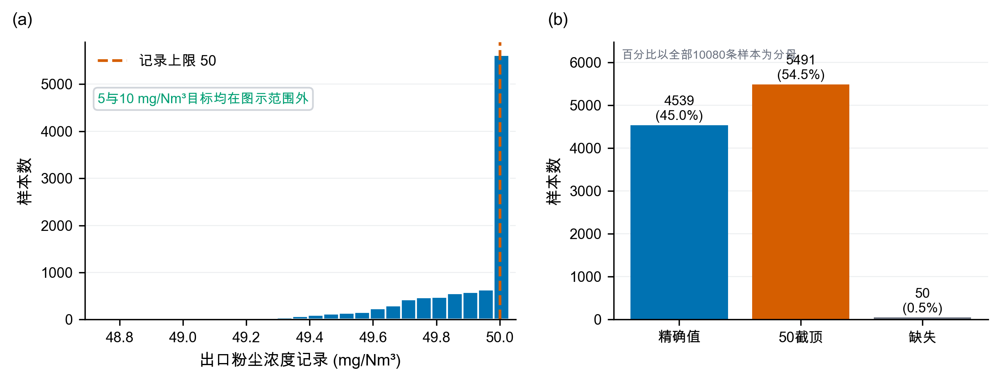


图1　出口浓度数据诊断


### 2.2 出口浓度可识别性审计


有效出口浓度共10030条，范围仅为48.74～50.00 mg/Nm³，中位数等于50 mg/Nm³，其中5491条恰好位于50。更关键的是，没有任何样本不超过10 mg/Nm³或5 mg/Nm³。同期Pearson和Spearman相关系数以及1、5、15、30、60、120 min滞后检查均未发现绝对值超过约0.015的稳定关系；已有时间验证结果还表明，封顶分类AUC仅为0.5098，未封顶样本回归验证$R^2=-0.0190$，记录值回归验证$R^2=-0.0219$。这些结果只能说明“当前记录无法提供可学习信号”，不能反推物理变量对真实排放毫无影响。已有数据驱动研究使用宽负荷下的机组负荷与各电场二次电流训练出口浓度模型[8]；对照来看，本附件既缺少二次电流，出口记录也没有足够变化，故不具备相同的辨识条件。


首24 h过程量的变化如图2所示。入口变量和功率具有连续变化和工况迁移特征，而出口浓度记录几乎被压缩在单点附近，进一步说明两类数据的信息量不对称。

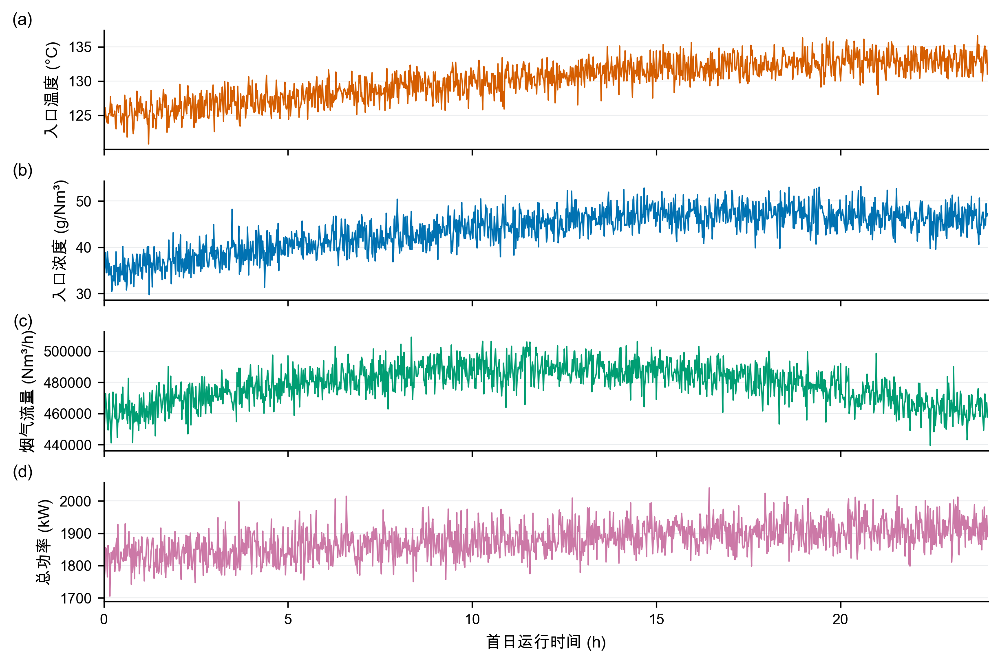


图2　首24 h过程量时序


### 2.3 小数点情景及边界


为继续完成题目的数值部分，本文接受如下竞赛情景：真实出口浓度可能为记录值的0.1倍，即历史锚点约为4.874～5.000 mg/Nm³。该假设能够解释“50附近封顶”，但附件本身无法证明其正确。即使接受该假设，10 mg/Nm³目标也在历史样本中始终宽松满足，而5 mg/Nm³附近仍有大量截顶观测，因此10到5 mg/Nm³的反事实功率增幅仍不能从数据直接回归，只能由灰箱先验推演。后文所有排放值均以“情景值”表述。


## 3 模型假设、符号与总体框架


### 3.1 模型假设


表1　模型假设及证据状态


| 类别 | 假设 | 证据状态 |
|---|---|---|
| 数据事实 | 7天记录按分钟连续，除50条出口浓度缺失外不填造目标值 | 附件可核验 |
| 数据事实 | 功率关系按时间滚动验证，不随机打乱 | 可由验证结果检查 |
| 情景假设 | 中心情景将出口记录整体乘0.10；结构扫描取0.08～0.12 | 附件不可确认 |
| 情景假设 | 电场贡献比较等权、弱前级与中心前级三种形状 | 工程先验与消融 |
| 情景假设 | 振打峰值指数取1.10、1.35、1.60，相位叠加尺度取0.65、0.80、1.00 | 工程结构情景 |
| 优化边界 | 控制量位于工况训练期P05～P95，且Mahalanobis距离不超过历史经验97.5%分位数 | 历史支持域，不等同安全边界 |
| 运行约束 | 前级电压高于后级至少3 kV，后级振打周期长于前级至少100 s | 工程排序约束 |


### 3.2 主要符号


表2　主要符号与单位


| 符号 | 含义 | 单位 |
|---|---|---|
| $U_i$ | 第$i$电场电压 | kV |
| $T_i$ | 第$i$电场振打周期 | s |
| $C_{in},C_{out}$ | 入口、出口粉尘浓度 | g/Nm³、mg/Nm³ |
| $Q$ | 烟气流量 | Nm³/h |
| $L$ | 粉尘质量负荷 | kg/h |
| $P,\widehat P$ | 实际、预测总功率 | kW |
| $K$ | 无量纲去除指数 | — |
| $B(T)$ | 振打引起的峰值增量代理 | mg/Nm³ |
| $\rho$ | 四场振打相位叠加尺度 | — |
| $q_{k,0.975}$ | 工况$k$历史Mahalanobis距离平方的经验97.5%分位数 | — |


本文采用的数据驱动层与灰箱情景层协同框架如图3所示。工况和总功率由实测数据辨识，排放约束由显式先验建立，两者仅在支持域优化阶段合并。

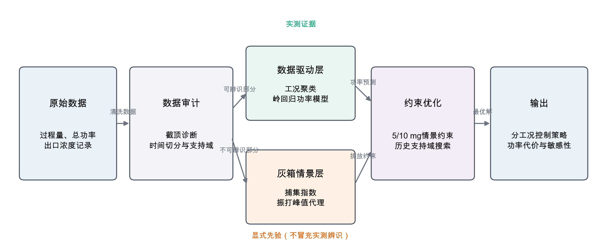


图3　总体方法框架


## 4 问题一：影响关系与振打峰值


### 4.1 去除指数灰箱模型


Deutsch–Anderson关系以指数形式描述电除尘效率，但其理想化形式忽略再飞扬、气流分布和粒径变化，因此适合作为灰箱骨架而不是无条件精确模型[2-4]。White的经典专著[12]与Parker的电除尘器电气运行专著[13]均强调电气运行、粉尘性质与振打之间的系统耦合，这也说明本文系数必须作为待现场标定的工程先验。定义


$$
K=\ln\frac{1000C_{in}}{C_{out}},\qquad C_{out}=1000C_{in}e^{-K}.\qquad\text{(2)}
$$


对工况$k$，以历史中位电压$U_{i,k}^{ref}$和缩放后的出口浓度中位数$C_{0,k}$为锚点：


$$
K_{0,k}=\ln\frac{1000C_{in,k}}{C_{0,k}}.\qquad\text{(3)}
$$


考虑电压贡献和振打偏离损失，构造


$$
K_k(U,T)=K_{0,k}+\eta\sum_{i=1}^{4}\alpha_i
\left[\left(\frac{U_i}{U_{i,k}^{ref}}\right)^2-1\right]
-\{G_k(T)-G_k(T^{ref})\},\qquad\text{(4)}
$$


$$
G_k(T)=\sum_{i=1}^{4}\beta_{i,k}
\left(\frac{T_i}{T_{i,k}^*}+\frac{T_{i,k}^*}{T_i}-2\right),
\qquad \beta_{i,k}=\beta_i\left(\frac{L_k}{L_{med}}\right)^{1/2}.\qquad\text{(5)}
$$


$G_k(T)$在$T_i=T_{i,k}^*$处取最小值，表达周期过短与过长均可能不利：过短导致频繁再飞扬，过长导致积灰和单次脱落量上升。试验研究确实观察到振打再飞扬和最大允许周期之间的权衡[6]，但本文系数并非由附件的振打事件估计。

表3　灰箱排放模型参数来源与证据状态

> 本节全部排放系数均为工程先验，不是由附件出口浓度估计得到的参数。

| 参数 | 中心取值 | 含义 | 来源 | 是否由附件识别 |
|---|---:|---|---|:---:|
| $\eta$ | 1.0 | 电压效应总体尺度 | 情景设定 | 否 |
| $\alpha_i$ | 四场权重 | 电场去除贡献 | 工程先验与消融 | 否 |
| $\beta_i$ | 四场损失系数 | 周期偏离损失 | 工程情景 | 否 |
| $b_0$ | 1.2 | 峰值尺度 | 工程情景 | 否 |
| $\gamma$ | 1.35 | 周期—峰值指数 | 中心情景 | 否 |
| $\rho$ | 1.0 | 相位叠加尺度 | 同相保守情景 | 否 |
| $T_i^*$ | 由历史周期和负荷构造 | 参考振打周期 | 情景构造 | 否 |
| $s$ | 0.08 | 安全裕度 | 工程情景 | 否 |


加入安全裕度$s$后，连续排放基值为


$$
C_{base,k}=1000C_{in,k}\exp[-K_k(U,T)+s].\qquad\text{(6)}
$$


### 4.2 振打峰值代理


附件只有振打周期设定，没有实际振打时刻、相位和秒级浓度，因此不能识别逐次峰值。为区分同相叠加上界与错相运行，本文引入相位尺度$\rho$和峰值指数$\gamma$：


$$
B_k(T;\rho,\gamma)=b_0\rho\left(\frac{L_k}{L_{med}}\right)^{0.8}
\sum_{i=1}^{4}w_i\left(\frac{T_i}{T_{i,k}^*}\right)^\gamma .\qquad\text{(7)}
$$


构造保守峰值增量，情景峰值总浓度为


$$
C_{peak,k}=C_{base,k}+B_k(T).\qquad\text{(8)}
$$


中心情景取$\rho=1$、$\gamma=1.35$，相当于四场峰值同相叠加的保守上界；错相情景取$\rho=0.65$或0.80。中心指数下，所有振打周期同步延长10%和20%时，单次峰值代理分别放大13.74%与27.91%。灰箱参数组合敏感性同时扫描$\gamma\in\{1.10,1.35,1.60\}$，避免把单一指数当作数据辨识结果。


振打周期与单次再飞扬峰值代理的关系如图4所示。周期延长会放大峰值代理，但该曲线仅表示工程情景，不是由附件中实际振打事件识别得到的因果关系。

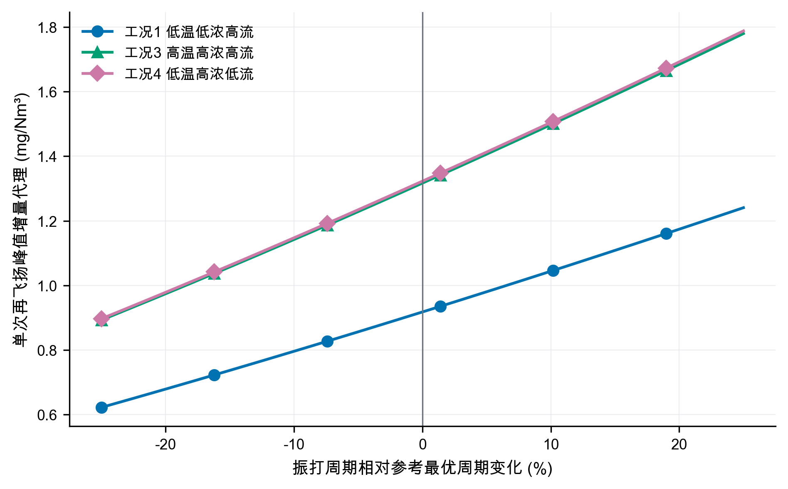


图4　振打峰值情景机理


### 4.3 各因素方向性解释


在灰箱骨架中，固定其他条件时，提高$U_i$增加$K$并降低连续排放，但总功率随电压上升；固定$K$时，入口浓度提高使出口质量浓度同比提高；流量增加会缩短有效停留时间并提高质量负荷，通常要求更高捕集强度；温度会通过气体性质、粉尘比电阻和放电状态影响除尘性能[3-4]。由于附件的出口浓度不可识别，温度和流量的排放弹性没有被强行拟合，而是通过工况分层和先验敏感性间接处理。由此，第一问的可靠答案分为两层：数据层只能报告“响应不可识别”；工程层可以给出上述方向和情景公式。


## 5 问题二：典型工况划分与协同优化


### 5.1 工况聚类


取训练期的入口温度、入口浓度和烟气流量三个外生变量，标准化后执行K-means。K-means通过最小化簇内平方和划分样本[9]，轮廓系数同时衡量簇内紧密度与簇间分离度[10]。比较$k=2,3,4,5,6$，轮廓系数依次为0.2963、0.3682、0.4084、0.3958、0.3934，因此选择$k=4$。轮廓系数0.4084表明聚类分离度中等，四类工况应理解为便于控制决策的统计工况分层，而不是唯一的物理状态划分。


聚类数选择结果如图5所示。四类工况取得最高轮廓系数；惯性随$k$增加持续下降，因此不能仅依据惯性无限增加簇数。


图5　聚类数选择结果


训练期四类典型工况的分布如图6所示，其中点的大小表示烟气流量，从而同时呈现入口浓度、温度和流量三维信息。

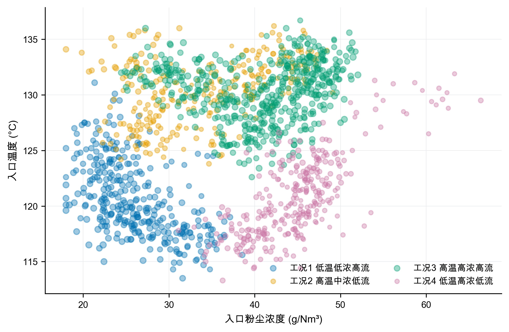


图6　训练期典型工况分布


表4　四类典型工况画像


| 工况 | 占比 | 温度/℃ | 入口浓度/(g/Nm³) | 流量/(Nm³/h) | 粉尘负荷/(kg/h) | 历史总功率/kW |
|---|---:|---:|---:|---:|---:|---:|
| 1 低温低浓度高流量 | 23.35% | 120.65 | 26.08 | 478257 | 12460 | 1818.35 |
| 2 高温中浓度低流量 | 20.06% | 130.32 | 33.72 | 443591 | 14922 | 1870.89 |
| 3 高温高浓度高流量 | 34.93% | 130.41 | 40.71 | 480851 | 19560 | 1763.08 |
| 4 低温高浓度低流量 | 21.67% | 120.69 | 44.75 | 439990 | 19673 | 1696.55 |


标准化工况画像如图7所示。工况3与工况4的粉尘负荷相近，但温度和流量不同，适合用于检验分工况策略的必要性。

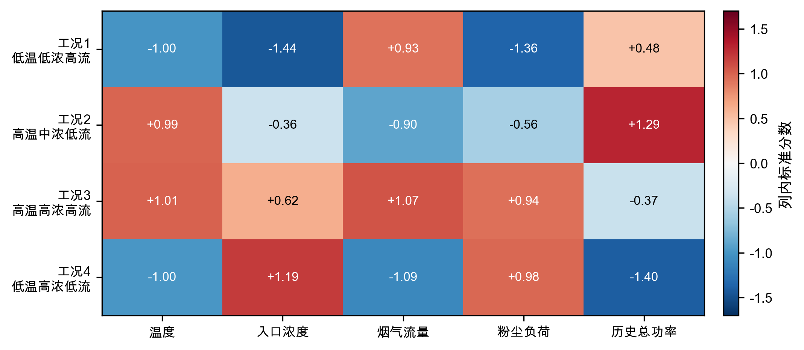


图7　标准化工况画像


### 5.2 功率模型


电场总功率与电压存在非线性，且四个电场之间可能存在联动。构造特征向量


$$
x=[U_1,\ldots,U_4,U_1^2,U_1U_2,\ldots,U_4^2,T_1,\ldots,T_4,H,C_{in},Q],\qquad\text{(9)}
$$


标准化后采用岭回归[11]


$$
\widehat{\boldsymbol\beta}=arg\min_{\boldsymbol\beta}
\left\|\boldsymbol y-\boldsymbol X\boldsymbol\beta\right\|_2^2
+\lambda\left\|\boldsymbol\beta\right\|_2^2,\qquad\text{(10)}
$$


截距不惩罚。在线性岭与二次岭各自的候选正则强度中，按训练期顺序设置3个扩展窗口滚动验证，二次岭选得$\lambda=0.1$，线性岭选得$\lambda=10$。最终模型只用训练期拟合，验证期用于模型比较与误差保护，回顾性测试期不参与选择。验证集绝对误差的90%分位数为11.78 kW，故每个候选同时报告点预测$\widehat P$与附加验证期误差后的功率$\widehat P+11.78$ kW；该附加量不改变候选排序，只用于表示功率预测误差的量级，不保证在后续日期仍具有90%的覆盖率。


表5　功率模型基线与时间外推结果


| 模型 | 数据段 | $R^2$ | RMSE/kW | 平均偏差/kW |
|---|---|---:|---:|---:|
| 均值预测 | 验证集 | -5.3259 | 140.18 | 128.62 |
| 线性岭 | 验证集 | 0.9798 | 7.93 | 0.28 |
| 二次岭 | 验证集 | 0.9837 | 7.12 | -1.87 |
| 均值预测 | 回顾性测试 | -0.3733 | 83.51 | -43.54 |
| 线性岭 | 回顾性测试 | 0.9180 | 20.41 | -16.65 |
| 二次岭 | 回顾性测试 | 0.9571 | 14.76 | -10.78 |


功率模型的回顾性测试结果如图8所示。二次岭回归保持较高预测一致性，并优于均值预测与线性岭基线；左图虚线表示理想预测，右图RMSE采用对数纵轴以同时呈现三种模型的量级差异。

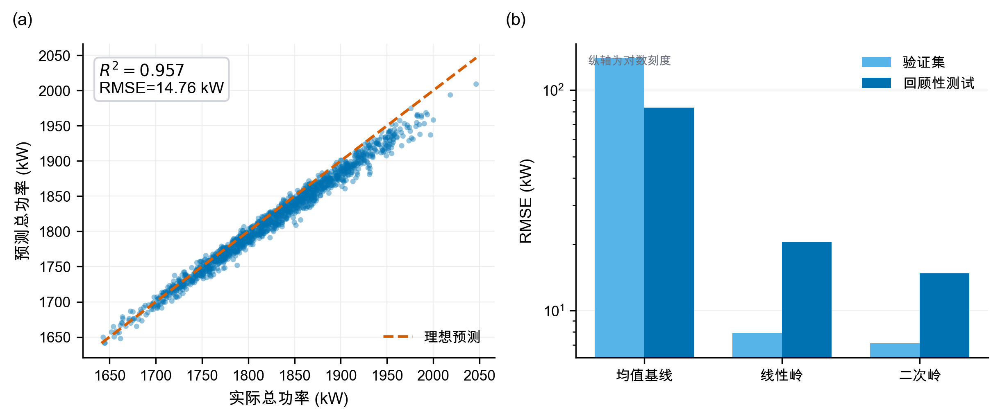


图8　功率模型预测结果

为识别功率预测主要依赖哪些变量，将二次岭模型的标准化系数按绝对值排序，如图9所示。电压、电压平方项及跨电场交互项提供了主要预测信息；由于各变量之间存在相关性，系数大小只用于解释模型的预测结构，**不能直接解释为单变量因果效应**。

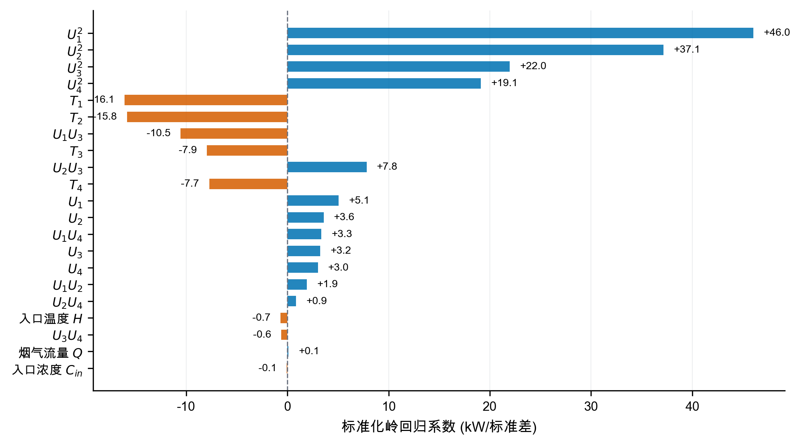

图9　二次岭功率模型的标准化系数


回顾性测试残差如图10所示。平均偏差为-10.78 kW，高功率区负偏差有所扩大；验证绝对误差90%分位数11.78 kW被用作验证期误差附加量。上线前仍需利用全新日期重新校准，不能把当前测试称为真正盲测。

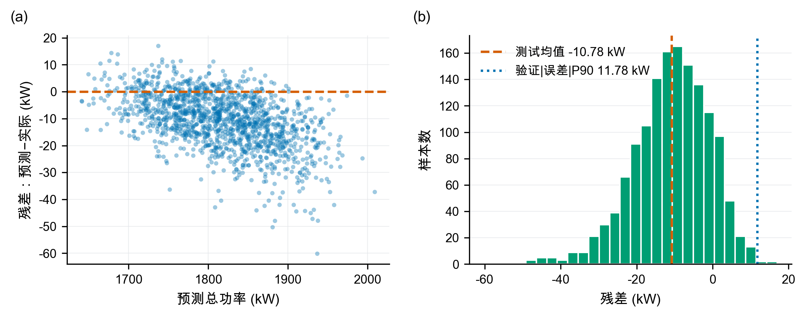


图10　回顾性测试残差诊断


各工况典型状态下的局部电压—功率响应如图11所示。曲线仅在历史电压附近绘制，表明在灰箱情景下，提高电压以满足更严格的排放约束会提高运行功率。

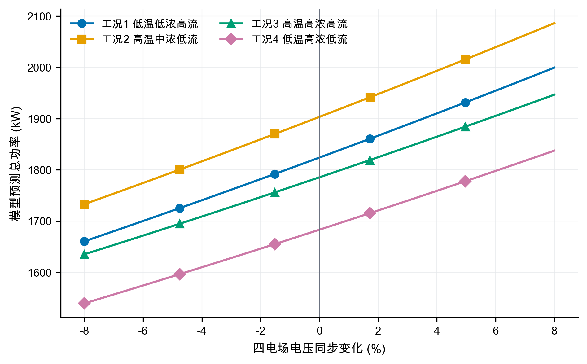


图11　局部电压—功率响应


### 5.3 支持域与优化模型


设控制向量$z=(U_1,\ldots,U_4,T_1,\ldots,T_4)$。历史P05～P95限制逐变量范围；同时用训练期工况$k$的均值$\mu_k$和协方差$\Sigma_k$计算


$$
d_M^2(z)=(z-\mu_k)^T\Sigma_k^{-1}(z-\mu_k)\le q_{k,0.975}.\qquad\text{(11)}
$$


$q_{k,0.975}$直接取该工况历史距离平方的经验97.5%分位数，四工况依次为20.55、18.72、16.85和19.09，不再借用多元正态假设下的统一卡方阈值。另加入


$$
U_1\ge U_3+3,\quad U_2\ge U_4+3,\qquad\text{(12)}
$$


$$
T_3\ge T_1+100,\quad T_4\ge T_2+100.\qquad\text{(13)}
$$


对每类工况和限值$C_{lim}$求解


$$
\min_z\ \widehat P_k(z)\qquad\text{(14)}
$$


$$
\text{s.t.}\quad C_{base,k}(z)+B_k(z)\le C_{lim},
\quad z\in\Omega_k,\quad d_M^2(z)\le q_{k,0.975}.\qquad\text{(15)}
$$


程序对每个工况使用5个独立随机种子，每个种子先生成220000组候选，再围绕10与5 mg/Nm³的初始最佳点各生成30000组局部高斯扰动。候选均经过经验支持域与工程排序过滤。文中参数称为“支持域内最佳采样可行解”；五种子结果用于报告离散度，局部细化用于检验随机库是否遗漏邻域改进。相关多电场节能研究也采用排放约束下的分场优化思想[5,7]，但本文搜索边界和排放先验均按本题情景定义。


### 5.4 两档目标下的最佳采样可行方案


表6　四工况两档目标的支持域内最佳采样可行解


| 工况 | 目标/(mg/Nm³) | $U_1$/kV | $U_2$/kV | $U_3$/kV | $U_4$/kV | $T_1$/s | $T_2$/s | $T_3$/s | $T_4$/s | 峰值排放/(mg/Nm³) | 预测总功率/kW |
|---|---:|---:|---:|---:|---:|---:|---:|---:|---:|---:|---:|
| 1 | 10 | 55.4 | 53.5 | 51.8 | 48.0 | 267 | 268 | 465 | 465 | 9.997 | 1629.63 |
| 1 | 5 | 65.0 | 61.8 | 51.7 | 53.2 | 267 | 267 | 466 | 466 | 4.996 | 1851.86 |
| 2 | 10 | 57.8 | 53.1 | 52.9 | 48.9 | 258 | 258 | 448 | 450 | 9.995 | 1693.00 |
| 2 | 5 | 65.6 | 65.3 | 52.3 | 54.5 | 258 | 256 | 465 | 464 | 4.985 | 1931.84 |
| 3 | 10 | 52.6 | 55.0 | 49.2 | 44.1 | 253 | 253 | 456 | 466 | 9.996 | 1595.37 |
| 3 | 5 | 60.9 | 61.8 | 52.2 | 49.9 | 251 | 253 | 464 | 464 | 4.989 | 1813.76 |
| 4 | 10 | 51.8 | 50.8 | 48.7 | 46.6 | 267 | 268 | 473 | 464 | 9.989 | 1532.90 |
| 4 | 5 | 62.7 | 57.1 | 50.0 | 50.7 | 268 | 268 | 473 | 472 | 4.999 | 1737.39 |


为保证在线参数表完整，表6列全四类工况在10与5 mg/Nm³两档目标下的中心情景最佳采样可行解；其中10 mg/Nm³四行直接回答问题二，5 mg/Nm³四行为问题四与在线执行链提供完整参数。它们不是设备安全设定。将10 mg/Nm³方案与同一功率模型在各工况“历史中位控制点”上的预测比较，辅助节能幅度为9.80%～12.43%；该比较仍受排放情景假设影响。表中为点预测功率，预算时可另加11.78 kW验证期误差附加量。现场应用必须继续受二次电流、火花率、联锁和设定变化速率约束。

表7　推荐解的历史支持域边界接近度审计

| 工况与排放限值 | 马氏距离平方 $d_M^2$ | 经验97.5%分位数 $q_{0.975}$ | 边界相对距离 $d_M^2/q_{0.975}$ | 边界状态评估 |
|---|---:|---:|---:|:---:|
| 工况1，10 mg | 10.89 | 20.55 | 53.0% | 内部良好 |
| 工况1，5 mg | 10.11 | 20.55 | 49.2% | 内部良好 |
| 工况2，10 mg | 17.52 | 18.72 | 93.6% | **贴近边界** |
| 工况2，5 mg | 10.96 | 18.72 | 58.5% | 内部良好 |
| 工况3，10 mg | 8.19 | 16.85 | 48.6% | 内部良好 |
| 工况3，5 mg | 14.50 | 16.85 | 86.1% | 接近边界 |
| 工况4，10 mg | 7.40 | 19.09 | 38.8% | 内部良好 |
| 工况4，5 mg | 18.16 | 19.09 | 95.1% | **贴近边界** |

数据表明：工况2的10 mg解及工况4的5 mg解已高度贴近历史支持域的马氏距离上界（$d_M^2/q_{0.975} > 90\%$）。这说明部分推荐控制点是在功率模型与支持域边界的共同作用下推至边界附近，实际工业应用时仍需通过现场阶跃试验重新标定，**不可直接将支持域边界解当作绝对安全解**。

推荐解与经验支持域边界的距离对比如图12所示。左图给出边界相对距离，右图并列展示推荐解马氏距离平方与各工况经验阈值；两种视图共同显示所有解均未越界，但工况2的10 mg解和工况4的5 mg解已进入90%贴近区。

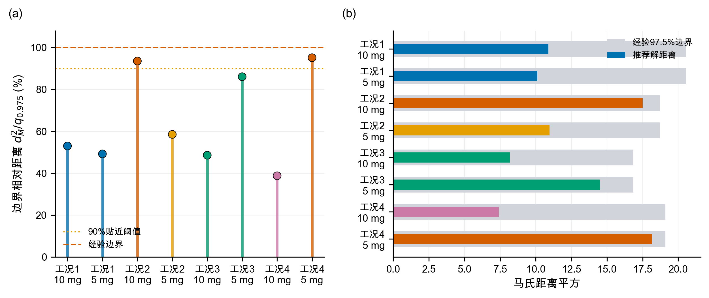

图12　推荐解的历史支持域边界接近度


四类工况在10和5 mg/Nm³限值下的中心情景最佳采样预测功率如图13所示。更严格的排放限值在全部工况下均提高预测功率。

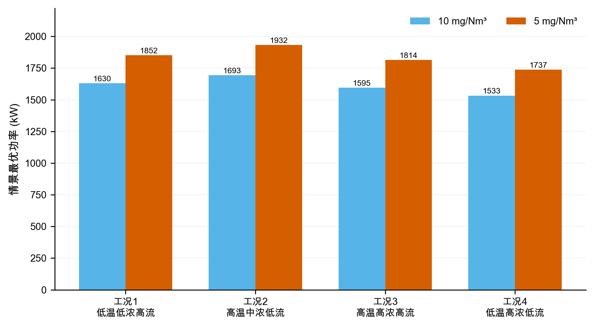


图13　两档排放限值下的最佳采样预测功率


## 6 问题三：代表工况的控制策略比较


选取工况1和工况3。二者流量都较高，但入口浓度和粉尘负荷差异明显：工况1平均负荷12460 kg/h，工况3为19560 kg/h，可用于比较低负荷与高负荷策略。


表8　代表工况在两档限值下的中心情景控制参数


| 工况与限值 | $U_1$/kV | $U_2$/kV | $U_3$/kV | $U_4$/kV | $T_1$/s | $T_2$/s | $T_3$/s | $T_4$/s | 预测总功率/kW |
|---|---:|---:|---:|---:|---:|---:|---:|---:|---:|
| 工况1，10 mg | 55.4 | 53.5 | 51.8 | 48.0 | 267 | 268 | 465 | 465 | 1629.63 |
| 工况1，5 mg | 65.0 | 61.8 | 51.7 | 53.2 | 267 | 267 | 466 | 466 | 1851.86 |
| 工况3，10 mg | 52.6 | 55.0 | 49.2 | 44.1 | 253 | 253 | 456 | 466 | 1595.37 |
| 工况3，5 mg | 60.9 | 61.8 | 52.2 | 49.9 | 251 | 253 | 464 | 464 | 1813.76 |


工况1从10收紧到5 mg/Nm³时，$U_1,U_2$分别提高9.6和8.3 kV，$U_3$近似不变，$U_4$提高5.2 kV；工况3的四场增量依次为8.3、6.8、3.0和5.8 kV。因而“前级优先”不能表述成“后级无需调整”。进一步把去除贡献权重改为等权、弱前级和中心前级三种形状后，前两电场仍承担70.8%～73.7%的正向加权电压增量，说明该规律不完全由中心权重预设，但其强度与具体后级补偿仍属于情景发现。

表9　控制优先级决策规则

| 状态特征 | 优先动作 | 原因 |
|---|---|---|
| 连续排放基值接近限值，振打峰值占比较低 | 优先小步提高前级电压 | 主要矛盾是连续捕集强度不足 |
| 峰值增量占比较高，周期明显长于参考周期 | 优先缩短过长周期并实施错相振打 | 主要矛盾是单次积灰脱落和峰值叠加 |
| 周期过短、振打频繁 | 适度延长周期 | 减少再飞扬次数 |
| 高粉尘负荷且基值和峰值均高 | 先错相、再调整周期，最后小步提升前级电压 | 先控制峰值，再补充连续捕集能力 |
| 前级电压已接近支持域上限 | 使用后级电场补偿 | 避免前级单独承担全部压力 |
| 超出历史支持域或出现火花、联锁风险 | 停止优化，回退现场安全设定 | 数学可行不等于设备安全 |

上述决策规则均基于灰箱情景推导，现场实施时应以在线监测数据为准。


两档排放限值下的四电场中心情景电压如图14所示。严格约束主要抬升前两电场，同时$U_4$在部分工况承担明显补偿，因此不能将策略绝对化为“只调前级”。

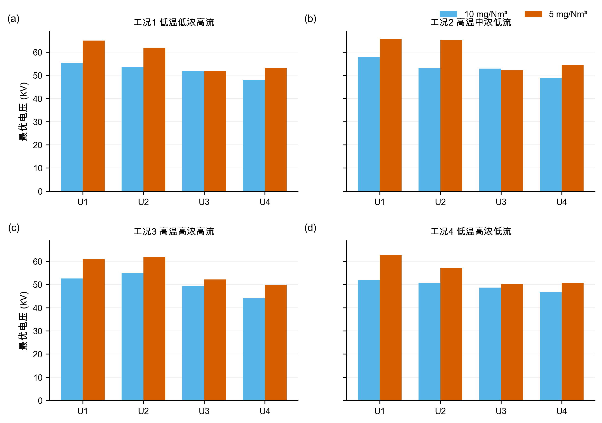


图14　两档排放限值下的电压配置

为突出代表工况内部四电场的协同变化，将工况1与工况3的电压和振打周期分别绘制为控制剖面，如图15所示。限值由10收紧至5 mg/Nm³时，两类工况均以前级电压抬升为主，但$U_4$仍有补偿；振打周期的变化则更依赖工况，说明**电压调节与振打调节不能拆成两个独立单变量策略**。

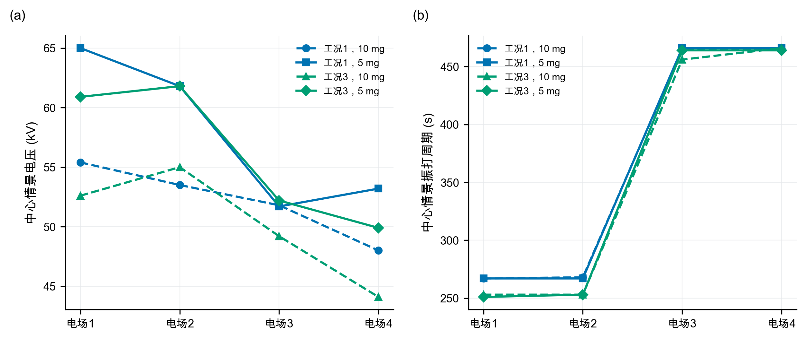

图15　代表工况四电场控制参数协同剖面


两档排放限值下的中心情景最佳采样振打周期如图16所示。周期变化不像电压那样单向，而是在积灰损失与再飞扬峰值之间重新平衡；前级短、后级长的顺序保持不变。

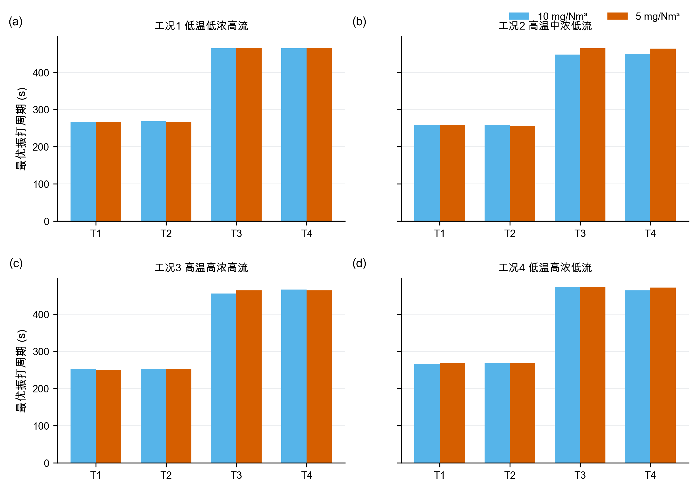


图16　两档排放限值下的振打周期


在线实施采用**TARGET-10、TARGET-5与FALLBACK三态**。排放目标由上级指令或管理规定选择，不设自动切换阈值——因为本文灰箱模型未经现场标定，不具备在线自动判定排放状态的精度。TARGET-10与TARGET-5分别读取表6中对应工况、对应排放目标的控制参数；表8仅用于问题三的代表工况比较。控制量按斜坡接近目标，试运行情景暂取电压不超过0.5 kV/min、振打周期不超过5 s/min，但现场DCS、联锁或设备制造商给出的更严限制具有优先权。四场振打先按$\rho=1$同相上界核验，再以$\rho=0.80$和0.65评估错相收益。FALLBACK仅在传感器失效、火花率越限、工况超出支持域或联锁触发时启用，此时回到现场确认的安全设定；未经现场标定的模型偏差不直接作为自动回退阈值。


## 7 问题四：10收紧至5 mg/Nm³的功率代价


### 7.1 分工况结果


表10　中心情景下10收紧至5 mg/Nm³的分工况功率增幅


| 工况 | 10 mg预测功率/kW | 5 mg预测功率/kW | 功率增幅 |
|---|---:|---:|---:|
| 1 低温低浓度高流量 | 1629.63 | 1851.86 | 13.64% |
| 2 高温中浓度低流量 | 1693.00 | 1931.84 | 14.11% |
| 3 高温高浓度高流量 | 1595.37 | 1813.76 | 13.69% |
| 4 低温高浓度低流量 | 1532.90 | 1737.39 | 13.34% |


按训练期工况占比$\pi_k$加权，


$$
\bar P_{10}=\frac{\sum_k\pi_kP_{k,10}}{\sum_k\pi_k}=1609.42\text{ kW}.\qquad\text{(16)}
$$


$$
\bar P_{5}=1829.79\text{ kW},\qquad
\Delta P=\frac{\bar P_5-\bar P_{10}}{\bar P_{10}}\approx13.7\%.\qquad\text{(17)}
$$


加上11.78 kW验证期误差附加量后，两档加权功率分别为1621.19和1841.57 kW；由于两者使用同一附加量，该比例不作为严格上界，而只用于功率预算。


四类工况从10收紧至5 mg/Nm³的中心情景功率增幅如图17所示。分工况功率增幅为13.34%～14.11%，工况加权点估计约13.7%；在相同运行时长下，该比例也等于电耗增幅。该点值必须与灰箱参数组合情景范围同时报告。

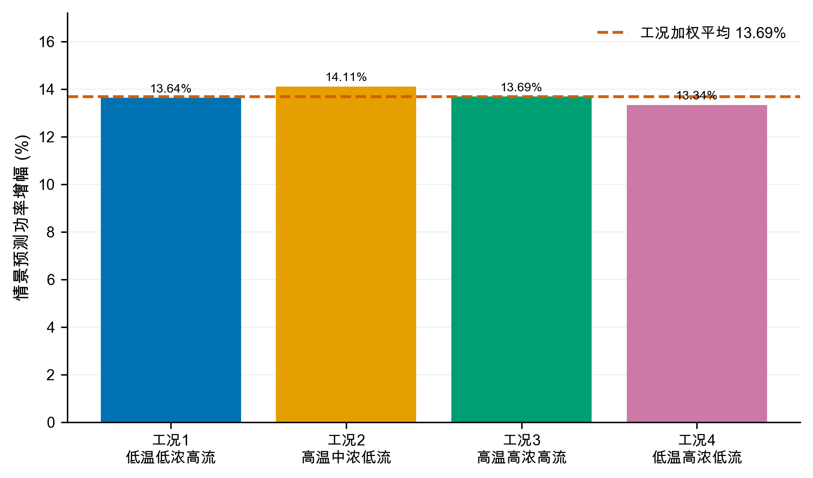


图17　分工况功率增幅比较


### 7.2 峰值约束的作用


中心情景最佳采样解中，10 mg/Nm³方案的连续基值为8.45～9.04 mg/Nm³，振打峰值增量为0.95～1.54 mg/Nm³；5 mg/Nm³方案的连续基值降至3.45～4.04 mg/Nm³，为振打峰值留出约0.95～1.55 mg/Nm³裕度。因此不能只令平均或基值低于限值，否则振打时刻仍可能超限。


中心情景最佳采样解的连续排放基值与振打峰值增量如图18所示。图中虚线表示情景限值，所有柱形均为模型推演结果，而非实测排放数据。

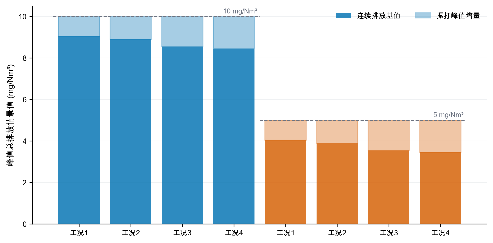


图18　排放约束分解


### 7.3 高浓度工况建议


工况3和4的粉尘负荷最高。对于这两类工况，建议：


1. 以$U_1,U_2$承担主体捕集，避免四个电场同步大幅抬升造成不必要的功率增加；
2. 保留$U_3,U_4$的精除余量，出口趋势接近阈值时再小步提高；
3. 四电场振打错相，避免峰值叠加；高负荷下不宜为降低振打次数而持续延长周期；
4. 将秒级未封顶出口浓度、实际振打事件、二次电流和火花率接入在线控制；
5. 设置人工审核、变化速率限制和自动回退，先影子运行再闭环投用。


## 8 模型检验、敏感性与稳健性


### 8.1 多种子稳定性与局部细化


对5个独立随机种子分别执行“每工况220000组全域采样＋每个初始最佳点30000组局部扰动”。八个工况—限值组合中，最佳采样预测功率的最大变异系数为0.181%，最大极差占均值0.464%；局部细化相对初始随机库的改善为0.18%～0.99%。这说明结果对种子不敏感，且邻域细化仍有小幅价值，但不能证明数学意义上的全局最优，因此全文统一使用“最佳采样可行解”。


五种子离散性与局部细化收益如图19所示。左图以各组合五种子中位数为基准，右图给出局部细化相对初始随机库的改善；数值稳定不等价于获得全局最优解。


图19　随机搜索稳定性与局部细化收益


### 8.2 灰箱参数组合敏感性


总体尺度扫描仍保留27组：电压效应尺度$\eta\in\{0.8,1.0,1.2\}$、振打峰值尺度$b_0\in\{0.9,1.2,1.5\}$、安全裕度$s\in\{0,0.08,0.15\}$。其中26组全工况可行，功率增幅为10.40%～18.45%。更重要的是，灰箱参数组合扫描涵盖出口缩放0.08～0.12、三种场权重形状、三个峰值指数、三个相位尺度和三个参考周期负荷指数，共405组且全部可行；灰箱参数组合情景功率增幅为11.37%～14.31%，中位数12.99%。两类范围都是先验网格上的灰箱参数组合情景范围，不是统计置信区间。


405组灰箱参数组合情景的功率增幅分布如图20所示。出口缩放与振打相位会系统改变功率增幅，中心点约13.7%应与11.37%～14.31%的灰箱参数组合情景范围结合解释。

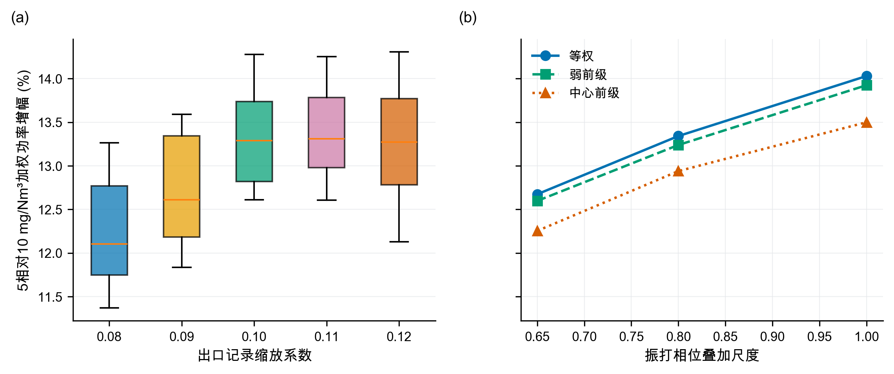


图20　功率增幅敏感性分布


电场贡献权重消融结果如图21所示。在等权、弱前级和中心前级三种设定下，前两电场仍承担70.8%～73.7%的正向电压增量；该结果支持有条件的“前级优先”，同时说明$U_4$补偿不可忽略。


图21　电场贡献权重消融结果


### 8.3 稳健性结论


稳健性证据分四层：轮廓系数支持四工况分层；基线与滚动验证支持功率模型选择；五种子与局部细化支持数值搜索稳定；灰箱参数组合情景与场权重消融检验灰箱结论对建模选择的依赖。中心功率增幅约13.7%，但灰箱参数组合情景中位数为12.99%，二者差异正说明不能只报告单点。验证期误差附加量、测试偏差和情景范围也不能把灰箱模型变成实证模型，现场补采与盲测仍是闭环前置条件。


## 9 模型评价、实施方案与局限


### 9.1 模型优点


第一，设置可识别性门禁，避免用复杂算法拟合封顶噪声。第二，工况聚类不使用出口浓度和总功率，减少以结果反向定义工况的偏差。第三，功率模型采用均值、线性、二次基线和滚动验证，并报告偏差与验证期误差附加量。第四，支持域使用逐变量分位数和经验Mahalanobis阈值，降低不合理外推。第五，优化使用五种子与局部细化，且不冒称全局最优。第六，405组灰箱参数组合情景、场权重消融和振打相位尺度把关键先验显式化。


### 9.2 模型局限


最主要的局限是出口浓度缩放、灰箱系数和振打峰值结构均未由附件识别；11.37%～14.31%只是给定网格上的灰箱参数组合情景范围，不是统计置信区间，也不覆盖所有物理模型。历史P05～P95和经验Mahalanobis阈值不是设备安全边界；模型没有二次电流、分场功率、火花率、极板积灰状态和联锁信息；分钟级数据不足以观察逐次振打峰值。回顾性测试数据曾被前期处理流程使用，不能视为完全未触碰的盲测。因而，本文控制参数只能作为试验起点，**不得直接下发生产设备**。


### 9.3 上线与补采方案


建议按四阶段部署。第一阶段只做影子计算，验证工况识别和TARGET-10/TARGET-5参数表的正确加载；第二阶段在每类工况内执行单因素小步阶跃，并由现场确定真实电压和周期斜坡上限；第三阶段用1～5 s未封顶出口浓度、实际振打事件、二次电流、火花率和分场功率重新标定灰箱参数及相位尺度；第四阶段冻结模型，在全新日期盲测，通过后才允许闭环。任何超支持域、传感器失效或联锁事件都触发FALLBACK。EPA技术资料和相关实验均强调气流、收尘面积及再飞扬对性能评价的重要性[2-3,6]，故补采应优先补齐这些状态链。


## 10 结论


本文对四个问题得到如下结论。


1. **问题一：可识别性与方向性关系。** 附件出口浓度在50 mg/Nm³附近显著截顶，无法从数据实证识别控制量对真实排放及逐次振打峰值的影响。灰箱模型只提供条件式方向与试验假设；同相振打是情景上界，错相收益需由事件级数据标定。
2. **问题二：工况划分、功率模型与10 mg方案。** 基于入口温度、入口浓度和流量识别出4类典型工况，轮廓系数0.4084。滚动验证选择的二次岭优于均值与线性基线，验证$R^2=0.9837$、RMSE=7.12 kW；验证期误差附加量为11.78 kW。中心情景下，10 mg/Nm³的四工况最佳采样预测功率为1532.90～1693.00 kW；五种子最大变异系数0.181%，局部细化最多改善0.986%，支持数值稳定但不构成全局最优证明。
3. **问题三：控制优先级。** 等权、弱前级和中心前级消融下，前两电场承担70.8%～73.7%的正向电压增量，故可保留有条件的“前级优先”；后级尤其$U_4$仍承担情景相关补偿，振打周期需与电压协同调整。
4. **问题四：5 mg方案与功率代价。** 排放目标由10收紧至5 mg/Nm³时，中心情景加权功率由1609.4增至1829.8 kW，功率增幅约13.7%；405组灰箱参数组合情景范围为11.37%～14.31%，中位数12.99%。在相同运行时长下，该功率增幅也等于电耗增幅。上述数值均为情景推演，必须在补采未封顶秒级排放、振打事件和电气状态后重新标定。


## 参考文献


[1] 中华人民共和国生态环境部. 水泥工业大气污染物排放标准：GB 4915—2013（含2025年修改单）[EB/OL]. (2013-12-27)[2026-08-06]. https://www.mee.gov.cn/ywgz/fgbz/bz/bzwb/dqhjbh/dqgdwrywrwpfbz/201312/t20131227_265765.htm.


[2] OGLESBY S Jr, NICHOLS G B. *A Manual of Electrostatic Precipitator Technology: Part I—Fundamentals*[R/OL]. Birmingham: Southern Research Institute, 1970[2026-08-06]. https://nepis.epa.gov/Exe/ZyPURL.cgi?Dockey=9101FJFA.TXT.


[3] SZABO M F, SHAH Y M, SCHLIESSER S P. *Inspection Manual for Evaluation of Electrostatic Precipitator Performance*[R/OL]. Washington, DC: U.S. Environmental Protection Agency, 1981[2026-08-06]. https://nepis.epa.gov/Exe/ZyPURL.cgi?Dockey=9400034C.TXT.


[4] MIZUNO A. Electrostatic precipitation[J]. IEEE Transactions on Dielectrics and Electrical Insulation, 2000, 7(5): 615-624. DOI: 10.1109/94.879357.


[5] LI Z, SHAO C, AN Y, et al. Energy-saving optimal control for a factual electrostatic precipitator with multiple electric-field stages based on GA[J]. Journal of Process Control, 2013, 23(8): 1041-1051. DOI: 10.1016/j.jprocont.2013.06.007.


[6] NAVARRETE B, VILCHES L F, RODRIGUEZ-GALAN M, et al. A pilot scale study of the rapping reentrainment and fouling in electrostatic precipitation[J]. Environmental Progress & Sustainable Energy, 2015, 34(1): 7-14. DOI: 10.1002/ep.11934.


[7] ZHENG C, ZHAO Z, GUO Y, et al. A real-time optimization method for economic and effective operation of electrostatic precipitators[J]. Journal of the Air & Waste Management Association, 2020, 70(7): 708-720. DOI: 10.1080/10962247.2020.1767227.


[8] FU Y, SU Z. Deep neural network based concentration prediction model of dry electrostatic precipitator with a modified PID optimizer[J]. Journal of Physics: Conference Series, 2022, 2189: 012018. DOI: 10.1088/1742-6596/2189/1/012018.


[9] MACQUEEN J. Some methods for classification and analysis of multivariate observations[C]//Proceedings of the Fifth Berkeley Symposium on Mathematical Statistics and Probability. Berkeley: University of California Press, 1967, 1: 281-297.


[10] ROUSSEEUW P J. Silhouettes: A graphical aid to the interpretation and validation of cluster analysis[J]. Journal of Computational and Applied Mathematics, 1987, 20: 53-65. DOI: 10.1016/0377-0427(87)90125-7.


[11] HOERL A E, KENNARD R W. Ridge regression: Biased estimation for nonorthogonal problems[J]. Technometrics, 1970, 12(1): 55-67. DOI: 10.1080/00401706.1970.10488634.


[12] WHITE H J. *Industrial Electrostatic Precipitation*[M]. Reading, MA: Addison-Wesley, 1963.


[13] PARKER K R. *Electrical Operation of Electrostatic Precipitators*[M]. London: Institution of Electrical Engineers, 2003.


## 附录A 程序求解流程


```text
输入：分钟级数据、5个随机种子、排放限值C_lim
1. 按时间划分训练/验证/回顾性测试；
2. 在训练期对Temp、C_in、Q标准化，K-means取k=4；
3. 比较均值、线性岭、二次岭，按3个滚动窗口选择正则强度；
4. 对每个工况与随机种子：
   4.1 计算P05、P95与经验Mahalanobis 97.5%阈值；
   4.2 生成220000组全域候选；
   4.3 在10/5 mg初始最佳点附近各生成30000组局部候选；
   4.4 过滤支持域与工程排序，选择预测总功率最低的情景可行候选；
5. 扫描27组总体参数情景和405组灰箱参数组合情景；
6. 执行场权重消融、多种子离散和动态控制表输出；
输出：控制参数、功率增幅、验证期误差附加量、消融、敏感性、图表与运行摘要。
```


完整可运行源程序随电子支撑材料提交：src/scenario_model.py（模型、优化与敏感性）、src/paper_figures.py（21幅正文图）、src/plot_utils.py（统一绘图样式）、src/integrity_check.py（确定性核验）。支撑数据、结果CSV/JSON、图注追踪表、回复审稿人与AI工具使用详情见附录C清单。


## 附录B 结果适用性声明


本文功率模型、工况划分及数据质量统计直接来源于附件；出口浓度缩放、排放灰箱系数、振打峰值系数以及由此得到的5/10 mg/Nm³最佳采样可行参数和功率增幅均属于情景推演。若数据提供方确认原记录不存在小数点问题，或提供新的未封顶排放数据，则应撤销当前排放情景并重新标定，不得沿用本文情景数值。


## 附录C 支撑材料与AI工具使用声明


**支撑材料清单：** 原始处理数据包；results目录下功率基线、滚动验证、中心控制、多种子稳定性、结构情景、场权重消融、动态控制表和运行摘要；figures_paper目录下21幅PNG预览、21幅PDF矢量图及figure_manifest.csv；src目录下4个完整源程序；integrity目录下确定性核验结果；revision_round1目录下修订补丁、应用报告、修改追踪表与逐点回复。


**AI工具使用声明（提交前由参赛队核验确认）：** 本稿坚持参赛队人工主导。题意分析、模型构建、公式推导、参数设定、程序审阅、结果复算和论文定稿由参赛队承担；OpenAI Codex（使用日期2026-08-05至2026-08-06）仅用于少量代码排错、图表版式检查、文字校对与格式核验。AI输出均经人工筛选和复核，未替代现场数据，也未把不可识别的排放关系改写为实证结论。详细用途和人工核验记录另见AI工具使用详情.pdf。

## 附录D 完整源程序

### D.1 scenario_model.py

```python
#!/usr/bin/env python3
"""Reproducible scenario model for the cement ESP problem.

The power model and condition profiles are learned from the supplied data.
The emission/rapping layer is an explicitly labelled engineering scenario,
because the recorded outlet concentration is not identifiable.
"""

from __future__ import annotations

import json
import math
from pathlib import Path

import matplotlib.pyplot as plt
import numpy as np
import pandas as pd


SEED = 20260805
SEEDS = [20260805, 20260806, 20260807, 20260808, 20260809]
ROOT = Path(__file__).resolve().parents[1]
PROJECT_ROOT = ROOT.parent
DATA_PACKAGE = PROJECT_ROOT / "数据处理" / "水泥电除尘器_数据处理四次返修包_交付链P1闭环_排放仍阻断"
DATA_FILE = DATA_PACKAGE / "data" / "processed" / "full_timeseries_with_flags.csv"
CLUSTER_EVAL_FILE = DATA_PACKAGE / "data" / "audit" / "condition_cluster_evaluation.csv"
OUT_DIR = ROOT / "results"
FIG_DIR = ROOT / "figures"

U_COLS = [f"U{i}_kV" for i in range(1, 5)]
T_COLS = [f"T{i}_s" for i in range(1, 5)]
COND_COLS = ["Temp_C", "C_in_gNm3", "Q_Nm3h"]
POWER_FIELDS = U_COLS + T_COLS + COND_COLS


def _r2(y: np.ndarray, pred: np.ndarray) -> float:
    return float(1.0 - np.sum((y - pred) ** 2) / np.sum((y - y.mean()) ** 2))


def _rmse(y: np.ndarray, pred: np.ndarray) -> float:
    return float(np.sqrt(np.mean((y - pred) ** 2)))


def voltage_polynomial(u: np.ndarray) -> np.ndarray:
    """Equivalent to PolynomialFeatures(degree=2, include_bias=False) for 4 voltages."""
    cols = [u[:, i] for i in range(4)]
    for i in range(4):
        for j in range(i, 4):
            cols.append(u[:, i] * u[:, j])
    return np.column_stack(cols)


class RidgePowerModel:
    def __init__(self, alpha: float = 1e-3, quadratic: bool = True):
        self.alpha = alpha
        self.quadratic = quadratic
        self.mean: np.ndarray | None = None
        self.std: np.ndarray | None = None
        self.beta: np.ndarray | None = None

    def design(self, frame: pd.DataFrame) -> np.ndarray:
        u = frame[U_COLS].to_numpy(float)
        remainder = frame[T_COLS + COND_COLS].to_numpy(float)
        voltage = voltage_polynomial(u) if self.quadratic else u
        return np.column_stack([voltage, remainder])

    def fit(self, frame: pd.DataFrame, y: np.ndarray) -> None:
        x = self.design(frame)
        self.mean = x.mean(axis=0)
        self.std = x.std(axis=0)
        self.std[self.std == 0] = 1.0
        z = (x - self.mean) / self.std
        zz = np.column_stack([np.ones(len(z)), z])
        penalty = np.eye(zz.shape[1]) * math.sqrt(self.alpha)
        penalty[0, 0] = 0.0
        augmented_x = np.vstack([zz, penalty])
        augmented_y = np.concatenate([y, np.zeros(zz.shape[1])])
        self.beta = np.linalg.lstsq(augmented_x, augmented_y, rcond=None)[0]

    def predict(self, frame: pd.DataFrame) -> np.ndarray:
        if self.mean is None or self.std is None or self.beta is None:
            raise RuntimeError("model not fitted")
        x = self.design(frame)
        z = (x - self.mean) / self.std
        zz = np.column_stack([np.ones(len(z)), z])
        return np.einsum("ij,j->i", zz, self.beta)


def condition_profiles(df: pd.DataFrame) -> pd.DataFrame:
    train = df[df["split"] == "train"].copy()
    overall_load = train["dust_load_kg_h"].median()
    labels = {
        1: "低温低浓度高流量",
        2: "高温中浓度低流量",
        3: "高温高浓度高流量",
        4: "低温高浓度低流量",
    }
    rows: list[dict[str, float | int | str]] = []
    for cluster, group in train.groupby("condition_cluster"):
        row: dict[str, float | int | str] = {
            "condition_cluster": int(cluster),
            "condition_name": labels[int(cluster)],
            "count": int(len(group)),
            "share": float(len(group) / len(train)),
            "Temp_C": float(group["Temp_C"].mean()),
            "C_in_gNm3": float(group["C_in_gNm3"].mean()),
            "Q_Nm3h": float(group["Q_Nm3h"].mean()),
            "dust_load_kg_h": float(group["dust_load_kg_h"].mean()),
            "C_out_recorded_median": float(group["C_out_mgNm3"].dropna().median()),
            "C_out_scaled_anchor": float((0.1 * group["C_out_mgNm3"].dropna()).median()),
            "historical_power_kW": float(group["P_total_kW"].mean()),
        }
        for col in U_COLS + T_COLS:
            row[f"{col}_p05"] = float(group[col].quantile(0.05))
            row[f"{col}_median"] = float(group[col].median())
            row[f"{col}_p95"] = float(group[col].quantile(0.95))
        row["load_ratio_to_train_median"] = float(row["dust_load_kg_h"] / overall_load)
        rows.append(row)
    return pd.DataFrame(rows).sort_values("condition_cluster").reset_index(drop=True)


def scenario_t_star(
    profile: pd.Series,
    global_t_median: np.ndarray,
    load_exponent: float = -0.18,
) -> np.ndarray:
    load_ratio = float(profile["load_ratio_to_train_median"])
    raw = global_t_median * load_ratio ** load_exponent
    lower = np.array([profile[f"{c}_p05"] for c in T_COLS], float)
    upper = np.array([profile[f"{c}_p95"] for c in T_COLS], float)
    return np.clip(raw, lower, upper)


def scenario_emission(
    profile: pd.Series,
    u: np.ndarray,
    t: np.ndarray,
    t_star: np.ndarray,
    eta: float = 1.0,
    peak_scale: float = 1.2,
    safety_index: float = 0.08,
    outlet_scale: float = 0.10,
    alpha_weights: np.ndarray | None = None,
    peak_exponent: float = 1.35,
    phase_scale: float = 1.0,
) -> tuple[np.ndarray, np.ndarray, np.ndarray]:
    """Return conservative base emission, rapping peak excess, and their sum.

    All non-control arguments are scenario inputs,
    not parameters estimated from the supplied outlet-concentration series.
    """
    u_ref = np.array([profile[f"{c}_median"] for c in U_COLS], float)
    t_ref = np.array([profile[f"{c}_median"] for c in T_COLS], float)
    cin = float(profile["C_in_gNm3"])
    anchor = float(profile["C_out_recorded_median"] * outlet_scale)
    k_anchor = math.log(cin * 1000.0 / anchor)

    if alpha_weights is None:
        alpha_weights = np.array([1.15, 1.10, 0.95, 0.80])
    alpha = eta * np.asarray(alpha_weights, float)
    control_delta = np.sum(alpha * ((u / u_ref) ** 2 - 1.0), axis=1)

    load_ratio = float(profile["load_ratio_to_train_median"])
    beta = np.array([0.30, 0.27, 0.20, 0.17]) * load_ratio ** 0.5

    def loss(period: np.ndarray) -> np.ndarray:
        ratio = period / t_star
        return np.sum(beta * (ratio + 1.0 / ratio - 2.0), axis=1)

    ref_loss = float(loss(t_ref.reshape(1, 4))[0])
    k = k_anchor + control_delta - (loss(t) - ref_loss)
    base = cin * 1000.0 * np.exp(-k + safety_index)

    shares = np.array([0.30, 0.30, 0.22, 0.18])
    peak = (
        peak_scale
        * phase_scale
        * load_ratio ** 0.80
        * np.sum(shares * (t / t_star) ** peak_exponent, axis=1)
    )
    return base, peak, base + peak


def support_statistics(train_group: pd.DataFrame) -> tuple[np.ndarray, np.ndarray, float]:
    """Return the empirical control-support centre, inverse covariance and d2 cut-off."""
    hist = train_group[U_COLS + T_COLS].to_numpy(float)
    mu = hist.mean(axis=0)
    inv_cov = np.linalg.pinv(np.cov(hist, rowvar=False))
    delta = hist - mu
    historical_d2 = np.einsum("ij,jk,ik->i", delta, inv_cov, delta)
    return mu, inv_cov, float(np.quantile(historical_d2, 0.975))


def filter_supported_controls(
    u: np.ndarray,
    t: np.ndarray,
    train_group: pd.DataFrame,
) -> tuple[np.ndarray, np.ndarray, np.ndarray, float]:
    mu, inv_cov, threshold = support_statistics(train_group)
    controls = np.column_stack([u, t])
    delta = controls - mu
    mahal = np.einsum("ij,jk,ik->i", delta, inv_cov, delta)
    ordering = (
        (u[:, 0] >= u[:, 2] + 3.0)
        & (u[:, 1] >= u[:, 3] + 3.0)
        & (t[:, 2] >= t[:, 0] + 100.0)
        & (t[:, 3] >= t[:, 1] + 100.0)
    )
    keep = (mahal <= threshold) & ordering
    return u[keep], t[keep], mahal[keep], threshold


def candidate_bank(
    profile: pd.Series,
    model: RidgePowerModel,
    t_star: np.ndarray,
    n: int,
    rng: np.random.Generator,
    train_group: pd.DataFrame,
) -> pd.DataFrame:
    lower_u = np.array([profile[f"{c}_p05"] for c in U_COLS], float)
    upper_u = np.array([profile[f"{c}_p95"] for c in U_COLS], float)
    lower_t = np.array([profile[f"{c}_p05"] for c in T_COLS], float)
    upper_t = np.array([profile[f"{c}_p95"] for c in T_COLS], float)

    u = np.round(rng.uniform(lower_u, upper_u, size=(n, 4)), 1)
    t = np.round(rng.uniform(lower_t, upper_t, size=(n, 4)))

    # Ensure reference and locally useful candidates are always present.
    ref_u = np.array([profile[f"{c}_median"] for c in U_COLS], float)
    special_u = np.vstack([ref_u, lower_u, upper_u, 0.5 * (ref_u + lower_u), 0.5 * (ref_u + upper_u)])
    special_t = np.vstack([
        np.array([profile[f"{c}_median"] for c in T_COLS], float),
        lower_t,
        upper_t,
        t_star,
        np.clip(0.92 * t_star, lower_t, upper_t),
    ])
    u[: len(special_u)] = np.round(special_u, 1)
    t[: len(special_t)] = np.round(special_t)

    u, t, mahal, threshold = filter_supported_controls(u, t, train_group)

    frame = pd.DataFrame(np.column_stack([u, t]), columns=U_COLS + T_COLS)
    for c in COND_COLS:
        frame[c] = float(profile[c])
    frame["predicted_power_kW"] = model.predict(frame)
    frame["mahalanobis_d2"] = mahal
    frame["support_threshold_d2"] = threshold
    return frame


def local_candidate_bank(
    profile: pd.Series,
    model: RidgePowerModel,
    centre: dict[str, float | int | str],
    n: int,
    rng: np.random.Generator,
    train_group: pd.DataFrame,
) -> pd.DataFrame:
    """Generate a clipped Gaussian neighbourhood around a preliminary solution."""
    lower_u = np.array([profile[f"{c}_p05"] for c in U_COLS], float)
    upper_u = np.array([profile[f"{c}_p95"] for c in U_COLS], float)
    lower_t = np.array([profile[f"{c}_p05"] for c in T_COLS], float)
    upper_t = np.array([profile[f"{c}_p95"] for c in T_COLS], float)
    centre_u = np.array([centre[c] for c in U_COLS], float)
    centre_t = np.array([centre[c] for c in T_COLS], float)
    u = np.clip(
        rng.normal(centre_u, np.maximum(0.15, 0.025 * (upper_u - lower_u)), size=(n, 4)),
        lower_u,
        upper_u,
    )
    t = np.clip(
        rng.normal(centre_t, np.maximum(2.0, 0.025 * (upper_t - lower_t)), size=(n, 4)),
        lower_t,
        upper_t,
    )
    u = np.round(u, 1)
    t = np.round(t)
    u[0] = centre_u
    t[0] = centre_t
    u, t, mahal, threshold = filter_supported_controls(u, t, train_group)
    frame = pd.DataFrame(np.column_stack([u, t]), columns=U_COLS + T_COLS)
    for c in COND_COLS:
        frame[c] = float(profile[c])
    frame["predicted_power_kW"] = model.predict(frame)
    frame["mahalanobis_d2"] = mahal
    frame["support_threshold_d2"] = threshold
    return frame


def select_optimum(
    profile: pd.Series,
    bank: pd.DataFrame,
    t_star: np.ndarray,
    limit: float,
    eta: float = 1.0,
    peak_scale: float = 1.2,
    safety_index: float = 0.08,
    outlet_scale: float = 0.10,
    alpha_weights: np.ndarray | None = None,
    peak_exponent: float = 1.35,
    phase_scale: float = 1.0,
    validation_error_guard_kW: float = 0.0,
) -> dict[str, float | int | str]:
    u = bank[U_COLS].to_numpy(float)
    t = bank[T_COLS].to_numpy(float)
    base, peak, total = scenario_emission(
        profile,
        u,
        t,
        t_star,
        eta,
        peak_scale,
        safety_index,
        outlet_scale,
        alpha_weights,
        peak_exponent,
        phase_scale,
    )
    feasible = total <= limit
    if not np.any(feasible):
        return {
            "condition_cluster": int(profile["condition_cluster"]),
            "condition_name": str(profile["condition_name"]),
            "limit_mgNm3": float(limit),
            "status": "INFEASIBLE_IN_SCENARIO_SUPPORT",
        }
    idx_pool = np.flatnonzero(feasible)
    local = bank["predicted_power_kW"].to_numpy(float)[idx_pool]
    idx = int(idx_pool[int(np.argmin(local))])
    row: dict[str, float | int | str] = {
        "condition_cluster": int(profile["condition_cluster"]),
        "condition_name": str(profile["condition_name"]),
        "limit_mgNm3": float(limit),
        "status": "SCENARIO_FEASIBLE",
        "scenario_base_emission_mgNm3": float(base[idx]),
        "scenario_peak_excess_mgNm3": float(peak[idx]),
        "scenario_peak_total_mgNm3": float(total[idx]),
        "predicted_power_kW": float(bank.iloc[idx]["predicted_power_kW"]),
        "validation_error_adjusted_power_kW": float(
            bank.iloc[idx]["predicted_power_kW"] + validation_error_guard_kW
        ),
        "validation_error_guard_kW": float(validation_error_guard_kW),
        "historical_power_kW": float(profile["historical_power_kW"]),
        "power_change_vs_historical_pct": float(
            100.0 * (bank.iloc[idx]["predicted_power_kW"] / profile["historical_power_kW"] - 1.0)
        ),
        "mahalanobis_d2": float(bank.iloc[idx]["mahalanobis_d2"]),
        "support_threshold_d2": float(bank.iloc[idx]["support_threshold_d2"]),
    }
    for col in U_COLS + T_COLS:
        row[col] = float(bank.iloc[idx][col])
    return row


def make_figures(
    df: pd.DataFrame,
    power_model: RidgePowerModel,
    profiles: pd.DataFrame,
    optimum: pd.DataFrame,
    sensitivity: pd.DataFrame,
) -> None:
    plt.rcParams.update({
        "font.sans-serif": ["Arial Unicode MS", "PingFang SC", "Heiti TC", "DejaVu Sans"],
        "axes.unicode_minus": False,
        "figure.dpi": 160,
        "savefig.dpi": 240,
    })

    colors = ["#0072B2", "#E69F00", "#009E73", "#CC79A7"]
    train = df[df["split"] == "train"]
    fig, ax = plt.subplots(figsize=(8.4, 5.4))
    for (cluster, group), color in zip(train.groupby("condition_cluster"), colors):
        sample = group.iloc[::4]
        ax.scatter(sample["C_in_gNm3"], sample["Temp_C"], s=7, alpha=0.35, color=color,
                   label=f"工况{int(cluster)}")
    ax.set_xlabel("入口粉尘浓度 (g/Nm³)")
    ax.set_ylabel("入口温度 (°C)")
    ax.set_title("训练期典型工况划分")
    ax.legend(ncol=2, frameon=False)
    fig.tight_layout()
    fig.savefig(FIG_DIR / "01_condition_clusters.png")
    plt.close(fig)

    test = df[df["split"] == "test"]
    pred = power_model.predict(test)
    actual = test["P_total_kW"].to_numpy(float)
    fig, ax = plt.subplots(figsize=(6.2, 5.4))
    ax.scatter(actual, pred, s=9, alpha=0.45, color="#0072B2")
    lo = min(actual.min(), pred.min())
    hi = max(actual.max(), pred.max())
    ax.plot([lo, hi], [lo, hi], "--", color="#D55E00", linewidth=1.3)
    ax.set_xlabel("实际总功率 (kW)")
    ax.set_ylabel("预测总功率 (kW)")
    ax.set_title("功率模型回顾性测试")
    fig.tight_layout()
    fig.savefig(FIG_DIR / "02_power_test.png")
    plt.close(fig)

    pivot = optimum.pivot(index="condition_name", columns="limit_mgNm3", values="predicted_power_kW")
    pivot = pivot[[10.0, 5.0]]
    fig, ax = plt.subplots(figsize=(9.2, 5.4))
    x = np.arange(len(pivot))
    width = 0.34
    ax.bar(x - width / 2, pivot[10.0], width, label="10 mg/Nm³", color="#56B4E9")
    ax.bar(x + width / 2, pivot[5.0], width, label="5 mg/Nm³", color="#D55E00")
    ax.set_xticks(x, pivot.index, rotation=12)
    ax.set_ylabel("情景最优功率 (kW)")
    ax.set_title("不同排放约束下的情景最优功率")
    ax.legend(frameon=False)
    fig.tight_layout()
    fig.savefig(FIG_DIR / "03_optimal_power_comparison.png")
    plt.close(fig)

    fig, ax = plt.subplots(figsize=(7.6, 5.1))
    ratio = np.linspace(0.75, 1.25, 200)
    for profile, color in zip((profiles.iloc[0], profiles.iloc[2]), (colors[0], colors[2])):
        load_ratio = float(profile["load_ratio_to_train_median"])
        peak = 1.2 * load_ratio ** 0.8 * ratio ** 1.35
        ax.plot(100 * (ratio - 1), peak, color=color, linewidth=2,
                label=str(profile["condition_name"]))
    ax.set_xlabel("振打周期相对最优周期的变化 (%)")
    ax.set_ylabel("单次振打峰值增量代理 (mg/Nm³)")
    ax.set_title("振打周期延长会放大单次再飞扬峰值")
    ax.axvline(0, color="#666666", linewidth=0.8)
    ax.legend(frameon=False)
    fig.tight_layout()
    fig.savefig(FIG_DIR / "04_rapping_peak_scenario.png")
    plt.close(fig)

    fig, ax = plt.subplots(figsize=(7.6, 5.1))
    vals = sensitivity["weighted_power_increase_pct"].dropna().sort_values().to_numpy()
    ax.hist(vals, bins=12, color="#009E73", alpha=0.85, edgecolor="white")
    ax.axvline(np.median(vals), color="#D55E00", linestyle="--", linewidth=1.5,
               label=f"中位数 {np.median(vals):.1f}%")
    ax.set_xlabel("5 mg/Nm³ 相对 10 mg/Nm³ 的加权功率增幅 (%)")
    ax.set_ylabel("情景组合数")
    ax.set_title("先验参数敏感性分析")
    ax.legend(frameon=False)
    fig.tight_layout()
    fig.savefig(FIG_DIR / "05_sensitivity_distribution.png")
    plt.close(fig)


def evaluate_power_models(
    train: pd.DataFrame,
    validation: pd.DataFrame,
    test: pd.DataFrame,
) -> tuple[RidgePowerModel, dict[str, object], pd.DataFrame, pd.DataFrame]:
    """Select ridge strength by blocked rolling validation and retain honest baselines."""
    alpha_grid = (1e-4, 1e-3, 1e-2, 1e-1, 1.0, 10.0)
    n = len(train)
    rolling_bounds = ((0, int(0.40*n), int(0.60*n)), (0, int(0.60*n), int(0.80*n)), (0, int(0.80*n), n))
    rolling_rows: list[dict[str, object]] = []
    selected: dict[str, float] = {}
    for model_name, quadratic in (("linear_ridge", False), ("quadratic_ridge", True)):
        alpha_scores: list[tuple[float, float]] = []
        for alpha in alpha_grid:
            fold_rmses = []
            for fold, (start, fit_end, eval_end) in enumerate(rolling_bounds, start=1):
                fit = train.iloc[start:fit_end]
                evaluate = train.iloc[fit_end:eval_end]
                candidate = RidgePowerModel(alpha=alpha, quadratic=quadratic)
                candidate.fit(fit, fit["P_total_kW"].to_numpy(float))
                pred = candidate.predict(evaluate)
                actual = evaluate["P_total_kW"].to_numpy(float)
                rmse = _rmse(actual, pred)
                fold_rmses.append(rmse)
                rolling_rows.append({
                    "model": model_name,
                    "alpha": alpha,
                    "fold": fold,
                    "fit_rows": len(fit),
                    "evaluation_rows": len(evaluate),
                    "r2": _r2(actual, pred),
                    "rmse_kW": rmse,
                    "bias_kW": float(np.mean(pred-actual)),
                })
            alpha_scores.append((float(np.mean(fold_rmses)), alpha))
        selected[model_name] = min(alpha_scores)[1]

    baseline_rows: list[dict[str, object]] = []
    mean_power = float(train["P_total_kW"].mean())
    fitted_models: dict[str, RidgePowerModel] = {}
    for model_name, quadratic in (("linear_ridge", False), ("quadratic_ridge", True)):
        fitted = RidgePowerModel(alpha=selected[model_name], quadratic=quadratic)
        fitted.fit(train, train["P_total_kW"].to_numpy(float))
        fitted_models[model_name] = fitted
    for split_name, frame in (("validation", validation), ("retrospective_test", test)):
        actual = frame["P_total_kW"].to_numpy(float)
        for model_name in ("mean_predictor", "linear_ridge", "quadratic_ridge"):
            pred = np.full(len(frame), mean_power) if model_name == "mean_predictor" else fitted_models[model_name].predict(frame)
            baseline_rows.append({
                "model": model_name,
                "selected_alpha": np.nan if model_name == "mean_predictor" else selected[model_name],
                "split": split_name,
                "r2": _r2(actual, pred),
                "rmse_kW": _rmse(actual, pred),
                "bias_kW": float(np.mean(pred-actual)),
            })
    chosen = fitted_models["quadratic_ridge"]
    val_actual = validation["P_total_kW"].to_numpy(float)
    val_pred = chosen.predict(validation)
    test_actual = test["P_total_kW"].to_numpy(float)
    test_pred = chosen.predict(test)
    guard = float(np.quantile(np.abs(val_pred-val_actual), 0.90))
    metrics: dict[str, object] = {
        "model": "standardized_quadratic_ridge_voltage_plus_period_and_condition",
        "fit_scope": "train_only",
        "alpha_selected_by_blocked_rolling_validation": selected["quadratic_ridge"],
        "validation_r2": _r2(val_actual, val_pred),
        "validation_rmse_kW": _rmse(val_actual, val_pred),
        "validation_bias_kW": float(np.mean(val_pred-val_actual)),
        "validation_abs_error_q90_kW": guard,
        "retrospective_test_r2": _r2(test_actual, test_pred),
        "retrospective_test_rmse_kW": _rmse(test_actual, test_pred),
        "retrospective_test_bias_kW": float(np.mean(test_pred-test_actual)),
        "test_protocol": "retrospective_not_blind_due_to_prior_package_use",
        "reporting_guard_rule": "point_prediction_plus_validation_absolute_error_q90",
        "selected_alphas": selected,
    }
    return chosen, metrics, pd.DataFrame(rolling_rows), pd.DataFrame(baseline_rows)


def aggregate_pair(rows10: list[dict[str, object]], rows5: list[dict[str, object]]) -> dict[str, float | bool]:
    if len(rows10) != 4 or len(rows5) != 4:
        return {"all_conditions_feasible": False, "weighted_power_10_kW": np.nan, "weighted_power_5_kW": np.nan, "weighted_power_increase_pct": np.nan}
    weights = np.array([float(r["share"]) for r in rows10])
    p10 = float(np.average([float(r["predicted_power_kW"]) for r in rows10], weights=weights))
    p5 = float(np.average([float(r["predicted_power_kW"]) for r in rows5], weights=weights))
    return {"all_conditions_feasible": True, "weighted_power_10_kW": p10, "weighted_power_5_kW": p5, "weighted_power_increase_pct": 100.0*(p5/p10-1.0)}


def main() -> None:
    OUT_DIR.mkdir(parents=True, exist_ok=True)
    FIG_DIR.mkdir(parents=True, exist_ok=True)
    df = pd.read_csv(DATA_FILE, parse_dates=["timestamp"])
    df["condition_cluster"] = df["condition_cluster"].astype(int)
    profiles = condition_profiles(df)
    profiles.to_csv(OUT_DIR / "condition_profiles.csv", index=False, encoding="utf-8-sig")

    train = df[df["split"] == "train"].copy()
    validation = df[df["split"] == "validation"].copy()
    test = df[df["split"] == "test"].copy()
    model, metrics, rolling_metrics, baseline_metrics = evaluate_power_models(train, validation, test)
    rolling_metrics.to_csv(OUT_DIR / "power_model_rolling_validation.csv", index=False, encoding="utf-8-sig")
    baseline_metrics.to_csv(OUT_DIR / "power_model_baselines.csv", index=False, encoding="utf-8-sig")
    (OUT_DIR / "power_model_metrics.json").write_text(json.dumps(metrics, ensure_ascii=False, indent=2), encoding="utf-8")
    validation_error_guard = float(metrics["validation_abs_error_q90_kW"])

    cluster_eval = pd.read_csv(CLUSTER_EVAL_FILE)
    cluster_eval.to_csv(OUT_DIR / "cluster_selection_metrics.csv", index=False, encoding="utf-8-sig")
    global_t_median = train[T_COLS].median().to_numpy(float)
    t_stars = {int(p["condition_cluster"]): scenario_t_star(p, global_t_median) for _, p in profiles.iterrows()}

    banks: dict[int, pd.DataFrame] = {}
    seed_rows: list[dict[str, object]] = []
    convergence_rows: list[dict[str, object]] = []
    for seed in SEEDS:
        rng = np.random.default_rng(seed)
        for _, profile in profiles.iterrows():
            cluster = int(profile["condition_cluster"])
            group = train[train["condition_cluster"] == cluster]
            t_star = t_stars[cluster]
            base_bank = candidate_bank(profile, model, t_star, 220_000, rng, group)
            preliminary = {
                limit: select_optimum(
                    profile,
                    base_bank,
                    t_star,
                    limit,
                    validation_error_guard_kW=validation_error_guard,
                )
                for limit in (10.0, 5.0)
            }
            additions = []
            for limit in (10.0, 5.0):
                if "predicted_power_kW" in preliminary[limit]:
                    additions.append(local_candidate_bank(profile, model, preliminary[limit], 30_000, rng, group))
            bank = pd.concat([base_bank] + additions, ignore_index=True).drop_duplicates(U_COLS+T_COLS, keep="first")
            if seed == SEED:
                banks[cluster] = bank
                for limit in (10.0, 5.0):
                    for fraction in (0.25, 0.50, 0.75, 1.00):
                        partial = base_bank.iloc[:max(1000, int(len(base_bank)*fraction))]
                        result = select_optimum(
                            profile,
                            partial,
                            t_star,
                            limit,
                            validation_error_guard_kW=validation_error_guard,
                        )
                        convergence_rows.append({
                            "condition_cluster": cluster,
                            "condition_name": profile["condition_name"],
                            "limit_mgNm3": limit,
                            "candidate_bank_fraction": fraction,
                            "supported_candidates": len(partial),
                            "status": result["status"],
                            "best_power_kW": result.get("predicted_power_kW", np.nan),
                        })
            for limit in (10.0, 5.0):
                final = select_optimum(
                    profile,
                    bank,
                    t_star,
                    limit,
                    validation_error_guard_kW=validation_error_guard,
                )
                final.update({
                    "seed": seed,
                    "base_supported_candidates": len(base_bank),
                    "refined_supported_candidates": len(bank),
                    "preliminary_power_kW": preliminary[limit].get("predicted_power_kW", np.nan),
                    "local_refinement_improvement_pct": 100.0*(float(preliminary[limit].get("predicted_power_kW", np.nan))/float(final.get("predicted_power_kW", np.nan))-1.0),
                })
                seed_rows.append(final)

    seed_stability = pd.DataFrame(seed_rows)
    seed_stability.to_csv(OUT_DIR / "optimization_seed_stability.csv", index=False, encoding="utf-8-sig")
    central = seed_stability[seed_stability["seed"] == SEED].copy()
    optimum = central.drop(columns=["seed", "base_supported_candidates", "refined_supported_candidates", "preliminary_power_kW", "local_refinement_improvement_pct"])
    optimum.to_csv(OUT_DIR / "optimal_controls_central_scenario.csv", index=False, encoding="utf-8-sig")
    pd.DataFrame(convergence_rows).to_csv(OUT_DIR / "optimization_convergence.csv", index=False, encoding="utf-8-sig")

    q4_rows: list[dict[str, object]] = []
    for _, profile in profiles.iterrows():
        cluster = int(profile["condition_cluster"])
        a = optimum[(optimum["condition_cluster"] == cluster) & (optimum["limit_mgNm3"] == 10.0)].iloc[0]
        b = optimum[(optimum["condition_cluster"] == cluster) & (optimum["limit_mgNm3"] == 5.0)].iloc[0]
        q4_rows.append({
            "condition_cluster": cluster,
            "condition_name": profile["condition_name"],
            "share": profile["share"],
            "power_10_kW": a["predicted_power_kW"],
            "power_5_kW": b["predicted_power_kW"],
            "validation_error_adjusted_power_10_kW": a["validation_error_adjusted_power_kW"],
            "validation_error_adjusted_power_5_kW": b["validation_error_adjusted_power_kW"],
            "increase_pct": 100.0*(b["predicted_power_kW"]/a["predicted_power_kW"]-1.0),
        })
    q4 = pd.DataFrame(q4_rows)
    weighted_p10 = float(np.average(q4["power_10_kW"], weights=q4["share"]))
    weighted_p5 = float(np.average(q4["power_5_kW"], weights=q4["share"]))
    q4_summary = {
        "weighted_power_10_kW": weighted_p10,
        "weighted_power_5_kW": weighted_p5,
        "weighted_increase_pct": 100.0*(weighted_p5/weighted_p10-1.0),
        "validation_error_guard_kW": validation_error_guard,
        "weighted_validation_error_adjusted_power_10_kW": weighted_p10 + validation_error_guard,
        "weighted_validation_error_adjusted_power_5_kW": weighted_p5 + validation_error_guard,
    }
    q4.to_csv(OUT_DIR / "question4_by_condition.csv", index=False, encoding="utf-8-sig")
    (OUT_DIR / "question4_summary.json").write_text(json.dumps(q4_summary, ensure_ascii=False, indent=2), encoding="utf-8")

    sensitivity_rows: list[dict[str, object]] = []
    for eta in (0.8, 1.0, 1.2):
        for peak_scale in (0.9, 1.2, 1.5):
            for safety in (0.0, 0.08, 0.15):
                r10s: list[dict[str, object]] = []
                r5s: list[dict[str, object]] = []
                for _, profile in profiles.iterrows():
                    cluster = int(profile["condition_cluster"])
                    r10 = select_optimum(profile, banks[cluster], t_stars[cluster], 10.0, eta=eta, peak_scale=peak_scale, safety_index=safety, validation_error_guard_kW=validation_error_guard)
                    r5 = select_optimum(profile, banks[cluster], t_stars[cluster], 5.0, eta=eta, peak_scale=peak_scale, safety_index=safety, validation_error_guard_kW=validation_error_guard)
                    if "predicted_power_kW" in r10 and "predicted_power_kW" in r5:
                        r10["share"] = profile["share"]
                        r5["share"] = profile["share"]
                        r10s.append(r10); r5s.append(r5)
                sensitivity_rows.append({"eta_voltage_effect": eta, "peak_scale": peak_scale, "safety_index": safety, **aggregate_pair(r10s, r5s)})
    sensitivity = pd.DataFrame(sensitivity_rows)
    sensitivity.to_csv(OUT_DIR / "question4_sensitivity.csv", index=False, encoding="utf-8-sig")

    alpha_profiles = {
        "equal": np.array([1.00, 1.00, 1.00, 1.00]),
        "weak_front": np.array([1.08, 1.04, 0.98, 0.90]),
        "central_front": np.array([1.15, 1.10, 0.95, 0.80]),
    }
    structural_rows: list[dict[str, object]] = []
    for outlet_scale in (0.08, 0.09, 0.10, 0.11, 0.12):
        for alpha_name, alpha_weights in alpha_profiles.items():
            for peak_exponent in (1.10, 1.35, 1.60):
                for phase_scale in (0.65, 0.80, 1.00):
                    for tstar_exponent in (-0.30, -0.18, -0.10):
                        r10s = []; r5s = []
                        for _, profile in profiles.iterrows():
                            cluster = int(profile["condition_cluster"])
                            t_star = scenario_t_star(profile, global_t_median, tstar_exponent)
                            args = dict(outlet_scale=outlet_scale, alpha_weights=alpha_weights, peak_exponent=peak_exponent, phase_scale=phase_scale, validation_error_guard_kW=validation_error_guard)
                            r10 = select_optimum(profile, banks[cluster], t_star, 10.0, **args)
                            r5 = select_optimum(profile, banks[cluster], t_star, 5.0, **args)
                            if "predicted_power_kW" in r10 and "predicted_power_kW" in r5:
                                r10["share"] = profile["share"]; r5["share"] = profile["share"]
                                r10s.append(r10); r5s.append(r5)
                        structural_rows.append({
                            "outlet_scale": outlet_scale,
                            "alpha_profile": alpha_name,
                            "peak_exponent": peak_exponent,
                            "phase_scale": phase_scale,
                            "tstar_load_exponent": tstar_exponent,
                            **aggregate_pair(r10s, r5s),
                        })
    structural = pd.DataFrame(structural_rows)
    structural.to_csv(OUT_DIR / "structural_sensitivity.csv", index=False, encoding="utf-8-sig")

    ablation_rows: list[dict[str, object]] = []
    ablation_summary_rows: list[dict[str, object]] = []
    for alpha_name, alpha_weights in alpha_profiles.items():
        per_profile = []
        for _, profile in profiles.iterrows():
            cluster = int(profile["condition_cluster"])
            args = dict(alpha_weights=alpha_weights, validation_error_guard_kW=validation_error_guard)
            r10 = select_optimum(profile, banks[cluster], t_stars[cluster], 10.0, **args)
            r5 = select_optimum(profile, banks[cluster], t_stars[cluster], 5.0, **args)
            row = {"alpha_profile": alpha_name, "condition_cluster": cluster, "condition_name": profile["condition_name"], "share": profile["share"]}
            for i, col in enumerate(U_COLS, start=1):
                row[f"delta_U{i}_kV"] = float(r5[col])-float(r10[col])
            per_profile.append(row); ablation_rows.append(row)
        weights = np.array([float(x["share"]) for x in per_profile])
        deltas = np.array([[float(x[f"delta_U{i}_kV"]) for i in range(1,5)] for x in per_profile])
        weighted = np.average(deltas, axis=0, weights=weights)
        positive = np.maximum(weighted, 0)
        ablation_summary_rows.append({
            "alpha_profile": alpha_name,
            **{f"weighted_delta_U{i}_kV": weighted[i-1] for i in range(1,5)},
            "front_two_share_of_positive_adjustment": float(positive[:2].sum()/positive.sum()) if positive.sum() else np.nan,
        })
    pd.DataFrame(ablation_rows).to_csv(OUT_DIR / "field_priority_ablation_by_condition.csv", index=False, encoding="utf-8-sig")
    ablation_summary = pd.DataFrame(ablation_summary_rows)
    ablation_summary.to_csv(OUT_DIR / "field_priority_ablation_summary.csv", index=False, encoding="utf-8-sig")

    historical_rows: list[dict[str, object]] = []
    dynamic_rows: list[dict[str, object]] = []
    for _, profile in profiles.iterrows():
        cluster = int(profile["condition_cluster"])
        frame = pd.DataFrame([{**{c: profile[f"{c}_median"] for c in U_COLS+T_COLS}, **{c: profile[c] for c in COND_COLS}}])
        median_power = float(model.predict(frame)[0])
        r10 = optimum[(optimum["condition_cluster"] == cluster) & (optimum["limit_mgNm3"] == 10.0)].iloc[0]
        r5 = optimum[(optimum["condition_cluster"] == cluster) & (optimum["limit_mgNm3"] == 5.0)].iloc[0]
        historical_rows.append({
            "condition_cluster": cluster,
            "condition_name": profile["condition_name"],
            "share": profile["share"],
            "historical_mean_actual_power_kW": profile["historical_power_kW"],
            "model_power_at_historical_median_controls_kW": median_power,
            "scenario_optimal_10_power_kW": r10["predicted_power_kW"],
            "auxiliary_saving_vs_model_median_pct": 100.0*(median_power/float(r10["predicted_power_kW"])-1.0),
        })
        dynamic_rows.append({
            "condition_cluster": cluster,
            "condition_name": profile["condition_name"],
            "mode_selection_rule": "EXTERNAL_TARGET_SELECTION",
            "available_modes": "TARGET-10/TARGET-5/FALLBACK",
            "automatic_emission_threshold_switching": False,
            "provisional_voltage_ramp_kV_per_min": 0.5,
            "provisional_period_ramp_s_per_min": 5.0,
            "phase_scenario_for_online_trial": "0.65/0.80/1.00",
            "implementation_status": "PROVISIONAL_MUST_BE_OVERRIDDEN_BY_SITE_DCS_AND_INTERLOCK_LIMITS",
            **{f"target10_{c}": r10[c] for c in U_COLS+T_COLS},
            **{f"target5_{c}": r5[c] for c in U_COLS+T_COLS},
        })
    pd.DataFrame(historical_rows).to_csv(OUT_DIR / "historical_median_power_comparison.csv", index=False, encoding="utf-8-sig")
    pd.DataFrame(dynamic_rows).to_csv(OUT_DIR / "dynamic_control_schedule.csv", index=False, encoding="utf-8-sig")

    feasible_structural = structural[structural["all_conditions_feasible"] == True]
    scenario_params = {
        "status": "SCENARIO_ASSUMPTIONS_NOT_IDENTIFIED_FROM_C_OUT",
        "central_outlet_scale": 0.10,
        "structural_outlet_scales": [0.08, 0.09, 0.10, 0.11, 0.12],
        "voltage_weight_profiles": {k: v.tolist() for k, v in alpha_profiles.items()},
        "peak_exponents": [1.10, 1.35, 1.60],
        "rapping_phase_scales": [0.65, 0.80, 1.00],
        "tstar_load_exponents": [-0.30, -0.18, -0.10],
        "rapping_loss_coefficients": [0.30, 0.27, 0.20, 0.17],
        "peak_field_shares": [0.30, 0.30, 0.22, 0.18],
        "support_rule": "cluster-specific P05-P95 plus empirical 97.5th percentile Mahalanobis d2 and engineering ordering",
        "base_candidate_count_per_condition_seed": 220000,
        "local_candidate_count_per_preliminary_solution": 30000,
        "random_seeds": SEEDS,
    }
    (OUT_DIR / "scenario_parameters.json").write_text(json.dumps(scenario_params, ensure_ascii=False, indent=2), encoding="utf-8")

    make_figures(df, model, profiles, optimum, sensitivity)
    seed_grouped = seed_stability.groupby(["condition_cluster", "limit_mgNm3"])["predicted_power_kW"]
    summary = {
        "power_model": metrics,
        "cluster_k": 4,
        "central_q4": q4_summary,
        "prior_parameter_sensitivity": {
            "increase_pct_min": float(sensitivity["weighted_power_increase_pct"].min()),
            "increase_pct_median": float(sensitivity["weighted_power_increase_pct"].median()),
            "increase_pct_max": float(sensitivity["weighted_power_increase_pct"].max()),
            "feasible_combinations": int(sensitivity["all_conditions_feasible"].sum()),
            "total_combinations": len(sensitivity),
        },
        "structural_sensitivity": {
            "feasible_combinations": len(feasible_structural),
            "total_combinations": len(structural),
            "increase_pct_min": float(feasible_structural["weighted_power_increase_pct"].min()),
            "increase_pct_median": float(feasible_structural["weighted_power_increase_pct"].median()),
            "increase_pct_max": float(feasible_structural["weighted_power_increase_pct"].max()),
        },
        "seed_stability_max_cv_pct": float((100.0*seed_grouped.std()/seed_grouped.mean()).max()),
        "seed_stability_max_range_pct_of_mean": float((100.0*(seed_grouped.max()-seed_grouped.min())/seed_grouped.mean()).max()),
        "local_refinement_max_improvement_pct": float(seed_stability["local_refinement_improvement_pct"].max()),
        "central_all_conditions_feasible": bool((optimum["status"] == "SCENARIO_FEASIBLE").all()),
    }
    (OUT_DIR / "model_run_summary.json").write_text(json.dumps(summary, ensure_ascii=False, indent=2), encoding="utf-8")
    print(json.dumps(summary, ensure_ascii=False, indent=2))


if __name__ == "__main__":
    main()
```

### D.2 paper_figures.py

```python
#!/usr/bin/env python3
"""Generate the complete publication figure set for the cement ESP paper.

All empirical plots are regenerated from the supplied processed dataset and
model result tables. Scenario-only plots are explicitly labelled in captions.
Both PNG previews and vector PDF files are exported.
"""

from __future__ import annotations

import sys
import hashlib
from pathlib import Path

import matplotlib.pyplot as plt
from matplotlib.patches import FancyArrowPatch, FancyBboxPatch
import numpy as np
import pandas as pd

SRC_DIR = Path(__file__).resolve().parent
if str(SRC_DIR) not in sys.path:
    sys.path.insert(0, str(SRC_DIR))

from plot_utils import GRAY, LIGHT_GRAY, PALETTE, add_subpanel_label, finish_axes, save_figure, set_paper_style
from scenario_model import RidgePowerModel, T_COLS, U_COLS


ROOT = SRC_DIR.parent
PROJECT_ROOT = ROOT.parent
DATA_PACKAGE = PROJECT_ROOT / "数据处理" / "水泥电除尘器_数据处理四次返修包_交付链P1闭环_排放仍阻断"
if not DATA_PACKAGE.exists():
    DATA_PACKAGE = PROJECT_ROOT.parent / "题目4" / "数据处理" / "水泥电除尘器_数据处理四次返修包_交付链P1闭环_排放仍阻断"
DATA_FILE = DATA_PACKAGE / "data" / "processed" / "full_timeseries_with_flags.csv"
RESULTS = ROOT / "results"
OUT = ROOT / "figures_paper"

COND_SHORT = {
    1: "工况1\n低温低浓高流",
    2: "工况2\n高温中浓低流",
    3: "工况3\n高温高浓高流",
    4: "工况4\n低温高浓低流",
}

CAPTIONS = {
    "01_outlet_data_diagnosis": "出口浓度记录存在显著截顶且不覆盖目标区间。有效记录全部位于48.74～50.00 mg/Nm³，其中大量观测等于50 mg/Nm³，因而不能从该列直接辨识5或10 mg/Nm³附近的控制—排放关系。",
    "02_process_timeseries": "原始过程量具有连续时序变化和多工况切换特征。图中展示首24小时入口温度、入口浓度、烟气流量及总功率的分钟级变化。",
    "03_cluster_selection": "四类工况在轮廓系数与解释复杂度之间取得较好平衡。k=4的轮廓系数达到0.408，且避免继续增加聚类数带来的解释负担。",
    "04_condition_map": "四类工况在入口浓度—温度平面上形成清晰分区，并由烟气流量大小补充刻画负荷差异。",
    "05_condition_profile_heatmap": "标准化工况画像揭示温度、浓度、流量、粉尘负荷与历史总功率之间的结构差异，为分工况控制提供依据。",
    "06_method_overview": "本文采用数据驱动功率模型与工程灰箱排放模型协同的分层优化框架。实测数据负责功率与工况辨识，排放约束仅在显式先验情景下推演。",
    "07_power_prediction": "滚动验证选择的二次岭回归优于均值与线性基线；回顾性测试R²为0.957、RMSE为14.76 kW。左图虚线表示理想预测，右图比较两时段RMSE。",
    "08_power_residuals": "回顾性测试残差均值为−10.78 kW，且在高功率区负偏差有所扩大；验证集绝对误差90%分位数11.78 kW作为验证期误差附加量。",
    "08b_feature_importance": "二次岭功率模型的标准化系数显示，电压及其二次交互项是主要预测信息来源。系数反映相关性和预测贡献，不解释为单变量因果效应。",
    "09_voltage_power_response": "在各工况典型状态下，模型给出的总功率随四电场电压同步提高而上升。曲线仅在各工况历史电压支持区间附近绘制。",
    "10_optimal_power": "更严格的5 mg/Nm³情景约束在四类工况下均要求更高预测功率；中心情景工况加权平均功率由1609.42 kW升至1829.79 kW。",
    "11_optimal_voltage": "5 mg/Nm³情景主要通过提高前级电场电压并适度调整后级电压实现更高捕集强度。各柱为随机候选搜索得到的支持域内最优解。",
    "12_optimal_rapping_period": "最优振打周期在不同工况和排放限值间发生协同调整，前两电场周期较短、后两电场周期较长的工程顺序约束始终得到保持。",
    "12b_radar_controls": "代表工况的电压和振打周期剖面表明，限值收紧时前级电压增量更突出，但后级补偿与周期协同仍不可忽略。",
    "13_emission_decomposition": "最优方案的约束值由连续排放基值和振打峰值增量共同构成。柱顶虚线分别表示10和5 mg/Nm³情景限值。",
    "14_rapping_peak_mechanism": "灰箱情景表明，振打周期相对参考最优周期延长会放大单次再飞扬峰值；高粉尘负荷工况的峰值增幅更显著。",
    "15_search_convergence": "五个独立随机种子与局部细化得到的最低预测功率高度稳定；八个工况—限值组合的最大变异系数为0.181%，局部细化相对初始随机库最多改善0.986%。",
    "16_sensitivity_distribution": "405组结构情景全部在当前支持域内可行；5 mg/Nm³相对10 mg/Nm³的加权功率增幅范围为11.37%～14.31%，中位数为12.99%。箱线图展示出口缩放与振打相位的联合影响。",
    "17_sensitivity_heatmap": "场权重消融后，前两电场仍承担70.8%～73.7%的正向电压增量，说明前级优先并非完全由中心权重先验写入，但后级电压仍有不可忽略的补偿作用。",
    "18_condition_energy_penalty": "四类工况从10收紧至5 mg/Nm³的中心情景功率增幅为13.34%～14.11%，加权平均为13.69%；在相同运行时长下，该比例也对应电耗增幅。",
    "05b_boundary_proximity": "八组推荐解均未超过各工况经验97.5%支持域边界，但工况2的10 mg解和工况4的5 mg解已超过90%贴近阈值，必须经现场阶跃试验复核。",
}

TRACE_META = {
    "01_outlet_data_diagnosis": (str(DATA_FILE), "fig01_outlet_diagnosis", "§2.2；图1", "出口记录可能为量程截顶；不代表真实排放分布"),
    "02_process_timeseries": (str(DATA_FILE), "fig02_timeseries", "§2.1—2.2；图2", "只展示首24 h，不代表全周期分布"),
    "03_cluster_selection": (str(RESULTS / "cluster_selection_metrics.csv"), "fig03_cluster_selection", "§5.1；图5", "聚类指标只评价统计分离度，不等于物理工况唯一性"),
    "04_condition_map": (str(DATA_FILE), "fig04_condition_map", "§5.1；图6", "为可视化抽样点；聚类实际使用全部训练样本"),
    "05_condition_profile_heatmap": (str(RESULTS / "condition_profiles.csv"), "fig05_profile_heatmap", "§5.1；图7", "列内标准化仅用于相对比较"),
    "06_method_overview": (str(ROOT / "10_修订后完整论文_核验版.md"), "fig06_method_overview", "§3；图3", "概念流程图，不含新的经验数据"),
    "07_power_prediction": (str(RESULTS / "power_model_baselines.csv"), "fig07_power_prediction + RidgePowerModel", "§5.2；图8", "回顾性测试并非真正未触碰盲测"),
    "08_power_residuals": (str(DATA_FILE), "fig08_residuals + RidgePowerModel", "§5.2；图10", "存在−10.78 kW平均偏差和高功率区低估"),
    "08b_feature_importance": (str(DATA_FILE), "fig08b_feature_importance + RidgePowerModel", "§5.2；图9", "标准化系数用于预测解释，不代表单变量因果效应"),
    "09_voltage_power_response": (str(DATA_FILE), "fig09_voltage_response + RidgePowerModel", "§5.2；图11", "局部情景曲线，仅在历史电压附近解释"),
    "10_optimal_power": (str(RESULTS / "optimal_controls_central_scenario.csv"), "fig10_power", "§5.4；图13", "功率来自数据模型；可行性来自未辨识灰箱情景"),
    "11_optimal_voltage": (str(RESULTS / "optimal_controls_central_scenario.csv"), "grouped_controls(U_COLS)", "§6；图14", "最优电压是情景试验起点，不是设备安全设定"),
    "12_optimal_rapping_period": (str(RESULTS / "optimal_controls_central_scenario.csv"), "grouped_controls(T_COLS)", "§6；图16", "无实际振打事件，周期结果依赖峰值先验"),
    "12b_radar_controls": (str(RESULTS / "optimal_controls_central_scenario.csv"), "fig12b_control_profiles", "§6；图15", "控制剖面来自中心灰箱情景，不是设备安全设定"),
    "13_emission_decomposition": (str(RESULTS / "optimal_controls_central_scenario.csv"), "fig13_emission", "§7.2；图18", "全部排放值为情景推演，不是实测"),
    "14_rapping_peak_mechanism": (str(RESULTS / "condition_profiles.csv"), "fig14_peak", "§4.2；图4", "峰值指数1.35与尺度1.2属于工程先验"),
    "15_search_convergence": (str(RESULTS / "optimization_seed_stability.csv"), "fig15_seed_stability", "§8.1；图19", "随机种子稳定不等价于全局最优证明"),
    "16_sensitivity_distribution": (str(RESULTS / "structural_sensitivity.csv"), "fig16_structural_sensitivity", "§8.2；图20", "扫描范围仍由显式情景网格决定"),
    "17_sensitivity_heatmap": (str(RESULTS / "field_priority_ablation_summary.csv"), "fig17_field_ablation", "§8.3；图21", "消融仍依赖同一灰箱结构与支持域"),
    "18_condition_energy_penalty": (str(RESULTS / "question4_by_condition.csv"), "fig18_penalty", "§7.1；图17", "13.69%为单一种子中心情景点估计"),
    "05b_boundary_proximity": (str(RESULTS / "optimal_controls_central_scenario.csv"), "fig05b_boundary_proximity", "§5.4；图12", "经验支持域不是设备安全边界，贴边解仍需现场复核"),
}

MANUSCRIPT_FIGURE = {
    "01_outlet_data_diagnosis": 1,
    "02_process_timeseries": 2,
    "06_method_overview": 3,
    "14_rapping_peak_mechanism": 4,
    "03_cluster_selection": 5,
    "04_condition_map": 6,
    "05_condition_profile_heatmap": 7,
    "07_power_prediction": 8,
    "08b_feature_importance": 9,
    "08_power_residuals": 10,
    "09_voltage_power_response": 11,
    "05b_boundary_proximity": 12,
    "10_optimal_power": 13,
    "11_optimal_voltage": 14,
    "12b_radar_controls": 15,
    "12_optimal_rapping_period": 16,
    "18_condition_energy_penalty": 17,
    "13_emission_decomposition": 18,
    "15_search_convergence": 19,
    "16_sensitivity_distribution": 20,
    "17_sensitivity_heatmap": 21,
}


def _label_bars(ax, bars, fmt="{:.0f}", dy=3.0):
    for bar in bars:
        h = bar.get_height()
        ax.text(bar.get_x() + bar.get_width() / 2, h + dy, fmt.format(h), ha="center", va="bottom", fontsize=7)


def fig01_outlet_diagnosis(df: pd.DataFrame) -> None:
    valid = df["C_out_mgNm3"].dropna()
    fig, axes = plt.subplots(1, 2, figsize=(8.2, 3.2), gridspec_kw={"width_ratios": [1.15, 1]})
    ax = axes[0]
    add_subpanel_label(ax, "a")
    bins = np.linspace(valid.min() - 0.03, valid.max() + 0.03, 28)
    ax.hist(valid, bins=bins, color=PALETTE[0], edgecolor="white")
    ax.axvline(50, color=PALETTE[4], linestyle="--", label="记录上限 50")
    ax.set_xlim(valid.min() - 0.05, valid.max() + 0.05)
    ax.text(
        0.03,
        0.78,
        "5与10 mg/Nm³目标均在图示范围外",
        transform=ax.transAxes,
        color=PALETTE[2],
        fontsize=8,
        bbox={"boxstyle": "round", "facecolor": "white", "edgecolor": LIGHT_GRAY},
    )
    ax.set_xlabel("出口粉尘浓度记录 (mg/Nm³)")
    ax.set_ylabel("样本数")
    ax.legend(frameon=False, loc="upper left")
    finish_axes(ax)

    ax = axes[1]
    add_subpanel_label(ax, "b")
    total = len(df)
    categories = ["精确值", "50截顶", "缺失"]
    values = [int(df["C_out_exact_flag"].sum()), int(df["C_out_cap50_flag"].sum()), int(df["C_out_missing_flag"].sum())]
    bars = ax.bar(categories, values, color=[PALETTE[0], PALETTE[4], GRAY])
    for bar, value in zip(bars, values):
        ax.text(bar.get_x() + bar.get_width()/2, value + total*0.012, f"{value}\n({100*value/total:.1f}%)", ha="center", fontsize=8)
    ax.set_ylabel("样本数")
    ax.set_ylim(0, max(values) * 1.18)
    ax.text(0.02, 0.97, "百分比以全部10080条样本为分母", transform=ax.transAxes, va="top", fontsize=7, color=GRAY)
    finish_axes(ax)
    fig.tight_layout(w_pad=2.0)
    save_figure(fig, OUT, "01_outlet_data_diagnosis")


def fig02_timeseries(df: pd.DataFrame) -> None:
    d = df.iloc[:1440].copy()
    hours = np.arange(len(d)) / 60
    fields = [
        ("Temp_C", "入口温度 (°C)", PALETTE[4]),
        ("C_in_gNm3", "入口浓度 (g/Nm³)", PALETTE[0]),
        ("Q_Nm3h", "烟气流量 (Nm³/h)", PALETTE[2]),
        ("P_total_kW", "总功率 (kW)", PALETTE[3]),
    ]
    fig, axes = plt.subplots(4, 1, figsize=(8.2, 5.5), sharex=True)
    for ax, (col, label, color), tag in zip(axes, fields, ["a", "b", "c", "d"]):
        add_subpanel_label(ax, tag, x=-0.08, y=1.02)
        ax.plot(hours, d[col], color=color, linewidth=0.8)
        ax.set_ylabel(label)
        finish_axes(ax)
    axes[-1].set_xlabel("首日运行时间 (h)")
    axes[-1].set_xlim(0, 24)
    fig.tight_layout(h_pad=0.5)
    save_figure(fig, OUT, "02_process_timeseries")


def fig03_cluster_selection(cluster_eval: pd.DataFrame) -> None:
    fig, axes = plt.subplots(1, 2, figsize=(7.7, 3.0))
    ax = axes[0]
    add_subpanel_label(ax, "a")
    ax.plot(cluster_eval["k"], cluster_eval["silhouette"], "o-", color=PALETTE[0])
    chosen = cluster_eval[cluster_eval["selected"]].iloc[0]
    ax.scatter([chosen["k"]], [chosen["silhouette"]], s=65, color=PALETTE[4], zorder=3, label="选定 k=4")
    ax.set_xlabel("聚类数 k")
    ax.set_ylabel("轮廓系数")
    ax.legend(frameon=False)
    finish_axes(ax)
    ax = axes[1]
    add_subpanel_label(ax, "b")
    ax.plot(cluster_eval["k"], cluster_eval["inertia"] / 1000, "s--", color=PALETTE[2], label="惯性/1000")
    ax.set_xlabel("聚类数 k")
    ax.set_ylabel("类内惯性 (×10³)")
    finish_axes(ax)
    fig.tight_layout(w_pad=2.0)
    save_figure(fig, OUT, "03_cluster_selection")


def fig04_condition_map(df: pd.DataFrame) -> None:
    train = df[df["split"] == "train"]
    fig, ax = plt.subplots(figsize=(6.7, 4.4))
    for cluster, group in train.groupby("condition_cluster"):
        g = group.iloc[::5]
        sizes = 8 + 28 * (g["Q_Nm3h"] - train["Q_Nm3h"].min()) / (train["Q_Nm3h"].max() - train["Q_Nm3h"].min())
        ax.scatter(g["C_in_gNm3"], g["Temp_C"], s=sizes, alpha=0.38, color=PALETTE[int(cluster)-1], label=COND_SHORT[int(cluster)].replace("\n", " "))
    ax.set_xlabel("入口粉尘浓度 (g/Nm³)")
    ax.set_ylabel("入口温度 (°C)")
    ax.legend(frameon=False, ncol=2)
    finish_axes(ax, grid_axis="both")
    fig.tight_layout()
    save_figure(fig, OUT, "04_condition_map")


def fig05_profile_heatmap(profiles: pd.DataFrame) -> None:
    cols = ["Temp_C", "C_in_gNm3", "Q_Nm3h", "dust_load_kg_h", "historical_power_kW"]
    labels = ["温度", "入口浓度", "烟气流量", "粉尘负荷", "历史总功率"]
    values = profiles[cols].to_numpy(float)
    z = (values - values.mean(axis=0)) / values.std(axis=0)
    fig, ax = plt.subplots(figsize=(7.2, 3.2))
    im = ax.imshow(z, cmap="RdBu_r", vmin=-1.7, vmax=1.7, aspect="auto")
    ax.set_xticks(range(len(labels)), labels)
    ax.set_yticks(range(4), [COND_SHORT[i] for i in range(1, 5)])
    for i in range(z.shape[0]):
        for j in range(z.shape[1]):
            ax.text(j, i, f"{z[i,j]:+.2f}", ha="center", va="center", fontsize=8,
                    color="white" if abs(z[i,j]) > 0.85 else "black")
    cbar = fig.colorbar(im, ax=ax, fraction=0.032, pad=0.03)
    cbar.set_label("列内标准分数")
    fig.tight_layout()
    save_figure(fig, OUT, "05_condition_profile_heatmap")


def fig05b_boundary_proximity(optimum: pd.DataFrame) -> None:
    """Audit how close each recommended point lies to its empirical support limit."""
    ordered = optimum.sort_values(["condition_cluster", "limit_mgNm3"], ascending=[True, False]).copy()
    ordered["ratio_pct"] = 100.0 * ordered["mahalanobis_d2"] / ordered["support_threshold_d2"]
    labels = [f"工况{int(c)}\n{int(lim)} mg" for c, lim in zip(ordered["condition_cluster"], ordered["limit_mgNm3"])]
    colors = ["#D55E00" if ratio > 90 else PALETTE[int(c)-1]
              for c, ratio in zip(ordered["condition_cluster"], ordered["ratio_pct"])]

    fig, axes = plt.subplots(1, 2, figsize=(8.4, 3.6), gridspec_kw={"width_ratios": [1.05, 1.2]})
    add_subpanel_label(axes[0], "a")
    x = np.arange(len(ordered))
    axes[0].vlines(x, 0, ordered["ratio_pct"], color=colors, linewidth=2.2, alpha=0.8)
    axes[0].scatter(x, ordered["ratio_pct"], color=colors, s=45, edgecolor="black", linewidth=0.5, zorder=3)
    axes[0].axhline(90, color=PALETTE[1], linestyle=":", linewidth=1.2, label="90%贴近阈值")
    axes[0].axhline(100, color=PALETTE[4], linestyle="--", linewidth=1.2, label="经验边界")
    axes[0].set_xticks(x, labels)
    axes[0].set_ylabel("边界相对距离 $d_M^2/q_{0.975}$ (%)")
    axes[0].set_ylim(0, 108)
    axes[0].legend(frameon=False, loc="lower left", fontsize=7.5)
    finish_axes(axes[0], grid_axis="y")

    add_subpanel_label(axes[1], "b")
    y = np.arange(len(ordered))[::-1]
    axes[1].barh(y, ordered["support_threshold_d2"], color=LIGHT_GRAY, height=0.58, label="经验97.5%边界")
    axes[1].barh(y, ordered["mahalanobis_d2"], color=colors, height=0.38, label="推荐解距离")
    axes[1].set_yticks(y, labels)
    axes[1].set_xlabel("马氏距离平方")
    axes[1].legend(frameon=False, fontsize=7.5)
    finish_axes(axes[1], grid_axis="x")

    fig.tight_layout(w_pad=1.8)
    save_figure(fig, OUT, "05b_boundary_proximity")


def fig06_method_overview() -> None:
    fig, ax = plt.subplots(figsize=(9.0, 3.7))
    ax.set_xlim(0, 10)
    ax.set_ylim(0, 4.5)
    ax.axis("off")
    stages = [
        (0.25, 1.2, 1.55, 2.1, "原始数据", "过程量、总功率\n出口浓度记录"),
        (2.1, 1.2, 1.65, 2.1, "数据审计", "截顶诊断\n时间切分与支持域"),
        (4.05, 2.35, 1.75, 1.35, "数据驱动层", "工况聚类\n岭回归功率模型"),
        (4.05, 0.35, 1.75, 1.35, "灰箱情景层", "捕集指数\n振打峰值代理"),
        (6.15, 1.2, 1.65, 2.1, "约束优化", "5/10 mg情景约束\n历史支持域搜索"),
        (8.15, 1.2, 1.55, 2.1, "输出", "分工况控制策略\n功率代价与敏感性"),
    ]
    fills = ["#E8F1F8", "#F2F4F7", "#E8F5F0", "#FFF2E5", "#F3ECF7", "#E8F1F8"]
    for (x, y, w, h, title, body), fill in zip(stages, fills):
        box = FancyBboxPatch((x, y), w, h, boxstyle="round,pad=0.04,rounding_size=0.08", facecolor=fill, edgecolor="#4B5563", linewidth=1.0)
        ax.add_patch(box)
        ax.text(x+w/2, y+h*0.68, title, ha="center", va="center", fontsize=10, fontweight="bold")
        ax.text(x+w/2, y+h*0.34, body, ha="center", va="center", fontsize=8.5, linespacing=1.45)
    arrows = [
        ((1.82, 2.25), (2.08, 2.25), "清洗数据"),
        ((3.77, 2.52), (4.03, 2.85), "可辨识部分"),
        ((3.77, 1.98), (4.03, 1.05), "不可辨识部分"),
        ((5.82, 3.0), (6.13, 2.65), "功率预测"),
        ((5.82, 1.05), (6.13, 1.75), "排放约束"),
        ((7.82, 2.25), (8.13, 2.25), "最优解"),
    ]
    for start, end, label in arrows:
        ax.add_patch(FancyArrowPatch(start, end, arrowstyle="-|>", mutation_scale=10, color=GRAY, linewidth=1.1))
        ax.text((start[0]+end[0])/2, (start[1]+end[1])/2+0.18, label, ha="center", fontsize=7, color=GRAY)
    ax.text(4.93, 4.12, "实测证据", ha="center", color=PALETTE[2], fontsize=8, fontweight="bold")
    ax.text(4.93, 0.04, "显式先验（不冒充实测辨识）", ha="center", color=PALETTE[4], fontsize=8, fontweight="bold")
    fig.tight_layout()
    save_figure(fig, OUT, "06_method_overview")


def fit_power_model(df: pd.DataFrame) -> RidgePowerModel:
    train = df[df["split"] == "train"]
    metrics = pd.read_json(RESULTS / "power_model_metrics.json", typ="series")
    model = RidgePowerModel(alpha=float(metrics["alpha_selected_by_blocked_rolling_validation"]))
    model.fit(train, train["P_total_kW"].to_numpy(float))
    return model


def fig07_power_prediction(df: pd.DataFrame, model: RidgePowerModel, baselines: pd.DataFrame) -> None:
    test = df[df["split"] == "test"]
    actual = test["P_total_kW"].to_numpy(float)
    pred = model.predict(test)
    fig, axes = plt.subplots(1, 2, figsize=(8.2, 3.5))
    ax = axes[0]
    add_subpanel_label(ax, "a")
    ax.scatter(actual, pred, s=10, alpha=0.42, color=PALETTE[0], edgecolors="none")
    lo, hi = min(actual.min(), pred.min()), max(actual.max(), pred.max())
    ax.plot([lo, hi], [lo, hi], "--", color=PALETTE[4], label="理想预测")
    ax.text(0.04, 0.94, "$R^2=0.957$\nRMSE=14.76 kW", transform=ax.transAxes, va="top",
            bbox={"boxstyle":"round", "facecolor":"white", "edgecolor":LIGHT_GRAY})
    ax.set_xlabel("实际总功率 (kW)")
    ax.set_ylabel("预测总功率 (kW)")
    ax.legend(frameon=False, loc="lower right")
    finish_axes(ax, grid_axis="both")

    ax = axes[1]
    add_subpanel_label(ax, "b")
    labels = ["均值基线", "线性岭", "二次岭"]
    model_order = ["mean_predictor", "linear_ridge", "quadratic_ridge"]
    x = np.arange(3)
    val = baselines[baselines["split"] == "validation"].set_index("model").loc[model_order, "rmse_kW"]
    tst = baselines[baselines["split"] == "retrospective_test"].set_index("model").loc[model_order, "rmse_kW"]
    ax.bar(x-0.18, val, 0.36, color=PALETTE[5], label="验证集")
    ax.bar(x+0.18, tst, 0.36, color=PALETTE[0], label="回顾性测试")
    ax.set_xticks(x, labels)
    ax.set_ylabel("RMSE (kW)")
    ax.set_yscale("log")
    ax.text(0.03, 0.96, "纵轴为对数刻度", transform=ax.transAxes, va="top", fontsize=7, color=GRAY)
    ax.legend(frameon=False)
    finish_axes(ax)
    fig.tight_layout()
    save_figure(fig, OUT, "07_power_prediction")


def fig08_residuals(df: pd.DataFrame, model: RidgePowerModel) -> None:
    test = df[df["split"] == "test"]
    actual = test["P_total_kW"].to_numpy(float)
    pred = model.predict(test)
    res = pred - actual
    fig, axes = plt.subplots(1, 2, figsize=(7.7, 3.1))
    add_subpanel_label(axes[0], "a")
    axes[0].scatter(pred, res, s=9, alpha=0.38, color=PALETTE[0], edgecolors="none")
    axes[0].axhline(0, color=PALETTE[4], linestyle="--")
    axes[0].set_xlabel("预测总功率 (kW)")
    axes[0].set_ylabel("残差：预测−实际 (kW)")
    finish_axes(axes[0], grid_axis="both")
    add_subpanel_label(axes[1], "b")
    axes[1].hist(res, bins=28, color=PALETTE[2], edgecolor="white")
    metrics = pd.read_json(RESULTS / "power_model_metrics.json", typ="series")
    guard = float(metrics["validation_abs_error_q90_kW"])
    axes[1].axvline(res.mean(), color=PALETTE[4], linestyle="--", label=f"测试均值 {res.mean():.2f} kW")
    axes[1].axvline(guard, color=PALETTE[0], linestyle=":", label=f"验证|误差|P90 {guard:.2f} kW")
    axes[1].set_xlabel("残差 (kW)")
    axes[1].set_ylabel("样本数")
    axes[1].legend(frameon=False)
    finish_axes(axes[1])
    fig.tight_layout(w_pad=2.0)
    save_figure(fig, OUT, "08_power_residuals")


def fig08b_feature_importance(model: RidgePowerModel) -> None:
    """Plot standardized ridge coefficients without giving them a causal meaning."""
    names = [
        "$U_1$", "$U_2$", "$U_3$", "$U_4$",
        "$U_1^2$", "$U_1U_2$", "$U_1U_3$", "$U_1U_4$",
        "$U_2^2$", "$U_2U_3$", "$U_2U_4$", "$U_3^2$", "$U_3U_4$", "$U_4^2$",
        "$T_1$", "$T_2$", "$T_3$", "$T_4$", "入口温度 $H$", "入口浓度 $C_{in}$", "烟气流量 $Q$",
    ]
    coef = np.asarray(model.beta[1:], dtype=float)
    order = np.argsort(np.abs(coef))
    values = coef[order]
    labels = [names[i] for i in order]
    colors = [PALETTE[0] if value >= 0 else PALETTE[4] for value in values]

    fig, ax = plt.subplots(figsize=(7.5, 4.2))
    bars = ax.barh(np.arange(len(values)), values, color=colors, alpha=0.86, height=0.62)
    for bar, value in zip(bars, values):
        ax.text(value + (1.0 if value >= 0 else -1.0), bar.get_y() + bar.get_height()/2,
                f"{value:+.1f}", va="center", ha="left" if value >= 0 else "right", fontsize=7)
    ax.set_yticks(np.arange(len(values)), labels)
    ax.set_xlabel("标准化岭回归系数 (kW/标准差)")
    ax.axvline(0, color=GRAY, linestyle="--", linewidth=0.8)
    finish_axes(ax, grid_axis="x")
    fig.tight_layout()
    save_figure(fig, OUT, "08b_feature_importance")


def fig09_voltage_response(df: pd.DataFrame, profiles: pd.DataFrame, model: RidgePowerModel) -> None:
    train = df[df["split"] == "train"]
    fig, ax = plt.subplots(figsize=(6.4, 4.0))
    for _, p in profiles.iterrows():
        c = int(p["condition_cluster"])
        group = train[train["condition_cluster"] == c]
        scale = np.linspace(0.92, 1.08, 80)
        rows = []
        u0 = group[U_COLS].median().to_numpy(float)
        t0 = group[T_COLS].median().to_numpy(float)
        for s in scale:
            row = {col: val for col, val in zip(U_COLS, u0*s)}
            row.update({col: val for col, val in zip(T_COLS, t0)})
            row.update({"Temp_C":p["Temp_C"], "C_in_gNm3":p["C_in_gNm3"], "Q_Nm3h":p["Q_Nm3h"]})
            rows.append(row)
        y = model.predict(pd.DataFrame(rows))
        ax.plot(100*(scale-1), y, color=PALETTE[c-1], marker=["o","s","^","D"][c-1], markevery=16,
                label=COND_SHORT[c].replace("\n", " "))
    ax.set_xlabel("四电场电压同步变化 (%)")
    ax.set_ylabel("模型预测总功率 (kW)")
    ax.axvline(0, color=GRAY, linewidth=0.8)
    ax.legend(frameon=False, ncol=2)
    finish_axes(ax, grid_axis="both")
    fig.tight_layout()
    save_figure(fig, OUT, "09_voltage_power_response")


def fig10_power(optimum: pd.DataFrame, q4: pd.DataFrame) -> None:
    p = optimum.pivot(index="condition_cluster", columns="limit_mgNm3", values="predicted_power_kW")
    x = np.arange(4)
    fig, ax = plt.subplots(figsize=(7.2, 4.0))
    b1 = ax.bar(x-0.18, p[10.0], 0.36, color=PALETTE[5], label="10 mg/Nm³")
    b2 = ax.bar(x+0.18, p[5.0], 0.36, color=PALETTE[4], label="5 mg/Nm³")
    _label_bars(ax, b1); _label_bars(ax, b2)
    ax.set_xticks(x, [COND_SHORT[i] for i in range(1,5)])
    ax.set_ylabel("情景最优功率 (kW)")
    ax.set_ylim(0, max(p.max())*1.15)
    ax.legend(frameon=False, ncol=2)
    finish_axes(ax)
    fig.tight_layout()
    save_figure(fig, OUT, "10_optimal_power")


def grouped_controls(optimum: pd.DataFrame, cols: list[str], stem: str, ylabel: str) -> None:
    fig, axes = plt.subplots(2, 2, figsize=(8.2, 5.8), sharey=True)
    for ax, cluster, tag in zip(axes.flat, range(1,5), ["a", "b", "c", "d"]):
        add_subpanel_label(ax, tag)
        sub = optimum[optimum["condition_cluster"] == cluster].set_index("limit_mgNm3")
        x = np.arange(4)
        ax.bar(x-0.18, sub.loc[10.0, cols], 0.36, color=PALETTE[5], label="10 mg/Nm³")
        ax.bar(x+0.18, sub.loc[5.0, cols], 0.36, color=PALETTE[4], label="5 mg/Nm³")
        ax.set_xticks(x, [c.split("_")[0] for c in cols])
        ax.set_title(COND_SHORT[cluster].replace("\n", " "), fontsize=9)
        finish_axes(ax)
    axes[0,0].set_ylabel(ylabel); axes[1,0].set_ylabel(ylabel)
    axes[0,1].legend(frameon=False, ncol=2, loc="upper right", bbox_to_anchor=(1.0, 1.18))
    fig.tight_layout(h_pad=1.8)
    save_figure(fig, OUT, stem)


def fig12b_control_profiles(optimum: pd.DataFrame) -> None:
    """Compare voltage and rapping profiles for representative low/high-load conditions."""
    fig, axes = plt.subplots(1, 2, figsize=(8.4, 3.6))
    x = np.arange(4)
    fields = ["电场1", "电场2", "电场3", "电场4"]
    styles = {
        (1, 10.0): ("o--", PALETTE[0], "工况1，10 mg"),
        (1, 5.0): ("s-", PALETTE[0], "工况1，5 mg"),
        (3, 10.0): ("^--", PALETTE[2], "工况3，10 mg"),
        (3, 5.0): ("D-", PALETTE[2], "工况3，5 mg"),
    }
    for ax, cols, ylabel, tag in [
        (axes[0], U_COLS, "中心情景电压 (kV)", "a"),
        (axes[1], T_COLS, "中心情景振打周期 (s)", "b"),
    ]:
        add_subpanel_label(ax, tag)
        for (cluster, limit), (style, color, label) in styles.items():
            row = optimum[(optimum["condition_cluster"] == cluster) & (optimum["limit_mgNm3"] == limit)].iloc[0]
            ax.plot(x, row[cols].to_numpy(float), style, color=color, label=label, linewidth=1.6, markersize=5)
        ax.set_xticks(x, fields)
        ax.set_ylabel(ylabel)
        ax.legend(frameon=False, fontsize=7.2)
        finish_axes(ax, grid_axis="both")
    fig.tight_layout(w_pad=1.8)
    save_figure(fig, OUT, "12b_radar_controls")


def fig13_emission(optimum: pd.DataFrame) -> None:
    x = np.arange(8)
    ordered = optimum.sort_values(["limit_mgNm3", "condition_cluster"], ascending=[False, True])
    base = ordered["scenario_base_emission_mgNm3"].to_numpy()
    peak = ordered["scenario_peak_excess_mgNm3"].to_numpy()
    colors = [PALETTE[0]]*4 + [PALETTE[4]]*4
    fig, ax = plt.subplots(figsize=(8.0, 4.0))
    ax.bar(x, base, color=colors, alpha=0.82, label="连续排放基值")
    ax.bar(x, peak, bottom=base, color=colors, alpha=0.35, edgecolor=colors, label="振打峰值增量")
    ax.hlines(10, -0.5, 3.5, colors=GRAY, linestyles="--", linewidth=1.0)
    ax.hlines(5, 3.5, 7.5, colors=GRAY, linestyles="--", linewidth=1.0)
    ax.text(3.45, 10.15, "10 mg/Nm³", ha="right", fontsize=8, color=GRAY)
    ax.text(7.45, 5.15, "5 mg/Nm³", ha="right", fontsize=8, color=GRAY)
    ax.set_xticks(x, [f"工况{i}" for i in range(1,5)]*2)
    ax.set_ylabel("峰值总排放情景值 (mg/Nm³)")
    ax.legend(frameon=False, ncol=2)
    finish_axes(ax)
    fig.tight_layout()
    save_figure(fig, OUT, "13_emission_decomposition")


def fig14_peak(profiles: pd.DataFrame) -> None:
    ratio = np.linspace(0.75, 1.25, 200)
    fig, ax = plt.subplots(figsize=(6.4, 4.0))
    for cluster in [1,3,4]:
        p = profiles[profiles["condition_cluster"] == cluster].iloc[0]
        peak = 1.2 * float(p["load_ratio_to_train_median"])**0.8 * ratio**1.35
        ax.plot(100*(ratio-1), peak, color=PALETTE[cluster-1], marker=["o","s","^","D"][cluster-1], markevery=35,
                label=COND_SHORT[cluster].replace("\n", " "))
    ax.axvline(0, color=GRAY, linewidth=0.8)
    ax.set_xlabel("振打周期相对参考最优周期变化 (%)")
    ax.set_ylabel("单次再飞扬峰值增量代理 (mg/Nm³)")
    ax.legend(frameon=False)
    finish_axes(ax, grid_axis="both")
    fig.tight_layout()
    save_figure(fig, OUT, "14_rapping_peak_mechanism")


def fig15_seed_stability(seed_data: pd.DataFrame) -> None:
    fig, axes = plt.subplots(1, 2, figsize=(8.2, 3.4))
    ax = axes[0]
    add_subpanel_label(ax, "a")
    ordered = seed_data.assign(key=seed_data["condition_cluster"].astype(str)+"-"+seed_data["limit_mgNm3"].astype(int).astype(str))
    keys = [f"{c}-{int(limit)}" for c in range(1,5) for limit in (10.0,5.0)]
    for j, key in enumerate(keys):
        g = ordered[ordered["key"] == key]
        median = g["predicted_power_kW"].median()
        rel = 100*(g["predicted_power_kW"]/median-1)
        jitter = np.linspace(-0.12,0.12,len(g))
        ax.scatter(np.full(len(g),j)+jitter, rel, color=PALETTE[j%4], marker="o" if key.endswith("-10") else "s", s=24)
        ax.vlines(j, rel.min(), rel.max(), color=LIGHT_GRAY, linewidth=2, zorder=0)
    ax.axhline(0, color=GRAY, linewidth=0.8)
    ax.set_xticks(range(8), [f"工况{c}\n{limit} mg" for c in range(1,5) for limit in (10,5)])
    ax.set_ylabel("相对五种子中位数偏差 (%)")
    ax.set_xlabel("工况—限值组合")
    finish_axes(ax, grid_axis="both")

    ax = axes[1]
    add_subpanel_label(ax, "b")
    groups = [seed_data[seed_data["limit_mgNm3"]==limit]["local_refinement_improvement_pct"] for limit in (10.0,5.0)]
    boxes = ax.boxplot(groups, tick_labels=["10 mg/Nm³", "5 mg/Nm³"], patch_artist=True, widths=0.55)
    for box, color in zip(boxes["boxes"], [PALETTE[5], PALETTE[4]]):
        box.set_facecolor(color); box.set_alpha(0.75)
    ax.scatter(np.repeat([1,2], [len(groups[0]),len(groups[1])]), np.concatenate(groups), s=10, color=GRAY, alpha=0.45)
    ax.set_ylabel("局部细化相对初始库改善 (%)")
    ax.set_xlabel("排放限值")
    finish_axes(ax)
    fig.tight_layout(w_pad=2.1)
    save_figure(fig, OUT, "15_search_convergence")


def fig16_structural_sensitivity(structural: pd.DataFrame) -> None:
    valid = structural[structural["all_conditions_feasible"] == True]
    fig, axes = plt.subplots(1, 2, figsize=(8.2, 3.5), sharey=True)
    ax = axes[0]
    add_subpanel_label(ax, "a")
    scales = sorted(valid["outlet_scale"].unique())
    data = [valid[valid["outlet_scale"]==x]["weighted_power_increase_pct"] for x in scales]
    boxes = ax.boxplot(data, tick_labels=[f"{x:.2f}" for x in scales], patch_artist=True, showfliers=False)
    for i, box in enumerate(boxes["boxes"]):
        box.set_facecolor(PALETTE[i%len(PALETTE)]); box.set_alpha(0.72)
    ax.set_xlabel("出口记录缩放系数")
    ax.set_ylabel("5相对10 mg/Nm³加权功率增幅 (%)")
    finish_axes(ax)

    ax = axes[1]
    add_subpanel_label(ax, "b")
    phases = sorted(valid["phase_scale"].unique())
    profiles = ["equal", "weak_front", "central_front"]
    styles = ["o-", "s--", "^:"]
    labels = ["等权", "弱前级", "中心前级"]
    for profile, style, label, color in zip(profiles, styles, labels, [PALETTE[0],PALETTE[2],PALETTE[4]]):
        medians = [valid[(valid["phase_scale"]==p)&(valid["alpha_profile"]==profile)]["weighted_power_increase_pct"].median() for p in phases]
        ax.plot(phases, medians, style, color=color, label=label)
    ax.set_xlabel("振打相位叠加尺度")
    ax.legend(frameon=False)
    finish_axes(ax, grid_axis="both")
    fig.tight_layout(w_pad=2.0)
    save_figure(fig, OUT, "16_sensitivity_distribution")


def fig17_field_ablation(ablation: pd.DataFrame) -> None:
    profiles = ["equal", "weak_front", "central_front"]
    labels = ["等权", "弱前级", "中心前级"]
    cols = [f"weighted_delta_U{i}_kV" for i in range(1,5)]
    d = ablation.set_index("alpha_profile").loc[profiles, cols]
    fig, axes = plt.subplots(1, 2, figsize=(7.8, 3.3), gridspec_kw={"width_ratios":[1.45,1]})
    ax = axes[0]
    add_subpanel_label(ax, "a")
    im = ax.imshow(d.to_numpy(), cmap="YlGnBu", aspect="auto", vmin=0)
    ax.set_xticks(range(4), [f"U{i}" for i in range(1,5)])
    ax.set_yticks(range(3), labels)
    ax.set_xlabel("电场")
    ax.set_ylabel("去除贡献权重设定")
    for i in range(3):
        for j in range(4):
            ax.text(j, i, f"{d.iloc[i,j]:.2f}", ha="center", va="center", color="white" if d.iloc[i,j]>5 else "black", fontsize=8)
    cbar = fig.colorbar(im, ax=ax, fraction=0.05, pad=0.04)
    cbar.set_label("10→5 mg时加权电压增量 (kV)")

    ax = axes[1]
    add_subpanel_label(ax, "b")
    shares = 100*ablation.set_index("alpha_profile").loc[profiles,"front_two_share_of_positive_adjustment"]
    bars = ax.bar(labels, shares, color=[PALETTE[0],PALETTE[2],PALETTE[4]])
    _label_bars(ax, bars, fmt="{:.1f}%", dy=0.7)
    ax.set_ylabel("前两电场占正向电压增量 (%)")
    ax.set_ylim(0,100)
    finish_axes(ax)
    fig.tight_layout(w_pad=2.0)
    save_figure(fig, OUT, "17_sensitivity_heatmap")


def fig18_penalty(q4: pd.DataFrame) -> None:
    x = np.arange(4)
    weighted_p10 = float(np.sum(q4["share"] * q4["power_10_kW"]) / q4["share"].sum())
    weighted_p5 = float(np.sum(q4["share"] * q4["power_5_kW"]) / q4["share"].sum())
    weighted = 100.0 * (weighted_p5 / weighted_p10 - 1.0)
    fig, ax = plt.subplots(figsize=(6.4, 3.8))
    bars = ax.bar(x, q4.sort_values("condition_cluster")["increase_pct"], color=PALETTE[:4])
    _label_bars(ax, bars, fmt="{:.2f}%", dy=0.12)
    ax.axhline(weighted, color=PALETTE[4], linestyle="--", label=f"工况加权平均 {weighted:.2f}%")
    ax.set_xticks(x, [COND_SHORT[i] for i in range(1,5)])
    ax.set_ylabel("情景预测功率增幅 (%)")
    ax.set_ylim(0, max(q4["increase_pct"])*1.22)
    ax.legend(frameon=False)
    finish_axes(ax)
    fig.tight_layout()
    save_figure(fig, OUT, "18_condition_energy_penalty")


def write_manifest() -> None:
    script_hash = hashlib.sha256(Path(__file__).read_bytes()).hexdigest()
    model_hash = hashlib.sha256((SRC_DIR / "scenario_model.py").read_bytes()).hexdigest()
    rows = []
    for stem, caption in CAPTIONS.items():
        source_data, function_name, claims, limitations = TRACE_META[stem]
        rows.append({"figure_id": stem.split("_")[0], "manuscript_figure": MANUSCRIPT_FIGURE[stem], "stem": stem, "caption": caption,
                     "png": str((OUT/f"{stem}.png").resolve()), "pdf": str((OUT/f"{stem}.pdf").resolve()),
                     "source_data": source_data,
                     "transformation": f"paper_figures.py::{function_name}; plot_sha256={script_hash}; model_sha256={model_hash}",
                     "supported_manuscript_claims": claims,
                     "limitations": limitations})
    pd.DataFrame(rows).to_csv(OUT / "figure_manifest.csv", index=False, encoding="utf-8-sig")
    lines = ["# 论文图组与图注", "", "所有图均提供 PNG 预览和 PDF 矢量版本。", ""]
    for row in sorted(rows, key=lambda x: x["manuscript_figure"]):
        lines.extend([
            f"## 正文图{row['manuscript_figure']}（文件编号{row['figure_id']}）{row['stem']}", "", row["caption"], "",
            f"- 源数据：`{row['source_data']}`",
            f"- 变换：`{row['transformation']}`",
            f"- 支持的正文论断：{row['supported_manuscript_claims']}",
            f"- 局限：{row['limitations']}",
            f"- PNG：`{row['png']}`", f"- PDF：`{row['pdf']}`", ""])
    (OUT / "图注清单.md").write_text("\n".join(lines), encoding="utf-8")


def main() -> None:
    set_paper_style()
    df = pd.read_csv(DATA_FILE, parse_dates=["timestamp"])
    profiles = pd.read_csv(RESULTS / "condition_profiles.csv")
    cluster_eval = pd.read_csv(RESULTS / "cluster_selection_metrics.csv")
    optimum = pd.read_csv(RESULTS / "optimal_controls_central_scenario.csv")
    seed_data = pd.read_csv(RESULTS / "optimization_seed_stability.csv")
    structural = pd.read_csv(RESULTS / "structural_sensitivity.csv")
    ablation = pd.read_csv(RESULTS / "field_priority_ablation_summary.csv")
    baselines = pd.read_csv(RESULTS / "power_model_baselines.csv")
    q4 = pd.read_csv(RESULTS / "question4_by_condition.csv")
    model = fit_power_model(df)

    fig01_outlet_diagnosis(df)
    fig02_timeseries(df)
    fig03_cluster_selection(cluster_eval)
    fig04_condition_map(df)
    fig05_profile_heatmap(profiles)
    fig05b_boundary_proximity(optimum)
    fig06_method_overview()
    fig07_power_prediction(df, model, baselines)
    fig08b_feature_importance(model)
    fig08_residuals(df, model)
    fig09_voltage_response(df, profiles, model)
    fig10_power(optimum, q4)
    grouped_controls(optimum, U_COLS, "11_optimal_voltage", "最优电压 (kV)")
    fig12b_control_profiles(optimum)
    grouped_controls(optimum, T_COLS, "12_optimal_rapping_period", "最优振打周期 (s)")
    fig13_emission(optimum)
    fig14_peak(profiles)
    fig15_seed_stability(seed_data)
    fig16_structural_sensitivity(structural)
    fig17_field_ablation(ablation)
    fig18_penalty(q4)
    write_manifest()
    print(f"Generated {len(CAPTIONS)} figures in {OUT}")


if __name__ == "__main__":
    main()
```

### D.3 plot_utils.py

```python
"""Shared publication plotting style for the cement ESP paper."""

from __future__ import annotations

from pathlib import Path

import matplotlib.pyplot as plt


PALETTE = ["#0072B2", "#E69F00", "#009E73", "#CC79A7", "#D55E00", "#56B4E9"]
GRAY = "#6B7280"
LIGHT_GRAY = "#D1D5DB"


def set_paper_style() -> None:
    plt.rcParams.update(
        {
            "font.family": "sans-serif",
            "font.sans-serif": [
                "Arial Unicode MS",
                "PingFang SC",
                "Heiti TC",
                "Noto Sans CJK SC",
                "DejaVu Sans",
            ],
            "axes.unicode_minus": False,
            "font.size": 9.5,
            "axes.labelsize": 9.5,
            "axes.titlesize": 9.5,
            "xtick.labelsize": 8.5,
            "ytick.labelsize": 8.5,
            "legend.fontsize": 8.5,
            "axes.linewidth": 0.8,
            "lines.linewidth": 1.6,
            "grid.color": "#E5E7EB",
            "grid.linewidth": 0.55,
            "grid.alpha": 0.7,
            "figure.dpi": 160,
            "savefig.dpi": 300,
            "savefig.bbox": "tight",
            "pdf.fonttype": 42,
            "ps.fonttype": 42,
        }
    )


def finish_axes(ax, grid_axis: str = "y") -> None:
    if grid_axis != "none":
        ax.grid(True, axis=grid_axis)
    ax.set_axisbelow(True)
    ax.spines["top"].set_visible(False)
    ax.spines["right"].set_visible(False)


def add_subpanel_label(ax, label: str, x: float = -0.12, y: float = 1.05) -> None:
    """Add a compact (a), (b), ... identifier to a multi-panel figure."""
    ax.text(
        x,
        y,
        f"({label})",
        transform=ax.transAxes,
        fontsize=10,
        fontweight="bold",
        va="bottom",
        ha="right",
    )


def save_figure(fig, out_dir: Path, stem: str) -> None:
    out_dir.mkdir(parents=True, exist_ok=True)
    fig.savefig(out_dir / f"{stem}.png")
    fig.savefig(out_dir / f"{stem}.pdf")
    plt.close(fig)
```

### D.4 integrity_check.py

```python
#!/usr/bin/env python3
"""Deterministic integrity checks for manuscript numbers and artifacts."""

from __future__ import annotations

import json
import re
import sys
from pathlib import Path

import numpy as np
import pandas as pd

SRC = Path(__file__).resolve().parent
if str(SRC) not in sys.path:
    sys.path.insert(0, str(SRC))

from scenario_model import RidgePowerModel, _r2, _rmse


ROOT = SRC.parent
PROJECT_ROOT = ROOT.parent
DATA_PACKAGE = PROJECT_ROOT / "数据处理" / "水泥电除尘器_数据处理四次返修包_交付链P1闭环_排放仍阻断"
if not DATA_PACKAGE.exists():
    DATA_PACKAGE = PROJECT_ROOT.parent / "题目4" / "数据处理" / "水泥电除尘器_数据处理四次返修包_交付链P1闭环_排放仍阻断"
DATA = DATA_PACKAGE / "data" / "processed" / "full_timeseries_with_flags.csv"
RESULTS = ROOT / "results"
FIGURES = ROOT / "figures_paper"
MANUSCRIPT = ROOT / "10_修订后完整论文_核验版.md"
OUT = ROOT / "integrity"


def close(a: float, b: float, tol: float = 1e-6) -> bool:
    return bool(abs(a - b) <= tol)


def main() -> None:
    checks: list[dict[str, object]] = []

    def check(name: str, passed: bool, actual: object, expected: object) -> None:
        checks.append({"check": name, "passed": bool(passed), "actual": actual, "expected": expected})

    df = pd.read_csv(DATA)
    check("raw_row_count", len(df) == 10080, len(df), 10080)
    check("outlet_missing_count", int(df["C_out_missing_flag"].sum()) == 50, int(df["C_out_missing_flag"].sum()), 50)
    valid = df["C_out_mgNm3"].dropna()
    check("outlet_valid_count", len(valid) == 10030, len(valid), 10030)
    check("outlet_min", close(float(valid.min()), 48.74), float(valid.min()), 48.74)
    check("outlet_max", close(float(valid.max()), 50.0), float(valid.max()), 50.0)
    check("outlet_cap50_count", int((valid == 50).sum()) == 5491, int((valid == 50).sum()), 5491)
    check("outlet_le10_count", int((valid <= 10).sum()) == 0, int((valid <= 10).sum()), 0)
    check("outlet_le5_count", int((valid <= 5).sum()) == 0, int((valid <= 5).sum()), 0)

    metrics = json.loads((RESULTS / "power_model_metrics.json").read_text())
    train, val, test = (df[df["split"] == s] for s in ("train", "validation", "test"))
    model = RidgePowerModel(alpha=float(metrics["alpha_selected_by_blocked_rolling_validation"]))
    model.fit(train, train["P_total_kW"].to_numpy(float))
    vp, tp = model.predict(val), model.predict(test)
    recomputed = {
        "validation_r2": _r2(val["P_total_kW"].to_numpy(float), vp),
        "validation_rmse_kW": _rmse(val["P_total_kW"].to_numpy(float), vp),
        "retrospective_test_r2": _r2(test["P_total_kW"].to_numpy(float), tp),
        "retrospective_test_rmse_kW": _rmse(test["P_total_kW"].to_numpy(float), tp),
        "retrospective_test_bias_kW": float(np.mean(tp - test["P_total_kW"].to_numpy(float))),
    }
    for key, value in recomputed.items():
        check(f"power_metric_{key}", close(value, float(metrics[key]), 1e-9), value, metrics[key])
    guard = float(np.quantile(np.abs(vp-val["P_total_kW"].to_numpy(float)), 0.90))
    check("validation_error_guard_q90", close(guard, float(metrics["validation_abs_error_q90_kW"]), 1e-9), guard, metrics["validation_abs_error_q90_kW"])
    check(
        "reporting_guard_rule_named_consistently",
        metrics.get("reporting_guard_rule") == "point_prediction_plus_validation_absolute_error_q90"
        and "conservative_reporting_rule" not in metrics,
        {k: metrics[k] for k in metrics if "reporting" in k or "guard" in k},
        {"reporting_guard_rule": "point_prediction_plus_validation_absolute_error_q90"},
    )
    baselines = pd.read_csv(RESULTS / "power_model_baselines.csv")
    val_base = baselines[baselines["split"] == "validation"].set_index("model")
    check("quadratic_beats_linear_validation", float(val_base.loc["quadratic_ridge", "rmse_kW"]) < float(val_base.loc["linear_ridge", "rmse_kW"]), val_base["rmse_kW"].to_dict(), "quadratic < linear")
    check("linear_beats_mean_validation", float(val_base.loc["linear_ridge", "rmse_kW"]) < float(val_base.loc["mean_predictor", "rmse_kW"]), val_base["rmse_kW"].to_dict(), "linear < mean")
    rolling = pd.read_csv(RESULTS / "power_model_rolling_validation.csv")
    check("rolling_fold_count", rolling["fold"].nunique() == 3, int(rolling["fold"].nunique()), 3)

    cluster = pd.read_csv(RESULTS / "cluster_selection_metrics.csv")
    selected = cluster[cluster["selected"]].iloc[0]
    check("selected_cluster_k", int(selected["k"]) == 4, int(selected["k"]), 4)
    check("silhouette_k4", close(float(selected["silhouette"]), 0.4083689, 1e-6), float(selected["silhouette"]), 0.4083689)

    optimum = pd.read_csv(RESULTS / "optimal_controls_central_scenario.csv")
    check(
        "central_parameter_table_complete",
        len(optimum) == 8
        and set(map(tuple, optimum[["condition_cluster", "limit_mgNm3"]].to_numpy()))
        == {(cluster, limit) for cluster in range(1, 5) for limit in (10.0, 5.0)},
        optimum[["condition_cluster", "limit_mgNm3"]].values.tolist(),
        "4 conditions × 2 targets",
    )
    check(
        "validation_error_columns_named_consistently",
        {"validation_error_adjusted_power_kW", "validation_error_guard_kW"}.issubset(optimum.columns)
        and {"conservative_power_kW", "power_guard_kW"}.isdisjoint(optimum.columns),
        sorted(optimum.columns),
        "new validation-error names present; old conservative names absent",
    )
    check("central_all_feasible", bool((optimum["status"] == "SCENARIO_FEASIBLE").all()), optimum["status"].unique().tolist(), ["SCENARIO_FEASIBLE"])
    check("central_limits_respected", bool((optimum["scenario_peak_total_mgNm3"] <= optimum["limit_mgNm3"] + 1e-12).all()), float((optimum["scenario_peak_total_mgNm3"] - optimum["limit_mgNm3"]).max()), "<=0")
    check("mahalanobis_respected", bool((optimum["mahalanobis_d2"] <= optimum["support_threshold_d2"] + 1e-12).all()), float((optimum["mahalanobis_d2"]-optimum["support_threshold_d2"]).max()), "<=0")
    thresholds = optimum.groupby("condition_cluster")["support_threshold_d2"].first().round(2).tolist()
    check("empirical_support_thresholds", thresholds == [20.55, 18.72, 16.85, 19.09], thresholds, [20.55, 18.72, 16.85, 19.09])

    q4 = pd.read_csv(RESULTS / "question4_by_condition.csv")
    p10 = float(np.sum(q4["share"] * q4["power_10_kW"]) / q4["share"].sum())
    p5 = float(np.sum(q4["share"] * q4["power_5_kW"]) / q4["share"].sum())
    increase = 100 * (p5 / p10 - 1)
    summary = json.loads((RESULTS / "question4_summary.json").read_text())
    check("weighted_power_10", close(p10, summary["weighted_power_10_kW"], 1e-9), p10, summary["weighted_power_10_kW"])
    check("weighted_power_5", close(p5, summary["weighted_power_5_kW"], 1e-9), p5, summary["weighted_power_5_kW"])
    check("weighted_increase", close(increase, summary["weighted_increase_pct"], 1e-9), increase, summary["weighted_increase_pct"])

    sens = pd.read_csv(RESULTS / "question4_sensitivity.csv")
    vals = sens["weighted_power_increase_pct"].dropna()
    check("sensitivity_feasible_count", int(sens["all_conditions_feasible"].sum()) == 26, int(sens["all_conditions_feasible"].sum()), 26)
    check("sensitivity_min", round(float(vals.min()), 2) == 10.40, round(float(vals.min()), 2), 10.40)
    check("sensitivity_median", round(float(vals.median()), 2) == 13.51, round(float(vals.median()), 2), 13.51)
    check("sensitivity_max", round(float(vals.max()), 2) == 18.45, round(float(vals.max()), 2), 18.45)

    seeds = pd.read_csv(RESULTS / "optimization_seed_stability.csv")
    check("optimization_seed_count", seeds["seed"].nunique() == 5, int(seeds["seed"].nunique()), 5)
    grouped = seeds.groupby(["condition_cluster", "limit_mgNm3"])["predicted_power_kW"]
    max_cv = float((100*grouped.std()/grouped.mean()).max())
    max_range = float((100*(grouped.max()-grouped.min())/grouped.mean()).max())
    check("seed_max_cv", max_cv <= 0.181, max_cv, "<=0.181%")
    check("seed_max_range", max_range <= 0.465, max_range, "<=0.465%")
    check("local_refinement_gain", float(seeds["local_refinement_improvement_pct"].max()) <= 0.987, float(seeds["local_refinement_improvement_pct"].max()), "<=0.987%")

    structural = pd.read_csv(RESULTS / "structural_sensitivity.csv")
    structural_vals = structural.loc[structural["all_conditions_feasible"] == True, "weighted_power_increase_pct"]
    check("structural_total_count", len(structural) == 405, len(structural), 405)
    check("structural_all_feasible", len(structural_vals) == 405, len(structural_vals), 405)
    check("structural_min", round(float(structural_vals.min()), 2) == 11.37, round(float(structural_vals.min()), 2), 11.37)
    check("structural_median", round(float(structural_vals.median()), 2) == 12.99, round(float(structural_vals.median()), 2), 12.99)
    check("structural_max", round(float(structural_vals.max()), 2) == 14.31, round(float(structural_vals.max()), 2), 14.31)

    ablation = pd.read_csv(RESULTS / "field_priority_ablation_summary.csv")
    shares = ablation["front_two_share_of_positive_adjustment"]
    check("ablation_profiles", set(ablation["alpha_profile"]) == {"equal", "weak_front", "central_front"}, sorted(ablation["alpha_profile"].tolist()), ["central_front", "equal", "weak_front"])
    check("ablation_front_share_range", float(shares.min()) >= 0.707 and float(shares.max()) <= 0.738, [float(shares.min()), float(shares.max())], "[0.707,0.738]")
    dynamic = pd.read_csv(RESULTS / "dynamic_control_schedule.csv")
    check("dynamic_schedule_conditions", len(dynamic) == 4, len(dynamic), 4)
    check("dynamic_schedule_provisional", bool(dynamic["implementation_status"].str.startswith("PROVISIONAL").all()), dynamic["implementation_status"].unique().tolist(), "PROVISIONAL*")
    old_columns = {
        "strict_mode_entry_upper_bound_mgNm3",
        "strict_mode_exit_upper_bound_mgNm3",
        "minimum_dwell_min",
    }
    check(
        "old_auto_switch_thresholds_removed",
        old_columns.isdisjoint(dynamic.columns),
        sorted(dynamic.columns),
        "no legacy 4.0/4.5 threshold or dwell columns",
    )
    new_columns = {
        "mode_selection_rule",
        "available_modes",
        "automatic_emission_threshold_switching",
    }
    check(
        "external_mode_selection_schema",
        new_columns.issubset(dynamic.columns)
        and bool((dynamic["mode_selection_rule"] == "EXTERNAL_TARGET_SELECTION").all())
        and bool((dynamic["available_modes"] == "TARGET-10/TARGET-5/FALLBACK").all())
        and not bool(dynamic["automatic_emission_threshold_switching"].astype(bool).any()),
        {c: dynamic[c].unique().tolist() for c in new_columns if c in dynamic.columns},
        "external target selection; automatic threshold switching disabled",
    )

    manuscript = MANUSCRIPT.read_text(encoding="utf-8")
    # A final submission may print this verifier itself in Appendix D. Restrict
    # manuscript-content checks to the paper and non-code appendices so string
    # literals inside the printed source do not become false positives.
    review_manuscript = manuscript.split("## 附录D 完整源程序", 1)[0]
    ref_body = review_manuscript.split("## 参考文献", 1)[0]
    cited = set()
    for token in re.findall(r"\[([0-9,-]+)\]", ref_body):
        for part in token.split(","):
            if "-" in part:
                a, b = map(int, part.split("-"))
                cited.update(range(a, b + 1))
            else:
                cited.add(int(part))
    listed = set(map(int, re.findall(r"^\[([0-9]+)\] ", review_manuscript.split("## 参考文献", 1)[1], flags=re.M)))
    check("all_references_cited", cited == set(range(1, 14)), sorted(cited), list(range(1, 14)))
    check("reference_list_complete", listed == set(range(1, 14)), sorted(listed), list(range(1, 14)))
    clean_manuscript = re.sub(r"<!--.*?-->\n?", "", review_manuscript)
    table6_segment = clean_manuscript.split("表6", 1)[1].split("表7", 1)[0]
    table6_rows: dict[tuple[int, float], list[float]] = {}
    for line in table6_segment.splitlines():
        if not re.match(r"^\| [1-4] \| (?:10|5) \|", line):
            continue
        cells = [cell.strip() for cell in line.strip().strip("|").split("|")]
        table6_rows[(int(cells[0]), float(cells[1]))] = [float(x) for x in cells[2:]]
    table6_matches = len(table6_rows) == 8
    for key, displayed in table6_rows.items():
        expected_row = optimum[
            (optimum["condition_cluster"] == key[0]) & (optimum["limit_mgNm3"] == key[1])
        ]
        if len(expected_row) != 1:
            table6_matches = False
            continue
        row = expected_row.iloc[0]
        expected = [
            *[round(float(row[f"U{i}_kV"]), 1) for i in range(1, 5)],
            *[round(float(row[f"T{i}_s"]), 0) for i in range(1, 5)],
            round(float(row["scenario_peak_total_mgNm3"]), 3),
            round(float(row["predicted_power_kW"]), 2),
        ]
        table6_matches &= bool(np.allclose(displayed, expected, atol=1e-9))
    check(
        "table6_complete_and_matches_results",
        table6_matches,
        {f"condition_{key[0]}_target_{key[1]:g}": value for key, value in table6_rows.items()},
        "8 rows matching optimal_controls_central_scenario.csv after displayed rounding",
    )
    abstract = clean_manuscript.split("## 摘要", 1)[1].split("**关键词", 1)[0]
    abstract_chars = len(re.sub(r"\s+", "", abstract))
    check("abstract_under_500_chars", abstract_chars <= 500, abstract_chars, "<=500")
    check("anonymous_manuscript", "作者：" not in clean_manuscript and "学校：" not in clean_manuscript, ["作者：" in clean_manuscript, "学校：" in clean_manuscript], [False, False])
    check("no_english_abstract", "## Abstract" not in clean_manuscript, "## Abstract" in clean_manuscript, False)
    check("old_point_estimate_removed", "13.52%" not in clean_manuscript, "13.52%" in clean_manuscript, False)
    check("table_caption_count", len(re.findall(r"^表\d+", clean_manuscript, flags=re.M)) == 10, len(re.findall(r"^表\d+", clean_manuscript, flags=re.M)), 10)
    check("manuscript_figure_count", len(re.findall(r"^!\[图", clean_manuscript, flags=re.M)) == 21, len(re.findall(r"^!\[图", clean_manuscript, flags=re.M)), 21)
    check("ai_disclosure_present", "AI工具使用声明" in clean_manuscript, "AI工具使用声明" in clean_manuscript, True)
    check("support_list_exists", (ROOT / "支撑材料文件清单.md").exists(), (ROOT / "支撑材料文件清单.md").exists(), True)
    check("ai_detail_exists", (ROOT / "AI工具使用详情.md").exists(), (ROOT / "AI工具使用详情.md").exists(), True)

    manifest = pd.read_csv(FIGURES / "figure_manifest.csv")
    check("figure_manifest_count", len(manifest) == 21, len(manifest), 21)
    required_trace = {"source_data", "transformation", "caption", "supported_manuscript_claims", "limitations"}
    check("figure_trace_fields", required_trace.issubset(manifest.columns), sorted(manifest.columns), sorted(required_trace))
    missing_artifacts = []
    for _, row in manifest.iterrows():
        for col in ("png", "pdf", "source_data"):
            artifact = Path(row[col])
            if not artifact.is_absolute():
                artifact = ROOT / artifact
            if not artifact.exists():
                missing_artifacts.append(f"{row['stem']}:{col}")
    check("figure_artifacts_and_sources_exist", not missing_artifacts, missing_artifacts, [])

    OUT.mkdir(parents=True, exist_ok=True)
    failed = [x for x in checks if not x["passed"]]
    report = {"status": "PASS" if not failed else "FAIL", "total_checks": len(checks), "passed": len(checks)-len(failed), "failed": len(failed), "checks": checks}
    (OUT / "deterministic_integrity_results.json").write_text(json.dumps(report, ensure_ascii=False, indent=2), encoding="utf-8")
    print(json.dumps({k: report[k] for k in ("status", "total_checks", "passed", "failed")}, ensure_ascii=False, indent=2))
    if failed:
        for item in failed:
            print("FAILED", item)
        raise SystemExit(1)


if __name__ == "__main__":
    main()
```

