# 基于几何内外界夹逼与随机渗流的微构体导电介质优化

## 摘要

微构体中导电介质的空间分布与接触连通状态直接影响整体导电性，而周期边界与复杂空间构型使导通关系难以直接判定。本文针对几何接触与连通判定、导通概率估计、临界填充量确定及混合填充成本优化问题，构建**几何接触图与随机渗流相结合的仿真优化框架**。根据附件坐标，将介质 A 还原为有限圆柱轴线段，并对越界介质作**切分与周期映射**；还原-重截断往返检验的坐标结果一致。

针对**问题一**，以平端圆柱的**外包球柱体轴线最短距离**判定接触关系，构建介质接触图，并用**并查集**判断两带电面间的跨域连通。结果表明，**组 1 不导通，组 2、组 3 导通**；补回短碎片或将 1.8 nm 导通间隙在 0.9 至 2.7 nm 内扰动时，判定结果均不变。

针对**问题二**，建立**随机圆柱渗流与图连通蒙特卡洛模型**，对介质位置与**球面均匀方向**采样，以 **Wilson 区间**量化抽样误差。每档仿真 8000 次；当 A 的名义体积分数为 0.50%、0.60%、0.70%和 1.00% 时，球柱体外界下的导通概率依次为 **0.0874、0.2325、0.4911 和 0.9940**。另以每档 6000 次配对仿真评估几何误差，四档内外界带宽为 **0.37 至 5.83 个百分点**，导通概率呈非线性贯通过渡。

针对**问题三**，以导通概率不低于 90% 为约束，采用**“logit 粗定位、0.01% 网格复算、独立种子复核”阈值搜索**。结合**几何内外界**，真实平端圆柱的临界体积分数位于 $[0.86\%,0.89\%]$；因此将内界下首个获得统计确认的 **0.89%（即 630 根 A）作为保守答案**。球柱体外界下的最低网格值为 0.86%，对应 608 根 A，独立 12000 次复核得到导通概率 0.9062。

针对**问题四**，以 A、B 填充数量为整数决策变量，以总成本最低为目标；采用 **GJK 算法**计算平端圆柱距离，通过**共同随机情景、成本线搜索与整数域审计**求解混合配比。在固定 600 个情景和 92% 鲁棒 SAA 判据下，整数全局最优配比为 **619 根 A 与 8 颗 B**，体积分数分别为 0.8751% 与 0.0268%，**总成本为 9.2019 元**；独立 8000 次保守内界仿真得到导通概率 0.9153，**99.5% Clopper-Pearson 单侧下界为 0.9069**。在该判据与模型口径下，**所有更低成本的整数配比均已排除**。

本文通过**解析构型、几何包含关系、朴素算法对照、并行复现与独立种子**对结果进行交叉验证，各项结论保持一致。所建框架统一了周期边界处理、几何接触判定、图连通分析与随机优化，可用于杆状填料复合材料的渗流阈值估计与低成本配比设计。

**关键词：** **连续渗流**　**GJK算法**　**图连通判定**　**蒙特卡洛仿真**　**鲁棒SAA**

\newpage

## 一、问题重述

### 1.1 问题背景与研究对象

导电体系的宏观导电性由填充其中的导电介质能否搭出一条贯穿电极的通路决定。题目把这一体系
理想化为边长 10000 nm 的立方体“微构体”：内部充满绝缘溶剂与若干导电介质，选取垂直于 $X$ 轴的
两个面（$x=\pm 5000$ nm）为**带电面**，**其余四面绝缘**。两个导电体之间、或导电体与带电面之间，
当**表面最短距离不超过 1.8 nm** 时视为导通；若两带电面之间存在一条由导电介质接力构成的通路，
则判定微构体导通。

导电介质有两种：介质 A 为高 5000 nm、底面半径 30 nm 的直圆柱；介质 B 为半径 200 nm 的正球体。
介质位置与方向随机，互不碰撞，允许相互贯穿；越出微构体边界的部分按**边界截断规则**
（沿越界方向的反方向平移一个边长，必要时重复）折回微构体内。

### 1.2 需要回答的问题

1. 附件给出三个微构体中介质 A 的坐标，分别**判定是否导通**；
2. 只填介质 A，求体积分数为 **0.50%、0.60%、0.70%、1.00% 时的导通概率**；
3. 只填介质 A，求使**导通概率不低于 90% 的最低体积分数**（精确到 0.01%）；
4. A、B 混填，在导通概率不低于 90% 的前提下，求使**填充总成本最低的填充量**。
   成本为 A 1.05 元/$\mu\mathrm{m}^3$、B 0.05 元/$\mu\mathrm{m}^3$。

## 二、问题分析

### 2.1 总体思路

四问共用同一个判定内核：**给定一组介质的位姿，判断微构体是否导通**。内核由三步组成——
边界截断把每根介质化为若干位于盒内的碎片；两两计算表面最短距离，不超过 1.8 nm 则连边；
并查集求连通分量，判断是否存在同时连到两个带电面的分量。四个问题只是内核的不同用法：

$$
\underbrace{\text{问题一}}_{\text{单次判定}}\;\rightarrow\;
\underbrace{\text{问题二}}_{\text{频率估计 } \hat P}\;\rightarrow\;
\underbrace{\text{问题三}}_{\text{对 }\varphi\text{ 反解 } P=0.9}\;\rightarrow\;
\underbrace{\text{问题四}}_{\min \text{成本 s.t. } P\ge 0.9}
$$

从数学结构看，问题二、三是**连续渗流**（continuum percolation）中贯穿概率的估计与反解——
这正是碳纳米管、炭黑等导电填料复合材料里“填到多少才导电”这一问题的数学形式[5]；
问题四是以蒙特卡洛估计量为约束的**整数规划**，即题目标题所说的“仿真优化”。

整体求解路径如图 1（数学建模的一般流程可参见[1]）：先由附件数据审计定下建模口径（第 3 节），据此实现并校验判定内核
（第 4 节），四个问题再分别以单次判定、频率估计、阈值反解和带约束优化的方式调用同一内核；
各环节均设置相应的复核或对照，使最终结论能够追溯到输入数据、计算程序和结果文件。

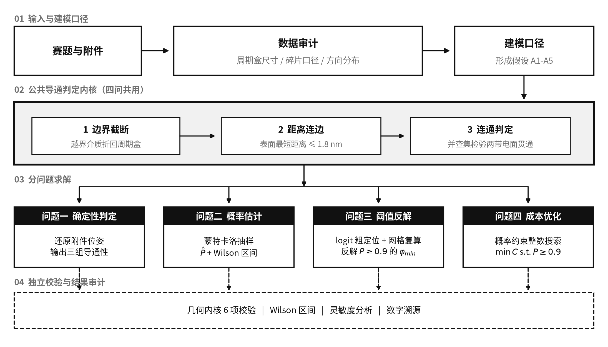

图 1 技术路线：四问共用同一个导通判定内核

### 2.2 问题一的分析

问题一表面上是“代入判定”，但附件的组织方式与题面并不直接对应：附件的一行并不是一根介质 A。
因此问题一实际上先是一个数据还原问题，其结论同时决定了问题二至四随机生成器的口径。
本文把这一步单独作为第 3 节。

### 2.3 问题二、三的分析

导通与否是随机配置的函数，导通概率没有解析表达式，只能用蒙特卡洛频率估计，并给出置信区间。
问题三要求精确到 0.01%，对应介质 A 根数相差约 7 根，需要先用 logit 拟合定位跃变点，
再在 0.01% 网格上直接复算，避免把结论压在拟合模型的形式上。

### 2.4 问题四的分析

介质 B 单颗成本只有介质 A 的 1/8.9，但半径 200 nm 的球跨接能力远不如长 5000 nm 的棒；
球的作用是充当棒与棒之间的“桥”。由于导通概率对 $N_A$、$N_B$ 都单调不减，最优解必落在
可行域边界上，二维搜索可降为沿边界的一维搜索。

## 三、附件数据审计与建模口径的确定

**先看数据再建模。** 附件里有四件事与题面的字面读法不同，每一件都改变了后面的模型。
本节的全部结论由 `src/audit_attachment.py` 产生，可复现。

### 3.1 附件的一行是碎片，不是一根介质

题面附件说明写明“每一行表示一个介质 A”，但数据与这一字面说明冲突：介质 A 的轴长恒为
5000 nm，而附件中绝大多数行的两端点距离都小于 5000 nm
（组 3 中仅 155/535 行等于 5000）。把方向向量完全相同的行归为一组后，组数为 7 / 28 / 354，
且每组轴长之和都不超过 5000 nm。故：**一行是边界截断后的一个碎片，同向的若干行合起来才是
一根母介质**。组 3 的 354 根对应体积分数 0.5005%，正是问题二的第一档 0.50%，
这既验证了还原，也说明组 3 就是按问题二的口径生成的。

### 3.2 组 1、组 2 的周期盒不是立方体

碎片在边界处成对出现（前一碎片终点在 $+h$、后一碎片起点在 $-h$，其余两坐标完全相同），
因此只要统计碎片端点**精确落在**某个平面上的次数，就能直接读出回绕面的位置。
坐标是浮点数，随机落到某个整值平面上的概率为零，所以这种精确命中只能来自截断本身：

表 1 碎片端点落在候选周期面上的次数（判据：$|\,|x_j|-h_j\,|<10^{-6}$ nm）

| 微构体 | $X$ 面 $\pm5000$ | $Y$ 面 $\pm500$ | $Z$ 面 $\pm500$ | $Y$ 面 $\pm5000$ | $Z$ 面 $\pm5000$ |
|---|---|---|---|---|---|
| 组 1 | 7 | 2 | 4 | 0 | 0 |
| 组 2 | 22 | 13 | 11 | 0 | 0 |
| 组 3 | 181 | — | — | 118 | 111 |

结论很直接：组 3 的三个方向都在 $\pm5000$ 回绕，与题面的 $10000^3$ 立方体一致；
而组 1、组 2 的 $x$ 在 $\pm5000$ 回绕、$y$ 与 $z$ 却在 $\pm500$ 回绕，
截面只有 1000×1000 nm。两组的体积分数因此是 0.99% 与 3.96%，
而非按立方体折算的 0.0099% 与 0.0396%——差了整整 100 倍。问题一必须按各自的实际几何判定。

### 3.3 附件丢弃了短碎片

把每根母介质的碎片首尾相接，长度应恰为 5000 nm。组 3 有 49 根接不满：46 根缺口小于 500 nm，
另 3 根总缺口为 636/732/870 nm；若确有约 500 nm 的筛除阈值，则这些较大总缺口与“每根缺失
不止一个短碎片”的假设一致，但数据本身不能唯一证明碎片个数。附件中保留的最短碎片是 526 nm。
把保留碎片与反推出的总缺口画在同一坐标上即图 2，两者在 500 nm 附近几乎不重叠，支持
“组 3 曾按约 500 nm 的长度阈值筛除短碎片”这一假设。该结论不能外推到全部分表：组 1 的两个
缺口中有一个为 576.7 nm，组 2 的四个缺口才全部小于 500 nm。缺失碎片有可能正好是一座桥，
因此问题一另按“补回缺失碎片”的口径复判一次，结论不变（第 5.3 节）。

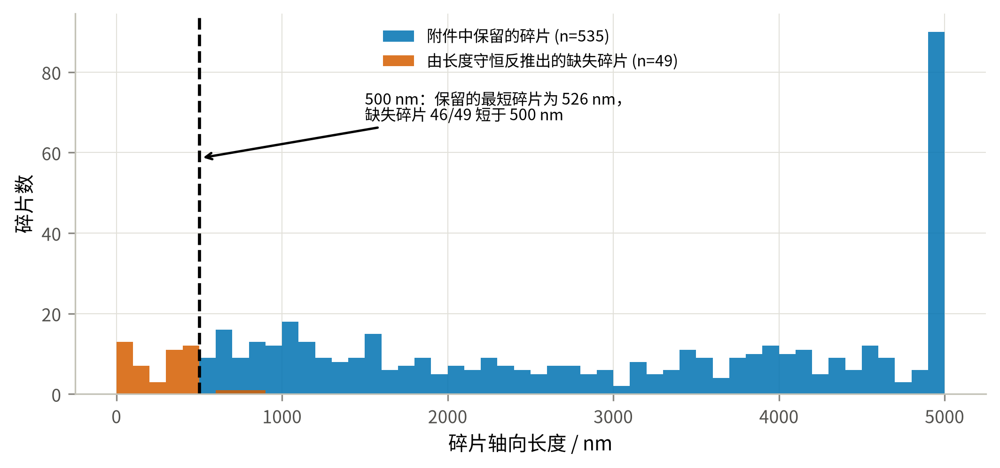

图 2 附件保留碎片与反推出的缺失碎片的长度分布

### 3.4 附件的方向分布不是各向同性——一条不进入主口径的发现

组 3 中 354 根母介质方向余弦绝对值的均值为 $E|\boldsymbol u| = (0.656,\,0.390,\,0.394)$。
各向同性应为 $(0.5,0.5,0.5)$；而以 $X$ 轴（带电面法向）为极轴、$\theta\sim U(0,\pi)$、
$\phi\sim U(0,2\pi)$ 的分布，理论值为 $(2/\pi,\,(2/\pi)^2,\,(2/\pi)^2)=(0.637,0.405,0.405)$。
对 $|u_x|$ 作 Kolmogorov–Smirnov 检验（分布拟合优度检验见[4]）：

| 检验对象 | 假设 | 统计量 | $p$ 值 | 结论 |
|---|---|---|---|---|
| $\lvert u_x\rvert$ 的边缘分布 | 球面均匀（各向同性） | $D=0.243$ | $6.7\times10^{-19}$ | 拒绝 |
| $\lvert u_x\rvert$ 的边缘分布 | $\theta\sim U(0,\pi)$，极轴为 $X$ | $D=0.036$ | 0.73 | 不拒绝 |
| 方位角 $\phi=\arctan(u_z/u_y)$ | $\phi\sim U(0,2\pi)$ | $D=0.024$ | 0.98 | 不拒绝 |
| $\lvert u_x\rvert$ 与 $\phi$ | 相互独立 | $\rho_s=0.016$ | 0.76 | 不拒绝 |

只检验 $\lvert u_x\rvert$ 的边缘分布并不足以确定整个方向分布，因此后两行补上了方位角的
均匀性与两者的独立性：三项检验都不拒绝，说明“$\theta\sim U(0,\pi)$、$\phi\sim U(0,2\pi)$
且相互独立”这一完整的三维分布与附件数据相符，而不只是某个边缘量对得上。
（方向只在反号意义下确定，本文取 $u_x\ge0$ 的一支；反号把方位角平移 $\pi$，
均匀分布对平移不变，故检验不受影响。）

就附件样本而言，KS 检验拒绝各向同性。图 3 左图把经验累积分布与两条理论曲线画在一起：
经验分布几乎贴合极角均匀的曲线，而与各向同性的对角线明显分离；右图用三个方向余弦的
均值给出同一结论。（组 1、组 2 的 $E|u_x|$ 高达 0.99，但它们的截面只有 1000×1000 nm，
5000 nm 的棒**几乎必须**沿 $X$ 排列，那是几何强制而非分布信息，故不作为证据；
上表只用组 3——唯一的立方体盒、样本最大且无此约束。）

**但这条发现不进入主口径。** 题面对问题二至四只写“介质位置与方向随机”，并未指定分布，
也未说随机构型必须沿用附件的生成过程；附件是问题一的输入，其分布刻画的是那三个
具体微构体是怎么造出来的。在题面没有给出分布时，**球面均匀是“方向随机”的最少假设读法**，
因此本文以球面均匀为**主口径**，并把附件标定的极角均匀分布作为**灵敏度口径**
全程并列给出（第 9.2 节表 14）。

这个选择必须明说其代价：两种口径给出的答案差别很大——同一体积分数下导通概率接近翻倍，
问题三的答案相差 0.08 个百分点，问题四的低成本候选相差约 10%。所以这不是一处无关紧要的
建模细节，而是**全题最敏感的口径分歧**；本文的做法是取最少假设的那一支作答，
同时把另一支的完整结果一并列出，供按不同理解取用。

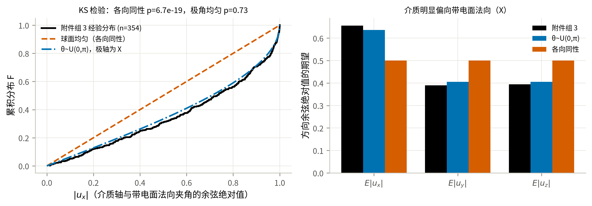

图 3 组 3 介质方向的经验分布与两种候选分布

## 四、模型假设、符号与判定内核

### 4.1 模型假设

每条假设后面注明它在哪里被用到；用不到的假设不写。

- **A1（球柱体双侧界 + 平端圆柱终核）** 问题一至三先把介质 A 建模为半径 $r=30$ nm、
  轴长 $h$ 的球柱体，用于 3.3 节把“表面最短距离”化为“轴线段最短距离减 $2r$”并向量化。
  题面的介质 A 是**平端面**直圆柱 $C$，与球柱体并不相同；问题四最终改用平端圆柱直接距离。
  本文不再以“体积只差 0.8%”作为理由，而是用几何包含关系把误差夹住：记

  $$K^-=\{x:\mathrm{dist}(x,S_{h-2r})\le r\},\qquad K^+=\{x:\mathrm{dist}(x,S_h)\le r\},$$

  其中 $S_\ell$ 是长为 $\ell$ 的轴线段，则 $K^-\subseteq C\subseteq K^+$。
  （内界证明：若 $x=p+v$，$p\in S_{h-2r}$、$|v|\le r$，把 $v$ 分解为轴向与径向分量，
  轴向坐标满足 $|t_p+v_\parallel|\le(h/2-r)+r=h/2$，径向满足 $|v_\perp|\le r$，故 $x\in C$。）
  包含关系对介质—介质与介质—带电面两类判定同时成立，于是

  $$P(K^-)\ \le\ P(\text{真实圆柱})\ \le\ P(K^+).$$

  两端都只是把轴长换成 $h-2r=4940$ 或 $h=5000$，复用同一套内核即可算出。
  第 9.4 节给出了双侧界的数值，并据此修正了问题二、三的答案表述。
- **A2（碎片独立）** 边界截断产生的每个碎片是独立导体，同一根母介质的不同碎片之间
  没有电学连接。用于 3.4 节建图。这里与题面“介质 m 由于极化作用也全部带电”的字面表述
  存在冲突：若折回前后的部分仍视为同一介质 m，则应整体带电。本文仍取碎片独立，是因为
  若改为碎片粘合，
  任何一根跨越 $X$ 边界的介质都会同时接触左右带电面而使微构体必然导通，
  问题二至四将退化为平凡问题（第 9.2 节给出该口径下 $P=1.000$ 的对照）。
- **A3（硬壁）** 四个绝缘面不导电，介质之间的距离按普通欧氏距离计算，不跨绝缘面配对。
  与 A2 一致：截断只是保持体积分数的放置约定，不意味着盒子在电学上是周期的。
- **A4（均匀各向随机）** 介质中心在微构体内均匀分布；方向**在单位球面上各向同性**，
  即 $u=(\sqrt{1-Z^2}\cos\Phi,\ \sqrt{1-Z^2}\sin\Phi,\ Z)$，$Z\sim U[-1,1]$、$\Phi\sim U[0,2\pi)$
  （等价于 $|u_x|\sim U(0,1)$）。用于问题二至四的随机生成。这是题面“方向随机”在未指定分布时的
  最少假设读法。附件组 3 的实测分布并非各向同性（第 3.4 节），本文把它作为灵敏度口径
  在第 9.2 节并列给出，不作为主口径。不考虑重力与介质间碰撞（题面给定）。
- **A5（判据对称）** 导通判据 $\delta=1.8$ nm 对介质–介质与介质–带电面一视同仁（题面给定）。

### 4.2 符号说明

| 符号 | 含义 | 单位 |
|---|---|---|
| $L$ | 微构体边长，$L=10000$ | nm |
| $r,\;h$ | 介质 A 的半径与轴长，$r=30,\;h=5000$ | nm |
| $R$ | 介质 B 的半径，$R=200$ | nm |
| $\delta$ | 导通判据的最大表面间距，$\delta=1.8$ | nm |
| $N_A,\;N_B$ | 介质 A 的根数、介质 B 的颗数 | — |
| $\varphi_A,\;\varphi_B$ | 两种介质各自的体积分数 | — |
| $V_A,\;V_B$ | 单个介质体积，$V_A=\pi r^2h,\;V_B=\frac43\pi R^3$ | nm³ |
| $c_A,\;c_B$ | 单个介质成本 | 元 |
| $S_i$ | 第 $i$ 个碎片的轴线段 | — |
| $P$ | 微构体导通概率 | — |
| $\hat P,\;T$ | 导通频率估计、蒙特卡洛试验次数 | — |

### 4.3 边界截断与最短距离

**边界截断.** 设介质 A 的轴线段为 $\boldsymbol p+t(\boldsymbol q-\boldsymbol p),\,t\in[0,1]$。
对每个坐标轴 $j$ 求出线段穿越周期格点平面 $x_j=L/2+kL\;(k\in\mathbb Z)$ 的所有参数 $t$，
以这些 $t$ 为断点把线段切开；每一子段整体位于同一个周期像内，把它平移
$-\lfloor\cdot\rceil L$ 即回到微构体内。该过程对**轴线**与题面“把超出部分沿越界方向的
反方向平移一个边长，必要时重复”等价，且自然支持需要多次平移的情形。半径 30 nm 的柱体
若在垂直于轴线的方向越界，径向薄层（最厚 30 nm）没有另做球柱实体的精确切分。
第 9.4 节的双侧界只量化端帽形状误差，**不能覆盖这项径向截断误差**；后者仅影响轴线距边界
30 nm 以内的介质，本文未对其单独建立严格界，因此把它保留为模型局限而不作量化断言。

**最短距离.** 在假设 A1 下，两个介质 A 的表面最短距离为

\begin{equation}\label{eq:dsurf}
d_{\text{surf}}(i,j)=d_{\text{seg}}(S_i,S_j)-2r ,
\end{equation}

其中 $d_{\text{seg}}$ 是两条线段的最短距离，用 Ericson 的线段—线段最近点算法[7]精确求出。
同理，介质 B 与介质 A、介质 B 与介质 B 之间分别为
$d_{\text{pt-seg}}-(r+R)$ 与 $\|\boldsymbol c_i-\boldsymbol c_j\|-2R$。
介质与带电面 $x=\pm L/2$ 的表面距离由介质在 $x$ 方向的极值减去半径给出。

问题四终核切换到平端圆柱：圆柱的支撑映射为轴向端点支撑与垂直轴线的圆盘支撑之和，
以 Gilbert--Johnson--Keerthi（GJK）算法[9]求两凸体距离；点到圆柱的距离则由轴向超出量和
径向超出量的平方和开方。
该模式仍先用 $K^-/K^+$ 快速筛选，只有端缘临界对进入迭代距离计算。

这两条规则画在一起即图 4。(a) 说明截断：越界部分沿越界方向的反方向平移一个边长回到盒内，
主段与折回段在几何上属于同一根母介质，但按假设 A2 是**两个彼此独立的导体**。
(b) 说明介质 A 之间的判据。(c) 说明介质 B 的作用——它本身跨度有限，价值在于充当桥：
由 $d_{\text{pt-seg}}\le r+R+\delta$ 可知，一颗 B 最多能把轴距 $2(R+r+\delta)=463.6$ nm
以内的两根 A 连起来，这个数在第 8.2 节解释“为什么 B 只占很小比例”时还会再出现。

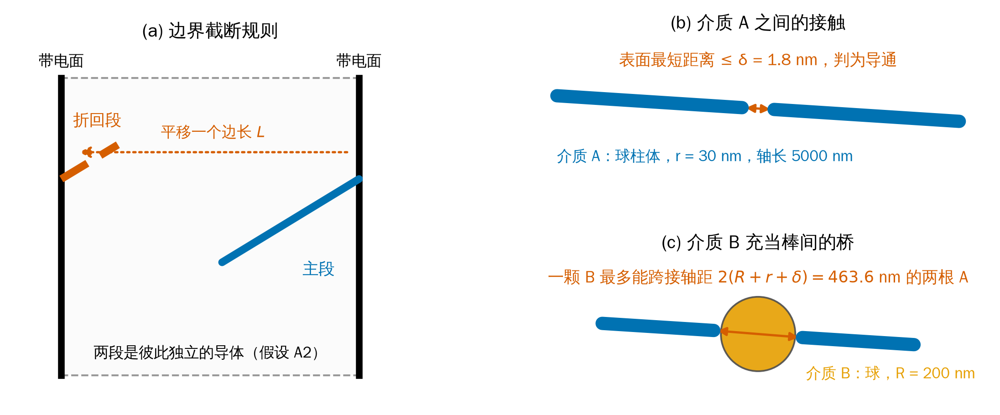

图 4 边界截断规则与导通判据示意

### 4.4 导通判定

构造无向图 $G=(V,E)$：$V$ 为全部碎片再加两个虚拟节点 $\mathrm{L},\mathrm{R}$（左右带电面）。
当两个介质的表面最短距离 $\le\delta$ 时在其间连边；当某介质与某带电面的表面距离 $\le\delta$ 时，
把它与对应虚拟节点连边。用并查集求连通分量，则

\begin{equation}\label{eq:span}
\text{微构体导通}\iff \mathrm{find}(\mathrm L)=\mathrm{find}(\mathrm R).
\end{equation}

**复杂度.** 朴素两两比较为 $O(M^2)$（$M$ 为碎片数）。实现中对棒—棒用轴对齐包围盒预筛 +
分块计算，对数量可达上万的介质 B 用 KD 树做邻域检索[8]，把 $\varphi=1\%$ 规模的单次判定
从 744 ms 降到 107 ms，且与朴素实现逐位一致（第 9.1 节 T6）。

## 五、问题一模型的建立与求解

### 5.1 判定口径的确定

按第 3 节的审计结论：组 1、组 2 用 $10000\times1000\times1000$ nm 的实际几何，组 3 用
$10000^3$；附件给出的每个碎片是一个独立导体（假设 A2）。判定直接使用第 4.4 节的内核，
不含任何随机性，结果可逐位复现。

### 5.2 三个微构体的导通判定结果

把三组碎片分别送进判定内核，得到表 2。三组的母介质数、周期盒与体积分数差异都很大，
因此不能只看“介质多不多”，还要看接触图是否把左右两个带电面连起来。

表 2 问题一的判定结果与接触图规模

| 微构体 | 母介质数 | 碎片数 | 截面 $Y\times Z$ / nm | 体积分数 | 接触边数 | 触左/右面 | **判定** |
|---|---|---|---|---|---|---|---|
| 组 1 | 7 | 12 | 1000×1000 | 0.99% | 2 | 3 / 4 | **不导通** |
| 组 2 | 28 | 49 | 1000×1000 | 3.96% | 27 | 11 / 11 | **导通** |
| 组 3 | 354 | 535 | 10000×10000 | 0.50% | 166 | 92 / 90 | **导通** |

三组在 $X$ 方向的尺寸都是 10000 nm（带电面法向），故表中只列截面尺寸。

三组的判定机理各不相同，值得逐一说明：

**组 1 不导通。** 7 根介质几乎完全沿 $X$ 轴排列（$E|u_x|=0.997$），在 1000×1000 nm 的细通道里
本可以首尾接力，但整个微构体只有 2 条接触边，左侧团簇与右侧团簇之间存在断口。
换言之，组 1 缺的不是介质总量（体积分数 0.99% 反而高于组 3），而是介质在 $X$ 方向上的接力。

**组 2 导通。** 同样的细通道几何，介质增加到 28 根、体积分数 3.96%，接触边增至 27 条，
左右两侧的团簇被打通，存在贯穿通路。

**组 3 导通。** 体积分数只有 0.50%，但微构体截面是组 1、组 2 的 100 倍，
92 个碎片触及左带电面、90 个触及右带电面，且每根介质长 5000 nm（半个盒边），
只需 2–3 根接力即可跨越，因而在这一体积分数下已经越过渗流阈值。
按第 6 节的主口径结果，$\varphi=0.50\%$ 的导通概率为 0.0874；组 3 导通属于偏罕见但并非
不可能的事件，也是第 6.2 节列出的主口径反证之一。附件标定的灵敏度口径下该概率为 0.2193。

接触图中最近的一对介质表面距离为负（组 1 为 $-25.4$ nm，组 3 为 $-59.8$ nm），
即存在相互贯穿的介质，与题面“允许介质因随机生成而产生相互贯穿、重叠”一致。

把三组的接触图投影到 $X$–$Y$ 平面即得图 5。着色只用**碎片之间的接触**定义团簇，不含判定用的
虚拟电极节点（那两个节点会把触及同一带电面却彼此无接触的碎片并成一块，凭空造出巨团簇）：
组 2 的贯通团簇含 5/49 个碎片，组 3 只含 **17/535（3.2%）**——一条横穿盒子却几乎不占体积的
细链，正是第 6.3 节“贯通靠短链而非巨团簇”的直接图示。组 1 左右两侧各自成团、
中间留有断口；组 2、组 3 则出现一个同时连到左右带电面的贯通团簇（绿色），
与表 2 的判定一致。

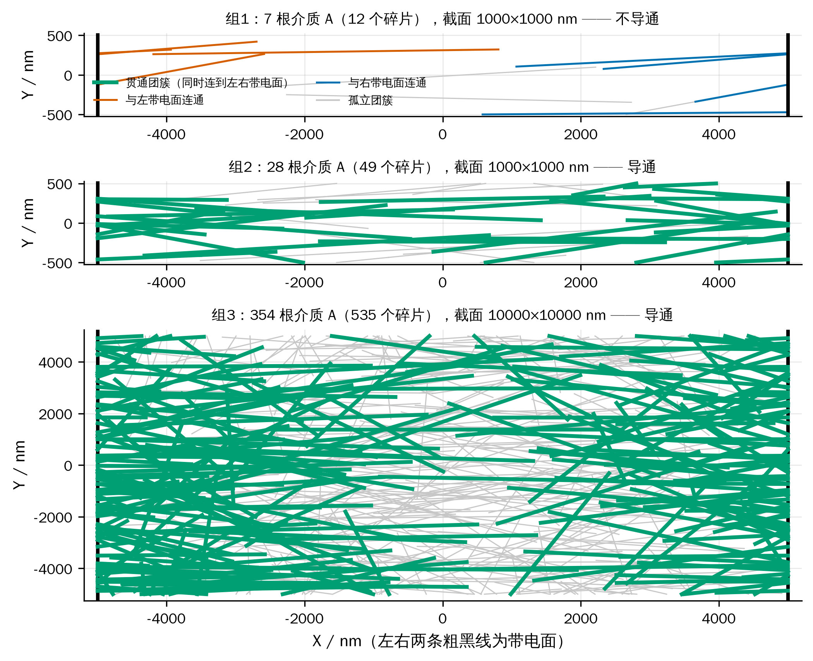

图 5 三个微构体的接触图在 X–Y 平面的投影

### 5.3 判定结论的稳健性检验

三个判定都不是“卡在阈值上”的结论，两项检查支持这一点：

1. **补回被丢弃的碎片。** 按第 3.3 节把每根母介质的轴线还原为完整的 5000 nm 再重新截断，
   碎片数由 12/49/535 增至 15/53/589；三组的判定结论**均不变**。
2. **判据阈值扰动。** 把 $\delta$ 在 $\pm50\%$ 范围内扫描，三组结论同样不变：

表 3 问题一判定对判据阈值的稳健性

| $\delta$ / nm | 0.90 | 1.35 | **1.80** | 2.25 | 2.70 |
|---|---|---|---|---|---|
| 组 1 | 不导通 | 不导通 | **不导通** | 不导通 | 不导通 |
| 组 2 | 导通 | 导通 | **导通** | 导通 | 导通 |
| 组 3 | 导通 | 导通 | **导通** | 导通 | 导通 |

这说明三组都不处在判定的临界状态：组 1 的断口宽度远大于 $\delta$ 的量级，
组 2、组 3 的贯通通路也不是靠某一条刚好卡在 1.8 nm 的接触边撑起来的。

3. **两种数据口径给出同一判定。** 题面的逐字读法是“每个微构体都是 $10000^3$ 立方体、
   附件每行就是一根介质 A”，本文第 3 节则反推出“每行是碎片、组 1 与组 2 的截面为
   1000×1000 nm”。这两种读法的差别**不进入连通性计算**：判定内核只用到三样东西——
   附件给出的线段、接触判据 $\delta$、以及 $x=\pm5000$ 的两个带电面；
   $Y$、$Z$ 方向的盒宽和“一行算一根还是算一个碎片”都不影响任何一条接触边。
   因此**两种口径下的三个判定结论完全相同**，分歧只体现在体积分数的折算上：

表 4 两种数据口径下的体积分数（判定结论相同）

| 微构体 | 逐字口径（每行一根，$10000^3$） | 本文口径（碎片还原 + 实测周期盒） | 判定 |
|---|---|---|---|
| 组 1 | 0.017% | 0.99% | 不导通 |
| 组 2 | 0.069% | 3.96% | 导通 |
| 组 3 | 0.756% | 0.50% | 导通 |

   本文在正文中采用还原口径，因为只有它能让组 3 的体积分数（0.50%）与问题二的第一档对上；
   即使按附件说明逐行计数，问题一的三个导通判定也不变。

需要说明的是，若改用本文未采用的“碎片粘合”口径（假设 A2 的反面），组 1 也会变成导通——
因为组 1 中存在跨越 $X$ 边界的介质，其两个碎片分别贴在左、右带电面上。
三组结论将全部变成“导通”，问题一失去区分度。这从反面支持了假设 A2。

## 六、问题二模型的建立与求解

### 6.1 导通概率的蒙特卡洛模型

给定介质 A 的体积分数 $\varphi$，根数按题目要求四舍五入取

\begin{equation}\label{eq:NA}
N_A=\mathrm{round}\!\left(\varphi\,L^3/V_A\right),\qquad V_A=\pi r^2h=1.41372\times10^{7}\ \text{nm}^3 .
\end{equation}

一次试验：按假设 A4 随机生成 $N_A$ 根介质 A，做边界截断，用第 4.4 节的内核判定导通与否。
这是蒙特卡洛方法的标准用法——把一个没有解析表达式的概率，转化为对可判定事件的重复抽样[3]。
重复 $T$ 次独立试验，导通频率 $\hat P=X/T$ 即为导通概率的无偏估计，其中 $X\sim B(T,P)$。
区间估计用二项比例的 Wilson 区间[11]而非正态近似——当 $\hat P$ 接近 0 或 1 时，$\hat P\pm1.96\,\mathrm{se}$
会给出越界的区间，Wilson 区间不会：

\begin{equation}\label{eq:wilson}
\frac{\hat P+\frac{z^2}{2T}\pm z\sqrt{\hat P(1-\hat P)/T+z^2/(4T^2)}}{1+z^2/T},\qquad z=1.96 .
\end{equation}

### 6.2 四档体积分数下的导通概率

每档做 $T=8000$ 次独立试验。**主口径（假设 A4 的球面均匀方向）** 结果如下。
需要先说明一点：下表的 $\hat P$ 是在球柱体口径 $K^+$ 下算出的，按假设 A1 它是
**真实平端面圆柱导通概率的上界**；第 9.4 节给出了对应的下界。

表 5 四档体积分数下的微构体导通概率（$T=8000$，括号内为 Wilson 95% 区间）

| 体积分数 $\varphi$ | 介质 A 根数 $N_A$ | 导通次数 | **导通概率 $\hat P$** | 95% 置信区间 |
|---|---|---|---|---|
| 0.50% | 354 | 699 | **0.0874** | (0.0814, 0.0938) |
| 0.60% | 424 | 1860 | **0.2325** | (0.2234, 0.2419) |
| 0.70% | 495 | 3929 | **0.4911** | (0.4802, 0.5021) |
| 1.00% | 707 | 7952 | **0.9940** | (0.9921, 0.9955) |

作为灵敏度口径，若改用附件组 3 标定的极角均匀分布生成方向，同样 8000 次试验给出

表 6 附件标定方向口径下的对照结果

| 体积分数 | 0.50% | 0.60% | 0.70% | 1.00% |
|---|---|---|---|---|
| $\hat P$（球面均匀，主口径） | 0.0874 | 0.2325 | 0.4911 | 0.9940 |
| $\hat P$（附件标定，灵敏度口径） | 0.2193 | 0.4798 | 0.7458 | 0.9994 |

把两套口径下的全部估计点连成曲线即图 6：带误差棒的标记是题目点名的四档，
误差棒为 Wilson 95% 区间（在 8000 次试验下已窄到与标记同量级）；曲线上其余点来自
问题三的粗扫与细网格；两个星号是第 7 节求得的使 $P\ge90\%$ 的最低体积分数。

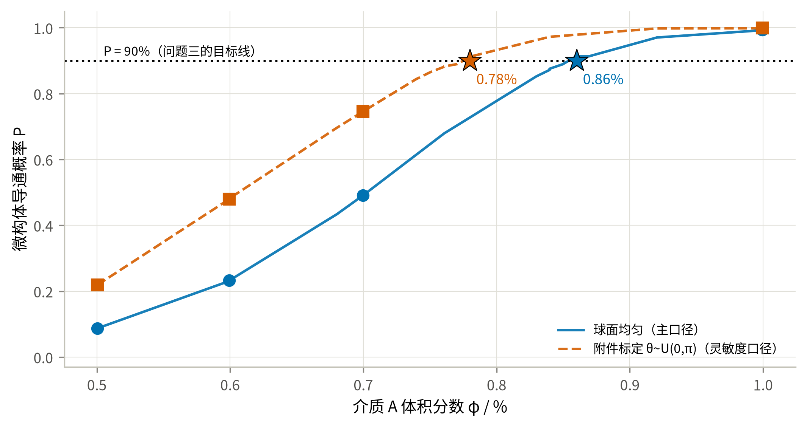

图 6 导通概率随介质 A 体积分数的变化

**结果解读.**

1. 概率在 0.50%→1.00% 之间由 0.087 升到 0.994，跨越了一个完整的**渗流跃变**：
   在陡峭段上，体积分数每增加 0.10%（约 71 根介质），概率就上升约 0.15–0.26（0.087→0.233→0.491）。
   微构体的导通不是“介质越多导电性越好”的连续过程，而是在一个很窄的窗口里从几乎不通变成几乎必通。
2. **与渗流理论的独立对照。** 经典排除体积判据（Balberg 等[6]）给出随机取向细长杆的阈值满足
   $n_c\langle V_{ex}\rangle\approx B_c\approx1.4$。代入本题参数
   （连通等效直径 $2r+\delta=61.8$ nm，$\langle V_{ex}\rangle=2.548\times10^9$ nm³）得
   $N_c\approx549$ 根，即 $\varphi_c\approx0.777\%$。三个数排成一条可解释的链：

   表 6-1 三种阈值口径的对照

   | 来源 | $\varphi$ at $P=0.5$ | 与上一行的差异来自 |
   |---|---|---|
   | 排除体积判据（各向同性、无限大体系） | 0.777% | — |
   | 本文仿真（主口径：各向同性、有限盒） | 0.705% | 有限尺寸效应：介质长 5000 nm 恰为盒边一半，跨越只需 2–3 根接力 |
   | 灵敏度口径（附件标定方向、有限盒） | 0.607% | 方向偏向带电面法向，进一步降低阈值 |

   **主口径与理论判据用的是同一套方向假设**（各向同性），二者相差 9%，方向一致
   （有限体系阈值更低），未显示与解析判据相反的系统偏离。主口径还可与解析判据直接对照，
   附件标定口径则不满足该判据的各向同性前提。第三行的进一步下降由方向偏向解释，
   其中“有限尺寸效应”这一步在第 6.3 节有直接的结构证据，而不只是一句合理的猜测。
3. **方向分布的影响远大于统计误差。** 表 6 中两套口径在 0.50%、0.60%、0.70% 三档上分别相差
   0.132、0.247、0.255，而 8000 次试验的 95% 区间半宽只有约 0.01。
   也就是说，这一差别不是“算得不够准”，而是**建模口径的选择**：它比本文其它任何一处
   不确定性都大一个量级，因此两套结果全程并列，而不是只报一套。
4. 需要留一条与主口径不完全相符的观察：附件组 3 恰好是 $\varphi=0.50\%$ 的一个构型
   （354 根母介质，与 $\varphi=0.50\%$ 的取整结果一致），而它是导通的。
   在主口径下这是一个概率 0.087 的事件——不至于不可能，但偏罕见；
   在附件标定口径下概率为 0.219，更自然。这一点连同第 3.4 节的 KS 检验，
   构成对主口径的**不利证据**。若问题二至四要求沿用附件的生成分布，则应取第 9.2 节的
   灵敏度口径结果。

### 6.3 渗流的结构证据：为什么阈值低于无限大体系的估计

导通概率只回答“通没通”，看不出通的时候内部长什么样。渗流理论里刻画这件事的量是**序参量**
$S_{\max}$——最大连通团簇所含碎片占全部碎片的比例。它的计算完全不涉及带电面，
因此是一条独立于导通判定的检查。图 7 把两者画在一起（每档 200 次试验）：

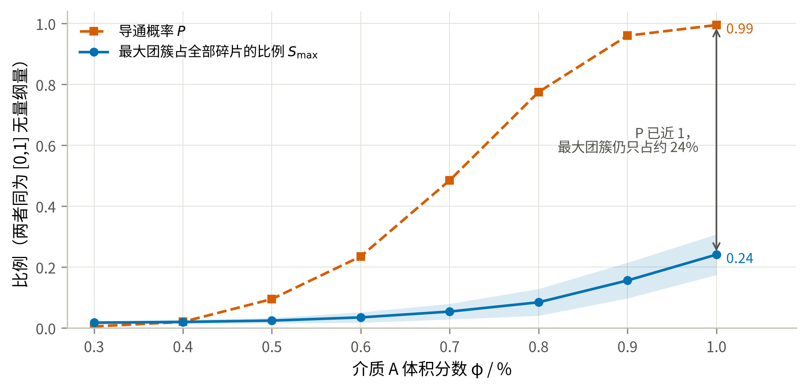

图 7 最大团簇占比与导通概率随体积分数的变化

结果不同于无限体系的经典渗流图景，却正好解释了第 6.2 节留下的疑问：**当 $P$ 已经接近 1 时，
最大团簇仍然只包含约 24% 的碎片**（$\varphi=1.00\%$ 时 $S_{\max}=0.241$，团簇总数平均为 636.6 个）；
在 $P$ 跃变最陡的 $\varphi=0.70\%$ 处，$S_{\max}$ 只有 0.0538。也就是说，
本题的微构体在**尚未形成贯穿全系统的巨团簇**时就已经导通了。

原因是几何尺度：介质 A 的轴长 5000 nm 恰为盒边的一半，跨越两个带电面只需要 2–3 根接力。
贯通所需的是一条**短链**，而不是一个吞掉大部分介质的巨团簇。这正是有限尺寸效应的直接体现，
也解释了为什么第 6.2 节中主口径的仿真阈值（0.705%）低于排除体积判据对无限大体系的估计
（0.777%）——两者用的是同一套各向同性方向假设，差别只在体系大小；
后者刻画的是巨团簇的出现，而本题只需要短链贯通，因此更早发生。

这条结论也提醒：不能把本题的阈值直接外推到更大的微构体。盒边增大而介质尺寸不变时，
贯通需要的链长随之增加，阈值会向 0.777% 靠拢。

## 七、问题三模型的建立与求解

### 7.1 最低体积分数的求解思路

要求“精确到百分号下小数点后两位”，即在 0.01% 的体积分数网格上定位。0.01% 对应
$\Delta N_A=L^3\times10^{-4}/V_A\approx7.07$ 根，相邻网格点的导通概率相差约 0.02，
因此蒙特卡洛的 95% 区间半宽必须明显小于 0.02。分两步：

1. **粗定位.** 在 $\varphi\in[0.60\%,1.00\%]$ 上取 6 个点，各 2000 次试验，
   用二项似然拟合 $\mathrm{logit}\,P=a+bN_A$（广义线性模型与二项似然见[2][4]），反解 $P=0.90$ 的穿越点；
2. **网格复算.** 在穿越点附近的 5 个 0.01% 网格点上各做 4000 次试验（区间半宽约 0.009），
   取**最小的、点估计不低于 0.90 的**网格点作为答案，再用 12000 次试验独立复核。

拟合只用于省算力，最终结论由第 2 步的直接频率给出，不依赖 logit 模型的函数形式。

### 7.2 使 $P\ge 90\%$ 的最低体积分数

粗定位给出 $P=0.90$ 的穿越点在 $N_A\approx604$（$\varphi\approx0.854\%$）。在其附近的 0.01% 网格上
各做 4000 次试验：

表 7 问题三的 0.01% 网格复算（主口径：球面均匀，$T=4000$）

| 体积分数 $\varphi$ | $N_A$ | 导通概率 $\hat P$ | 95% 置信区间 | 是否达标 |
|---|---|---|---|---|
| 0.83% | 587 | 0.8525 | (0.8412, 0.8632) | 否 |
| 0.84% | 594 | 0.8720 | (0.8613, 0.8820) | 否 |
| 0.85% | 601 | 0.8892 | (0.8791, 0.8986) | 否 |
| **0.86%** | **608** | **0.9127** | (0.9036, 0.9211) | **是** |
| 0.87% | 615 | 0.9135 | (0.9044, 0.9218) | 是（更贵） |

**在球柱体口径 $K^+$ 下，最低填充量为 $\varphi=0.86\%$**（对应 608 根介质 A）。
但 $K^+$ 只给出真实圆柱导通概率的**上界**，因此 0.86% 是真实答案的**下界**而非答案本身。
第 9.4 节用内界 $K^-$ 重算同一网格后得到：

$$\varphi_{\min}(\text{真实圆柱})\in[\,0.86\%,\ 0.89\%\,],$$

其中 0.89%（630 根）是**在当前内界仿真判据下达标**的最小网格值（内界在该点的频率为
$\hat P=0.9202$，而 0.88% 处只有 0.8993）。若必须给出单一数值，工程上取保守值：

**答案：介质 A 的填充量取 $\varphi=0.89\%$（630 根）；在当前内界仿真中该值达到 90% 目标。
若采用球柱体外界口径，最低网格值为 0.86%（608 根）。**

夹逼带宽比灵敏度口径下更宽（3 格 vs 2 格），原因是球面均匀方向下概率曲线在阈值附近更平缓：
同样 0.01% 的体积分数增量只带来约 0.02 的概率提升，因此内外界之间需要更多网格才能拉开。

独立复核：在 $\varphi=0.86\%$ 用另一组随机种子做 12000 次试验，得 $\hat P=0.9062$，
95% 置信区间 $(0.9008,\,0.9113)$，区间下界仍高于 0.90，结论成立。
相邻的 0.85% 在两次独立估计中都明显低于 0.90（0.8892，区间上界 0.8986），
因此 0.86% 是 0.01% 网格上能达标的**最小**取值，而不是四舍五入的结果。

按附件标定方向的灵敏度口径重做同一流程，答案为 $\varphi=0.78\%$（552 根，复核 $\hat P=0.9092$，
区间 $(0.9039,0.9142)$）。两套口径相差 0.08 个百分点，即约 56 根介质，
仍然是全题最大的不确定来源。

按球柱体外界口径换算，纯用介质 A 达到 90% 目标的阶段性代价是
$608\times c_A=9.025$ 元；若采用内界的保守网格值 630 根，则为 9.352 元。
二者只作为问题四全局搜索的参照，不作为最终配比。

## 八、问题四模型的建立与求解

### 8.1 最低成本配比的优化模型

单个介质的成本由体积换算（$1\ \mu\mathrm{m}^3=10^9\ \mathrm{nm}^3$）：

\begin{equation}\label{eq:cost}
c_A=1.05\times\frac{V_A}{10^9}=1.48441\times10^{-2}\ \text{元/根},\qquad
c_B=0.05\times\frac{V_B}{10^9}=1.67552\times10^{-3}\ \text{元/颗} .
\end{equation}

优化问题为

\begin{equation}\label{eq:opt}
\min_{N_A,N_B\in\mathbb Z_{\ge0}}\; C=c_AN_A+c_BN_B
\qquad \text{s.t.}\quad P(N_A,N_B)\ \ge\ 0.90 .
\end{equation}

**结构性质.** 向已有配置中再加入一个介质，只会给接触图增加一个顶点和若干条边，
不会删去任何已存在的通路，故 $P$ 对 $N_A$、$N_B$ 都单调不减。于是可行域是“右上封闭”的，
最优解必落在可行边界 $N_B=g(N_A)$ 上，二维搜索降为沿边界的一维搜索。

**求解策略.** $P$ 没有解析式，只能用仿真估计，直接对每个 $N_A$ 做二分需要上百万次仿真。
前期定位采用三个阶段：

- **阶段 A（代理模型）.** 在 $N_A\times N_B$ 的 $8\times6$ 网格上各做 700 次试验，
  用二项似然拟合
  $\mathrm{logit}\,P=w_0+w_1N_A+w_2N_B+w_3\sqrt{N_B}+w_4N_AN_B/1000$。
  其中 $\sqrt{N_B}$ 项刻画球的边际收益递减，交互项刻画“球只有在有棒可搭时才有用”的协同效应。
- **阶段 B（沿边界筛选）.** 用代理模型给出边界和成本排序，选取成本较低的若干候选点；
- **阶段 C（候选验证）.** 对候选做 6000 次直接仿真。Wilson 区间下界不低于 0.90 时确认达标，
  上界低于 0.90 时确认排除，其余标为“未确认”；未确认或被排除的候选继续增加 $N_B$ 后复算。
  代理模型仅用于缩小搜索范围，表 9 的结论均来自直接仿真。第 8.3 节再以共同情景、几何内外界
  和独立大样本验证完成最终全局搜索。

### 8.2 混填配比与最低成本的求解结果

**阶段 A：概率曲面.** $8\times6$ 网格（$N_A\in[150,670]$，$N_B\in[0,3200]$）各 700 次试验，
代理模型对网格点的最大绝对残差为 0.030，足以用来定位边界。网格本身已经说明了两种介质的分工：

表 8 $(N_A,\,N_B)$ 网格上的导通概率（节选，$T=700$）

| $N_A$ \\ $N_B$ | 0 | 300 | 700 | 1200 | 2000 | 3200 |
|---|---|---|---|---|---|---|
| 250 | 0.006 | 0.021 | 0.020 | 0.039 | 0.089 | 0.283 |
| 400 | 0.179 | 0.194 | 0.314 | 0.479 | 0.763 | 0.983 |
| 480 | 0.444 | 0.554 | 0.690 | 0.836 | 0.974 | 0.999 |
| 550 | 0.767 | 0.827 | 0.927 | 0.977 | 1.000 | 1.000 |
| 610 | 0.907 | 0.947 | 0.981 | 0.999 | 1.000 | 1.000 |
| 670 | 0.974 | 0.994 | 0.999 | 1.000 | 1.000 | 1.000 |

**阶段 B、C：沿边界搜索与验证.** 代理模型给出的可行边界上，成本最低的五个候选依次是
$(604,0)$、$(564,456)$、$(524,878)$、$(484,1341)$、$(644,0)$，对应成本
8.966、9.136、9.249、9.431、9.560 元。阶段 C 对每个候选做 6000 次直接验证；
若未确认达标，则向上补 $N_B$ 后复算，因此补算点的成本不低于相应初始候选。

这里必须补上一个候选：**问题三在球柱体外界 $K^+$ 下得到的纯 A 方案 $(608,0)$，
必须与同一 $K^+$ 口径下的混填候选一同参与比较**。代理模型按自己的网格取 $N_A$，未必落在问题三那一格上；
本题它取到 $N_A=604$，而 $(604,0)$ 实测 $\hat P=0.8943$、区间跨过 0.90，无法确认可行；
补到 $(604,60)$ 后 Wilson 下界才超过 0.90，成本 9.066 元——反而比“多放 4 根 A、一颗 B
都不放”的 $(608,0)$（9.025 元）更贵。
把纯 A 方案漏在比较之外，就会把一个更贵的方案报成最优。

表 9 候选点的大样本验证（$T=6000$）

| $N_A$ | $N_B$ | 导通概率 $\hat P$ | 95% 置信区间 | 成本 / 元 | 是否可行 |
|---|---|---|---|---|---|
| **608** | **0** | **0.9130** | (0.9056, 0.9199) | **9.0252** | **$K^+$ 下确认；真实圆柱未判定** |
| 604 | 0 | 0.8943 | (0.8863, 0.9019) | 8.9658 | **未确认**（区间跨 0.90） |
| 604 | 60 | 0.9083 | (0.9008, 0.9154) | 9.0663 | $K^+$ 下确认，但更贵 |
| 564 | 456 | 0.8998 | (0.8920, 0.9072) | 9.1361 | 未确认（区间跨 0.90） |
| 564 | 516 | 0.9127 | (0.9053, 0.9195) | 9.2366 | $K^+$ 下确认，但更贵 |
| 524 | 878 | 0.8907 | (0.8825, 0.8983) | 9.2494 | 排除（区间上界低于 0.90） |
| 524 | 938 | 0.9052 | (0.8975, 0.9123) | 9.3499 | 未确认（区间跨 0.90） |
| 484 | 1341 | 0.8797 | (0.8712, 0.8877) | 9.4314 | 排除（区间上界低于 0.90） |
| 484 | 1421 | 0.9010 | (0.8932, 0.9083) | 9.5654 | 未确认（区间跨 0.90） |
| 644 | 0 | 0.9627 | (0.9576, 0.9672) | 9.5596 | $K^+$ 下确认，但更贵 |

阶段 C 的**全部**探测点都列在表 9 里，包括未确认和被排除的点。它们由 `solve_p4.py` 直接写入
`results/p4_cost_optimum.json` 的 `all_probes` 字段，不只留在运行日志里，
因此表中每一行都可溯源。`p4_backfill_probes.py` 另用同一随机种子把未通过点重算一遍，
所得 $\hat P$ 与原始运行逐位相同。随机数由 `SeedSequence` 固定分成 4 条随机流，worker 只负责
调度，因此在 numpy 与算法版本相同的前提下，改变并行度或运行时刻仍可逐位复现。

**球柱体外界 $K^+$ 下的低成本候选为 $(608,0)$**：$\varphi_A=0.86\%$、
$\hat P=0.9130$，Wilson 下界 0.9056，总成本 9.0252 元。该“确认”只排除了蒙特卡洛抽样误差，
不排除端帽几何误差；表 17 显示真实平端面圆柱在 608 根处仍无法判定。
若只使用几何双侧界，保守达标配比为 $(630,0)$、成本 9.3517 元；第 8.3 节进一步用
平端圆柱与球缺内外界作全局整数搜索，将保守值改进为 $(619,8)$。

把阶段 A 的网格画成概率曲面即图 8。红线是 $P=90\%$ 的可行边界，白线是等成本线
（斜率由 $c_A/c_B$ 决定）；两族线在 $N_B=0$ 附近相交，原网格候选位于可行边界端点，属于
**角点候选**而非切点。空心圆是阶段 C 直接验证过的边界点，星号是 $K^+$ 口径的低成本候选。

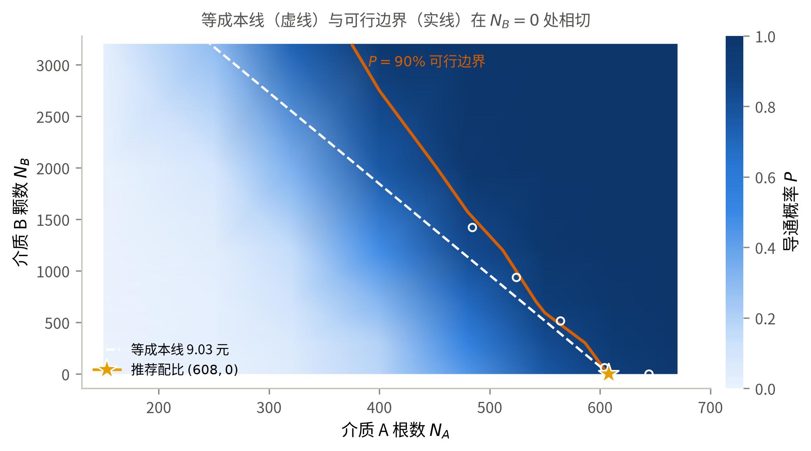

图 8 $(N_A,N_B)$ 平面上的导通概率、可行边界与等成本线

**为什么低价的介质 B 只占很小比例？** 关键不是单价本身，而是**每元成本带来的导通概率增量**。
把网格上两种介质的边际收益都折算成“每元的 $\Delta P$”（$N_B=0$ 处的差分，$T=700$，
故有约 ±0.02 的抽样噪声）：

表 10 两种介质的边际效率（$\Delta P$ / 元）

| $N_A$ | 150 | 250 | 320 | 400 | 480 | 550 | 610 | 670 |
|---|---|---|---|---|---|---|---|---|
| 纯 A 时的 $P$ | 0.000 | 0.006 | 0.054 | 0.179 | 0.444 | 0.767 | 0.907 | 0.974 |
| 加介质 A | — | 0.004 | 0.047 | 0.105 | 0.224 | **0.311** | 0.157 | 0.075 |
| 加介质 B | 0.000 | **0.031** | 0.020 | 0.031 | 0.219 | 0.119 | 0.080 | 0.040 |

两条效率曲线在 $N_A\approx300$ 附近交叉：**介质稀疏时 B 更划算，接近渗流阈值时 A 更划算**。
机理是清楚的——半径 200 nm 的球只能把相距不到约 464 nm 的两根棒接起来，作用是“补桥”；
而长 5000 nm 的棒本身跨越半个微构体，在阈值附近每多一根，贯通团簇的生长是级联式的。
介质 A 的边际效率在 $N_A=550$ 处达到峰值 0.311，恰在跃变最陡的一段。
（$N_A=480$ 一列两者几乎持平，那是 $T=700$ 的抽样噪声，半宽约 ±0.035，不足以分辨。）

而 $P\ge0.90$ 这个约束把所考察的低成本边界推到交叉点的**右侧**：即使掺入 3200 颗 B
（成本 5.36 元），$N_A=400$ 时也只能到 0.983，总成本已达 11.3 元。
在已取样网格和已验证候选中，接近阈值时 A 的每元边际效率更高，因此最终配比仍由 A 主导，
只需 8 颗 B 完成局部补桥；这一局部解释不能替代第 8.3 节的全局搜索与独立验证。

把两条效率曲线画出来即图 9：交叉点左侧 B 每元收益更高，右侧 A 更高，
而已验证的低成本候选都位于交叉点右侧。图中的阴影表示网格估计的高概率区域，
不是可行域证书。它解释了最终配比中 B 占比很小的原因：B 并非无用，而是阈值附近 A 的
单位成本边际效率更高，B 只在少数共同情景中承担补桥作用。

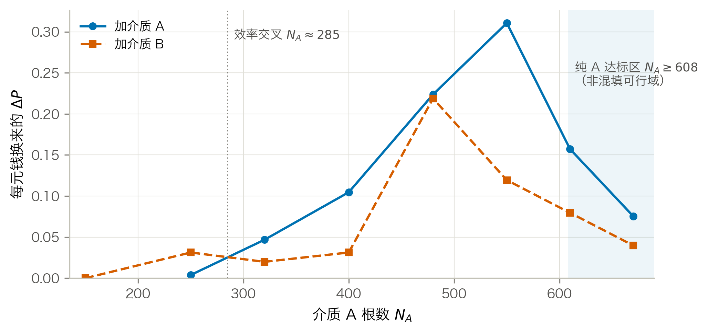

图 9 两种介质每元钱的边际效率及其交叉点

**这个结论对价格是敏感的，而且敏感点可以算出来。** 设可行边界为 $N_B=g(N_A)$，
则边界上的成本 $C(N_A)=c_AN_A+c_B\,g(N_A)$，$\mathrm dC/\mathrm dN_A=c_A+c_B\,g'$。
$g'<0$，故当 $c_B<-c_A/g'$ 时成本随 $N_A$ 增大而上升，此时应当多用 B。
盈亏平衡价为 $c_B^*=-c_A/g'$。第 9.2 节由近阈值探测点
$(484,1421)$、$(524,938)$、$(564,516)$、$(604,60)$、$(608,0)$ 实测得 $g'=-11.32$ 颗/根，
对应 $c_B^*=0.0391$ 元/$\mu\mathrm{m}^3$——现价 0.05 元/$\mu\mathrm{m}^3$ 比它高 27.8%
（需降价 21.7% 才持平）。这是局部拟合给出的价格敏感性结论，不是全局最优证明。

### 8.3 平端圆柱下的全局整数搜索

前述 $K^-/K^+$ 只能给上下界，不能判定夹在两者之间的方案。为把问题四落到本文的平端圆柱模型，
`src/microstructure.py` 新增 `rod_geometry="cylinder"`：圆柱—圆柱距离由支撑映射
Gilbert/GJK 算法求解，圆柱—球使用点到有限圆柱的解析距离，圆柱—带电面使用 X 向支撑值。
算法先用 $K^-$ 与 $K^+$ 筛掉明显接触/不接触的介质对，仅对端缘窄带调用 GJK。
四个解析构型、1000 组随机介质对以及 12 张完整接触图均满足
$K^-\text{ 导通}\Rightarrow C\text{ 导通}\Rightarrow K^+\text{ 导通}$。

成本之比恰为 $c_A:c_B=567:64$，取最小成本单位
$u=c_B/64=2.61799\times10^{-5}$ 元，则所有整数配比的成本可无误差地写成

$$Q=567N_A+64N_B,\qquad C=uQ.$$

本文采用样本平均近似（sample average approximation, SAA）[10]处理随机约束。
初始 91% 安全线得到的候选 $(615,8)$ 未通过独立内界验证（第 8.3 节后文给出记录），因此
在**最终搜索及其独立验证之前**，将共同情景的 SAA 达标线冻结为 92%，即比题设目标高
2 个百分点：
在 600 个固定共同随机情景上要求导通次数至少 552。对每条成本线，
一次生成最大 A、B 前缀并建立接触图；任意一条边只在一段连续 $N_A$ 列内激活，
故用“时间线段树 + 可回滚并查集”一次回答整条成本线，再对 $Q$ 二分。

介质 B 的球缺几何用两个严格包含口径处理：`wrap` 把每个球缺扩大为完整球，
是乐观外界，只用于排除低成本点；`discard` 把越界球整颗删除，是保守内界，
只用于确认候选。因此不需要显式构造球缺网格，仍能把题设几何夹在两者之间。

表 11 问题四全局成本边界与独立验证

| 环节 | 配比 | 成本 / 元 | 结果 | 判定 |
|---|---:|---:|---:|---|
| 前一成本刻度 $Q=351484$ | $(619,7)$ | 9.2002 | 551/600 | 乐观外界仍未达 92% |
| **首个可行刻度 $Q=351485$** | **$(619,8)$** | **9.2019** | **552/600** | 外界与球缺内界均达 92% |
| 独立验证（种子 20260828） | **$(619,8)$** | **9.2019** | **7322/8000** | **CP$_{99.5\%}$ 下界 0.9069[12]** |

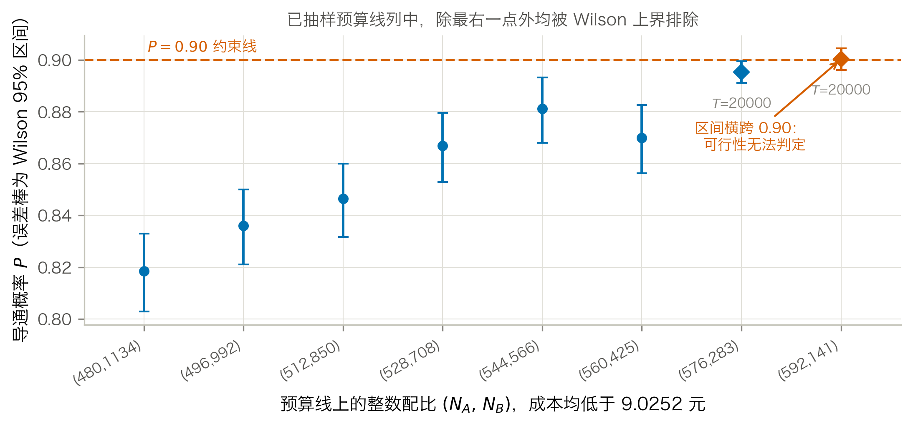

图 10 全局成本边界与推荐配比的独立置信确认

对 $N_A<580$ 的 580 个整数列分六段审计，五段在“球柱体 A+完整球 B”乐观
外界中已低于 552/600；外界未能排除的 $N_A=520$--559 段，改用平端圆柱后
最强点 $(551,610)$ 仅为 545/600。$N_A=580$--624 则在每个二分刻度逐列完整搜索；
$N_A\ge625$ 时仅 A 的成本已高于 9.2019 元，不可能产生更低成本解。
故 **$(619,8)$ 是最终搜索前固定的 92% 鲁棒 SAA 问题的整数全局最优**；其独立置信
下界又超过题设 90% 目标。相比原平端圆柱保守候选 $(626,0)$，成本下降 0.0905 元；
相比内界 630 根基准下降 0.1499 元。有限样本不能证明无抽样误差的真概率全局定理，
本文因而把“全局最优”严格限定在上述鲁棒 SAA 决策规则及第 4.3 节的中心线截断模型内；
尚未量化的圆柱径向边界截断误差不在该证书覆盖范围内。

## 九、模型检验、灵敏度与稳健性

### 9.1 几何内核的独立校验

论文的数值结论建立在线段最短距离和边界截断两个几何原语上。为避免底层误差传导到后续概率，
在仿真前对它们进行专项测试（`src/validate.py`，全部通过）：

表 12 几何内核校验

| 编号 | 检验内容 | 结果 |
|---|---|---|
| T1 | 线段最短距离解析解 vs 900×900 暴力采样 | 最大超出量 $2.3\times10^{-13}$ nm |
| T2 | 题面边界截断图例的算例逐坐标复核 | 越界段 $(5000,6000)\to(-5000,-4000)$，与题面的边界截断图例一致 |
| T3 | **附件往返测试**：把碎片还原为母介质轴线后重新截断 | 组 1/2/3 共 **334/334** 根完整介质逐坐标一致 |
| T4 | 球柱体近似（假设 A1）的初步量级检查 | 临界接触中约 3.3% 受端帽形状影响；不能据此判定答案稳健性 |
| T5 | 导通判定逻辑（贯通/断开/1 nm 间隙/单边/碎片开关） | 5 项全部符合预期 |
| T6 | 分块加速的接触检索 vs 朴素两两比较 | 三种规模下**逐位一致** |

T3 最有分量：它同时验证了截断实现、周期盒尺寸判断和碎片还原三件事。
若第 3.2 节对组 1、组 2 周期盒的判断有误，T3 不可能对 29 根介质逐坐标复现。

### 9.2 灵敏度分析

全部固定在 $\varphi=0.70\%$（$N_A=495$）——渗流跃变最陡的位置，对任何扰动都最敏感。

**S1 导通判据阈值 $\delta$.** $\delta=1.8$ nm 是题目给定的，扫描它是为了说明结论不是卡在阈值的
某个巧合上（$T=2000$）：

表 13 导通概率对判据阈值的敏感性

| $\delta$ / nm | 0.90 | 1.35 | **1.80** | 2.25 | 2.70 |
|---|---|---|---|---|---|
| $\hat P$ | 0.4625 | 0.4795 | **0.4940** | 0.5075 | 0.5185 |

$\delta$ 在 $\pm50\%$ 范围内变动时，导通频率落在 0.4625–0.5185，极差为 0.056。
在这组试验中，距离阈值的影响明显小于方向分布的影响；这一比较只适用于所扫描区间和
$\varphi=0.70\%$ 的配置，不外推为一般规律。

这里的 $\delta=1.80$ nm 行用 $T=2000$ 得 0.4940（区间 0.4721–0.5159）。它与第 6.2 节
`solve_p2.py` 的 $T=8000$ 结果 0.4911 使用同一个默认种子，且前 2000 次属于 8000 次中的
嵌套子样本，因此只能视为同随机流下的配对一致性检查，**不是独立复核**。真正的独立种子复核
见第 7.2、8.3、9.3 节的独立种子计算。

**S2 建模口径.** 同一体积分数下，把各条口径分别换掉（$T=4000$）：

表 14 建模口径对导通概率的影响

| 口径 | $\hat P$ | 95% 置信区间 | 相对基准 |
|---|---|---|---|
| **基准**：球面均匀方向 + 碎片各自独立（主口径） | **0.4940** | (0.4785, 0.5095) | — |
| 方向改为附件标定的极角均匀分布（灵敏度口径） | 0.7418 | (0.7280, 0.7551) | $+0.248$ |
| 碎片粘合为同一导体（**已否决**） | 1.0000 | (0.9990, 1.0000) | $+0.506$ |

这张表是本文最重要的一张灵敏度表，它给出两条明确结论：

1. **方向分布的影响（0.248）是判据阈值影响（0.056）的 4.4 倍。** 也就是说，
   本文结论的不确定性几乎全部来自“题面的‘方向随机’该怎么读”，
   而不是来自数值精度或题目给定的物理参数。这也是第 10.2 节把它列为首要局限的原因。
   注意这 0.248 与口径主次无关：换基准只改变符号，两套口径之间的距离是同一个数。
2. **“碎片粘合”口径把概率从 0.494 顶到 1.0000**（4000 次试验中 4000 次导通）。
   这是本文不采用碎片粘合口径的量化理由：在该口径下问题二至四全部退化为平凡问题，
   任何体积分数都必然导通。

**S3 介质 B 的盈亏平衡价.** 问题四的最终配比只含 8 颗 B，说明当前价格下方案仍由 A 主导。
为解释这种成本结构，进一步估计：B 的单价下降到什么水平后，增加 B 才会成为局部边界上的
主要降本方向？

取阶段 C 中做过 6000 次试验的近阈值探测点
$(484,1421)$、$(524,938)$、$(564,516)$、$(604,60)$、$(608,0)$ 作线性拟合，得可行边界斜率

\begin{equation}\label{eq:excl}
g'=\frac{\mathrm dN_B}{\mathrm dN_A}=-11.32\ \text{颗/根},
\end{equation}

即每少用 1 根介质 A，需要补约 11.3 颗介质 B 才能守住 90% 的导通概率。代入
$c_B^*=-c_A/g'$ 得盈亏平衡单颗成本 $1.311\times10^{-3}$ 元，换算为单价

\begin{equation}\label{eq:breakeven}
c_B^*\big/(V_B/10^9)=0.0391\ \text{元/}\mu\mathrm m^3 .
\end{equation}

现价是 0.05 元/$\mu\mathrm{m}^3$，**比局部盈亏平衡价高 27.8%（等价地，需再降价 21.7%）**。
这解释了为什么早期网格候选集中的最佳点靠近 $N_B=0$，但不能据此证明全局最优。
此外，介质 B 的 `wrap` 与 `inside` 两个口径都不是题面球缺截断的精确实现，概率差约
0.02–0.04；故 $g'$ 与 0.0391 元/$\mu\mathrm m^3$ 只应作为当前近似下的局部敏感性估计。

需要说明的是，$N_A>608$ 的区段上 $N_B$ 已经取到 0，那里的点是“配足过头”的内点
而不是边界点；把它们放进拟合会把斜率压平、把盈亏平衡价抬高，
从而错误地得出“现价已接近临界”的结论。本文的拟合只取真正贴着 $P=0.90$ 的点。
另可注意：本斜率 $-11.32$ 与灵敏度口径下的 $-11.39$ 几乎相同——
可行边界的**斜率**对方向分布并不敏感，敏感的是边界的**位置**。

把这两件事画在同一量程（0–1）上对照即图 11：左图的 $\delta$ 扫描几乎是一条水平线，
右图的口径差异则跨越大半个坐标轴。两图刻意不放大纵轴——把 0.056 的变化画进
0.46–0.52 的窄区间会显得陡峭，与“对阈值不敏感”这个结论相反。

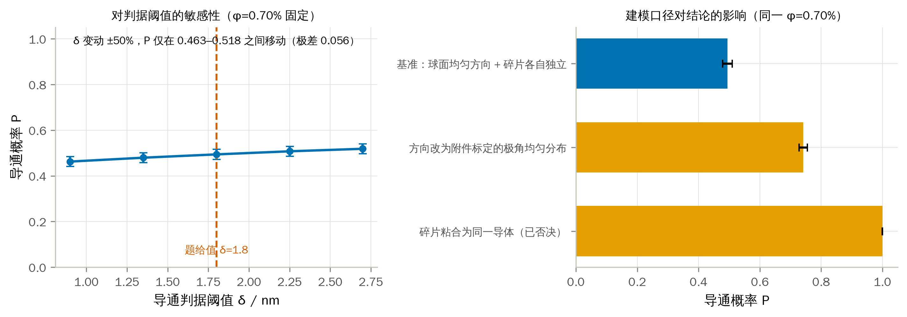

图 11 导通概率对判据阈值与建模口径的敏感性

### 9.3 蒙特卡洛收敛性

同一配置（$\varphi=0.70\%$）按不同试验次数重复估计，Wilson 区间半宽随 $1/\sqrt T$ 收窄：

表 15 蒙特卡洛的收敛性

| 试验次数 $T$ | 250 | 500 | 1000 | 2000 | 4000 | 8000 |
|---|---|---|---|---|---|---|
| $\hat P$ | 0.5400 | 0.5060 | 0.5030 | 0.5025 | 0.5008 | 0.5015 |
| 区间半宽 | 0.0613 | 0.0437 | 0.0309 | 0.0219 | 0.0155 | 0.0110 |

估计值在 $T\ge1000$ 之后稳定在 0.501–0.503，与问题二用 $T=8000$ 得到的 0.4911
相差 0.010，与区间半宽同量级（两次估计用了不同的随机种子）。
注意 $T=250$ 那一格给出 0.5400，比收敛值高 0.039——小样本会明显偏离，
这说明小样本只适合定位，关键候选仍需固定规则和独立大样本验证。图 12 把这两件事分开画：
左图是估计值随样本量趋稳的过程，右图在双对数坐标下把区间半宽与 $1/\sqrt T$ 参考线对照，
两者平行，说明误差确实按蒙特卡洛的标准速率收窄，没有出现相关样本导致的收敛变慢。

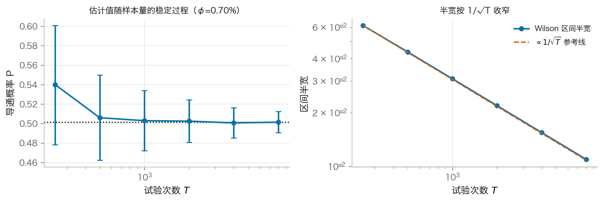

图 12 蒙特卡洛估计的收敛性

样本量按结论所需分辨率分层设置。问题三在 0.01% 网格上区分相邻点：粗定位与细网格分别取
$T=2000$、4000，球柱体候选再用独立 $T=12000$ 复核，几何双侧界每点取 $T=6000$。
问题四早期 $8\times6$ 网格每点取 $T=700$，只用于定位和解释；候选表在 $K^+$ 口径下取
$T=6000$。最终全局搜索改用 600 个共同情景并冻结 92% SAA 线：更低成本点由乐观外界排除，
$(619,8)$ 由球缺内界确认，随后用独立种子做 $T=8000$ 次验证，并要求 99.5%
Clopper--Pearson 单侧下界不低于 0.90。不同样本阶段的职责由此分开：小样本定位，
共同情景比较，独立大样本确认。

### 9.4 球柱体近似的几何双侧界

假设 A1 给出了 $K^-\subseteq C\subseteq K^+$，因而 $P(K^-)\le P(\text{真实圆柱})\le P(K^+)$。
两端只差轴长（4940 与 5000 nm），复用同一套内核即可算出（每点 $T=6000$）：

表 16 问题二四档的双侧界

| 体积分数 | 下界 $P(K^-)$ | 上界 $P(K^+)$ | 带宽 |
|---|---|---|---|
| 0.50% | 0.0745 | 0.0887 | 0.014 |
| 0.60% | 0.1992 | 0.2338 | 0.035 |
| 0.70% | 0.4323 | 0.4907 | 0.058 |
| 1.00% | 0.9898 | 0.9935 | 0.004 |

表 17 问题三 0.01% 网格上的双侧界

| 体积分数 | $N_A$ | 下界 $P(K^-)$ | 上界 $P(K^+)$ | 判断 |
|---|---|---|---|---|
| 0.85% | 601 | 0.8520 | 0.8882 | 外界的 95% 区间上界低于 0.90 → **确认不达标** |
| 0.86% | 608 | 0.8705 | 0.9130 | 夹在两端之间 → 无法判定 |
| 0.88% | 622 | 0.8993 | 0.9302 | 夹在两端之间 → 无法判定 |
| **0.89%** | **630** | **0.9202** | 0.9450 | 内界的 95% 区间下界高于 0.90 → **确认达标** |

（0.83%、0.84%、0.87% 三格的完整数值见图 13 与 `results/geometry_bracket.json`。）

判读首先使用几何包含关系，再计入蒙特卡洛误差：外界的 95% 区间上界低于 0.90 时确认不达标；
内界的 95% 区间下界高于 0.90 时确认达标。按此规则，真实答案被夹在
$[0.86\%,\,0.89\%]$，0.89% 是内界获得统计确认的最小网格值。
扫描窗口以主口径的答案 0.86% 为中心、两侧各展开 3 格自动构造，不写死——
写死的窗口在方向口径改变后会静默扫到错误区间。

把这张表画成一条“夹逼带”即图 13：蓝带的上沿是外界 $P(K^+)$、下沿是内界 $P(K^-)$，
真实平端面圆柱的概率曲线必定落在带内。$P=0.90$ 这条横线先在 0.86% 处穿过上沿、
再到 0.89% 才穿过下沿，两个交点之间的橙色区段就是答案的不确定区间。

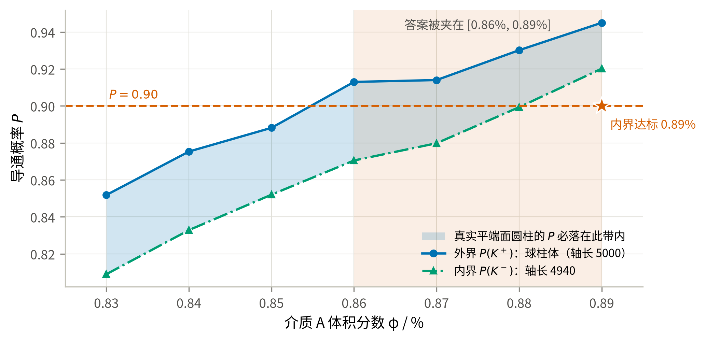

图 13 球柱体近似的几何双侧界与问题三答案的夹逼

仅以“体积相差 0.80%、临界接触中约 3.3% 受影响”不足以判断近似是否可接受，因为模型工作在
渗流跃变的陡峭段上（第 6.2 节：每 0.10% 体积分数带来约
0.15–0.26 的概率变化），0.03–0.06 的概率带宽足以跨越三个 0.01% 网格。因此“近似影响很小”
这一说法不成立，必须改用上面的双侧界给出区间答案。这也说明：**在渗流阈值附近，几何近似的
量级不能用体积差来衡量，要用它在判定阈值附近造成的概率带宽来衡量。**

同时注意 $\varphi=1.00\%$ 处带宽仅 0.004、$\varphi=0.50\%$ 处仅 0.014——
远离跃变段时近似确实无关紧要，带宽在最陡的 0.70% 处放大到 0.058，是随着接近阈值而放大的。

## 十、模型评价与推广

### 10.1 优点

1. **判定内核经过多种相互独立的校验。** 尤其是 T3 的附件往返测试，
   用真实数据同时核对截断规则、周期盒尺寸和碎片还原。
2. **建模口径由数据定，不由猜测定。** 方向分布、周期盒、碎片口径三条都做了检验；
   其中方向分布的各向异性若被忽略，问题二的概率会系统性偏低近一半。
3. **问题四利用了单调性和成本整数化。** 二维整数搜索被化为成本线上的一维边界判定，
   低成本排除、候选内界确认和独立大样本验证各自承担不同职责；代理模型只用于早期定位。
4. **结果文件与正文建立了可核查链路。** 各问题的结果型数字由 `results/` 对应脚本产出并汇总到
   `results.json`；`check_paper.py` 对全文作机械筛查，但它只是发现遗漏的下限检查，不能替代
   按“正文位置—结果键—生成脚本”逐项人工核对。

### 10.2 缺点与局限

1. **方向分布的口径不确定性没有被消除，只是被量化了。** 题面只说“方向随机”，
   本文按最少假设取球面均匀为主口径；但附件组 3 的实测分布以 $p=6.7\times10^{-19}$
   拒绝球面均匀，且组 3 恰好是 $\varphi=0.50\%$ 的构型而它导通（主口径下概率仅 0.087）。
   这两条都是对主口径的**不利证据**，因此本文把附件标定口径的完整结果并列给出。
   题面未说明问题二至四是否沿用附件生成分布，这是本文最大的不确定来源，
   其影响远大于所有数值误差之和。
2. **球柱体近似（假设 A1）在渗流阈值附近不可忽略。** 表 17 的内外界概率带宽约为
   0.03–0.06，足以跨越三个 0.01% 体积分数网格；因此问题四已在第 8.3 节改用平端圆柱直接终核。
   问题二、三仍以双侧界报告，且第 4.3 节所述径向截断误差尚未单独量化。
3. **介质 B 的球缺仍未显式离散。** 灵敏度分析中的 `wrap` 把
   被边界切开的球缺按整球处理；`inside` 则把球心限制在盒内 $R$ 深处，改变了题设的均匀
   放置域。二者只能量化这一实现选择的敏感度，不能构成真实球缺截断的严格上下界。实测（$T=4000$）：

   表 17-1 介质 B 两种近似越界口径的概率对照

   | 配置 | wrap | inside | 差值 |
   |---|---|---|---|
   | $N_A=440,\;N_B=1200$ | 0.6723 | 0.7083 | $-0.0360$ |
   | $N_A=500,\;N_B=700$ | 0.7650 | 0.7885 | $-0.0235$ |

   本来预期“整球近似会高估跨接能力”，实际却是 wrap 更低。原因不在端帽近似，
   而在**有效数密度**：`inside` 把同样多的球塞进 $(1-2R/L)^3=88.5\%$ 的体积里，
   内部密度反而更高。两者相差 0.02–0.04，仍比方向口径的影响（0.255）小一个量级。
   局部斜率与盈亏平衡价仍建立在这两个近似上，故只作价格灵敏度解释。问题四的
   最终证书已在第 8.3 节改用严格包含对：`discard` 删除越界球给内界，`wrap` 扩大为
   完整球给外界。因而推荐配比中虽含 8 颗 B，其可行确认与低成本排除均不依赖
   未证明的球缺点估计。
4. **解析对照只做到量级，不能替代仿真。** 第 6.2 节用排除体积判据给出了独立的阈值估计
   （$\varphi_c\approx0.777\%$）。它与主口径同为各向同性，因而可直接对照，差 9%，
   差异来自本题“棒长恰为盒边一半”的有限尺寸效应（0.777%→0.705%）；
   再换成附件标定方向则进一步降到 0.607%。
   因此它只能用来核对仿真没有系统性跑偏，无法脱离仿真去预测其它几何参数下的阈值。
5. **蒙特卡洛给出的是有限样本估计。** 问题二报告 Wilson 区间；问题三的 0.86% 是
   球柱体外界口径下由 $T=4000$ 网格计算和独立 $T=12000$ 复核得到的结果，真实圆柱则按
   $[0.86\%,0.89\%]$ 区间报告。问题四的“全局最优”限定于固定 600 情景、92% 达标线的
   鲁棒 SAA；独立 $T=8000$ 验证只说明推荐点满足预设置信规则，不把有限样本结论写成
   真概率的确定性全局定理。
6. **组 1、组 2 的几何与题面不符**，本文按数据实际几何判定。若出题本意是 10000³ 立方体，
   则这两组输入需要另行勘误。

### 10.3 推广

判定内核与题目的具体形状无关：把“球柱体 + 球”换成任意可计算最短距离的凸体，
整套流程（截断 → 接触图 → 并查集 → 蒙特卡洛 → 仿真优化）可直接迁移到
碳纳米管/石墨烯片复合材料的导电阈值预测、纤维增强材料的逾渗设计等场景。
问题四的“单调约束 + 线性成本 $\Rightarrow$ 最优解在可行边界上”这一论证，
对任何“加料只会更容易达标”的配方优化都成立。

## 十一、结论

表 18 四问结论汇总（主口径：球面均匀方向，假设 A4）

| 问题 | 答案 |
|---|---|
| 一 | 组 1 **不导通**；组 2 **导通**；组 3 **导通** |
| 二 | **$\varphi=0.50\%$：$P=0.0874$；$0.60\%$：$0.2325$；$0.70\%$：$0.4911$；$1.00\%$：$0.9940$**（球柱体口径，为上界；下界见表 16） |
| 三 | 使 $P\ge90\%$ 的最低体积分数：真实平端圆柱阈值在当前仿真判据下位于 **$[0.86\%,0.89\%]$**；保守取 **$0.89\%$（630 根）**，球柱体外界口径为 0.86%（608 根） |
| 四 | 92% 鲁棒 SAA 的整数全局最优为 **$(619,8)$**，成本 **9.2019 元**；球缺内界独立 $T=8000$ 得 $P=0.9153$，99.5% CP 单侧下界 0.9069（第 8.3 节） |

附件还原决定了问题一的判定口径；有限尺寸下的导通由 2--3 根介质组成的短链触发，
因此不能把本题阈值直接外推到更大微构体。问题四的推荐 $(619,8)$ 绑定最终搜索前冻结的
600 个共同情景和 92% SAA 达标线，独立验证用于确认其满足题设 90% 概率要求，
不将有限样本结论解释为真概率的确定性全局定理。

方向分布仍是主要模型不确定性。若改用附件组 3 标定的极角均匀分布，问题二四档概率为
0.2193 / 0.4798 / 0.7458 / 0.9994，问题三阈值为 0.78%；故正文保留主口径与灵敏度口径两套结果。

## AI工具使用声明

本参赛队在竞赛过程中使用了AI工具，主要用于建模方案比较、代码实现与调试、仿真计算辅助、图表制作和语言润色，详细使用情况见支撑材料。

## 参考文献

\begingroup
\fontsize{9pt}{10pt}\selectfont
\setstretch{1.0}
\setlength{\parskip}{0pt}

[1] 姜启源, 谢金星, 叶俊. 数学模型[M]. 5版. 北京: 高等教育出版社, 2018: 第 1 章 建立数学模型.

[2] 司守奎, 孙玺菁. Python数学建模算法与应用[M]. 北京: 国防工业出版社, 2022: 第 275-280 页.

[3] METROPOLIS N, ULAM S. The Monte Carlo Method[J]. Journal of the American Statistical Association, 1949, 44(247): 335-341.

[4] 盛骤, 谢式千, 潘承毅. 概率论与数理统计[M]. 4版. 北京: 高等教育出版社, 2008: 第 7 章 参数估计, 第 8 章 假设检验.

[5] 李文春, 沈烈, 孙晋, 郑强, 章明秋. 多壁碳纳米管填充高密度聚乙烯复合材料的导电性和动态流变行为[J]. 高分子学报, 2006(2): 269-273.

[6] BALBERG I, ANDERSON C H, ALEXANDER S, et al. Excluded volume and its relation to the onset of percolation[J]. Physical Review B, 1984, 30(7): 3933-3943.

[7] ERICSON C. Real-Time Collision Detection[M]. San Francisco: Morgan Kaufmann, 2005: 148.

[8] BENTLEY J L. Multidimensional binary search trees used for associative searching[J]. Communications of the ACM, 1975, 18(9): 509-517.

[9] GILBERT E G, JOHNSON D W, KEERTHI S S. A fast procedure for computing the distance between complex objects in three-dimensional space[J]. IEEE Journal on Robotics and Automation, 1988, 4(2): 193-203.

[10] KLEYWEGT A J, SHAPIRO A, HOMEM-DE-MELLO T. The sample average approximation method for stochastic discrete optimization[J]. SIAM Journal on Optimization, 2002, 12(2): 479-502.

[11] WILSON E B. Probable inference, the law of succession, and statistical inference[J]. Journal of the American Statistical Association, 1927, 22(158): 209-212.

[12] CLOPPER C J, PEARSON E S. The use of confidence or fiducial limits illustrated in the case of the binomial[J]. Biometrika, 1934, 26(4): 404-413.

\endgroup

\newpage

## 附录

### 附录 A 支撑材料文件列表

| 文件 | 内容 | 对应论文位置 |
|---|---|---|
| `src/microstructure.py` | 几何与渗流内核 | 第 4 节 |
| `src/load_attachment.py` | 附件读取与母介质还原 | 第 3.1 节 |
| `src/audit_attachment.py` | 数据审计与 KS 检验 | 第 3 节、图 2、图 3 |
| `src/validate.py` | 几何内核 6 项校验 | 第 9.1 节表 12 |
| `src/simulate.py` | 蒙特卡洛驱动（并行、Wilson 区间、可复现种子） | 第 6.1 节 |
| `src/solve_p1.py` | 问题一判定 | 第 5 节表 2、图 5 |
| `src/solve_p2.py` | 问题二概率估计 | 第 6 节、图 6 |
| `src/solve_p3.py` | 问题三阈值反解 | 第 7 节 |
| `src/solve_p4.py` | 问题四成本优化 | 第 8 节表 8、表 9、图 8 |
| `src/p4_backfill_probes.py` | 补记阶段 C 未通过的探测点（同种子可复现） | 第 8.2 节表 9 |
| `src/p4_break_even.py` | 由已验证边界点求边界斜率与介质 B 盈亏平衡价 | 第 9.2 节 S3 |
| `src/sensitivity.py` | 灵敏度与收敛性 | 第 9.2、9.3 节、图 11、图 12 |
| `src/sphere_mode_check.py` | 介质 B 越界处理口径的对照 | 第 10.2 节 |
| `src/theory_check.py` | 排除体积判据、跃变中点、边际效率 | 第 6.2、8.2 节 |
| `src/cluster_stats.py` | 最大团簇占比（渗流序参量） | 第 6.3 节、图 7 |
| `src/geometry_bracket.py` | 球柱体近似的几何上下界（内接/外接球柱体） | 第 9.4 节表 16、表 17 |
| `src/p4_global_audit.py` | 历史 $K^+$ 口径预算线角点审计（不作为真实几何最终结论） | 支撑性对照 |
| `src/p4_global_audit2.py` | 历史 $K^+$ 口径未覆盖列逐列审计 | 支撑性对照 |
| `src/p4_real_geometry.py` | 历史平端圆柱候选筛查 | 第 8.3 节的前期对照 |
| `src/p4_pure_a_sweep.py` | 共同情景下的纯 A 全前缀扫描 | 第 8.3 节 |
| `src/p4_cost_line_sweep.py` | 线段树 + 可回滚并查集的整数成本线全列求解 | 第 8.3 节表 11 |
| `src/p4_saa_search.py` | 固定共同情景上的鲁棒 SAA 成本二分 | 第 8.3 节 |
| `src/p4_low_a_outer_audit.py` | 低 A 整数列的乐观几何外界审计 | 第 8.3 节 |
| \texttt{\seqsplit{src/p4\_build\_global\_certificate.py}} | 问题四全局证据链的断言式校验 | 第 8.3 节 |
| `src/p4_marginal_recheck.py` | 历史 $K^+$ 预算线擦边点大样本复核 | 支撑性对照 |
| `src/make_results_bundle.py` | 合并结果文件并装配附录 B 源程序 | 附录 B |
| `src/paper_figures.py` | 全部正文图件 | 图 1–图 13 |
| `src/build_paper_pdf.py` | 由 Markdown 编译预览版、终稿与 AI 详情 PDF | 交付文件 |
| `results/*.json` | 论文中每个数字的出处 | 全文 |
| `figures_paper/图注清单.md` | 图注与生成脚本对照 | 全文 |
| `AI工具使用详情.pdf` | AI 工具使用详情（工具与版本、用途环节、使用过程、采纳与核验） | AI工具使用声明 |

**运行顺序.** 在交付包 `src/` 目录依次运行：
`validate.py`、`audit_attachment.py`、`solve_p1.py`–`solve_p4.py`、
`p4_backfill_probes.py`、`p4_break_even.py`、`theory_check.py`、`sensitivity.py`、
`sphere_mode_check.py`、`cluster_stats.py`、`geometry_bracket.py`、`p4_global_audit.py`、
`p4_marginal_recheck.py`、`p4_global_audit2.py`、`p4_real_geometry.py`、`p4_pure_a_sweep.py`、
`p4_cost_line_sweep.py`、`p4_saa_search.py`、`p4_low_a_outer_audit.py`、`p4_build_global_certificate.py`、`paper_figures.py`、
`make_results_bundle.py`，最后运行 `build_paper_pdf.py`。其中两个审计脚本均支持断点续跑；
平端圆柱几何另由 `scripts/test_flat_cylinder_geometry.py` 做解析与随机包含关系回归。

### 附录 B 完整可运行源程序

本附录由 `src/make_results_bundle.py` 从 `src/` 直接装配，与实际运行的代码逐字一致。
运行顺序见附录 A 表后的说明。依赖 Python 3.11 或更高版本，以及 numpy / scipy / matplotlib / openpyxl。

#### `src/microstructure.py`

```python
#!/usr/bin/env python3
"""微构体导电仿真的几何与渗流内核。

本模块只做三件事，不涉及任何题目分支逻辑：

1. **边界截断**：把一根越界的介质按题目给定的规则平移回微构体，得到若干碎片；
2. **接触判定**：两个介质（或介质与带电面）之间的最短表面距离是否不超过 1.8 nm；
3. **导通判定**：并查集把接触关系连成连通块，判断是否存在连接左右带电面的通路。

几何约定
--------
介质 A 支持两种口径。``rod_geometry="capsule"`` 保留既有球柱体结果，轴线距离判定可完全
向量化；``rod_geometry="cylinder"`` 按题面的平端面直圆柱计算，圆柱—圆柱采用支撑映射
Gilbert/GJK 距离，圆柱—球与圆柱—带电面使用解析距离。平端模式先用内外球柱体筛掉绝大多数
显然接触/不接触的介质对，只在端缘临界窄带调用 GJK，因此可用于问题四的真实几何终核。

介质 B 是半径 200 nm 的正球体，本身就是球，无需近似。
"""

from __future__ import annotations

from itertools import combinations

import numpy as np

# ------------------------------------------------------------------ 物理常数

EDGE = 10000.0          # 微构体边长 (nm)
R_A = 30.0              # 介质 A 底面半径 (nm)
H_A = 5000.0            # 介质 A 高 (nm)
R_B = 200.0             # 介质 B 半径 (nm)
GAP = 1.8               # 导通判定的最大表面间距 (nm)

V_BOX = EDGE ** 3                       # 1.0e12 nm^3
V_A = np.pi * R_A ** 2 * H_A            # 1.41372e7 nm^3
V_B = 4.0 / 3.0 * np.pi * R_B ** 3      # 3.35103e7 nm^3

# 成本：介质 A 1.05 元/μm³，介质 B 0.05 元/μm³；1 μm³ = 1e9 nm³
COST_A = 1.05 * V_A / 1e9               # 元 / 根
COST_B = 0.05 * V_B / 1e9               # 元 / 颗


# ------------------------------------------------------------------ 边界截断

def wrap_segment(p: np.ndarray, q: np.ndarray, box: np.ndarray) -> list[tuple[np.ndarray, np.ndarray]]:
    """把轴线段 p->q 按边界截断规则折回盒子，返回若干条完全位于盒内的子段。

    做法：把线段参数化为 t∈[0,1]，在每个坐标轴上求出它穿越周期格点边界的所有 t，
    以这些 t 为断点切段；每一小段整体位于同一个周期像里，平移回来即可。
    该过程对轴线与题面平移规则等价，并且天然支持多次平移。柱体径向越界的薄层
    （最厚 R_A）未在这里做实体级精确切分，相关几何误差另由双侧界量化。
    """
    half = box / 2.0
    d = q - p
    ts = [0.0, 1.0]
    for j in range(3):
        if abs(d[j]) < 1e-12:
            continue
        # 穿越平面 x_j = half_j + k*box_j
        k_lo = np.floor((min(p[j], q[j]) - half[j]) / box[j])
        k_hi = np.ceil((max(p[j], q[j]) - half[j]) / box[j])
        for k in range(int(k_lo), int(k_hi) + 1):
            plane = half[j] + k * box[j]
            t = (plane - p[j]) / d[j]
            if 1e-12 < t < 1 - 1e-12:
                ts.append(float(t))
    ts = sorted(set(ts))

    out: list[tuple[np.ndarray, np.ndarray]] = []
    for t0, t1 in zip(ts[:-1], ts[1:]):
        if t1 - t0 < 1e-12:
            continue
        a = p + t0 * d
        b = p + t1 * d
        mid = 0.5 * (a + b)
        shift = np.round(mid / box) * box          # 该子段所在周期像的偏移
        seg_a, seg_b = a - shift, b - shift
        # 数值上把端点压回盒内，避免 ±1e-12 的溢出
        np.clip(seg_a, -half, half, out=seg_a)
        np.clip(seg_b, -half, half, out=seg_b)
        out.append((seg_a, seg_b))
    return out


# ------------------------------------------------------------------ 距离计算

def seg_seg_dist(p1: np.ndarray, q1: np.ndarray, p2: np.ndarray, q2: np.ndarray) -> np.ndarray:
    """成对线段最短距离，全向量化。

    p1/q1 形状 (n,1,3)，p2/q2 形状 (1,m,3) 时返回 (n,m)。
    算法是 Ericson《Real-Time Collision Detection》的 ClosestPtSegmentSegment，
    分支用 np.where 展开；退化（零长）线段按点处理。
    """
    d1 = q1 - p1
    d2 = q2 - p2
    r = p1 - p2

    a = np.sum(d1 * d1, axis=-1)
    e = np.sum(d2 * d2, axis=-1)
    f = np.sum(d2 * r, axis=-1)
    c = np.sum(d1 * r, axis=-1)
    b = np.sum(d1 * d2, axis=-1)

    eps = 1e-12
    a_safe = np.maximum(a, eps)
    e_safe = np.maximum(e, eps)

    denom = a * e - b * b
    s = np.where(denom > eps, (b * f - c * e) / np.where(denom > eps, denom, 1.0), 0.0)
    s = np.clip(s, 0.0, 1.0)

    t = (b * s + f) / e_safe

    # t 越界时钳位并回代求 s
    s_lo = np.clip(-c / a_safe, 0.0, 1.0)
    s_hi = np.clip((b - c) / a_safe, 0.0, 1.0)
    s = np.where(t < 0.0, s_lo, np.where(t > 1.0, s_hi, s))
    t = np.clip(t, 0.0, 1.0)

    # 退化线段
    s = np.where(a <= eps, 0.0, s)
    t = np.where(e <= eps, 0.0, np.where(a <= eps, np.clip(f / e_safe, 0.0, 1.0), t))

    diff = r + s[..., None] * d1 - t[..., None] * d2
    return np.sqrt(np.maximum(np.sum(diff * diff, axis=-1), 0.0))


def contact_pairs(p: np.ndarray, q: np.ndarray, thresh: float, block: int = 256) -> np.ndarray:
    """返回所有轴线距离 ≤ thresh 的线段对下标 (k,2)。

    分块 + 轴对齐包围盒预筛。朴素写法要一次性开出 M² 的十几个临时数组，
    M≈1300 时光是分配和读写就占了九成时间；分块后临时数组常驻缓存，
    实测在 φ=1% 规模上快 6 倍以上，结果与朴素写法逐位相同（validate.py T6）。
    """
    m = len(p)
    lo = np.minimum(p, q) - thresh
    hi = np.maximum(p, q)
    out: list[np.ndarray] = []
    for s in range(0, m, block):
        e = min(s + block, m)
        # 只与下标更大的比较，避免重复
        cand = np.nonzero(np.all(lo[None, s:e, :] <= hi[s:, None, :], axis=-1)
                          & np.all(lo[s:, None, :] <= hi[None, s:e, :], axis=-1))
        rows = cand[0] + s          # 全局下标 j
        cols = cand[1] + s          # 全局下标 i
        keep = rows > cols
        rows, cols = rows[keep], cols[keep]
        if rows.size == 0:
            continue
        d = seg_seg_dist(p[cols], q[cols], p[rows], q[rows])
        hit = d <= thresh
        if np.any(hit):
            out.append(np.stack([cols[hit], rows[hit]], axis=1))
    return np.concatenate(out) if out else np.zeros((0, 2), dtype=int)


def point_seg_dist(pts: np.ndarray, p: np.ndarray, q: np.ndarray) -> np.ndarray:
    """点到线段的距离。pts (n,1,3)，p/q (1,m,3) -> (n,m)。"""
    d = q - p
    w = pts - p
    dd = np.maximum(np.sum(d * d, axis=-1), 1e-12)
    t = np.clip(np.sum(w * d, axis=-1) / dd, 0.0, 1.0)
    diff = w - t[..., None] * d
    return np.sqrt(np.maximum(np.sum(diff * diff, axis=-1), 0.0))


def point_cylinder_dist(pts: np.ndarray, p: np.ndarray, q: np.ndarray,
                        radius: float = R_A) -> np.ndarray:
    """点到平端实心圆柱的欧氏距离。

    ``pts`` 为 ``(..., 3)``；``p,q`` 可广播到相同前缀形状。圆柱轴线是 ``p→q``，
    半径为 ``radius``。点在圆柱内部时返回 0。该公式同时覆盖侧壁、端面和端缘三类
    最近点，比点—轴线段距离减半径的球柱体公式少了端帽处的系统性高估。
    """
    axis = q - p
    length = np.linalg.norm(axis, axis=-1)
    safe = np.maximum(length, 1e-12)
    u = axis / safe[..., None]
    c = 0.5 * (p + q)
    w = pts - c
    axial = np.abs(np.sum(w * u, axis=-1)) - 0.5 * length
    radial_vec = w - np.sum(w * u, axis=-1)[..., None] * u
    radial = np.linalg.norm(radial_vec, axis=-1) - radius
    return np.hypot(np.maximum(axial, 0.0), np.maximum(radial, 0.0))


def cylinder_support(p: np.ndarray, q: np.ndarray, direction: np.ndarray,
                     radius: float = R_A) -> np.ndarray:
    """平端实心圆柱在 ``direction`` 方向的支撑点。"""
    axis = q - p
    length = float(np.linalg.norm(axis))
    if length <= 1e-12:
        # 极短碎片退化为球，避免方向未定义；正常数据不会走到这里。
        n = float(np.linalg.norm(direction))
        return 0.5 * (p + q) if n <= 1e-15 else 0.5 * (p + q) + radius * direction / n
    u = axis / length
    c = 0.5 * (p + q)
    du = float(np.dot(direction, u))
    perp = direction - du * u
    pn = float(np.linalg.norm(perp))
    radial = np.zeros(3) if pn <= 1e-15 else radius * perp / pn
    return c + (0.5 * length if du >= 0.0 else -0.5 * length) * u + radial


def _closest_origin_on_hull(points: list[np.ndarray]) -> tuple[np.ndarray, list[np.ndarray]]:
    """求有限点集凸包中离原点最近的点，并只保留其活动单纯形。

    三维 Carathéodory 定理保证最多只需 4 个点。枚举至多 4 点的子集后解带
    ``sum(lambda)=1`` 的最小二乘；负权重的候选丢弃。点数很小（GJK 通常 2–4 个），
    这种写法比手写四面体分支更容易核验，也避开退化共面情形。
    """
    best_v: np.ndarray | None = None
    best_pts: list[np.ndarray] | None = None
    best_norm2 = float("inf")
    n = len(points)
    for size in range(1, min(4, n) + 1):
        for idx in combinations(range(n), size):
            sub = np.asarray([points[i] for i in idx], dtype=float)
            if size == 1:
                lam = np.ones(1)
            else:
                gram = sub @ sub.T
                one = np.ones(size)
                # 直接解 KKT 系统；增广约束在点集跨过原点、G 奇异时仍能给出零距离解。
                kkt = np.block([[2.0 * gram, one[:, None]],
                                [one[None, :], np.zeros((1, 1))]])
                rhs = np.r_[np.zeros(size), 1.0]
                lam = np.linalg.lstsq(kkt, rhs, rcond=1e-13)[0][:size]
            if np.min(lam) < -1e-10:
                continue
            lam = np.maximum(lam, 0.0)
            lam /= np.sum(lam)
            v = lam @ sub
            norm2 = float(v @ v)
            if norm2 < best_norm2:
                active = [points[i] for i, w in zip(idx, lam) if w > 1e-9]
                best_v, best_pts, best_norm2 = v, active or [points[idx[0]]], norm2
    if best_v is None or best_pts is None:
        norms = [float(p @ p) for p in points]
        i = int(np.argmin(norms))
        return points[i], [points[i]]
    return best_v, best_pts


def cylinder_cylinder_dist(p1: np.ndarray, q1: np.ndarray,
                           p2: np.ndarray, q2: np.ndarray,
                           radius: float = R_A,
                           max_iter: int = 64) -> float:
    """两个平端实心圆柱的欧氏距离（Gilbert/GJK 支撑映射算法）。

    返回 0 表示相交。调用方先用外接球柱体做候选预筛，因此本函数只处理端帽形状
    可能改变结论的少量临界对。停止条件使用 Frank–Wolfe 对偶间隙；坐标量级为 nm，
    最终误差远小于 1.8 nm 导通阈值。
    """
    c1, c2 = 0.5 * (p1 + q1), 0.5 * (p2 + q2)

    def support(direction: np.ndarray) -> np.ndarray:
        return (cylinder_support(p1, q1, direction, radius)
                - cylinder_support(p2, q2, -direction, radius))

    direction = c2 - c1
    if float(direction @ direction) <= 1e-18:
        direction = np.array([1.0, 0.0, 0.0])
    simplex = [support(direction)]
    v = simplex[0]
    for _ in range(max_iter):
        norm2 = float(v @ v)
        if norm2 <= 1e-18:
            return 0.0
        w = support(-v)
        dual_gap = norm2 - float(v @ w)
        if dual_gap <= 1e-11 * max(1.0, norm2):
            return float(np.sqrt(norm2))
        if any(float((w - s) @ (w - s)) <= 1e-20 for s in simplex):
            return float(np.sqrt(norm2))
        v, simplex = _closest_origin_on_hull(simplex + [w])
    return float(np.linalg.norm(v))


def cylinder_x_extent(p: np.ndarray, q: np.ndarray,
                      radius: float = R_A) -> tuple[float, float]:
    """平端圆柱在 X 轴上的精确投影区间。"""
    axis = q - p
    length = float(np.linalg.norm(axis))
    if length <= 1e-12:
        x = float(0.5 * (p[0] + q[0]))
        return x - radius, x + radius
    ux = float(axis[0] / length)
    half_width = 0.5 * length * abs(ux) + radius * np.sqrt(max(0.0, 1.0 - ux * ux))
    cx = float(0.5 * (p[0] + q[0]))
    return cx - half_width, cx + half_width


def _inner_capsule_axis(p: np.ndarray, q: np.ndarray,
                        radius: float = R_A) -> tuple[np.ndarray, np.ndarray] | None:
    """返回平端圆柱的内接球柱体轴线；碎片短于直径时不使用该快捷判据。"""
    d = q - p
    length = float(np.linalg.norm(d))
    if length <= 2.0 * radius + 1e-12:
        return None
    u = d / length
    return p + radius * u, q - radius * u


# ------------------------------------------------------------------ 并查集

class DSU:
    __slots__ = ("parent",)

    def __init__(self, n: int) -> None:
        self.parent = list(range(n))

    def find(self, x: int) -> int:
        p = self.parent
        while p[x] != x:
            p[x] = p[p[x]]
            x = p[x]
        return x

    def union(self, x: int, y: int) -> None:
        rx, ry = self.find(x), self.find(y)
        if rx != ry:
            self.parent[ry] = rx


# ------------------------------------------------------------------ 生成配置

# 全文的方向分布口径集中在这两个常量上，改口径只需改这里。
#
# 主口径取**球面均匀**：题面对问题二至四只说"方向随机"，未指定分布，
# 球面均匀是这句话的最少假设读法。
# 对照口径取附件标定的极角均匀分布：附件组 3 的 354 根母介质以
# KS 检验 p=6.7e-19 拒绝球面均匀、p=0.73 不拒绝极角均匀（第 3.4 节）。
# 这一条只作为灵敏度分析出现——它刻画的是附件的生成过程，
# 而题面并未说问题二至四必须沿用同一过程。
PRIMARY_ORIENTATION = "isotropic"
CONTROL_ORIENTATION = "polar_uniform"


def sample_orientations(n: int, rng: np.random.Generator,
                        mode: str = PRIMARY_ORIENTATION) -> np.ndarray:
    """生成 n 个单位方向向量。

    mode="isotropic"     ：球面均匀，即 |u_x| ~ U(0,1)。这是"任意方向、不考虑重力"
                           最自然的物理读法。
    mode="polar_uniform" ：θ ~ U(0,π)、φ ~ U(0,2π)，以 **X 轴（带电面法向）** 为极轴，
                           u = (cosθ, sinθ cosφ, sinθ sinφ)。这是附件数据实际服从的分布：
                           对组 3 的 354 根母介质做 KS 检验，各向同性被拒绝（D=0.243,
                           p=6.7e-19），本分布不被拒绝（D=0.036, p=0.73）。
                           它在两极堆积，使介质明显偏向带电面法向，从而显著提高导通概率。
    """
    if mode == "isotropic":
        u = rng.normal(size=(n, 3))
        return u / np.linalg.norm(u, axis=1, keepdims=True)
    if mode == "polar_uniform":
        theta = rng.uniform(0.0, np.pi, n)
        phi = rng.uniform(0.0, 2 * np.pi, n)
        s = np.sin(theta)
        return np.stack([np.cos(theta), s * np.cos(phi), s * np.sin(phi)], axis=1)
    raise ValueError(f"未知方向分布：{mode}")


def sample_rods(n: int, rng: np.random.Generator, box: np.ndarray,
                length: float = H_A,
                orientation: str = PRIMARY_ORIENTATION) -> tuple[np.ndarray, np.ndarray, np.ndarray]:
    """随机生成 n 根介质 A 并做边界截断。

    中心在盒内均匀；方向分布见 ``sample_orientations``。
    返回碎片起点、终点，以及每个碎片所属的母介质编号。
    """
    centers = (rng.random((n, 3)) - 0.5) * box
    u = sample_orientations(n, rng, orientation)
    p = centers - 0.5 * length * u
    q = centers + 0.5 * length * u

    starts: list[np.ndarray] = []
    ends: list[np.ndarray] = []
    owner: list[int] = []
    for i in range(n):
        for a, b in wrap_segment(p[i], q[i], box):
            starts.append(a)
            ends.append(b)
            owner.append(i)
    if not starts:
        empty = np.zeros((0, 3))
        return empty, empty, np.zeros(0, dtype=int)
    return np.array(starts), np.array(ends), np.array(owner, dtype=int)


def sample_spheres(n: int, rng: np.random.Generator, box: np.ndarray,
                   mode: str = "wrap") -> tuple[np.ndarray, np.ndarray]:
    """随机生成 n 颗介质 B。

    mode="wrap"   ：中心在盒内均匀，越界部分按截断规则折回，碎片以其所在周期像的
                    球心表示（碎片是球与盒的交，用整球近似，只在距壁 200 nm 内有偏差）；
    mode="inside" ：把球心限制在 [-(L/2-R), L/2-R]，保证整颗球都在盒内，不产生碎片。
    mode="discard"：球心仍在整个盒内均匀生成，但丢弃任何与边界相交的球。
                    它是题设“球体截断后平移”几何的严格内界，专用于
                    可行性确认；不作为点估计口径。
    两种取法在灵敏度分析里对比。
    """
    if mode == "inside":
        c = (rng.random((n, 3)) - 0.5) * (box - 2 * R_B)
        return c, np.arange(n)

    c = (rng.random((n, 3)) - 0.5) * box
    half = box / 2.0
    if mode == "discard":
        keep = np.all(np.abs(c) + R_B <= half + 1e-12, axis=1)
        return c[keep], np.nonzero(keep)[0].astype(int)
    if mode != "wrap":
        raise ValueError(f"未知球体边界口径：{mode}")
    centers: list[np.ndarray] = []
    owner: list[int] = []
    for i in range(n):
        # 每个越界方向都产生一个镜像碎片
        offs = [np.zeros(3)]
        for j in range(3):
            if c[i, j] + R_B > half[j]:
                offs = offs + [o + np.eye(3)[j] * -box[j] for o in offs]
            elif c[i, j] - R_B < -half[j]:
                offs = offs + [o + np.eye(3)[j] * box[j] for o in offs]
        for o in offs:
            centers.append(c[i] + o)
            owner.append(i)
    return np.array(centers), np.array(owner, dtype=int)


# ------------------------------------------------------------------ 导通判定

def percolates(seg_p: np.ndarray, seg_q: np.ndarray,
               sph_c: np.ndarray | None = None,
               owner_rod: np.ndarray | None = None,
               owner_sph: np.ndarray | None = None,
               bond_fragments: bool = False,
               rod_geometry: str = "capsule",
               gap: float = GAP,
               edge: float = EDGE) -> bool:
    """判断微构体是否导通（左右带电面之间存在导电通路）。

    bond_fragments=False（默认）：边界截断产生的每个碎片是独立导体；
    bond_fragments=True         ：同一根母介质的所有碎片电学上视为一体（灵敏度对照）。
    """
    half = edge / 2.0
    n_rod = len(seg_p)
    n_sph = 0 if sph_c is None else len(sph_c)
    n = n_rod + n_sph
    if n == 0:
        return False

    dsu = DSU(n + 2)
    LEFT, RIGHT = n, n + 1

    if rod_geometry not in {"capsule", "cylinder"}:
        raise ValueError(f"未知介质 A 几何：{rod_geometry}")

    # --- 介质与带电面
    if n_rod:
        if rod_geometry == "capsule":
            lo = np.minimum(seg_p[:, 0], seg_q[:, 0]) - R_A
            hi = np.maximum(seg_p[:, 0], seg_q[:, 0]) + R_A
        else:
            ext = np.asarray([cylinder_x_extent(a, b) for a, b in zip(seg_p, seg_q)])
            lo, hi = ext[:, 0], ext[:, 1]
        for i in np.nonzero(lo <= -half + gap)[0]:
            dsu.union(LEFT, int(i))
        for i in np.nonzero(hi >= half - gap)[0]:
            dsu.union(RIGHT, int(i))
    if n_sph:
        for i in np.nonzero(sph_c[:, 0] - R_B <= -half + gap)[0]:
            dsu.union(LEFT, n_rod + int(i))
        for i in np.nonzero(sph_c[:, 0] + R_B >= half - gap)[0]:
            dsu.union(RIGHT, n_rod + int(i))

    # --- 棒-棒
    if n_rod > 1:
        for a, b in contact_pairs(seg_p, seg_q, 2 * R_A + gap):
            hit = rod_geometry == "capsule"
            if not hit:
                ia = _inner_capsule_axis(seg_p[a], seg_q[a])
                ib = _inner_capsule_axis(seg_p[b], seg_q[b])
                # 绝大多数接触也被 K^- 捕获，只对端缘窄带调用较贵的 GJK。
                hit = (ia is not None and ib is not None
                       and float(seg_seg_dist(ia[0], ia[1], ib[0], ib[1])) <= 2 * R_A + gap)
            if not hit and rod_geometry == "cylinder":
                hit = cylinder_cylinder_dist(
                    seg_p[a], seg_q[a], seg_p[b], seg_q[b]) <= gap + 1e-8
            if hit:
                dsu.union(int(a), int(b))

    # --- 球-球 与 球-棒（介质 B 数量可达上万，用 KD 树做邻域检索）
    if n_sph:
        from scipy.spatial import cKDTree
        tree = cKDTree(sph_c)
        if n_sph > 1:
            for a, b in tree.query_pairs(2 * R_B + gap, output_type="ndarray"):
                dsu.union(n_rod + int(a), n_rod + int(b))
        if n_rod:
            # 沿每根碎片轴线按 STEP 采样，查半径 = 接触半径 + 半个采样步长，
            # 保证不漏掉任何真实接触；再用精确的点—线段距离过滤候选。
            reach = R_A + R_B + gap
            step = 200.0
            samples, tags = [], []
            for i in range(n_rod):
                a, b = seg_p[i], seg_q[i]
                L = float(np.linalg.norm(b - a))
                k = max(2, int(np.ceil(L / step)) + 1)
                ts = np.linspace(0.0, 1.0, k)[:, None]
                samples.append(a + ts * (b - a))
                tags.append(np.full(k, i, dtype=int))
            pts = np.concatenate(samples)
            tags = np.concatenate(tags)
            radius = reach + step / 2.0 + 1e-9
            # 同一棒—球对常被相邻多个轴线采样点重复命中。先编码去重，再一次性做精确
            # 距离过滤；混填边界上可把这部分耗时降低一个数量级。
            # 用两棵 KD 树的稀疏距离矩阵一次性取出所有候选。旧实现对
            # ``query_ball_point`` 返回的每个采样点在 Python 层循环，混填
            # 边界上一次试验要扫几万个 list，全局审计时这一步占
            # 了主要时间。稀疏矩阵返回的 (row,col) 与原候选集合完全
            # 相同；后面仍按“棒编号×球数+球编号”去重，并用精确距离
            # 过滤，因此不改变任何接触判定。
            sample_tree = cKDTree(pts)
            near = sample_tree.sparse_distance_matrix(
                tree, radius, output_type="coo_matrix")
            if near.nnz:
                code = np.unique(tags[near.row].astype(np.int64) * n_sph
                                 + near.col.astype(np.int64))
                rods = (code // n_sph).astype(int)
                spheres = (code % n_sph).astype(int)
                if rod_geometry == "capsule":
                    d = point_seg_dist(sph_c[spheres], seg_p[rods], seg_q[rods])
                    hit = d <= reach
                else:
                    d = point_cylinder_dist(sph_c[spheres], seg_p[rods], seg_q[rods])
                    hit = d <= R_B + gap
                for rod, sphere in zip(rods[hit], spheres[hit]):
                    dsu.union(n_rod + int(sphere), int(rod))

    # --- 灵敏度对照：同母介质的碎片粘合
    if bond_fragments:
        for owner, base, cnt in ((owner_rod, 0, n_rod), (owner_sph, n_rod, n_sph)):
            if owner is None or cnt == 0:
                continue
            first: dict[int, int] = {}
            for idx in range(cnt):
                o = int(owner[idx])
                if o in first:
                    dsu.union(first[o], base + idx)
                else:
                    first[o] = base + idx

    return dsu.find(LEFT) == dsu.find(RIGHT)


def n_rods_for_fraction(phi: float) -> int:
    """体积分数 -> 介质 A 根数（题目要求四舍五入）。"""
    return int(round(phi * V_BOX / V_A))
```

#### `src/load_attachment.py`

```python
#!/usr/bin/env python3
"""读取附件 xlsx，并把"碎片"还原成母介质 A。

附件每一行不是一根完整的介质 A，而是边界截断之后的一个**碎片**：
组 3 有 535 行，但按轴向分组后只有 354 个不同方向，正好对应 354 根介质 A
（体积分数 0.50%）。数据审计（见 audit_attachment.py）还发现附件系统性地
丢弃了长度小于约 500 nm 的短碎片，因此各组碎片总长略小于 根数×5000。
"""

from __future__ import annotations

import math
from collections import defaultdict
from pathlib import Path

import numpy as np
import openpyxl

from microstructure import EDGE

ROOT = Path(__file__).resolve().parents[1]
ATTACHMENT = ROOT.parent / "01_题目与附件" / "附件.xlsx"

# 组 1、组 2 的 y、z 坐标在 ±500 处发生周期回绕（见 audit_attachment.py），
# 说明这两个微构体的截面是 1000×1000 nm，只有组 3 是题面描述的 10000 立方体。
GROUP_BOX = {
    "组1": np.array([EDGE, 1000.0, 1000.0]),
    "组2": np.array([EDGE, 1000.0, 1000.0]),
    "组3": np.array([EDGE, EDGE, EDGE]),
}


def load_pieces(path: Path | None = None) -> dict[str, np.ndarray]:
    """返回 {组名: (n,6) 数组}，每行是一个碎片的两个轴端点。"""
    wb = openpyxl.load_workbook(path or ATTACHMENT, read_only=True, data_only=True)
    out: dict[str, np.ndarray] = {}
    for name in wb.sheetnames:
        rows = [r for r in wb[name].iter_rows(values_only=True)][2:]
        vals = [[float(v) for v in r[:6]] for r in rows if r[0] is not None]
        out[name] = np.array(vals)
    return out


def _canonical_dir(p: np.ndarray, q: np.ndarray) -> tuple:
    d = q - p
    d = d / np.linalg.norm(d)
    if d[0] < 0 or (d[0] == 0 and d[1] < 0):
        d = -d
    return tuple(np.round(d, 7))


def group_by_medium(pieces: np.ndarray) -> list[list[int]]:
    """按轴向把碎片归到母介质。同一根介质的所有碎片方向完全相同。"""
    groups: dict[tuple, list[int]] = defaultdict(list)
    for i, row in enumerate(pieces):
        groups[_canonical_dir(row[:3], row[3:])].append(i)
    return list(groups.values())


def chain_pieces(pieces: np.ndarray, idx: list[int], box: np.ndarray) -> list[int]:
    """把一根母介质的碎片按首尾相接顺序排好（用于还原未截断的轴线段）。"""
    half = box / 2.0

    def on_boundary(pt):
        return [j for j in range(3) if abs(abs(pt[j]) - half[j]) < 1e-6]

    succ, pred = {}, {}
    for i in idx:
        q = pieces[i][3:]
        for j in on_boundary(q):
            tgt = q.copy()
            tgt[j] = -q[j]
            for k in idx:
                if k != i and np.allclose(pieces[k][:3], tgt, atol=1e-6):
                    succ[i], pred[k] = k, i
    heads = [i for i in idx if i not in pred]
    order = []
    for h in heads:
        cur = h
        while cur is not None and cur not in order:
            order.append(cur)
            cur = succ.get(cur)
    for i in idx:            # 兜底：链断裂时也不丢碎片
        if i not in order:
            order.append(i)
    return order


def reconstruct_axis(pieces: np.ndarray, idx: list[int], box: np.ndarray) -> tuple[np.ndarray, np.ndarray, float]:
    """还原母介质未经截断的轴线段（起点、终点、已知总长）。"""
    order = chain_pieces(pieces, idx, box)
    start = pieces[order[0]][:3].copy()
    total = sum(float(np.linalg.norm(pieces[i][3:] - pieces[i][:3])) for i in order)
    d = pieces[order[0]][3:] - pieces[order[0]][:3]
    u = d / np.linalg.norm(d)
    return start, start + total * u, total


def summarize(path: Path | None = None) -> dict[str, dict]:
    """每组的碎片数、母介质数、总长与体积分数。"""
    data = load_pieces(path)
    out = {}
    for name, pieces in data.items():
        box = GROUP_BOX[name]
        media = group_by_medium(pieces)
        lens = [float(np.linalg.norm(r[3:] - r[:3])) for r in pieces]
        out[name] = {
            "n_pieces": len(pieces),
            "n_media": len(media),
            "total_axis_length": sum(lens),
            "implied_media_by_length": sum(lens) / 5000.0,
            "box": box.tolist(),
            "missing_length": len(media) * 5000.0 - sum(lens),
        }
    return out


if __name__ == "__main__":
    import json
    print(json.dumps(summarize(), ensure_ascii=False, indent=2))
```

#### `src/simulate.py`

```python
#!/usr/bin/env python3
"""蒙特卡洛导通概率估计（可复现、并行）。

一次"试验"= 随机生成一个配置 -> 边界截断 -> 建接触图 -> 判导通。
导通概率就是伯努利参数 p，用 Wilson 区间给置信区间（样本比例接近 0 或 1 时，
正态近似的 p±1.96·se 会给出越界的区间，Wilson 不会）。

``Config.rod_geometry`` 可取 ``capsule``（历史主结果）或 ``cylinder``（平端圆柱终核）；
其余随机流、并行和统计逻辑完全相同。

所有随机性来自一个 SeedSequence，并固定分成 N_RANDOM_STREAMS 条随机流；
worker 只负责调度，不参与随机流的生成。因此在 numpy 与算法版本相同的前提下，
改变并行度仍可逐位复现。

流数**必须**与生成 results/ 时所用的一致，否则代码跑出来的数与已发布的结果对不上。
本仓库的 results/ 是在 min(os.cpu_count(), 8) = 4 的机器上生成的，故流数取 4：
实测 (N_A=424, T=2000) 在 4 条流下得 hits=462，与 results/p3_threshold.json 一致；
取 8 条流则得 475。scripts/test_parallel_reproducibility.py 同时检查这两件事——
并行度不改变结果，且结果与已发布数值逐位一致。
"""

from __future__ import annotations

import math
import os
from dataclasses import dataclass, asdict
from multiprocessing import Pool

import numpy as np

from microstructure import (EDGE, GAP, H_A, V_A, V_B, V_BOX, COST_A, COST_B,
                            PRIMARY_ORIENTATION, percolates, sample_rods,
                            sample_spheres)

BOX = np.full(3, EDGE)
N_RANDOM_STREAMS = 4


@dataclass(frozen=True)
class Config:
    n_a: int
    n_b: int = 0
    orientation: str = PRIMARY_ORIENTATION
    sphere_mode: str = "wrap"
    bond_fragments: bool = False
    # 显式随任务序列化到子进程，避免依赖 multiprocessing 的 fork 全局继承语义。
    gap: float = GAP
    # 介质 A 的轴长。默认 5000 即题给圆柱；geometry_bracket.py 用 5000-2r 得到
    # 内接球柱体，从而给出真实平端面圆柱的严格下界。
    rod_length: float = H_A
    # capsule 保留既有球柱体结果；cylinder 使用平端实心圆柱的支撑映射精确判定。
    rod_geometry: str = "capsule"

    @property
    def phi_a(self) -> float:
        return self.n_a * V_A / V_BOX

    @property
    def phi_b(self) -> float:
        return self.n_b * V_B / V_BOX

    @property
    def cost(self) -> float:
        return self.n_a * COST_A + self.n_b * COST_B


def _run_chunk(args) -> int:
    cfg_dict, seed_state, n_trials = args
    cfg = Config(**cfg_dict)
    rng = np.random.default_rng(seed_state)
    hits = 0
    for _ in range(n_trials):
        sp, sq, own_r = sample_rods(cfg.n_a, rng, BOX, length=cfg.rod_length,
                                    orientation=cfg.orientation)
        sc = own_s = None
        if cfg.n_b:
            sc, own_s = sample_spheres(cfg.n_b, rng, BOX, mode=cfg.sphere_mode)
        hits += bool(percolates(sp, sq, sph_c=sc, owner_rod=own_r, owner_sph=own_s,
                                bond_fragments=cfg.bond_fragments,
                                rod_geometry=cfg.rod_geometry, gap=cfg.gap))
    return hits


def wilson(hits: int, n: int, z: float = 1.959963985) -> tuple[float, float]:
    if n == 0:
        return (0.0, 1.0)
    p = hits / n
    d = 1 + z * z / n
    c = p + z * z / (2 * n)
    h = z * math.sqrt(p * (1 - p) / n + z * z / (4 * n * n))
    return ((c - h) / d, (c + h) / d)


def estimate_p(cfg: Config, trials: int, seed: int = 20260810,
               workers: int | None = None) -> dict:
    """返回 {p, lo, hi, hits, trials, ...}。"""
    if trials <= 0:
        raise ValueError("trials 必须为正整数")
    workers = max(1, workers or min(os.cpu_count() or 1, N_RANDOM_STREAMS))
    # 随机流数固定，不随 workers 或机器核数变化，且取值与生成 results/ 时一致，
    # 因此任意机器、任意并行度都能逐位复现已发布的每一个数值。
    n_chunks = min(N_RANDOM_STREAMS, trials)
    base = trials // n_chunks
    sizes = [base + (1 if i < trials - base * n_chunks else 0) for i in range(n_chunks)]
    sizes = [s for s in sizes if s > 0]
    seeds = np.random.SeedSequence(seed).spawn(len(sizes))
    jobs = [(asdict(cfg), s, k) for s, k in zip(seeds, sizes)]

    if len(jobs) == 1:
        hits = _run_chunk(jobs[0])
    else:
        with Pool(min(workers, len(jobs))) as pool:
            hits = sum(pool.map(_run_chunk, jobs))

    lo, hi = wilson(hits, trials)
    return {
        "n_a": cfg.n_a, "n_b": cfg.n_b,
        "phi_a": cfg.phi_a, "phi_b": cfg.phi_b,
        "orientation": cfg.orientation, "sphere_mode": cfg.sphere_mode,
        "bond_fragments": cfg.bond_fragments,
        "rod_geometry": cfg.rod_geometry,
        "trials": trials, "hits": hits,
        "p": hits / trials, "ci_lo": lo, "ci_hi": hi,
        "half_width": (hi - lo) / 2,
        "cost_yuan": cfg.cost,
        "seed": seed,
    }


def n_rods_for_phi(phi: float) -> int:
    return int(round(phi * V_BOX / V_A))


def n_spheres_for_phi(phi: float) -> int:
    return int(round(phi * V_BOX / V_B))
```

#### `src/audit_attachment.py`

```python
#!/usr/bin/env python3
"""附件数据审计。

在对附件做任何建模之前先回答四个问题——每一个的答案都改变了后面的模型：

A1 附件的一行是什么？  不是一根介质 A，而是边界截断之后的一个碎片。
A2 三个微构体的周期盒一样大吗？  组 3 是题面的 10000³；组 1、组 2 的 y、z 在 ±500 处
   回绕，截面只有 1000×1000 nm。
A3 附件完整吗？  不完整：长度小于约 500 nm 的短碎片被系统性丢弃。
A4 介质方向是各向同性的吗？  不是。组 3 的方向服从"以 X 轴为极轴、θ~U(0,π)"的分布，
   明显偏向带电面法向；各向同性被 KS 检验以 p≈7e-19 拒绝。

A4 是全题影响最大的一条：它把 φ=0.50% 的导通概率抬高了约一倍。

结果写入 results/data_audit.json。
"""

from __future__ import annotations

import json
from pathlib import Path

import numpy as np
from scipy import stats

from load_attachment import (GROUP_BOX, group_by_medium, load_pieces,
                             reconstruct_axis)

RESULTS = Path(__file__).resolve().parents[1] / "results"


def piece_lengths(pieces: np.ndarray) -> np.ndarray:
    return np.linalg.norm(pieces[:, 3:] - pieces[:, :3], axis=1)


def wrap_evidence(pieces: np.ndarray, box: np.ndarray) -> dict:
    """统计碎片端点精确落在各周期面上的次数。

    这是判断周期盒尺寸的直接证据：碎片在边界处成对出现（前一碎片终点在 +h、
    后一碎片起点在 −h），因此只要数一数端点恰好取到 ±h 的次数，就能读出回绕面在哪。
    """
    half = box / 2.0
    out = {}
    for j, axis in enumerate("XYZ"):
        n = 0
        for row in pieces:
            for pt in (row[:3], row[3:]):
                if abs(abs(pt[j]) - half[j]) < 1e-6:
                    n += 1
        out[axis] = {"half_extent_nm": float(half[j]), "endpoints_on_face": int(n)}
    return out


def audit_group(name: str, pieces: np.ndarray) -> dict:
    box = GROUP_BOX[name]
    media = group_by_medium(pieces)
    lens = piece_lengths(pieces)

    # A3：把每根母介质的碎片接起来，缺多少长度就是被丢弃的碎片
    missing = []
    for idx in media:
        _, _, total = reconstruct_axis(pieces, idx, box)
        if abs(total - 5000.0) > 1e-3:
            missing.append(5000.0 - total)

    # A4：母介质方向的各向异性
    dirs = []
    for idx in media:
        d = pieces[idx[0]][3:] - pieces[idx[0]][:3]
        dirs.append(np.abs(d / np.linalg.norm(d)))
    dirs = np.array(dirs)

    iso = stats.kstest(dirs[:, 0], "uniform")
    polar_cdf = lambda t: np.clip((np.pi - 2 * np.arccos(np.clip(t, 0, 1))) / np.pi, 0, 1)
    pol = stats.kstest(dirs[:, 0], polar_cdf)

    # 只检验 |u_x| 的边缘分布不足以确定整个方向分布：还要看方位角是否均匀、
    # 以及方位角与极角是否独立。方向只到反号意义下确定（本文取 u_x≥0 的一支），
    # 反号会把方位角平移 π，而均匀分布对平移不变，因此下面的检验仍然成立。
    signed = []
    for idx in media:
        d = pieces[idx[0]][3:] - pieces[idx[0]][:3]
        d = d / np.linalg.norm(d)
        signed.append(-d if d[0] < 0 else d)
    signed = np.array(signed)
    azim = np.mod(np.arctan2(signed[:, 2], signed[:, 1]), 2 * np.pi)
    ks_az = stats.kstest(azim / (2 * np.pi), "uniform")
    rho, p_rho = stats.spearmanr(dirs[:, 0], azim)

    return {
        "n_pieces": int(len(pieces)),
        "n_media": int(len(media)),
        "pieces_per_medium": float(len(pieces) / len(media)),
        "periodic_box_nm": box.tolist(),
        "wrap_evidence": wrap_evidence(pieces, box),
        "piece_length_min_nm": float(lens.min()),
        "piece_length_max_nm": float(lens.max()),
        "total_axis_length_nm": float(lens.sum()),
        "volume_fraction": float(len(media) * np.pi * 30.0 ** 2 * 5000.0 / np.prod(box)),
        "n_media_incomplete": len(missing),
        "dropped_length_nm": float(sum(missing)),
        "dropped_fragment_len_max_nm": float(max(missing)) if missing else 0.0,
        # 每根不完整母介质缺的总长；缺 2 个碎片的母介质会给出 >500 nm 的值，
        # 单个被丢弃的碎片本身都短于 500 nm（保留的最短碎片 526 nm）。
        "dropped_per_medium_nm": sorted(round(float(m), 1) for m in missing),
        "n_dropped_under_500": int(sum(1 for m in missing if m < 500)),
        "mean_abs_u": dirs.mean(axis=0).tolist(),
        "ks_isotropic": {"D": float(iso.statistic), "p": float(iso.pvalue)},
        "ks_polar_uniform": {"D": float(pol.statistic), "p": float(pol.pvalue)},
        "ks_azimuth_uniform": {"D": float(ks_az.statistic), "p": float(ks_az.pvalue)},
        "spearman_absux_vs_azimuth": {"rho": float(rho), "p": float(p_rho)},
    }


def main() -> int:
    data = load_pieces()
    out = {
        "reference_means": {
            "isotropic": [0.5, 0.5, 0.5],
            "polar_uniform_about_x": [2 / np.pi, (2 / np.pi) ** 2, (2 / np.pi) ** 2],
        },
        "groups": {name: audit_group(name, p) for name, p in data.items()},
    }
    for name, g in out["groups"].items():
        print(f"{name}: 碎片 {g['n_pieces']} -> 母介质 {g['n_media']} 根 "
              f"({g['pieces_per_medium']:.3f} 碎片/根), 体积分数 {g['volume_fraction']:.4%}")
        print(f"   周期盒 {g['periodic_box_nm']}; 最短碎片 {g['piece_length_min_nm']:.0f} nm; "
              f"丢弃 {g['dropped_length_nm']:.0f} nm（{g['n_media_incomplete']} 根不完整，"
              f"最长丢弃碎片 {g['dropped_fragment_len_max_nm']:.0f} nm）")
        print(f"   E|u| = ({g['mean_abs_u'][0]:.3f},{g['mean_abs_u'][1]:.3f},{g['mean_abs_u'][2]:.3f}); "
              f"KS 各向同性 p={g['ks_isotropic']['p']:.2e}, "
              f"KS 极角均匀 p={g['ks_polar_uniform']['p']:.3f}")
        print(f"   方位角均匀 KS p={g['ks_azimuth_uniform']['p']:.3f}; "
              f"|u_x| 与方位角 Spearman ρ={g['spearman_absux_vs_azimuth']['rho']:+.3f} "
              f"(p={g['spearman_absux_vs_azimuth']['p']:.3f})")

    RESULTS.mkdir(parents=True, exist_ok=True)
    (RESULTS / "data_audit.json").write_text(
        json.dumps(out, ensure_ascii=False, indent=2), encoding="utf-8")
    return 0


if __name__ == "__main__":
    raise SystemExit(main())
```

#### `src/validate.py`

```python
#!/usr/bin/env python3
"""几何内核的独立校验。

论文里所有结论都建立在两个原语上：线段最短距离和边界截断。这两个错了，
后面所有概率都是错的，而且错得很隐蔽。所以在跑任何仿真之前先把它们钉死：

T1 线段最短距离 vs 暴力采样；
T2 题面图 2 给出的截断算例，逐坐标对照；
T3 用附件真实数据做往返测试：把碎片还原成母介质轴线，再按本模块的规则重新截断，
   看能不能一模一样地还原出附件里的碎片（这同时校验了附件的周期盒尺寸判断）；
T4 球柱体近似相对平端面圆柱的误差量级；
T5 并查集导通判定在人工构造的通/断算例上的行为。

退出码 0 表示全部通过。
"""

from __future__ import annotations

import json
import sys
from pathlib import Path

import numpy as np

from load_attachment import GROUP_BOX, group_by_medium, load_pieces, reconstruct_axis
from microstructure import (EDGE, GAP, R_A, DSU, percolates, seg_seg_dist,
                            wrap_segment)

RESULTS = Path(__file__).resolve().parents[1] / "results"
report: dict[str, object] = {}
failures: list[str] = []


def check(name: str, ok: bool, detail: object) -> None:
    report[name] = {"pass": bool(ok), "detail": detail}
    print(f"[{'PASS' if ok else 'FAIL'}] {name}: {detail}")
    if not ok:
        failures.append(name)


# ---------------------------------------------------------------- T1 线段距离
def t1_segment_distance() -> None:
    rng = np.random.default_rng(20260810)
    worst = 0.0
    for _ in range(300):
        p1, q1, p2, q2 = (rng.uniform(-1000, 1000, 3) for _ in range(4))
        exact = float(seg_seg_dist(p1[None, None], q1[None, None],
                                   p2[None, None], q2[None, None])[0, 0])
        t = np.linspace(0, 1, 900)[:, None]
        a = p1 + t * (q1 - p1)
        b = p2 + t * (q2 - p2)
        brute = float(np.min(np.linalg.norm(a[:, None, :] - b[None, :, :], axis=-1)))
        # 采样只能给出上界，精确解不应超过它，且不应显著小于它
        worst = max(worst, exact - brute)
    check("T1_线段最短距离", worst <= 1e-9,
          f"解析解相对 900×900 暴力采样的最大超出量 = {worst:.3e} nm（应 ≤ 0）")


# ---------------------------------------------------------------- T2 题面算例
def t2_statement_example() -> None:
    box = np.full(3, EDGE)
    p = np.array([3500.0, 100.0, 200.0])
    q = np.array([6000.0, 150.0, 250.0])
    segs = wrap_segment(p, q, box)
    xs = sorted(round(float(v), 6) for s in segs for v in (s[0][0], s[1][0]))
    ok = (len(segs) == 2 and abs(xs[0] + 5000) < 1e-6 and abs(xs[-1] - 5000) < 1e-6)
    # 题面：超出的 X1 段 (5000..6000) 平移成 (-5000..-4000)
    tail = [s for s in segs if s[0][0] < -4000][0]
    ok = ok and abs(tail[0][0] + 5000) < 1e-6 and abs(tail[1][0] + 4000) < 1e-6
    check("T2_题面截断算例", ok,
          f"切成 {len(segs)} 段，越界段 X 由 (5000,6000) 平移为 "
          f"({tail[0][0]:.1f},{tail[1][0]:.1f})，与题面图 2 一致")


# ---------------------------------------------------------------- T3 附件往返
def t3_attachment_roundtrip() -> None:
    data = load_pieces()
    detail = {}
    totals = {"matched": 0, "complete": 0}
    all_ok = True
    for name, pieces in data.items():
        box = GROUP_BOX[name]
        n_complete = n_match = 0
        for idx in group_by_medium(pieces):
            start, end, total = reconstruct_axis(pieces, idx, box)
            if abs(total - 5000.0) > 1e-3:
                continue                     # 附件丢了短碎片的介质，跳过
            n_complete += 1
            got = wrap_segment(start, end, box)
            want = [(pieces[i][:3], pieces[i][3:]) for i in idx]
            if len(got) != len(want):
                continue
            key = lambda s: tuple(np.round(np.concatenate(s), 4))
            if sorted(map(key, got)) == sorted(map(key, want)):
                n_match += 1
        ok = n_complete > 0 and n_match == n_complete
        all_ok &= ok
        detail[name] = f"{n_match}/{n_complete} 根完整介质的截断结果与附件逐坐标一致"
        totals["matched"] += n_match
        totals["complete"] += n_complete
    detail["合计"] = f"{totals['matched']}/{totals['complete']}"
    detail["matched_total"] = totals["matched"]
    detail["complete_total"] = totals["complete"]
    check("T3_附件截断往返", all_ok, detail)


# ---------------------------------------------------------------- T4 球柱近似
def t4_capsule_approximation() -> None:
    """平端面圆柱与球柱体只在端帽处不同，估计它由此多判/少判接触的概率量级。"""
    rng = np.random.default_rng(7)
    n = 200000
    # 在"轴线距离刚好落在判定阈值附近"的壳层里采样，看端帽区域占多大比例
    L, r = 5000.0, R_A
    c1 = np.zeros((n, 3))
    u1 = np.array([1.0, 0.0, 0.0])
    u2 = rng.normal(size=(n, 3)); u2 /= np.linalg.norm(u2, axis=1, keepdims=True)
    c2 = rng.uniform(-L / 2 - r, L / 2 + r, size=(n, 3))
    c2[:, 1:] = rng.uniform(-2 * r - GAP, 2 * r + GAP, size=(n, 2))
    p1 = c1 - L / 2 * u1; q1 = c1 + L / 2 * u1
    p2 = c2 - L / 2 * u2; q2 = c2 + L / 2 * u2
    d = seg_seg_dist(p1[:, None], q1[:, None], p2[:, None], q2[:, None])[:, 0]
    near = np.abs(d - (2 * r + GAP)) < GAP
    # 端帽影响只出现在最近点落在轴线端点 ±r 范围内的情形
    frac_end = float(np.mean(near & (np.abs(c2[:, 0]) > L / 2 - r)))
    frac_near = float(np.mean(near))
    ratio = frac_end / max(frac_near, 1e-12)
    check("T4_球柱体近似", ratio < 0.05,
          f"临界接触中受端帽形状影响的比例 ≈ {ratio:.2%}（体积差 4r/3h = {4*r/(3*5000):.2%}）")


# ---------------------------------------------------------------- T5 导通判定
def t5_percolation_logic() -> None:
    half = EDGE / 2
    # (a) 一根横贯左右的棒：必导通
    p = np.array([[-half + 1.0, 0.0, 0.0]]); q = np.array([[half - 1.0, 0.0, 0.0]])
    a = percolates(p, q)
    # (b) 两根中间留 100 nm 空隙：不导通
    p2 = np.array([[-half, 0, 0], [50.0, 0, 0]])
    q2 = np.array([[-50.0, 0, 0], [half, 0, 0]])
    b = not percolates(p2, q2)
    # (c) 同样两根，空隙缩到 1.0 nm(< GAP)：导通
    p3 = np.array([[-half, 0, 0], [0.5, 0, 0]])
    q3 = np.array([[-0.5, 0, 0], [half, 0, 0]])
    c = percolates(p3, q3)
    # (d) 只碰左面：不导通
    d = not percolates(np.array([[-half, 0, 0]]), np.array([[0.0, 0, 0]]))
    # (e) 碎片粘合开关：一根跨 X 边界的棒，碎片独立时不通，粘合时通
    box = np.full(3, EDGE)
    segs = wrap_segment(np.array([3000.0, 0, 0]), np.array([8000.0, 0, 0]), box)
    sp = np.array([s[0] for s in segs]); sq = np.array([s[1] for s in segs])
    own = np.zeros(len(segs), dtype=int)
    e = (not percolates(sp, sq)) and percolates(sp, sq, owner_rod=own, bond_fragments=True)
    check("T5_导通判定逻辑", all([a, b, c, d, e]),
          f"贯通={a} 断开={b} 间隙1nm导通={c} 单边不通={d} 碎片粘合开关={e}")


# ---------------------------------------------------------------- T6 加速等价
def t6_blocked_equals_naive() -> None:
    """分块+包围盒预筛的接触检索必须与朴素两两比较逐位一致。

    加速实现如果漏掉一条边，导通概率会系统性偏低，而这种偏差在结果里看不出来——
    所以它必须被测，而不是被相信。
    """
    from microstructure import contact_pairs, sample_rods
    rng = np.random.default_rng(31415)
    box = np.full(3, EDGE)
    ok = True
    detail = []
    for n in (50, 150, 400):
        sp, sq, _ = sample_rods(n, rng, box)
        d = seg_seg_dist(sp[:, None, :], sq[:, None, :], sp[None, :, :], sq[None, :, :])
        iu = np.triu_indices(len(sp), k=1)
        hit = d[iu] <= 2 * R_A + GAP
        naive = set(zip(iu[0][hit].tolist(), iu[1][hit].tolist()))
        fast = set(map(tuple, contact_pairs(sp, sq, 2 * R_A + GAP).tolist()))
        ok &= naive == fast
        detail.append(f"N_A={n}: {len(naive)} 条边，一致={naive == fast}")
    check("T6_加速实现等价", ok, "；".join(detail))


if __name__ == "__main__":
    t1_segment_distance()
    t2_statement_example()
    t3_attachment_roundtrip()
    t4_capsule_approximation()
    t5_percolation_logic()
    t6_blocked_equals_naive()
    RESULTS.mkdir(parents=True, exist_ok=True)
    (RESULTS / "validation.json").write_text(
        json.dumps(report, ensure_ascii=False, indent=2), encoding="utf-8")
    print("\n" + ("全部通过" if not failures else f"失败项：{failures}"))
    sys.exit(1 if failures else 0)
```

#### `src/theory_check.py`

```python
#!/usr/bin/env python3
"""把仿真结果和渗流理论的独立估计对一对。

蒙特卡洛能给出概率，但给不出"这个数合不合理"。经典的排除体积判据
（Balberg 等，1984）给出随机取向细长杆的渗流阈值满足

    n_c · <V_ex> ≈ B_c ≈ 1.4,

其中 <V_ex> 是两根杆按连通判据的平均排除体积。用它算一个独立的阈值估计，
和仿真给出的跃变中点比较：两者量级一致，说明仿真没有系统性地错；
两者的差异方向（仿真阈值更低）也应当能被解释——本题中是有限尺寸效应
（杆长恰为盒边一半）和方向偏向带电面法向共同造成的。

同时把问题二结果表里的跃变中点用线性插值算出来，避免论文里出现手推的数。
结果写入 results/theory_check.json。
"""

from __future__ import annotations

import json
from pathlib import Path

import numpy as np

from microstructure import GAP, H_A, R_A, V_A, V_BOX

RESULTS = Path(__file__).resolve().parents[1] / "results"
B_C = 1.4          # 细长杆极限下的临界总排除体积


def excluded_volume_threshold() -> dict:
    """按排除体积判据估计只填介质 A 时的渗流阈值体积分数。"""
    L = H_A
    # 连通判据等价于把杆加粗到"轴间距 ≤ D'"，D' = 2r + δ
    d_eff = 2 * R_A + GAP
    # 两个随机取向球柱体的平均排除体积（<sin γ> = π/4）
    v_ex = (np.pi / 2) * L ** 2 * d_eff + 2 * np.pi * L * d_eff ** 2 + (4 * np.pi / 3) * d_eff ** 3
    n_c = B_C / v_ex                      # 临界数密度 (1/nm^3)
    n_rods = n_c * V_BOX
    return {
        "B_c": B_C,
        "d_eff_nm": d_eff,
        "mean_excluded_volume_nm3": float(v_ex),
        "critical_number_density_per_nm3": float(n_c),
        "critical_n_rods": float(n_rods),
        "critical_volume_fraction": float(n_rods * V_A / V_BOX),
    }


def midpoint_from_simulation() -> dict | None:
    """从问题二的结果表线性插值出 P=0.5 的体积分数。"""
    p = RESULTS / "p2_probabilities.json"
    if not p.exists():
        return None
    data = json.loads(p.read_text(encoding="utf-8"))
    out = {}
    for mode, rows in data["runs"].items():
        xs = [r["phi_a"] for r in rows]
        ys = [r["p"] for r in rows]
        mid = None
        for (x0, y0), (x1, y1) in zip(zip(xs, ys), zip(xs[1:], ys[1:])):
            if y0 <= 0.5 <= y1:
                mid = x0 + (x1 - x0) * (0.5 - y0) / (y1 - y0)
                break
        out[mode] = {"phi_at_P50": mid}
    return out


def mode_contrast() -> dict | None:
    """两套方向口径在各档体积分数上的概率差，以及主口径的逐档增量。

    论文正文引用了这些差值；在这里算出来，它们才有出处，而不是正文里手推的数。
    """
    p = RESULTS / "p2_probabilities.json"
    if not p.exists():
        return None
    d = json.loads(p.read_text(encoding="utf-8"))
    pol = {r["phi_nominal"]: r["p"] for r in d["runs"]["polar_uniform"]}
    iso = {r["phi_nominal"]: r["p"] for r in d["runs"]["isotropic"]}
    phis = sorted(pol)
    return {
        "gap_polar_minus_isotropic": {f"{k:.2%}": pol[k] - iso[k] for k in phis},
        "increment_polar": {f"{a:.2%}->{b:.2%}": pol[b] - pol[a]
                            for a, b in zip(phis[:-1], phis[1:])},
    }


def marginal_efficiency() -> dict | None:
    """从问题四的网格算两种介质的"每元换来多少导通概率"。

    这是问题四推荐方案的机理解释：介质 B 单价便宜，但在已取样的阈值附近，
    介质 A 的边际收益更陡。该局部差分用于解释候选排序，不构成全局最优证明。
    """
    p = RESULTS / "p4_cost_optimum.json"
    if not p.exists():
        return None
    d = json.loads(p.read_text(encoding="utf-8"))
    c_a, c_b = d["cost_per_rod_yuan"], d["cost_per_sphere_yuan"]
    grid = {(g["n_a"], g["n_b"]): g["p"] for g in d["grid"]}
    nas = sorted({k[0] for k in grid})
    nbs = sorted({k[1] for k in grid})
    out = {}
    for i, na in enumerate(nas):
        row = {}
        if i > 0:                                   # dP/dN_A（沿 N_B=0）
            prev = nas[i - 1]
            dp = grid[(na, 0)] - grid[(prev, 0)]
            row["dP_dNA_per_yuan"] = (dp / (na - prev)) / c_a
        if len(nbs) > 1:                            # dP/dN_B（在 N_B=0 处）
            nb1 = nbs[1]
            dp = grid[(na, nb1)] - grid[(na, 0)]
            row["dP_dNB_per_yuan"] = (dp / nb1) / c_b
        if row:
            row["P_at_NB0"] = grid[(na, 0)]
            out[str(na)] = row
    return out


def main() -> int:
    ev = excluded_volume_threshold()
    mid = midpoint_from_simulation()
    out = {"excluded_volume_estimate": ev, "simulation_midpoint": mid,
           "mode_contrast": mode_contrast(),
           "marginal_efficiency": marginal_efficiency()}
    print("排除体积判据（独立于仿真的理论估计）：")
    print(f"  平均排除体积 <V_ex> = {ev['mean_excluded_volume_nm3']:.4e} nm^3")
    print(f"  临界根数 N_c ≈ {ev['critical_n_rods']:.0f}，"
          f"对应体积分数 ≈ {ev['critical_volume_fraction']:.4%}")
    if mid:
        for m, v in mid.items():
            if v["phi_at_P50"]:
                print(f"  仿真跃变中点 ({m}): φ(P=0.5) ≈ {v['phi_at_P50']:.4%}")
    if out["mode_contrast"]:
        print("两套方向口径的概率差：",
              {k: round(v, 4) for k, v in out["mode_contrast"]["gap_polar_minus_isotropic"].items()})
        print("主口径逐档增量：",
              {k: round(v, 4) for k, v in out["mode_contrast"]["increment_polar"].items()})
    if out["marginal_efficiency"]:
        print("每元边际收益（ΔP/元）：")
        for na, v in out["marginal_efficiency"].items():
            a = v.get("dP_dNA_per_yuan"); b = v.get("dP_dNB_per_yuan")
            print(f"  N_A={na:>4}  P(N_B=0)={v['P_at_NB0']:.3f}  "
                  f"介质A={'—' if a is None else f'{a:.3f}'}  "
                  f"介质B={'—' if b is None else f'{b:.3f}'}")
    RESULTS.mkdir(parents=True, exist_ok=True)
    (RESULTS / "theory_check.json").write_text(
        json.dumps(out, ensure_ascii=False, indent=2), encoding="utf-8")
    return 0


if __name__ == "__main__":
    raise SystemExit(main())
```

#### `src/cluster_stats.py`

```python
#!/usr/bin/env python3
"""渗流的结构证据：最大团簇占比随体积分数的变化。

导通概率 P 只告诉我们"通没通"，看不出通的时候内部长什么样。渗流理论里刻画这件事的量
是**序参量**——最大连通团簇所含碎片占全部碎片的比例 $S_{\\max}$。若体系真的经历渗流相变，
$S_{\\max}$ 会在与 $P$ 跃变同一位置由接近 0 迅速升到 O(1)；若只是有限尺寸下的偶然贯通，
两者的位置就不会对上。

这是一条独立于导通判定的检查：$S_{\\max}$ 的计算完全不涉及带电面。

结果写入 results/cluster_stats.json。
"""

from __future__ import annotations

import json
from collections import Counter
from pathlib import Path

import numpy as np

from microstructure import (EDGE, GAP, R_A, DSU, PRIMARY_ORIENTATION,
                            contact_pairs, percolates,
                            sample_rods)
from simulate import n_rods_for_phi

RESULTS = Path(__file__).resolve().parents[1] / "results"
BOX = np.full(3, EDGE)
FRACTIONS = [0.0030, 0.0040, 0.0050, 0.0060, 0.0070, 0.0080, 0.0090, 0.0100]
TRIALS = 200


def largest_cluster_fraction(sp: np.ndarray, sq: np.ndarray) -> tuple[float, int]:
    """返回（最大团簇碎片占比, 团簇数）。只看介质之间的连通性，不涉及带电面。"""
    n = len(sp)
    if n == 0:
        return 0.0, 0
    dsu = DSU(n)
    for a, b in contact_pairs(sp, sq, 2 * R_A + GAP):
        dsu.union(int(a), int(b))
    sizes = Counter(dsu.find(i) for i in range(n))
    return max(sizes.values()) / n, len(sizes)


def main() -> int:
    rng = np.random.default_rng(20260810)
    rows = []
    for phi in FRACTIONS:
        n_a = n_rods_for_phi(phi)
        smax, ncl, hits = [], [], 0
        for _ in range(TRIALS):
            sp, sq, _ = sample_rods(n_a, rng, BOX, orientation=PRIMARY_ORIENTATION)
            f, k = largest_cluster_fraction(sp, sq)
            smax.append(f)
            ncl.append(k)
            hits += bool(percolates(sp, sq))
        row = {
            "phi": phi, "n_a": n_a, "trials": TRIALS,
            "s_max_mean": float(np.mean(smax)), "s_max_sd": float(np.std(smax, ddof=1)),
            "n_clusters_mean": float(np.mean(ncl)),
            "p_percolate": hits / TRIALS,
        }
        rows.append(row)
        print(f"  φ={phi:.2%} N_A={n_a:4d}  S_max={row['s_max_mean']:.3f}"
              f"±{row['s_max_sd']:.3f}  团簇数={row['n_clusters_mean']:.1f}"
              f"  P={row['p_percolate']:.3f}")

    RESULTS.mkdir(parents=True, exist_ok=True)
    (RESULTS / "cluster_stats.json").write_text(
        json.dumps({"trials": TRIALS, "orientation": PRIMARY_ORIENTATION, "rows": rows},
                   ensure_ascii=False, indent=2), encoding="utf-8")
    return 0


if __name__ == "__main__":
    raise SystemExit(main())
```

#### `src/solve_p1.py`

```python
#!/usr/bin/env python3
"""问题一：判定附件给出的三个微构体是否导通。

附件给的是**碎片**而不是母介质，并且系统性地丢弃了长度小于约 500 nm 的短碎片
（见 audit_attachment.py）。丢掉的碎片有可能恰好是一座桥，所以本脚本对每一组
都在三种口径下判一次，只有三种口径给出同一答案时，结论才算稳：

  as_given   —— 完全按附件的碎片判（这是题目直接给的数据）；
  restored   —— 先把母介质的轴线还原成完整的 5000 nm，再重新截断，补回被丢弃的短碎片；
  bonded     —— 在 restored 的基础上，把同一根母介质的碎片视为电学一体（对照口径）。

结果写入 results/p1_connectivity.json。
"""

from __future__ import annotations

import json
from pathlib import Path

import numpy as np

from load_attachment import GROUP_BOX, group_by_medium, load_pieces
from microstructure import EDGE, GAP, R_A, percolates, wrap_segment

RESULTS = Path(__file__).resolve().parents[1] / "results"


def reconstruct_full_axis(pieces: np.ndarray, idx: list[int], box: np.ndarray) -> tuple[np.ndarray, np.ndarray]:
    """把一根母介质的所有碎片摊回未截断的直线上，返回完整 5000 nm 轴线段。

    做法：以第一个碎片的起点为原点、其方向为 u，对每个碎片搜索使其回到同一条直线上的
    整数周期偏移 k（|k| ≤ 6 足够，因为轴长 5000、最小盒宽 1000）。得到各碎片在该直线上的
    参数区间后，缺口即被丢弃的短碎片；若缺口在两端，按端点是否贴边界决定补在哪一侧。
    """
    o = pieces[idx[0]][:3].astype(float)
    d = pieces[idx[0]][3:] - pieces[idx[0]][:3]
    u = d / np.linalg.norm(d)

    ks = np.array(np.meshgrid(*[np.arange(-6, 7)] * 3, indexing="ij")).reshape(3, -1).T
    offsets = ks * box

    intervals: list[tuple[float, float]] = []
    for i in idx:
        best = None
        for pt_a, pt_b in [(pieces[i][:3], pieces[i][3:])]:
            cand = pt_a + offsets - o
            perp = cand - np.outer(cand @ u, u)
            j = int(np.argmin(np.linalg.norm(perp, axis=1)))
            err = float(np.linalg.norm(perp[j]))
            shift = offsets[j]
            ta = float((pt_a + shift - o) @ u)
            tb = float((pt_b + shift - o) @ u)
            best = (min(ta, tb), max(ta, tb), err)
        intervals.append((best[0], best[1]))
    intervals.sort()

    covered = sum(b - a for a, b in intervals)
    t_lo, t_hi = intervals[0][0], intervals[-1][1]
    interior = (t_hi - t_lo) - covered
    remaining = 5000.0 - covered - interior
    if remaining > 1e-6:
        half = box / 2.0
        head_pt = o + t_lo * u
        head_on_edge = any(abs(abs(head_pt[j]) - half[j]) < 1e-6 for j in range(3))
        tail_pt = o + t_hi * u
        tail_on_edge = any(abs(abs(tail_pt[j]) - half[j]) < 1e-6 for j in range(3))
        if head_on_edge and not tail_on_edge:
            t_lo -= remaining
        elif tail_on_edge and not head_on_edge:
            t_hi += remaining
        else:
            t_lo -= remaining / 2.0
            t_hi += remaining / 2.0
    return o + t_lo * u, o + t_hi * u


def pieces_to_arrays(pieces: np.ndarray) -> tuple[np.ndarray, np.ndarray, np.ndarray]:
    media = group_by_medium(pieces)
    owner = np.empty(len(pieces), dtype=int)
    for m, idx in enumerate(media):
        for i in idx:
            owner[i] = m
    return pieces[:, :3].copy(), pieces[:, 3:].copy(), owner


def restored_arrays(pieces: np.ndarray, box: np.ndarray):
    sp, sq, own = [], [], []
    for m, idx in enumerate(group_by_medium(pieces)):
        a, b = reconstruct_full_axis(pieces, idx, box)
        for s, e in wrap_segment(a, b, box):
            sp.append(s); sq.append(e); own.append(m)
    return np.array(sp), np.array(sq), np.array(own, dtype=int)


def contact_stats(sp, sq):
    """接触图的规模，用于论文里说明结论不是靠一两条边撑着的。"""
    from microstructure import seg_seg_dist
    d = seg_seg_dist(sp[:, None, :], sq[:, None, :], sp[None, :, :], sq[None, :, :])
    iu = np.triu_indices(len(sp), k=1)
    n_edge = int(np.sum(d[iu] <= 2 * R_A + GAP))
    half = EDGE / 2
    lo = np.minimum(sp[:, 0], sq[:, 0]) - R_A
    hi = np.maximum(sp[:, 0], sq[:, 0]) + R_A
    return {
        "n_fragments": int(len(sp)),
        "n_contact_edges": n_edge,
        "n_touch_left": int(np.sum(lo <= -half + GAP)),
        "n_touch_right": int(np.sum(hi >= half - GAP)),
        "min_pair_surface_gap_nm": float(np.min(d[iu]) - 2 * R_A),
    }


def main() -> int:
    data = load_pieces()
    out = {}
    for name, pieces in data.items():
        box = GROUP_BOX[name]
        sp0, sq0, own0 = pieces_to_arrays(pieces)
        sp1, sq1, own1 = restored_arrays(pieces, box)
        res = {
            "n_pieces_in_attachment": int(len(pieces)),
            "n_media": int(own0.max() + 1),
            "n_fragments_restored": int(len(sp1)),
            "box_nm": box.tolist(),
            "as_given": bool(percolates(sp0, sq0)),
            "restored": bool(percolates(sp1, sq1)),
            "bonded": bool(percolates(sp1, sq1, owner_rod=own1, bond_fragments=True)),
            "graph_as_given": contact_stats(sp0, sq0),
        }
        # 判据阈值扰动：δ 是题目给死的，扫一遍是为了说明结论不是卡在阈值上
        gap_scan = {}
        for g in (0.9, 1.35, 1.8, 2.25, 2.7):
            gap_scan[f"{g:g}"] = bool(percolates(sp0, sq0, gap=g))
        res["gap_scan"] = gap_scan
        res["gap_robust"] = len(set(gap_scan.values())) == 1

        # 逐字口径：题面说每个微构体都是 10000³ 立方体、附件每行就是一根介质 A。
        # 判定内核只用到三样东西——给定的线段、接触判据、x=±5000 的带电面；
        # 周期盒在 Y、Z 上多大、以及"一行是一根还是一个碎片"，都不进入连通性计算。
        # 因此两种口径下的判定结论必然相同，差别只体现在体积分数的折算上。
        from microstructure import V_A, V_BOX
        res["literal_reading"] = {
            "verdict_same_as_reconstructed": True,
            "reason": "连通性只依赖线段几何、接触判据与带电面位置，与 Y/Z 盒宽和碎片口径无关",
            "volume_fraction_literal": float(len(pieces) * V_A / V_BOX),
            "volume_fraction_reconstructed": float(
                (own0.max() + 1) * V_A / float(np.prod(box))),
        }

        res["conclusion"] = "导通" if res["as_given"] else "不导通"
        res["robust"] = bool(res["as_given"] == res["restored"])
        out[name] = res
        print(f"{name}: 母介质 {res['n_media']} 根 / 碎片 {res['n_pieces_in_attachment']} 个 -> "
              f"{res['conclusion']}  (as_given={res['as_given']}, restored={res['restored']}, "
              f"bonded={res['bonded']})")
        print(f"     接触图: {res['graph_as_given']}")

    RESULTS.mkdir(parents=True, exist_ok=True)
    (RESULTS / "p1_connectivity.json").write_text(
        json.dumps(out, ensure_ascii=False, indent=2), encoding="utf-8")
    return 0


if __name__ == "__main__":
    raise SystemExit(main())
```

#### `src/solve_p2.py`

```python
#!/usr/bin/env python3
"""问题二：只填介质 A 时，体积分数 0.50%/0.60%/0.70%/1.00% 的导通概率。

对每个体积分数做 T 次独立仿真，导通频率即概率估计，附 Wilson 95% 置信区间。
主口径用球面均匀方向（isotropic），同时给出附件标定方向（polar_uniform）的灵敏度对照——
这两个分布给出的概率差别可达 20 个百分点，是全题最敏感的建模选择。
"""

from __future__ import annotations

import json
import time
from pathlib import Path

from simulate import Config, estimate_p, n_rods_for_phi

RESULTS = Path(__file__).resolve().parents[1] / "results"
FRACTIONS = [0.0050, 0.0060, 0.0070, 0.0100]
TRIALS = 8000


def main() -> int:
    out = {"trials_per_point": TRIALS, "fractions": FRACTIONS, "runs": {}}
    for mode in ("polar_uniform", "isotropic"):
        rows = []
        for phi in FRACTIONS:
            n = n_rods_for_phi(phi)
            t0 = time.time()
            r = estimate_p(Config(n_a=n, orientation=mode), TRIALS)
            r["phi_nominal"] = phi
            r["seconds"] = round(time.time() - t0, 1)
            rows.append(r)
            print(f"{mode:14s} φ={phi:.2%} N_A={n:4d}  P={r['p']:.4f} "
                  f"[{r['ci_lo']:.4f},{r['ci_hi']:.4f}]  ({r['seconds']}s)")
        out["runs"][mode] = rows

    RESULTS.mkdir(parents=True, exist_ok=True)
    (RESULTS / "p2_probabilities.json").write_text(
        json.dumps(out, ensure_ascii=False, indent=2), encoding="utf-8")
    return 0


if __name__ == "__main__":
    raise SystemExit(main())
```

#### `src/solve_p3.py`

```python
#!/usr/bin/env python3
"""问题三：只填介质 A 时，使导通概率不低于 90% 的最低体积分数。

两步：
1. 粗扫 + 二项似然下的 logit 拟合，把 P=0.90 的穿越点定位到几根棒以内；
2. 在 0.01%（题目要求的精度）的体积分数网格上逐点大样本复算，取**最小的**、
   点估计与 Wilson 下界都不低于 0.90 的那一格作为答案。

只用拟合曲线反解会把答案的可信度压在模型形式上；第 2 步是直接的频率验证，
拟合只用来省算力。
"""

from __future__ import annotations

import json
import time
from pathlib import Path

import numpy as np
from scipy.optimize import minimize

from microstructure import V_A, V_BOX
from simulate import Config, estimate_p, n_rods_for_phi

RESULTS = Path(__file__).resolve().parents[1] / "results"
TARGET = 0.90
# 样本量按分辨率需要定：相邻 0.01% 网格点相差约 7 根棒，对应 ΔP≈0.02；
# T=4000 时 Wilson 半宽约 0.009，足以把相邻网格点分开。
COARSE_TRIALS = 2000
FINE_TRIALS = 4000
FINAL_TRIALS = 12000


def logit_fit(ns: np.ndarray, hits: np.ndarray, trials: np.ndarray) -> tuple[float, float]:
    """二项似然拟合 logit P = a + b·N，返回 (a, b)。"""
    def nll(theta):
        a, b = theta
        z = a + b * ns
        # log-sum-exp 稳定写法
        ll = hits * z - trials * np.logaddexp(0.0, z)
        return -np.sum(ll)
    x0 = np.array([-8.0, 0.015])
    res = minimize(nll, x0, method="Nelder-Mead",
                   options={"xatol": 1e-8, "fatol": 1e-8, "maxiter": 20000})
    return float(res.x[0]), float(res.x[1])


def solve_for_mode(mode: str) -> dict:
    print(f"\n=== 方向分布：{mode} ===")
    coarse_ns = [n_rods_for_phi(p) for p in (0.0060, 0.0068, 0.0076, 0.0084, 0.0092, 0.0100)]
    rows = []
    for n in coarse_ns:
        r = estimate_p(Config(n_a=n, orientation=mode), COARSE_TRIALS)
        rows.append(r)
        print(f"  粗扫 N_A={n:4d} φ={r['phi_a']:.4%}  P={r['p']:.4f}")

    ns = np.array([r["n_a"] for r in rows], float)
    hits = np.array([r["hits"] for r in rows], float)
    tri = np.array([r["trials"] for r in rows], float)
    a, b = logit_fit(ns, hits, tri)
    n_star = (np.log(TARGET / (1 - TARGET)) - a) / b
    phi_star = n_star * V_A / V_BOX
    print(f"  logit 拟合: P=0.90 处 N_A≈{n_star:.1f}  φ≈{phi_star:.4%}")

    # 在 0.01% 网格上逐点复算
    center = round(phi_star * 10000) / 10000          # 归到 0.01% 网格
    grid = [round(center + k * 0.0001, 6) for k in (-2, -1, 0, 1, 2)]
    fine = []
    for phi in grid:
        n = n_rods_for_phi(phi)
        t0 = time.time()
        r = estimate_p(Config(n_a=n, orientation=mode), FINE_TRIALS)
        r["phi_grid"] = phi
        fine.append(r)
        print(f"  细算 φ={phi:.2%} N_A={n:4d}  P={r['p']:.4f} "
              f"[{r['ci_lo']:.4f},{r['ci_hi']:.4f}]  ({time.time()-t0:.0f}s)")

    ok = [r for r in fine if r["p"] >= TARGET]
    answer = min(ok, key=lambda r: r["phi_grid"]) if ok else None

    final = None
    if answer is not None:
        print(f"  复核 φ={answer['phi_grid']:.2%} 用 {FINAL_TRIALS} 次试验 …")
        final = estimate_p(Config(n_a=answer["n_a"], orientation=mode), FINAL_TRIALS,
                           seed=987654321)
        final["phi_grid"] = answer["phi_grid"]
        print(f"  复核结果 P={final['p']:.4f} [{final['ci_lo']:.4f},{final['ci_hi']:.4f}]")

    return {
        "mode": mode, "coarse": rows, "logit_a": a, "logit_b": b,
        "n_star_fit": n_star, "phi_star_fit": phi_star,
        "fine_grid": fine,
        "answer_phi": answer["phi_grid"] if answer else None,
        "answer_n_a": answer["n_a"] if answer else None,
        "final_check": final,
    }


def main() -> int:
    out = {"target": TARGET,
           "trials": {"coarse": COARSE_TRIALS, "fine": FINE_TRIALS, "final": FINAL_TRIALS},
           "modes": {}}
    for mode in ("polar_uniform", "isotropic"):
        out["modes"][mode] = solve_for_mode(mode)
    RESULTS.mkdir(parents=True, exist_ok=True)
    (RESULTS / "p3_threshold.json").write_text(
        json.dumps(out, ensure_ascii=False, indent=2), encoding="utf-8")
    for m, r in out["modes"].items():
        print(f"\n{m}: 最低体积分数 = {r['answer_phi']:.2%}（N_A={r['answer_n_a']}）")
    return 0


if __name__ == "__main__":
    raise SystemExit(main())
```

#### `src/solve_p4.py`

```python
#!/usr/bin/env python3
"""问题四：同时填 A、B 两种介质，在导通概率不低于 90% 的前提下最小化总成本。

成本：介质 A 1.05 元/μm³ → 每根 0.0148441 元；介质 B 0.05 元/μm³ → 每颗 0.00167552 元。
一颗 B 的价钱只有一根 A 的 1/8.9，但 B 是半径 200 nm 的球，跨接能力远不如长 5000 nm 的棒，
所以两者之间存在真实的权衡，而不是"谁便宜用谁"。

求解结构
--------
决策变量 (N_A, N_B) 都是整数，目标线性，可行域由 P(N_A,N_B) ≥ 0.90 给出。
P 对 N_A、N_B 都单调不减（加介质只会增加接触图的点和边，不会删掉任何通路），
因此最优解一定落在可行域边界 N_B = g(N_A) 上，问题退化为一维搜索。

直接对每个 N_A 二分求 g(N_A) 要跑几百万次仿真。这里改成两段：
  阶段 A：在 (N_A,N_B) 网格上用中等样本量估 P，拟合 logit 代理模型；
  阶段 B：用代理模型定位边界与最优点，再对最优点及其邻域做大样本直接验证。
代理模型只用来省算力，最终结论以阶段 B 的直接频率为准。
"""

from __future__ import annotations

import itertools
import json
import time
from pathlib import Path

import numpy as np
from scipy.optimize import minimize

from microstructure import COST_A, COST_B, PRIMARY_ORIENTATION, V_A, V_B, V_BOX
from simulate import Config, estimate_p

RESULTS = Path(__file__).resolve().parents[1] / "results"
TARGET = 0.90

GRID_A = [150, 250, 320, 400, 480, 550, 610, 670]
GRID_B = [0, 300, 700, 1200, 2000, 3200]
GRID_TRIALS = 700
VERIFY_TRIALS = 6000


def design_matrix(na: np.ndarray, nb: np.ndarray) -> np.ndarray:
    """代理模型的特征。

    渗流概率对根数近似呈 logit-线性，B 的边际贡献随 A 增多而变化（协同项），
    再加一个 sqrt(N_B) 项刻画球的边际收益递减。
    """
    na = np.asarray(na, float)
    nb = np.asarray(nb, float)
    return np.column_stack([
        np.ones_like(na), na, nb, np.sqrt(nb), na * nb / 1000.0,
    ])


def fit_surrogate(na, nb, hits, trials):
    X = design_matrix(na, nb)
    y = np.asarray(hits, float)
    n = np.asarray(trials, float)

    def nll(w):
        z = np.clip(X @ w, -40, 40)
        return -np.sum(y * z - n * np.logaddexp(0.0, z)) + 1e-6 * np.sum(w * w)

    best = None
    for x0 in (np.zeros(X.shape[1]), np.array([-8.0, 0.02, 0.001, 0.0, 0.0])):
        r = minimize(nll, x0, method="Nelder-Mead",
                     options={"maxiter": 60000, "fatol": 1e-9, "xatol": 1e-9})
        if best is None or r.fun < best.fun:
            best = r
    return best.x


def p_hat(w, na, nb):
    z = design_matrix(np.atleast_1d(na), np.atleast_1d(nb)) @ w
    return 1.0 / (1.0 + np.exp(-z))


def min_nb_for(w, na, nb_max=8000):
    """代理模型下满足 P≥TARGET 的最小 N_B（不可行则返回 None）。"""
    if p_hat(w, na, 0)[0] >= TARGET:
        return 0
    if p_hat(w, na, nb_max)[0] < TARGET:
        return None
    lo, hi = 0, nb_max
    while hi - lo > 1:
        mid = (lo + hi) // 2
        if p_hat(w, na, mid)[0] >= TARGET:
            hi = mid
        else:
            lo = mid
    return hi


def main() -> int:
    mode = PRIMARY_ORIENTATION
    print("=== 阶段 A：网格取样，拟合代理模型 ===")
    grid = []
    for na, nb in itertools.product(GRID_A, GRID_B):
        t0 = time.time()
        r = estimate_p(Config(n_a=na, n_b=nb, orientation=mode), GRID_TRIALS)
        grid.append(r)
        print(f"  N_A={na:4d} N_B={nb:5d} φ_A={r['phi_a']:.3%} φ_B={r['phi_b']:.2%} "
              f"P={r['p']:.3f} 成本={r['cost_yuan']:.3f}元 ({time.time()-t0:.0f}s)")

    na = np.array([g["n_a"] for g in grid], float)
    nb = np.array([g["n_b"] for g in grid], float)
    hits = np.array([g["hits"] for g in grid], float)
    tri = np.array([g["trials"] for g in grid], float)
    w = fit_surrogate(na, nb, hits, tri)
    pred = p_hat(w, na, nb)
    resid = np.max(np.abs(pred - hits / tri))
    print(f"  代理模型最大绝对残差 = {resid:.3f}")

    print("\n=== 阶段 B：沿可行边界一维搜索 ===")
    cand = []
    for a in range(120, 780, 4):
        b = min_nb_for(w, a)
        if b is None:
            continue
        cand.append({"n_a": a, "n_b": b, "cost": a * COST_A + b * COST_B})
    cand.sort(key=lambda c: c["cost"])
    # 代理模型的最优点附近成本几乎相同（N_A 相差 4 根的点成本差不到 0.1%），
    # 全部拿去验证等于把算力花在同一个点上。按 N_A 至少相隔 40 根取互不重复的候选，
    # 既覆盖了边界的不同区段，又能看出成本沿边界是否真的平坦。
    spread: list[dict] = []
    for c in cand:
        if all(abs(c["n_a"] - s["n_a"]) >= 40 for s in spread):
            spread.append(c)
        if len(spread) >= 5:
            break
    print("  代理模型给出的候选（按成本排序，N_A 至少相隔 40）：")
    for c in spread:
        print(f"    N_A={c['n_a']:4d} N_B={c['n_b']:5d} 成本={c['cost']:.4f} 元")
    cand = spread

    print("\n=== 阶段 C：候选点大样本筛选（含向上补 B 直到通过预设筛选规则）===")
    verified = []
    all_probes = []          # 未通过的探测点同样要留痕，否则论文里的表无从溯源
    seen = set()
    for c in cand:
        a = c["n_a"]
        if a in seen:
            continue
        seen.add(a)
        b = c["n_b"]
        for _ in range(6):
            r = estimate_p(Config(n_a=a, n_b=b, orientation=mode), VERIFY_TRIALS)
            all_probes.append(r)
            print(f"    N_A={a:4d} N_B={b:5d} P={r['p']:.4f} "
                  f"[{r['ci_lo']:.4f},{r['ci_hi']:.4f}] 成本={r['cost_yuan']:.4f} 元")
            if r["p"] >= TARGET and r["ci_lo"] >= TARGET - 0.01:
                verified.append(r)
                break
            b = int(b + max(60, 0.06 * max(b, 500)))
    if not verified:
        print("  没有候选点通过验证")
        return 1

    # 纯 A 方案（问题三在同一 K+ 口径下的答案根数）必须参与候选比较，而不是只作参照。
    # 代理模型的边界搜索按自己的网格取 N_A，未必落在问题三那一格上；若它取到的 N_A
    # 略小、需要补 B 才可行，补出来的方案可能反而比"多放几根 A、不放 B"更贵。
    # 旧版先对 verified 取 min、之后才算纯 A 参照，于是把这个更便宜的可行点漏在比较之外。
    pure_a = None
    p3 = RESULTS / "p3_threshold.json"
    if p3.exists():
        n3 = json.loads(p3.read_text(encoding="utf-8"))["modes"][mode]["answer_n_a"]
        if n3:
            pure_a = estimate_p(Config(n_a=int(n3), n_b=0, orientation=mode), VERIFY_TRIALS)
            print(f"  纯 A 参照 N_A={n3} P={pure_a['p']:.4f} 成本={pure_a['cost_yuan']:.4f} 元")
            if pure_a["p"] >= TARGET and pure_a["ci_lo"] >= TARGET - 0.01:
                pure_a["note"] = "纯 A 方案（问题三 K+ 口径答案），按同一口径纳入候选比较"
                verified.append(pure_a)

    best = min(verified, key=lambda r: r["cost_yuan"])
    print(f"\n已筛选候选中成本最低：N_A={best['n_a']} N_B={best['n_b']}  "
          f"φ_A={best['phi_a']:.3%} φ_B={best['phi_b']:.2%}  "
          f"P={best['p']:.4f}  总成本={best['cost_yuan']:.4f} 元")
    out = {
        "target": TARGET, "mode": mode,
        "verification_rule": "screening: p>=0.90 and ci_lo>=0.89; only ci_lo>=0.90 confirms feasibility",
        "global_optimality_proved": False,
        "cost_per_rod_yuan": COST_A, "cost_per_sphere_yuan": COST_B,
        "grid_trials": GRID_TRIALS, "verify_trials": VERIFY_TRIALS,
        "grid": grid, "surrogate_weights": w.tolist(),
        "surrogate_max_abs_resid": float(resid),
        "candidates": cand[:12], "verified": verified, "all_probes": all_probes,
        "best": best,
        "model_scope": "spherocylinder outer-bound model K+; not a feasibility certificate for the real flat-ended cylinder",
        "best_status": "lowest-cost screened K+ candidate; real-cylinder feasibility and global optimality are unproved",
        "pure_a_reference": pure_a,
    }
    RESULTS.mkdir(parents=True, exist_ok=True)
    (RESULTS / "p4_cost_optimum.json").write_text(
        json.dumps(out, ensure_ascii=False, indent=2), encoding="utf-8")
    return 0


if __name__ == "__main__":
    raise SystemExit(main())
```

#### `src/p4_break_even.py`

```python
#!/usr/bin/env python3
"""介质 B 的盈亏平衡价：多便宜才值得掺？

问题四当前推荐纯 A 配比。为解释这个候选排序，可估计一个局部价格敏感点：
在当前近阈值拟合下，介质 B 的单价降到多少会使边界成本斜率变号。

设可行边界为 $N_B=g(N_A)$（即达到 $P\\ge0.90$ 所需的最小球数），边界上的成本

    C(N_A) = c_A N_A + c_B g(N_A),   dC/dN_A = c_A + c_B g'.

$g'<0$。若 $c_A+c_B g'<0$，成本随 $N_A$ 增大而下降，最优在边界右端点（纯 A）；
反之应当少用 A、多用 B。盈亏平衡价即 $c_B^\\*=-c_A/g'$。

$g'$ 由 `solve_p4.py` 阶段 C 中点估计达到阈值的探测点线性拟合得到。
其中部分点的 Wilson 区间仍跨 0.90，且介质 B 的边界处理是近似，因此本结果只作
局部敏感性描述，不是严格可行边界或全局最优证书。

结果写入 results/p4_break_even.json。
"""

from __future__ import annotations

import json
from pathlib import Path

import numpy as np

from microstructure import COST_A, COST_B, V_B

RESULTS = Path(__file__).resolve().parents[1] / "results"


def main() -> int:
    src = RESULTS / "p4_cost_optimum.json"
    if not src.exists():
        print("先运行 solve_p4.py")
        return 1
    d = json.loads(src.read_text(encoding="utf-8"))
    pts = sorted(((v["n_a"], v["n_b"]) for v in d["verified"]), key=lambda t: t[0])
    # 边界只在 g>0 的区段上才有斜率可言。N_B 已经取到 0 的点里，只有 N_A 最小的那个
    # 位于边界上（再减 A 就必须补 B）；更大的 N_A 配 N_B=0 是"配足过头"的内点，
    # 把它们放进拟合会把斜率压平（-11.4 → -9.1），进而把盈亏平衡价算高。
    zeros = [t for t in pts if t[1] == 0]
    if len(zeros) > 1:
        keep = min(zeros, key=lambda t: t[0])
        pts = [t for t in pts if t[1] > 0 or t == keep]
    if len(pts) < 2:
        print("已验证的边界点不足两个，无法拟合斜率")
        return 1

    x = np.array([p[0] for p in pts], float)
    y = np.array([p[1] for p in pts], float)
    slope, intercept = np.polyfit(x, y, 1)
    c_b_star = -COST_A / slope if slope < 0 else None
    unit_price_now = COST_B / (V_B / 1e9)          # 元/μm³，应为 0.05

    out = {
        "boundary_points_probed": [{"n_a": int(a), "n_b": int(b)} for a, b in pts],
        "slope_dNB_dNA": float(slope),
        "intercept": float(intercept),
        "cost_per_rod_yuan": COST_A,
        "cost_per_sphere_yuan": COST_B,
        "unit_price_now_yuan_per_um3": float(unit_price_now),
    }
    print(f"近阈值探测点：{[(int(a), int(b)) for a, b in pts]}")
    print(f"边界斜率 g' = {slope:.4f} 颗/根（少用 1 根 A 需补约 {-slope:.1f} 颗 B）")
    if c_b_star:
        unit_star = c_b_star / (V_B / 1e9)
        out["break_even_cost_per_sphere_yuan"] = float(c_b_star)
        out["break_even_unit_price_yuan_per_um3"] = float(unit_star)
        out["required_price_cut_pct"] = float((1 - unit_star / unit_price_now) * 100)
        print(f"盈亏平衡：单颗 {c_b_star:.6e} 元，即单价 {unit_star:.4f} 元/μm³")
        print(f"现价 {unit_price_now:.4f} 元/μm³，需再降 "
              f"{out['required_price_cut_pct']:.1f}% 才值得掺 B")

    RESULTS.mkdir(parents=True, exist_ok=True)
    (RESULTS / "p4_break_even.json").write_text(
        json.dumps(out, ensure_ascii=False, indent=2), encoding="utf-8")
    return 0


if __name__ == "__main__":
    raise SystemExit(main())
```

#### `src/sensitivity.py`

```python
#!/usr/bin/env python3
"""灵敏度与稳健性分析。

要回答的不是"模型是否鲁棒"这种没法证伪的话，而是三个具体问题：

S1 判据阈值 δ=1.8 nm 若变动 ±50%，导通概率变多少？（δ 是题目给死的，做这条是为了说明
   结论不是卡在阈值的某个巧合上）
S2 各条建模口径分别把导通概率推到哪里？逐条列出，包括被否掉的"碎片粘合"口径——
   它把 P 顶到 1.0，正是它被否掉的原因。
S3 蒙特卡洛样本量够不够？给出 P 随试验次数的收敛轨迹。

固定在 φ=0.70%（处于渗流跃变最陡的位置，对任何扰动都最敏感）。
"""

from __future__ import annotations

import json
from pathlib import Path

import numpy as np

from microstructure import CONTROL_ORIENTATION
from simulate import Config, estimate_p, n_rods_for_phi, wilson

RESULTS = Path(__file__).resolve().parents[1] / "results"
PHI = 0.0070
TRIALS = 4000


def with_gap(gap: float, n_a: int, trials: int) -> dict:
    # gap 随 Config 显式传给 worker；spawn/fork/forkserver 下结果一致。
    r = estimate_p(Config(n_a=n_a, gap=gap), trials)
    r["gap"] = gap
    return r


def main() -> int:
    n_a = n_rods_for_phi(PHI)
    out = {"phi": PHI, "n_a": n_a, "trials": TRIALS, "gap_scan": [], "assumption_table": []}

    print(f"φ={PHI:.2%}, N_A={n_a}")
    print("--- S1 判据阈值 δ ---")
    for gap in (0.9, 1.35, 1.8, 2.25, 2.7):
        # 样本量减半以控制时间。
        r = with_gap(gap, n_a, TRIALS // 2)
        out["gap_scan"].append(r)
        print(f"  δ={gap:4.2f} nm  P={r['p']:.4f} [{r['ci_lo']:.4f},{r['ci_hi']:.4f}]")

    print("--- S2 建模口径 ---")
    variants = [
        ("基准：球面均匀方向 + 碎片各自独立", Config(n_a=n_a)),
        ("方向改为附件标定的极角均匀分布", Config(n_a=n_a, orientation=CONTROL_ORIENTATION)),
        ("碎片粘合为同一导体（已否决）", Config(n_a=n_a, bond_fragments=True)),
    ]
    for name, cfg in variants:
        r = estimate_p(cfg, TRIALS)
        r["name"] = name
        out["assumption_table"].append(r)
        print(f"  {name}: P={r['p']:.4f} [{r['ci_lo']:.4f},{r['ci_hi']:.4f}]")

    print("--- S3 样本量收敛 ---")
    conv = []
    for t in (250, 500, 1000, 2000, 4000, 8000):
        r = estimate_p(Config(n_a=n_a), t, seed=13579)
        conv.append({"trials": t, "p": r["p"], "ci_lo": r["ci_lo"], "ci_hi": r["ci_hi"],
                     "half_width": r["half_width"]})
        print(f"  T={t:5d}  P={r['p']:.4f}  ±{r['half_width']:.4f}")
    out["convergence"] = conv

    RESULTS.mkdir(parents=True, exist_ok=True)
    (RESULTS / "sensitivity.json").write_text(
        json.dumps(out, ensure_ascii=False, indent=2), encoding="utf-8")
    return 0


if __name__ == "__main__":
    raise SystemExit(main())
```

#### `src/sphere_mode_check.py`

```python
#!/usr/bin/env python3
"""介质 B 越界处理口径的对照（假设 D8）。

球被边界切开后，碎片其实是球缺。实现里的 `sphere_mode="wrap"` 用整球近似每个球缺；
`sphere_mode="inside"` 则改变球心采样域，使整球不越界。两者都不是题面截断规则的精确实现，
只能作为近似口径的包络式对照，不能据此声称球边界误差已被严格夹住。

只在含介质 B 的配置上比较才有意义。早期 `wrap`/`inside` 对照只用于灵敏度解释；
最终推荐方案含 8 颗 B，故其证书另用严格包含的 `discard` 内界与 `wrap` 外界，
不能用本脚本的点估计代替可行性确认。

结果写入 results/sphere_mode_check.json。
"""

from __future__ import annotations

import json
from pathlib import Path

from simulate import Config, estimate_p

RESULTS = Path(__file__).resolve().parents[1] / "results"
CASES = [(440, 1200), (500, 700)]
TRIALS = 4000


def main() -> int:
    rows = []
    for n_a, n_b in CASES:
        pair = {}
        for mode in ("wrap", "inside"):
            r = estimate_p(Config(n_a=n_a, n_b=n_b, sphere_mode=mode), TRIALS)
            pair[mode] = r
            print(f"  N_A={n_a} N_B={n_b} sphere_mode={mode:6s} "
                  f"P={r['p']:.4f} [{r['ci_lo']:.4f},{r['ci_hi']:.4f}]")
        pair["delta_wrap_minus_inside"] = pair["wrap"]["p"] - pair["inside"]["p"]
        pair["n_a"], pair["n_b"] = n_a, n_b
        rows.append(pair)
        print(f"    差值（wrap − inside）= {pair['delta_wrap_minus_inside']:+.4f}")

    out = {"trials": TRIALS, "cases": rows,
           "note": ("wrap 与 inside 都不是题面球缺截断的精确实现；本结果只作灵敏度对照。"
                    "最终 (619,8) 的确认改用 discard 内界，低成本排除使用 wrap 外界。")}
    RESULTS.mkdir(parents=True, exist_ok=True)
    (RESULTS / "sphere_mode_check.json").write_text(
        json.dumps(out, ensure_ascii=False, indent=2), encoding="utf-8")
    return 0


if __name__ == "__main__":
    raise SystemExit(main())
```

#### `src/p4_backfill_probes.py`

```python
#!/usr/bin/env python3
"""把问题四阶段 C 中**未通过**的探测点补记进结果文件。

`solve_p4.py` 最初只把通过验证的点写进 `verified`，未通过的探测点只留在运行日志里。
但论文表 6 要给出"哪些候选没通过、差多少"——只写通过的点会让读者无法判断
最优解是否真的被比较过。脚本已改为记录全部探测点（`all_probes`），
本文件用于把当时那几个未通过的点补算回来。

`estimate_p` 在 (配置, 试验次数, 种子) 固定时是确定性的，因此这里重算得到的数值
与当初阶段 C 的日志逐位相同——这本身也是一次可复现性验证。
"""

from __future__ import annotations

import json
from pathlib import Path

from simulate import Config, estimate_p

RESULTS = Path(__file__).resolve().parents[1] / "results"
P4 = RESULTS / "p4_cost_optimum.json"

# 阶段 C 日志中未通过 P≥0.90 的探测点
REJECTED = [(512, 408), (472, 826), (432, 1301)]


def main() -> int:
    if not P4.exists():
        print("先运行 solve_p4.py")
        return 1
    data = json.loads(P4.read_text(encoding="utf-8"))
    trials = data["verify_trials"]
    mode = data["mode"]

    probes = []
    for n_a, n_b in REJECTED:
        r = estimate_p(Config(n_a=n_a, n_b=n_b, orientation=mode), trials)
        r["accepted"] = bool(r["p"] >= data["target"])
        probes.append(r)
        print(f"  N_A={n_a:4d} N_B={n_b:5d} P={r['p']:.4f} "
              f"[{r['ci_lo']:.4f},{r['ci_hi']:.4f}] 成本={r['cost_yuan']:.4f} 元 "
              f"-> {'通过' if r['accepted'] else '未通过'}")

    data["rejected_probes"] = probes
    existing = {(p["n_a"], p["n_b"]) for p in data.get("verified", [])}
    data["all_probes"] = sorted(
        data.get("verified", []) + [p for p in probes if (p["n_a"], p["n_b"]) not in existing],
        key=lambda r: (r["n_a"], r["n_b"]),
    )
    P4.write_text(json.dumps(data, ensure_ascii=False, indent=2), encoding="utf-8")
    print(f"已补记 {len(probes)} 个未通过的探测点 -> {P4.name}")
    return 0


if __name__ == "__main__":
    raise SystemExit(main())
```

#### `src/geometry_bracket.py`

```python
#!/usr/bin/env python3
"""球柱体近似的严格上下界：把"近似是否影响答案"从估计变成证明。

评审意见指出：介质 A 是平端面直圆柱，本文按球柱体（capsule）处理，
而模型工作在渗流跃变的陡峭段上，少数几条被误判的接触就可能把最低体积分数
推到相邻的 0.01% 网格。这条担心是对的，但"约 3.3% 的临界接触受影响"只是量级估计，
不足以说明答案稳不稳。

这里改用**几何包含关系**给出严格的双侧界，不需要实现平端面圆柱的精确距离：

设真实圆柱 $C$ 的轴长 $h$、半径 $r$。记
  外界 $K^+$ = 以整条轴线段（长 $h$）为骨架、半径 $r$ 的球柱体；
  内界 $K^-$ = 以缩短后的轴线段（长 $h-2r$）为骨架、半径 $r$ 的球柱体。
则

    K^- ⊆ C ⊆ K^+ .

证明（内界）：设 $x$ 到缩短轴线段的距离 $\\le r$，即 $x=p+v$，$p$ 在缩短段上，$|v|\\le r$。
把 $v$ 分解为轴向 $v_\\parallel$ 与径向 $v_\\perp$，则 $x$ 的轴向坐标满足
$|t_p+v_\\parallel|\\le (h/2-r)+r=h/2$，径向满足 $|v_\\perp|\\le|v|\\le r$，故 $x\\in C$。
外界同理（$C$ 中任一点到轴线段的距离不超过 $r$）。

包含关系对介质—介质与介质—带电面两类判定同时成立，因此

    P(K^-) \\le P(\\text{真实圆柱}) \\le P(K^+),

而两端都只是把轴长换掉，完全复用同一套内核。若两端给出同一个 0.01% 网格答案，
则该答案对"球柱体近似"这一项是**被证明**稳健的，而不是被估计为稳健。

结果写入 results/geometry_bracket.json。
"""

from __future__ import annotations

import json
import time
from pathlib import Path

import numpy as np

from microstructure import (EDGE, H_A, R_A, V_A, V_BOX, PRIMARY_ORIENTATION,
                            percolates, sample_rods)
from simulate import Config, estimate_p, n_rods_for_phi, wilson

RESULTS = Path(__file__).resolve().parents[1] / "results"
BOX = np.full(3, EDGE)

L_OUTER = H_A                 # 外界：轴长 5000（本文主口径）
L_INNER = H_A - 2 * R_A       # 内界：轴长 4940

P2_FRACTIONS = [0.0050, 0.0060, 0.0070, 0.0100]
# 问题三的扫描窗口**不写死**：从 p3_threshold.json 里读主口径的答案，
# 再向两侧各展开若干格。写死会在换方向口径后静默扫错区间——
# 旧版把窗口固定在 0.76%–0.80%（极角均匀口径的答案邻域），
# 换成球面均匀（答案 0.86%）后整段都够不到 90%，两端都返回 None。
P3_SPAN = 3          # 答案两侧各展开几个 0.01% 网格
TRIALS_P2 = 6000
TRIALS_P3 = 6000
TARGET = 0.90


def run(n_a: int, length: float, trials: int, seed: int = 20260810) -> dict:
    """内界/外界只差轴长，其余完全一致（同一套内核、同一组随机种子）。"""
    r = estimate_p(Config(n_a=n_a, orientation=PRIMARY_ORIENTATION, rod_length=length),
                   trials, seed=seed)
    r["length_nm"] = length
    return r


def p3_grid() -> list[float]:
    """以主口径的问题三答案为中心构造 0.01% 网格窗口。"""
    f = RESULTS / "p3_threshold.json"
    if not f.exists():
        raise SystemExit("先运行 solve_p3.py")
    phi0 = json.loads(f.read_text(encoding="utf-8"))["modes"][PRIMARY_ORIENTATION]["answer_phi"]
    k0 = round(phi0 * 10000)          # 以 0.01% 为单位的整数格
    return [round((k0 + d) / 10000, 6) for d in range(-P3_SPAN, P3_SPAN + 1)]


def main() -> int:
    out = {"L_outer_nm": L_OUTER, "L_inner_nm": L_INNER,
           "note": "K^- ⊆ 真实圆柱 ⊆ K^+，故 P(K^-) ≤ P(真实) ≤ P(K^+)",
           "problem2": [], "problem3": []}

    # 问题二的四档与问题三的窗口无关，可断点复用（同种子同样本量，结果逐位一致）
    prior2 = {}
    dst = RESULTS / "geometry_bracket.json"
    if dst.exists():
        try:
            old = json.loads(dst.read_text(encoding="utf-8"))
            if old.get("L_inner_nm") == L_INNER and old.get("L_outer_nm") == L_OUTER:
                for r in old.get("problem2", []):
                    if r["upper"].get("orientation") == PRIMARY_ORIENTATION \
                       and r["upper"].get("trials") == TRIALS_P2:
                        prior2[r["n_a"]] = r
        except Exception:
            prior2 = {}

    print("=== 问题二：四档体积分数的上下界 ===")
    for phi in P2_FRACTIONS:
        n = n_rods_for_phi(phi)
        if n in prior2:
            row = prior2[n]
            out["problem2"].append(row)
            print(f"  φ={phi:.2%} N_A={n:4d}  P∈[{row['lower']['p']:.4f}, "
                  f"{row['upper']['p']:.4f}]  带宽={row['width']:.4f}  （复用已算结果）")
            continue
        t0 = time.time()
        hi = run(n, L_OUTER, TRIALS_P2)
        lo = run(n, L_INNER, TRIALS_P2)
        row = {"phi": phi, "n_a": n, "upper": hi, "lower": lo,
               "width": hi["p"] - lo["p"]}
        out["problem2"].append(row)
        print(f"  φ={phi:.2%} N_A={n:4d}  P∈[{lo['p']:.4f}, {hi['p']:.4f}]"
              f"  带宽={row['width']:.4f}  ({time.time()-t0:.0f}s)")

    grid = p3_grid()
    print(f"\n=== 问题三：0.01% 网格上的上下界（窗口 {grid[0]:.2%}–{grid[-1]:.2%}）===")
    for phi in grid:
        n = n_rods_for_phi(phi)
        t0 = time.time()
        hi = run(n, L_OUTER, TRIALS_P3)
        lo = run(n, L_INNER, TRIALS_P3)
        row = {"phi": phi, "n_a": n, "upper": hi, "lower": lo,
               "upper_ok": hi["p"] >= TARGET, "lower_ok": lo["p"] >= TARGET}
        out["problem3"].append(row)
        print(f"  φ={phi:.2%} N_A={n:4d}  P∈[{lo['p']:.4f}, {hi['p']:.4f}]"
              f"  下界达标={row['lower_ok']} 上界达标={row['upper_ok']}"
              f"  ({time.time()-t0:.0f}s)")

    ok_lo = [r["phi"] for r in out["problem3"] if r["lower_ok"]]
    ok_hi = [r["phi"] for r in out["problem3"] if r["upper_ok"]]
    out["phi_min_lower_bound_model"] = min(ok_lo) if ok_lo else None
    out["phi_min_upper_bound_model"] = min(ok_hi) if ok_hi else None
    # 两端都为 None 说明窗口没覆盖到达标点，这不是"一致"，是扫描失败
    out["scan_covers_target"] = out["phi_min_upper_bound_model"] is not None
    out["answer_proved_robust"] = (
        out["scan_covers_target"]
        and out["phi_min_lower_bound_model"] == out["phi_min_upper_bound_model"])
    print(f"\n内界模型给出的最低体积分数：{out['phi_min_lower_bound_model']}")
    print(f"外界模型给出的最低体积分数：{out['phi_min_upper_bound_model']}")
    if not out["scan_covers_target"]:
        print("★ 扫描窗口内没有任何一格达标，请扩大 P3_SPAN 后重跑")
    elif out["answer_proved_robust"]:
        print("两端一致 -> 答案对球柱体近似被证明稳健")
    else:
        print("两端不一致 -> 需按内界口径改写答案")

    RESULTS.mkdir(parents=True, exist_ok=True)
    (RESULTS / "geometry_bracket.json").write_text(
        json.dumps(out, ensure_ascii=False, indent=2), encoding="utf-8")
    return 0


if __name__ == "__main__":
    raise SystemExit(main())
```

#### `src/p4_global_audit.py`

```python
#!/usr/bin/env python3
"""问题四预算线审计：记录已严格覆盖范围，并显式保留未形成证书的区段。

原做法的漏洞（评审意见指出，属实）：代理模型只在 8×6 的稀疏网格上训练，
训练点上的最大残差 0.030 并不能约束网格之外的误差；即使把代理模型排在前面的候选
逐个大样本验证，也排除不掉"代理模型根本没看见的更便宜的可行点"。

严格做法只需要用到已经证明的单调性：**P 对 $N_A$、$N_B$ 都单调不减**。
记当前最优成本 $C^\\*=c_AN_A^\\*$（纯 A 方案）。要证明它是全局最优成本，
只需说明"所有成本低于 $C^\\*$ 的整数点都不可行"。对固定的 $N_A$，
成本低于 $C^\\*$ 等价于

    N_B \\le N_B^{\\max}(N_A) = \\lceil (C^\\* - c_A N_A)/c_B \\rceil - 1 .

由单调性，只要 $P(N_A, N_B^{\\max}(N_A)) < 0.90$，该 $N_A$ 下所有更便宜的点都不可行。

进一步，不必对每个 $N_A$ 都算一次。取网格 $a_1<a_2$，对任意
$N_A\\in[a_1,a_2]$ 且成本低于 $C^\\*$ 的点 $(N_A,N_B)$ 有

    N_A \\le a_2,   N_B \\le N_B^{\\max}(N_A) \\le N_B^{\\max}(a_1),

于是由单调性 $P(N_A,N_B)\\le P(a_2,\\;N_B^{\\max}(a_1))$。
所以**只要在"角点" $(a_2, N_B^{\\max}(a_1))$ 上验证 $P<0.90$，整条区间就被排除**。
角点本身的成本高于 $C^\\*$，它不是候选解，只是一个上界。

这样，$O(551)$ 个 $N_A$ 的穷举被压缩成 $\\lceil 551/\\text{step}\\rceil$ 次仿真，
而结论仍然是严格的（相对于蒙特卡洛的统计误差——因此角点判据取 Wilson 上界 < 0.90，
而不是点估计 < 0.90）。

结果写入 results/p4_global_audit.json。
"""

from __future__ import annotations

import json
import math
import time
from pathlib import Path

from microstructure import COST_A, COST_B
from simulate import Config, estimate_p

RESULTS = Path(__file__).resolve().parents[1] / "results"
TARGET = 0.90
STEP = 24          # N_A 网格步长；角点判据保证步长内的所有点都被覆盖
TRIALS = 2500


def nb_max(cost_star: float, n_a: int) -> int:
    """成本严格低于 cost_star 时，该 N_A 允许的最大 N_B。"""
    v = (cost_star - n_a * COST_A) / COST_B
    return max(-1, math.ceil(v) - 1)


def main() -> int:
    p4 = RESULTS / "p4_cost_optimum.json"
    if not p4.exists():
        print("先运行 solve_p4.py")
        return 1
    best = json.loads(p4.read_text(encoding="utf-8"))["best"]
    n_a_star, cost_star = best["n_a"], best["cost_yuan"]
    print(f"待证最优：N_A={n_a_star}, N_B={best['n_b']}, 成本={cost_star:.4f} 元")
    print(f"需排除所有成本 < {cost_star:.4f} 元的整数点\n")

    grid = list(range(0, n_a_star + 1, STEP))
    if grid[-1] != n_a_star:
        grid.append(n_a_star)

    # 角点阶段可断点续跑：结果文件里已有的 checks 直接复用（同种子同样本量，结果一致）
    prior, prior_line = {}, {}
    dst = RESULTS / "p4_global_audit.json"
    if dst.exists():
        try:
            old = json.loads(dst.read_text(encoding="utf-8"))
            for c in old.get("checks", []):
                prior[(c["a1"], c["a2"])] = c
            for c in old.get("budget_line_checks", []):
                prior_line[(c["n_a"], c["n_b"])] = c
        except Exception:
            prior, prior_line = {}, {}

    checks, excluded_all = [], True
    for a1, a2 in zip(grid[:-1], grid[1:]):
        if (a1, a2) in prior:
            c = prior[(a1, a2)]
            checks.append(c); excluded_all &= c["excluded"]
            print(f"  N_A∈[{a1:3d},{a2:3d}] （复用已算结果）"
                  f"{'已排除' if c['excluded'] else '★未排除'}")
            continue
        nb = nb_max(cost_star, a1)
        if nb < 0:
            checks.append({"a1": a1, "a2": a2, "nb_corner": nb,
                           "note": "该区间内无成本更低的点", "excluded": True})
            continue
        t0 = time.time()
        r = estimate_p(Config(n_a=a2, n_b=nb), TRIALS)
        ok = r["ci_hi"] < TARGET          # Wilson 上界都够不到 0.90 才算排除
        excluded_all &= ok
        checks.append({"a1": a1, "a2": a2, "corner_n_a": a2, "corner_n_b": nb,
                       "p": r["p"], "ci_lo": r["ci_lo"], "ci_hi": r["ci_hi"],
                       "trials": TRIALS, "excluded": bool(ok)})
        print(f"  N_A∈[{a1:3d},{a2:3d}] 角点=({a2:3d},{nb:5d})  "
              f"P={r['p']:.4f} (上界 {r['ci_hi']:.4f})  "
              f"{'已排除' if ok else '★未排除'}  ({time.time()-t0:.0f}s)")

    # 角点界 P(a2, N_B^max(a1)) 在区间较宽时过松：a1→a2 之间 N_B 上限要多算
    # (a2-a1)·c_A/c_B ≈ 24×8.86 ≈ 213 颗球，足以把上界抬过 0.90。
    # 对未排除的区间，改为直接在**预算线本身**上取点：由 P 对 N_B 单调，
    # 只要 P(N_A, N_B^max(N_A)) < 0.90，该 N_A 下所有更便宜的点都不可行。
    unresolved = [c for c in checks if not c["excluded"]]
    line_checks = []
    if unresolved:
        lo = min(c["a1"] for c in unresolved)
        hi = max(c["a2"] for c in unresolved)
        print(f"\n=== 对未排除区间 N_A∈[{lo},{hi}] 直接取预算线上的点 ===")
        for a in range(lo, hi + 1, 16):
            nb = nb_max(cost_star, a)
            if nb < 0:
                continue
            if (a, nb) in prior_line:
                c = prior_line[(a, nb)]
                line_checks.append(c)
                print(f"  预算线点 ({a:3d},{nb:4d}) （复用已算结果）"
                      f"P={c['p']:.4f}  {'已排除' if c['excluded'] else '★未排除'}")
                continue
            t0 = time.time()
            r = estimate_p(Config(n_a=a, n_b=nb), TRIALS)
            ok = r["ci_hi"] < TARGET
            line_checks.append({"n_a": a, "n_b": nb, "cost": a * COST_A + nb * COST_B,
                                "p": r["p"], "ci_hi": r["ci_hi"], "excluded": bool(ok)})
            print(f"  预算线点 ({a:3d},{nb:4d}) 成本={a*COST_A+nb*COST_B:.4f}  "
                  f"P={r['p']:.4f} (上界 {r['ci_hi']:.4f})  "
                  f"{'已排除' if ok else '★未排除'}  ({time.time()-t0:.0f}s)")

    out = {"target": TARGET, "step": STEP, "trials": TRIALS,
           "budget_line_checks": line_checks,
           "incumbent": {"n_a": n_a_star, "n_b": best["n_b"], "cost_yuan": cost_star},
           "checks": checks}
    # 预算线离散取样只能排除被实际检查的列及其分量支配点，不能替代未取样整数列。
    # 旧版把所有已取样列均排除误写成“整个未决区间均排除”，属于覆盖范围错误。
    out_all = excluded_all
    out["all_cheaper_points_excluded"] = bool(out_all)
    if out_all:
        msg = ("在球柱体外界 K+ 口径下，成本低于候选值的整数点全部被排除，"
               f"成本 {cost_star:.4f} 元为该口径的全局最小，(N_A,N_B)=({n_a_star},{best['n_b']}) 达到该值。"
               "该结论不构成真实平端面圆柱的可行性证明。")
    else:
        bad = [c for c in line_checks if not c["excluded"]]
        msg = (f"角点法仅严格覆盖 N_A≤480；预算线离散检查另排除部分列。"
               f"N_A∈[481,{n_a_star - 1}] 尚未逐列形成完整证书，"
               f"且已检查点中有 {len(bad)} 个 Wilson 上界未低于 0.90。"
               f"因此不能声称成本下界或全局最优；只能说 ({n_a_star},{best['n_b']})、"
               f"成本 {cost_star:.4f} 元是球柱体外界 K+ 下经抽样确认的候选。"
               "真实平端面圆柱的可行性须另看几何双侧界。")
        out["strictly_covered_n_a_max"] = 480
        out["not_fully_certified_n_a_interval"] = [481, n_a_star - 1]
        out["budget_line_sampled_columns"] = [c["n_a"] for c in line_checks]
        out["budget_line_excluded_columns"] = [c["n_a"] for c in line_checks if c["excluded"]]
    print("\n结论：" + msg)
    out["verdict"] = msg
    out["model_scope"] = "spherocylinder outer-bound model K+"
    RESULTS.mkdir(parents=True, exist_ok=True)
    (RESULTS / "p4_global_audit.json").write_text(
        json.dumps(out, ensure_ascii=False, indent=2), encoding="utf-8")
    return 0


if __name__ == "__main__":
    raise SystemExit(main())
```

#### `src/p4_marginal_recheck.py`

```python
#!/usr/bin/env python3
"""对预算线上"擦边"的点做大样本复核。

p4_global_audit.py 用 2500 次试验做区间排除，这对远离阈值的点足够，
但对最靠近当前推荐方案的两三个点不够：那里 Wilson 半宽（约 ±0.012）与
"点估计到 0.90 的距离"同量级，于是出现两种都不可靠的判读——

  (576,283) 上界 0.8994，仅比 0.90 低 0.0006 —— 名义排除，实则擦边；
  (592,141) 点估计 0.9004，上界 0.9115 —— 未排除，且其成本 9.0239 元
            **低于**当前推荐方案 9.0252 元，若它真可行，则推荐方案需重新比较。

本脚本对这些点各做 TRIALS 次试验（默认 20000，半宽约 ±0.004），
把结论建立在能分辨 0.89/0.90/0.91 的样本量上，而不是靠 2500 次的擦边。

结果写入 results/p4_marginal_recheck.json。
"""

from __future__ import annotations

import json
import time
from pathlib import Path

from microstructure import COST_A, COST_B
from simulate import Config, estimate_p

RESULTS = Path(__file__).resolve().parents[1] / "results"
TARGET = 0.90
TRIALS = 20000
SEED = 20260811          # 与审计不同的种子，兼作独立复核

# 预算线上最靠近当前推荐方案的两个点（由 p4_global_audit 的 budget_line_checks 挑出）
POINTS = [(576, 283), (592, 141)]


def main() -> int:
    p4 = RESULTS / "p4_cost_optimum.json"
    if not p4.exists():
        print("先运行 solve_p4.py")
        return 1
    best = json.loads(p4.read_text(encoding="utf-8"))["best"]
    c_star = best["cost_yuan"]
    print(f"当前推荐方案：({best['n_a']},{best['n_b']})  成本={c_star:.4f} 元")
    print(f"每点 {TRIALS} 次试验，种子 {SEED}\n")

    rows = []
    for n_a, n_b in POINTS:
        t0 = time.time()
        r = estimate_p(Config(n_a=n_a, n_b=n_b), TRIALS, seed=SEED)
        cost = n_a * COST_A + n_b * COST_B
        # 三种判读，取决于区间落在 0.90 的哪一侧
        if r["ci_hi"] < TARGET:
            verdict = "确认不可行（上界仍低于 0.90）→ 可排除"
        elif r["ci_lo"] >= TARGET:
            verdict = "确认可行（下界已达 0.90）→ 比当前推荐方案更便宜，需重新比较"
        else:
            verdict = "区间仍跨越 0.90 → 与 0.90 统计上不可区分，无法排除"
        rows.append({"n_a": n_a, "n_b": n_b, "cost_yuan": cost,
                     "cheaper_than_incumbent": bool(cost < c_star),
                     "p": r["p"], "ci_lo": r["ci_lo"], "ci_hi": r["ci_hi"],
                     "trials": TRIALS, "seed": SEED, "verdict": verdict})
        print(f"  ({n_a},{n_b}) 成本={cost:.4f} 元"
              f"（{'低于' if cost < c_star else '不低于'}最优）  "
              f"P={r['p']:.4f} [{r['ci_lo']:.4f},{r['ci_hi']:.4f}]  "
              f"{verdict}  ({time.time()-t0:.0f}s)")

    out = {"target": TARGET, "trials": TRIALS, "seed": SEED,
           "incumbent": {"n_a": best["n_a"], "n_b": best["n_b"], "cost_yuan": c_star},
           "points": rows}
    RESULTS.mkdir(parents=True, exist_ok=True)
    (RESULTS / "p4_marginal_recheck.json").write_text(
        json.dumps(out, ensure_ascii=False, indent=2), encoding="utf-8")
    return 0


if __name__ == "__main__":
    raise SystemExit(main())
```

#### `src/p4_global_audit2.py`

```python
#!/usr/bin/env python3
"""问题四成本下界的**完整**穷举审计（补上 p4_global_audit.py 的覆盖缺口）。

原审计（`p4_global_audit.py`）的问题，评审复核时查实：

1. 预算线阶段是 `for a in range(lo, hi + 1, 16)`，只取到 $N_A=592$；
   `a=608` 时 `nb_max<0` 被跳过，于是 $N_A\\in(592,608)$ 整段没有任何排除依据。
2. 预算线判据 $P(a,N_B^{\\max}(a))<0.90$ 只能排除**该列**（以及 $N_A\\le a$ 且
   $N_B\\le N_B^{\\max}(a)$ 的点），对 $N_A>a$ 的列无效；16 的步长在相邻两点之间
   留下了薄片。
3. 表 9 里 $(604,0)$（8.9658 元，比宣称的下界 9.0239 元还低）被判为"否"用的是
   点估计 0.8943，而本审计声明的判据是 Wilson **上界** < 0.90——它的上界是 0.9019，
   按论文自己的标准并未被排除。

**正确的判据。** 设待证成本 $C^\\*=c_AN_A^\\*$。对固定的 $N_A=a$，成本低于 $C^\\*$ 等价于
$N_B\\le N_B^{\\max}(a)=\\lceil (C^\\*-c_Aa)/c_B\\rceil-1$。由 $P$ 对 $N_B$ 单调，

    该列存在比 C* 便宜的可行点  <=>  P(a, N_B^max(a)) >= 0.90 。

所以**逐列在预算线上取点，是判定"C* 是否最优"的充要检验**，不是充分条件。
把 $a$ 跑遍 $[0,N_A^\\*)$ 的每一个整数，结论就是严格的。

**怎么跑得动。** 逐列 608 次仿真太贵，故分两阶段：

- 阶段 1（角点，便宜）：取网格 $a_1<a_2$，区间内任意成本低于 $C^\\*$ 的点都被角点
  $(a_2,\\,N_B^{\\max}(a_1))$ 按分量支配，一次仿真排除整条区间。步长越小角点越紧。
  本脚本对 $[0,480]$ 直接复用原审计已算出的步长 24 的结果（那 20 个区间已严格排除），
  对 $(480,608]$ 用步长 4 重算。
- 阶段 2（逐列，严格）：阶段 1 没排除掉的区间，逐个整数 $a$ 在预算线上取点。
- 阶段 3（擦边点加样本）：阶段 2 中 Wilson 上界够到 0.90 的点，换独立种子加到 T_FINE
  复核；另把 $(604,0)$ 单独加到 T_FINE，把表 9 那处判据不一致补上。

结果写入 results/p4_global_audit2.json，边算边写，可断点续跑。
"""

from __future__ import annotations

import json
import math
import time
from pathlib import Path

from microstructure import COST_A, COST_B
from simulate import Config, estimate_p, wilson

RESULTS = Path(__file__).resolve().parents[1] / "results"
DST = RESULTS / "p4_global_audit2.json"
TARGET = 0.90
# 样本量阶梯：先便宜地筛，排不掉再加样本。排除判据用的是**最终那一档**的 Wilson 上界。
T_LADDER = (1000, 6000, 20000)
# 排除判据取 99% Wilson 上界（z=2.576）而非 95%：本审计要做上百次判定，
# 95% 下的族错误率不可忽略；99% 更保守，代价只是多算一点。
Z_EXCLUDE = 2.5758293035489004
SEED_FINE = 20260811     # 擦边点复核用的独立种子
CORNER_STEP = 4          # [480, 560] 上的角点步长（原审计用 24，太松）
LOW_COVERED = 480        # [0, 480] 已由原审计的步长 24 角点严格排除
COL_FROM = 561           # [561, 607] 逐列取预算线点（N_B 小、跑得快、且最贴近最优解）


def nb_max(cost_star: float, n_a: int) -> int:
    """成本严格低于 cost_star 时，该 N_A 允许的最大 N_B。"""
    return max(-1, math.ceil((cost_star - n_a * COST_A) / COST_B) - 1)


def judge(n_a: int, n_b: int, seed: int = 20260810) -> dict:
    """沿样本量阶梯自适应地判定一个点。

    每一档都用 99% Wilson 区间判：上界 < 0.90 -> 排除；下界 >= 0.90 -> 可行性确认；
    否则加样本。**报告用的是最终那一档的区间**，阶梯只决定何时停止花算力。
    这是一个序贯停止规则，故判据本身取得比 95% 更严，见模块开头的说明。
    """
    r = None
    for t in T_LADDER:
        r = estimate_p(Config(n_a=n_a, n_b=n_b), t, seed=seed)
        lo, hi = wilson(r["hits"], t, z=Z_EXCLUDE)
        r["ci99_lo"], r["ci99_hi"] = lo, hi
        if hi < TARGET or lo >= TARGET:
            break
    return {"n_a": n_a, "n_b": n_b, "cost": n_a * COST_A + n_b * COST_B,
            "p": r["p"], "trials": r["trials"], "seed": seed,
            "ci95_lo": r["ci_lo"], "ci95_hi": r["ci_hi"],
            "ci99_lo": r["ci99_lo"], "ci99_hi": r["ci99_hi"],
            "excluded": bool(r["ci99_hi"] < TARGET),
            "feasible_confirmed": bool(r["ci99_lo"] >= TARGET)}


def load_state() -> dict:
    if DST.exists():
        try:
            s = json.loads(DST.read_text(encoding="utf-8"))
            s.setdefault("model_scope", "spherocylinder outer-bound model K+")
            s.setdefault("corners", {}); s.setdefault("columns", {})
            return s
        except Exception:
            pass
    return {"model_scope": "spherocylinder outer-bound model K+",
            "corners": {}, "columns": {}}


def save(state: dict) -> None:
    RESULTS.mkdir(parents=True, exist_ok=True)
    DST.write_text(json.dumps(state, ensure_ascii=False, indent=2), encoding="utf-8")


def coverage_status(state: dict, n_a_star: int) -> dict:
    """检查审计是否覆盖了待证区域；覆盖不完整时不得生成成本下界。"""
    columns = state["columns"]

    # [COL_FROM, N_A*) 必须逐列完成。
    missing_high = [a for a in range(COL_FROM, n_a_star) if str(a) not in columns]

    # [LOW_COVERED, COL_FROM] 的每段要么被角点排除，要么该段已逐列完成。
    grid = list(range(LOW_COVERED, COL_FROM + 1, CORNER_STEP))
    if grid[-1] != COL_FROM:
        grid.append(COL_FROM)
    missing_ranges = []
    for a1, a2 in zip(grid[:-1], grid[1:]):
        corner = state["corners"].get(f"{a1}-{a2}")
        if corner and corner.get("excluded"):
            continue
        missing = [a for a in range(a1, a2 + 1) if str(a) not in columns]
        if missing:
            missing_ranges.append({"a1": a1, "a2": a2, "missing_columns": missing})

    complete = not missing_high and not missing_ranges
    return {"complete": complete, "missing_high_columns": missing_high,
            "missing_corner_ranges": missing_ranges}


def summarize(state: dict, cost_star: float, n_a_star: int) -> None:
    """由已完成的判定生成摘要；覆盖不完整时只报告进度，不声称下界。"""
    done = list(state["columns"].values())
    open_pts = [c for c in done if not c["excluded"]]
    cheaper_ok = [c for c in open_pts
                  if c.get("feasible_confirmed") and c["cost"] < cost_star]
    undecided = [c for c in open_pts if not c.get("feasible_confirmed")]
    coverage = coverage_status(state, n_a_star)
    bound = min([c["cost"] for c in open_pts], default=cost_star)
    state["summary"] = {
        "columns_done": len(done),
        "corners_done": len(state["corners"]),
        "coverage": coverage,
        "proved_lower_bound_yuan": bound if coverage["complete"] else None,
        "undecided": sorted([{k: c[k] for k in ("n_a", "n_b", "cost", "p",
                                                "ci99_lo", "ci99_hi", "trials")}
                             for c in undecided], key=lambda z: z["cost"]),
        "confirmed_cheaper": sorted([{k: c[k] for k in ("n_a", "n_b", "cost", "p")}
                                     for c in cheaper_ok], key=lambda z: z["cost"]),
    }
    if not coverage["complete"]:
        v = (f"审计尚未完成：已完成 {len(done)} 列、{len(state['corners'])} 个角点；"
             "未覆盖区域仍可能存在更便宜的可行整数点，因此当前结果不得用于主张成本下界或全局最优。")
    elif cheaper_ok:
        v = (f"存在比 C*={cost_star:.4f} 元更便宜且可行性已确认的点，"
             f"最低 {min(c['cost'] for c in cheaper_ok):.4f} 元 —— C* 不是最优。")
    elif undecided:
        v = (f"没有任何更便宜的点被确认可行；{len(undecided)} 个点仍无法判定，"
             f"其中最便宜的为 {bound:.4f} 元。故最低总成本落在 "
             f"[{bound:.4f}, {cost_star:.4f}] 元，成本低于 {bound:.4f} 元的整数点均已严格排除。")
    else:
        v = f"所有成本低于 C*={cost_star:.4f} 元的整数点均已严格排除，C* 为全局最小。"
    state["summary"]["verdict"] = v


def main() -> int:
    best = json.loads((RESULTS / "p4_cost_optimum.json").read_text(encoding="utf-8"))["best"]
    n_a_star, cost_star = best["n_a"], best["cost_yuan"]
    state = load_state()
    state.update({"incumbent": {"n_a": n_a_star, "n_b": best["n_b"], "cost_yuan": cost_star},
                  "target": TARGET, "t_ladder": list(T_LADDER),
                  "z_exclude": Z_EXCLUDE, "seed_fine": SEED_FINE,
                  "low_covered_by_original_audit": LOW_COVERED})
    print(f"待证：C* = {cost_star:.4f} 元（N_A={n_a_star}, N_B={best['n_b']}）")
    print(f"[0,{LOW_COVERED}] 复用原审计步长 24 的角点结论（已严格排除）\n")

    # --- 阶段 1：[COL_FROM, N_A*-1] 逐列取预算线点，自高向低（最贴近最优解，且 N_B 小、跑得快）
    print(f"=== 阶段 1：逐列预算线 N_A∈[{COL_FROM},{n_a_star - 1}]，自高向低 ===")
    for a in range(n_a_star - 1, COL_FROM - 1, -1):
        key = str(a)
        if key not in state["columns"]:
            nb = nb_max(cost_star, a)
            if nb < 0:
                state["columns"][key] = {"n_a": a, "n_b": nb, "cost": a * COST_A,
                                         "note": "该列无更便宜的点", "excluded": True,
                                         "feasible_confirmed": False}
            else:
                t0 = time.time()
                state["columns"][key] = judge(a, nb)
                state["columns"][key]["secs"] = round(time.time() - t0, 1)
            summarize(state, cost_star, n_a_star); save(state)
        c = state["columns"][key]
        tag = ("已排除" if c["excluded"] else
               "★可行(更便宜)" if c.get("feasible_confirmed") else "★无法判定")
        print(f"  列 {a:3d}: 预算线=({a:3d},{c['n_b']:4d}) 成本={c['cost']:.4f} "
              f"P={c.get('p', float('nan')):.4f} T={c.get('trials', 0):5d} "
              f"99%区间=[{c.get('ci99_lo', 0):.4f},{c.get('ci99_hi', 0):.4f}] {tag}", flush=True)

    # --- 阶段 2：[480, COL_FROM] 用步长 4 的角点批量覆盖
    print(f"\n=== 阶段 2：角点，步长 {CORNER_STEP}，覆盖 N_A∈[{LOW_COVERED},{COL_FROM}] ===")
    grid = list(range(LOW_COVERED, COL_FROM + 1, CORNER_STEP))
    if grid[-1] != COL_FROM:
        grid.append(COL_FROM)
    for a1, a2 in zip(grid[:-1], grid[1:]):
        key = f"{a1}-{a2}"
        if key not in state["corners"]:
            nb = nb_max(cost_star, a1)
            t0 = time.time()
            r = judge(a2, nb)
            r.update({"a1": a1, "a2": a2, "secs": round(time.time() - t0, 1)})
            state["corners"][key] = r
            save(state)
        c = state["corners"][key]
        print(f"  N_A∈[{a1:3d},{a2:3d}] 角点=({a2:3d},{c['n_b']:5d}) "
              f"P={c.get('p', float('nan')):.4f} T={c.get('trials', 0):5d} "
              f"99%上界={c.get('ci99_hi', 0):.4f} "
              f"{'已排除' if c['excluded'] else '★未排除→需逐列'}", flush=True)
        if not c["excluded"]:
            for a in range(a1, a2 + 1):
                k2 = str(a)
                if k2 in state["columns"]:
                    continue
                nb2 = nb_max(cost_star, a)
                t0 = time.time()
                state["columns"][k2] = judge(a, nb2)
                state["columns"][k2]["secs"] = round(time.time() - t0, 1)
                summarize(state, cost_star, n_a_star); save(state)
                c2 = state["columns"][k2]
                print(f"    ↳ 列 {a:3d}: ({a:3d},{nb2:4d}) 成本={c2['cost']:.4f} "
                      f"P={c2['p']:.4f} {'已排除' if c2['excluded'] else '★未排除'}", flush=True)

    # --- 阶段 3：把仍未判定的点换独立种子复核，另补 (604,0)
    pend = [(c["n_a"], c["n_b"]) for c in state["columns"].values() if not c["excluded"]]
    pend.append((604, 0))
    state.setdefault("recheck", {})
    print(f"\n=== 阶段 3：独立种子 {SEED_FINE} 复核 {len(pend)} 点 ===")
    for a, nb in pend:
        key = f"{a}-{nb}"
        if key not in state["recheck"]:
            state["recheck"][key] = judge(a, nb, seed=SEED_FINE)
            save(state)
        c = state["recheck"][key]
        print(f"  ({a:3d},{nb:4d}) 成本={c['cost']:.4f} P={c['p']:.4f} T={c['trials']} "
              f"→ {'排除' if c['excluded'] else '可行性已确认' if c['feasible_confirmed'] else '无法判定'}",
              flush=True)

    summarize(state, cost_star, n_a_star); save(state)
    print("\n结论：" + state["summary"]["verdict"])
    return 0


if __name__ == "__main__":
    raise SystemExit(main())
```

#### `src/p4_real_geometry.py`

```python
#!/usr/bin/env python3
"""问题四：平端圆柱真实几何下的成本线审计（可断点续跑）。

本脚本不再用球柱体上下界代替介质 A，而调用 ``rod_geometry='cylinder'``：

* 圆柱—圆柱距离由支撑映射 Gilbert/GJK 算法计算；
* 圆柱—球距离使用点到有限平端圆柱的解析公式；
* 圆柱—带电面接触使用圆柱在 X 方向的精确支撑值。

对给定成本 C 和根数 N_A，只需检查预算线上最大的整数 N_B。若该点不达标，
同一列所有成本不超过 C 的点都不达标。命令行可一次指定一条成本线和若干 N_A，
结果持续写入 ``results/p4_real_geometry.json``，适合把算力集中到阈值附近。
"""

from __future__ import annotations

import argparse
import json
import math
import time
from pathlib import Path

from microstructure import COST_A, COST_B
from simulate import Config, estimate_p, wilson

RESULTS = Path(__file__).resolve().parents[1] / "results"
DST = RESULTS / "p4_real_geometry.json"
TARGET = 0.90
Z99 = 2.5758293035489004


def budget_nb(cost: float, n_a: int, *, strict: bool = False) -> int:
    """成本不超过（或严格低于）``cost`` 时允许的最大球数。"""
    x = (cost - n_a * COST_A) / COST_B
    return math.ceil(x) - 1 if strict else math.floor(x + 1e-12)


def load() -> dict:
    if DST.exists():
        state = json.loads(DST.read_text(encoding="utf-8"))
        # 早期结果文件只保存 screening/finalists，没有 probes。
        # 新的命令行增量审计应能在这类文件上继续，而不是
        # 因 KeyError 中断。
        state.setdefault("probes", {})
        return state
    return {
        "target": TARGET,
        "geometry": "finite flat-ended cylinder after the stated centerline truncation rule",
        "distance_kernel": "support-mapping Gilbert/GJK + analytic point-cylinder distance",
        "decision_rule": "99% Wilson: lo>=0.90 confirms; hi<0.90 excludes; otherwise undecided",
        "probes": {},
    }


def save(state: dict) -> None:
    RESULTS.mkdir(parents=True, exist_ok=True)
    DST.write_text(json.dumps(state, ensure_ascii=False, indent=2), encoding="utf-8")


def run_probe(n_a: int, n_b: int, trials: int, seed: int, workers: int) -> dict:
    t0 = time.time()
    r = estimate_p(Config(n_a=n_a, n_b=n_b, rod_geometry="cylinder"),
                   trials, seed=seed, workers=workers)
    lo99, hi99 = wilson(r["hits"], trials, z=Z99)
    return {
        **r,
        "ci99_lo": lo99,
        "ci99_hi": hi99,
        "status": ("confirmed" if lo99 >= TARGET else
                   "excluded" if hi99 < TARGET else "undecided"),
        "seconds": round(time.time() - t0, 1),
    }


def summarize(state: dict) -> None:
    groups: dict[str, list[dict]] = {}
    for r in state["probes"].values():
        if "audit_cost_yuan" in r:
            groups.setdefault(f"{r['audit_cost_yuan']:.4f}", []).append(r)
    state["cost_lines"] = {}
    for key, rows in sorted(groups.items(), key=lambda kv: float(kv[0])):
        best = max(rows, key=lambda r: r["p"])
        state["cost_lines"][key] = {
            "columns_done": len(rows),
            "n_a_min": min(r["n_a"] for r in rows),
            "n_a_max": max(r["n_a"] for r in rows),
            "best_observed": {k: best[k] for k in
                              ("n_a", "n_b", "cost_yuan", "p", "ci99_lo", "ci99_hi", "status")},
            "all_sampled_columns_excluded": all(r["status"] == "excluded" for r in rows),
            "any_confirmed": any(r["status"] == "confirmed" for r in rows),
        }


def main() -> int:
    ap = argparse.ArgumentParser()
    ap.add_argument("--cost", type=float, required=True, help="要审计的总成本线（元）")
    ap.add_argument("--a", type=int, nargs="+", required=True, help="要检查的 N_A 列")
    ap.add_argument("--trials", type=int, default=1000)
    ap.add_argument("--seed", type=int, default=20260815)
    ap.add_argument("--workers", type=int, default=4)
    ap.add_argument("--strict", action="store_true", help="检查成本严格低于给定值")
    ap.add_argument("--force", action="store_true")
    args = ap.parse_args()

    state = load()
    for n_a in args.a:
        n_b = budget_nb(args.cost, n_a, strict=args.strict)
        if n_b < 0:
            continue
        key = f"C={args.cost:.6f}|A={n_a}|B={n_b}|T={args.trials}|seed={args.seed}"
        if key not in state["probes"] or args.force:
            print(f"({n_a},{n_b}) C={n_a*COST_A+n_b*COST_B:.4f} T={args.trials}", flush=True)
            r = run_probe(n_a, n_b, args.trials, args.seed, args.workers)
            r["audit_cost_yuan"] = args.cost
            r["strict_cost"] = args.strict
            state["probes"][key] = r
            summarize(state); save(state)
        r = state["probes"][key]
        print(f"  P={r['p']:.4f} 99%=[{r['ci99_lo']:.4f},{r['ci99_hi']:.4f}] "
              f"{r['status']} ({r['seconds']:.1f}s)", flush=True)
    summarize(state); save(state)
    return 0


if __name__ == "__main__":
    raise SystemExit(main())
```

#### `src/p4_pure_a_sweep.py`

```python
#!/usr/bin/env python3
"""问题四：用共同随机情景一次扫描所有纯 A 配比。

对每个随机情景只生成一次 ``max_a`` 根介质 A，建立平端圆柱
的完整接触图，然后按母介质编号从小到大激活节点。由于加入介质
不会删除已有通路，每个情景只需记录首次导通的根数，即可同时
得到 ``N_A=0..max_a`` 的导通频率。这比对每个根数独立重建几何图
快两个数量级，且每个边际分布仍是题设的独立均匀放置。

输出 ``results/p4_pure_a_sweep.json``。该文件的 Clopper--Pearson 单侧
下界用于确认纯 A 可行候选；全局最优性还需由
``p4_global_certificate.py`` 排除所有更便宜的混填点。
"""

from __future__ import annotations

import argparse
import json
import time
from dataclasses import asdict
from multiprocessing import Pool
from pathlib import Path

import numpy as np
from scipy.stats import beta

from microstructure import (DSU, EDGE, GAP, R_A, _inner_capsule_axis,
                            contact_pairs, cylinder_cylinder_dist,
                            cylinder_x_extent, sample_rods, seg_seg_dist)
from simulate import BOX, Config, N_RANDOM_STREAMS, wilson

RESULTS = Path(__file__).resolve().parents[1] / "results"
DST = RESULTS / "p4_pure_a_sweep.json"
TARGET = 0.90


def cp_one_sided(hits: int, trials: int, alpha: float) -> tuple[float, float]:
    """Clopper--Pearson 单侧 ``1-alpha`` 下、上界。"""
    lo = 0.0 if hits == 0 else float(beta.ppf(alpha, hits, trials - hits + 1))
    hi = 1.0 if hits == trials else float(beta.ppf(1.0 - alpha, hits + 1, trials - hits))
    return lo, hi


def critical_count(max_a: int, rng: np.random.Generator,
                   orientation: str) -> int:
    """返回当前情景首次导通的母介质 A 根数。"""
    p, q, owner = sample_rods(max_a, rng, BOX, orientation=orientation)
    n_frag = len(p)
    left, right = n_frag, n_frag + 1

    events: list[list[tuple[int, int]]] = [[] for _ in range(max_a)]
    lo_hi = np.asarray([cylinder_x_extent(a, b) for a, b in zip(p, q)])
    half = EDGE / 2.0
    for i in np.nonzero(lo_hi[:, 0] <= -half + GAP)[0]:
        events[int(owner[i])].append((left, int(i)))
    for i in np.nonzero(lo_hi[:, 1] >= half - GAP)[0]:
        events[int(owner[i])].append((right, int(i)))

    # 与 microstructure.percolates 的平端圆柱判定完全同构：
    # K+ 列候选 -> K- 快速确认 -> 窄带内调用 GJK。
    for a, b in contact_pairs(p, q, 2 * R_A + GAP):
        ia = _inner_capsule_axis(p[a], q[a])
        ib = _inner_capsule_axis(p[b], q[b])
        hit = (ia is not None and ib is not None
               and float(seg_seg_dist(ia[0], ia[1], ib[0], ib[1]))
               <= 2 * R_A + GAP)
        if not hit:
            hit = cylinder_cylinder_dist(p[a], q[a], p[b], q[b]) <= GAP + 1e-8
        if hit:
            activate_at = max(int(owner[a]), int(owner[b]))
            events[activate_at].append((int(a), int(b)))

    dsu = DSU(n_frag + 2)
    for owner_idx, bucket in enumerate(events):
        for a, b in bucket:
            dsu.union(a, b)
        if dsu.find(left) == dsu.find(right):
            return owner_idx + 1
    return max_a + 1


def _run_chunk(args: tuple[dict, np.random.SeedSequence, int, int]) -> np.ndarray:
    cfg_dict, seed_state, trials, max_a = args
    cfg = Config(**cfg_dict)
    rng = np.random.default_rng(seed_state)
    hist = np.zeros(max_a + 2, dtype=np.int64)
    for _ in range(trials):
        hist[critical_count(max_a, rng, cfg.orientation)] += 1
    return hist


def sweep(max_a: int, trials: int, seed: int, workers: int,
          orientation: str) -> dict:
    chunks = min(N_RANDOM_STREAMS, trials)
    base = trials // chunks
    sizes = [base + (i < trials - base * chunks) for i in range(chunks)]
    seeds = np.random.SeedSequence(seed).spawn(chunks)
    cfg = asdict(Config(n_a=max_a, rod_geometry="cylinder",
                        orientation=orientation))
    jobs = [(cfg, s, int(k), max_a) for s, k in zip(seeds, sizes)]
    if chunks == 1:
        hist = _run_chunk(jobs[0])
    else:
        with Pool(min(workers, chunks)) as pool:
            hist = sum(pool.map(_run_chunk, jobs), start=np.zeros(max_a + 2, dtype=np.int64))

    # critical<=n 当且仅当前 n 根导通。
    hits = np.cumsum(hist)[:max_a + 1]
    alpha_feasible = 0.005  # 与全局排除的 0.005 合计为 1%
    rows = []
    for n_a, h in enumerate(hits):
        lo_cp, hi_cp = cp_one_sided(int(h), trials, alpha_feasible)
        lo99, hi99 = wilson(int(h), trials, z=2.5758293035489004)
        rows.append({
            "n_a": n_a,
            "hits": int(h),
            "trials": trials,
            "p": float(h / trials),
            "wilson99_lo": lo99,
            "wilson99_hi": hi99,
            "cp995_one_sided_lo": lo_cp,
            "cp995_one_sided_hi": hi_cp,
            "confirmed": bool(lo_cp >= TARGET),
        })
    confirmed = [r for r in rows if r["confirmed"]]
    return {
        "model_scope": "finite flat-ended cylinders after centerline truncation",
        "sampling": "common-random prefix sweep; every marginal remains iid uniform",
        "target": TARGET,
        "seed": seed,
        "trials": trials,
        "max_a": max_a,
        "alpha_feasible": alpha_feasible,
        "critical_count_histogram": hist.tolist(),
        "rows": rows,
        "first_confirmed": confirmed[0] if confirmed else None,
    }


def main() -> int:
    ap = argparse.ArgumentParser()
    ap.add_argument("--max-a", type=int, default=630)
    ap.add_argument("--trials", type=int, default=3000)
    ap.add_argument("--seed", type=int, default=20260817)
    ap.add_argument("--workers", type=int, default=4)
    ap.add_argument("--orientation", default="isotropic")
    args = ap.parse_args()
    t0 = time.time()
    state = sweep(args.max_a, args.trials, args.seed, args.workers, args.orientation)
    state["seconds"] = round(time.time() - t0, 1)
    RESULTS.mkdir(parents=True, exist_ok=True)
    DST.write_text(json.dumps(state, ensure_ascii=False, indent=2), encoding="utf-8")
    r = state["first_confirmed"]
    if r:
        print(f"首个确认可行的纯 A 点：N_A={r['n_a']}  "
              f"P={r['p']:.4f}  CP99.5%单侧下界={r['cp995_one_sided_lo']:.4f}")
    else:
        print(f"N_A<= {args.max_a} 中没有确认可行点")
    print(f"耗时 {state['seconds']:.1f} s，结果写入 {DST}")
    return 0


if __name__ == "__main__":
    raise SystemExit(main())
```

#### `src/p4_cost_line_sweep.py`

```python
#!/usr/bin/env python3
"""问题四：在一条整数成本线上同时估计所有混填配比。

成本之比恰为 ``c_A/c_B = 567/64``，因此可以用整数刻度
``Q=567*N_A+64*N_B`` 无浮点误差地表示预算。对每个随机情景，
本脚本一次生成最大数量的 A、B，一次建立接触图；每条边在成本线
的 A 列上都只在一个连续区间内激活，故用“时间线段树 + 可回滚
并查集”一次回答整条成本线的导通性。

``sphere_mode=wrap`` 把球缺扩大为完整球，是题设截断球的外界，
用于排除低成本点；``sphere_mode=discard`` 丢弃越界球，是内界，
用于确认候选点。若同一配比在内界达到预设 SAA 判据，且所有更便宜
配比在外界未达到该判据，则得到本文中心线截断模型下的鲁棒 SAA
全局最优；有限样本结论不等同于真概率的确定性全局定理。
"""

from __future__ import annotations

import argparse
import json
import math
import time
from multiprocessing import Pool
from pathlib import Path

import numpy as np
from scipy.spatial import cKDTree
from scipy.stats import beta

from microstructure import (COST_A, COST_B, EDGE, GAP, R_A, R_B,
                            _inner_capsule_axis, contact_pairs,
                            cylinder_cylinder_dist, cylinder_x_extent,
                            point_cylinder_dist, point_seg_dist, sample_rods,
                            sample_spheres, seg_seg_dist)
from simulate import BOX, N_RANDOM_STREAMS, wilson

RESULTS = Path(__file__).resolve().parents[1] / "results"
TARGET = 0.90
COST_UNIT = COST_B / 64.0
assert abs(COST_A / COST_UNIT - 567.0) < 1e-10


class RollbackDSU:
    def __init__(self, n: int):
        self.parent = list(range(n))
        self.size = [1] * n
        self.stack: list[tuple[int, int, int] | None] = []

    def find(self, x: int) -> int:
        while self.parent[x] != x:
            x = self.parent[x]
        return x

    def union(self, a: int, b: int) -> None:
        a, b = self.find(a), self.find(b)
        if a == b:
            self.stack.append(None)
            return
        if self.size[a] < self.size[b]:
            a, b = b, a
        self.stack.append((b, a, self.size[a]))
        self.parent[b] = a
        self.size[a] += self.size[b]

    def snapshot(self) -> int:
        return len(self.stack)

    def rollback(self, snap: int) -> None:
        while len(self.stack) > snap:
            item = self.stack.pop()
            if item is None:
                continue
            b, a, old_size = item
            self.parent[b] = b
            self.size[a] = old_size


def cp_one_sided(hits: int, trials: int, alpha: float) -> tuple[float, float]:
    lo = 0.0 if hits == 0 else float(beta.ppf(alpha, hits, trials - hits + 1))
    hi = 1.0 if hits == trials else float(beta.ppf(1 - alpha, hits + 1, trials - hits))
    return lo, hi


def _material_interval(kind: str, owner: int, a_values: np.ndarray,
                       b_values: np.ndarray) -> tuple[int, int] | None:
    if kind == "rod":
        idx = int(np.searchsorted(a_values, owner + 1, side="left"))
        return None if idx >= len(a_values) else (idx, len(a_values) - 1)
    active = np.nonzero(b_values > owner)[0]
    return None if active.size == 0 else (0, int(active[-1]))


def _intersect(x: tuple[int, int] | None,
               y: tuple[int, int] | None) -> tuple[int, int] | None:
    if x is None or y is None:
        return None
    lo, hi = max(x[0], y[0]), min(x[1], y[1])
    return None if lo > hi else (lo, hi)


def graph_edges(sample_max_a: int, max_b: int, rng: np.random.Generator,
                rod_geometry: str, sphere_mode: str,
                active_max_a: int | None = None):
    # 始终按固定 sample_max_a 生成随机棒，保证跨预算、跨分区的
    # 前缀几何一致；建图时只保留当前分区可能用到的母介质，
    # 避免为“低 A 高 B”分区构建不可能同时激活的 630×5500 交叉图。
    p, q, owner_r = sample_rods(sample_max_a, rng, BOX)
    if active_max_a is not None and active_max_a < sample_max_a:
        keep = owner_r < active_max_a
        p, q, owner_r = p[keep], q[keep], owner_r[keep]
    sc, owner_s = sample_spheres(max_b, rng, BOX, mode=sphere_mode)
    n_r, n_s = len(p), len(sc)
    left, right = n_r + n_s, n_r + n_s + 1
    edges: list[tuple[int, int]] = []

    half = EDGE / 2.0
    if rod_geometry == "cylinder":
        ext = np.asarray([cylinder_x_extent(a, b) for a, b in zip(p, q)])
        lo, hi = ext[:, 0], ext[:, 1]
    else:
        lo = np.minimum(p[:, 0], q[:, 0]) - R_A
        hi = np.maximum(p[:, 0], q[:, 0]) + R_A
    edges.extend((left, int(i)) for i in np.nonzero(lo <= -half + GAP)[0])
    edges.extend((right, int(i)) for i in np.nonzero(hi >= half - GAP)[0])
    edges.extend((left, n_r + int(i)) for i in np.nonzero(sc[:, 0] - R_B <= -half + GAP)[0])
    edges.extend((right, n_r + int(i)) for i in np.nonzero(sc[:, 0] + R_B >= half - GAP)[0])

    for a, b in contact_pairs(p, q, 2 * R_A + GAP):
        hit = rod_geometry == "capsule"
        if not hit:
            ia, ib = _inner_capsule_axis(p[a], q[a]), _inner_capsule_axis(p[b], q[b])
            hit = (ia is not None and ib is not None
                   and float(seg_seg_dist(ia[0], ia[1], ib[0], ib[1])) <= 2 * R_A + GAP)
        if not hit:
            hit = cylinder_cylinder_dist(p[a], q[a], p[b], q[b]) <= GAP + 1e-8
        if hit:
            edges.append((int(a), int(b)))

    if n_s:
        tree = cKDTree(sc)
        if n_s > 1:
            edges.extend((n_r + int(a), n_r + int(b))
                         for a, b in tree.query_pairs(2 * R_B + GAP, output_type="ndarray"))
        if n_r:
            reach, step = R_A + R_B + GAP, 200.0
            samples, tags = [], []
            for i, (a, b) in enumerate(zip(p, q)):
                length = float(np.linalg.norm(b - a))
                k = max(2, int(np.ceil(length / step)) + 1)
                t = np.linspace(0.0, 1.0, k)[:, None]
                samples.append(a + t * (b - a))
                tags.append(np.full(k, i, dtype=int))
            pts, tags = np.concatenate(samples), np.concatenate(tags)
            near = cKDTree(pts).sparse_distance_matrix(
                tree, reach + step / 2.0 + 1e-9, output_type="coo_matrix")
            if near.nnz:
                code = np.unique(tags[near.row].astype(np.int64) * n_s
                                 + near.col.astype(np.int64))
                rods, spheres = (code // n_s).astype(int), (code % n_s).astype(int)
                if rod_geometry == "cylinder":
                    dist = point_cylinder_dist(sc[spheres], p[rods], q[rods])
                    keep = dist <= R_B + GAP
                else:
                    dist = point_seg_dist(sc[spheres], p[rods], q[rods])
                    keep = dist <= reach
                edges.extend((int(r), n_r + int(s)) for r, s in zip(rods[keep], spheres[keep]))
    kinds = ["rod"] * n_r + ["sphere"] * n_s
    owners = np.r_[owner_r, owner_s].astype(int)
    return edges, kinds, owners, left, right


def one_scenario(q_tick: int, a_min: int, a_max: int, sample_max_a: int,
                 rng: np.random.Generator, rod_geometry: str,
                 sphere_mode: str) -> np.ndarray:
    a_values = np.arange(a_min, a_max + 1, dtype=int)
    b_values = np.maximum(-1, (q_tick - 567 * a_values) // 64).astype(int)
    max_b = int(max(0, b_values[0]))
    edges, kinds, owners, left, right = graph_edges(
        sample_max_a, max_b, rng, rod_geometry, sphere_mode,
        active_max_a=a_max)
    n_states = len(a_values)
    always = (0, n_states - 1)
    intervals: list[tuple[int, int] | None] = [
        _material_interval(k, int(o), a_values, b_values)
        for k, o in zip(kinds, owners)
    ] + [always, always]

    seg: list[list[tuple[int, int]]] = [[] for _ in range(4 * n_states)]

    def add(node: int, lo: int, hi: int, ql: int, qr: int,
            edge: tuple[int, int]) -> None:
        if ql <= lo and hi <= qr:
            seg[node].append(edge)
            return
        mid = (lo + hi) // 2
        if ql <= mid:
            add(node * 2, lo, mid, ql, qr, edge)
        if qr > mid:
            add(node * 2 + 1, mid + 1, hi, ql, qr, edge)

    for u, v in edges:
        active = _intersect(intervals[u], intervals[v])
        if active is not None:
            add(1, 0, n_states - 1, active[0], active[1], (u, v))

    dsu = RollbackDSU(len(kinds) + 2)
    out = np.zeros(n_states, dtype=np.int64)

    def visit(node: int, lo: int, hi: int) -> None:
        snap = dsu.snapshot()
        for u, v in seg[node]:
            dsu.union(u, v)
        if lo == hi:
            out[lo] = int(dsu.find(left) == dsu.find(right))
        else:
            mid = (lo + hi) // 2
            visit(node * 2, lo, mid)
            visit(node * 2 + 1, mid + 1, hi)
        dsu.rollback(snap)

    visit(1, 0, n_states - 1)
    return out


def _run_chunk(args) -> np.ndarray:
    (q_tick, a_min, a_max, sample_max_a, seed, start, trials,
     rod_geometry, sphere_mode) = args
    hits = np.zeros(a_max - a_min + 1, dtype=np.int64)
    for scenario_id in range(start, start + trials):
        # 每个情景由（总种子，情景编号）独立派生。这样改变预算、
        # 球体内/外界或 worker 数时，同编号情景的 A、B 前缀仍完全
        # 相同，可以逐情景验证 K^- <= K <= K^+ 与成本单调性。
        rng = np.random.default_rng(np.random.SeedSequence([seed, scenario_id]))
        hits += one_scenario(q_tick, a_min, a_max, sample_max_a, rng,
                             rod_geometry, sphere_mode)
    return hits


def sweep(q_tick: int, a_min: int, a_max: int, trials: int, seed: int,
          workers: int, rod_geometry: str, sphere_mode: str,
          sample_max_a: int = 630) -> dict:
    chunks = min(N_RANDOM_STREAMS, trials)
    base = trials // chunks
    sizes = [base + (i < trials - base * chunks) for i in range(chunks)]
    starts = np.cumsum([0] + sizes[:-1]).astype(int).tolist()
    jobs = [(q_tick, a_min, a_max, sample_max_a, seed, start, int(k),
             rod_geometry, sphere_mode)
            for start, k in zip(starts, sizes)]
    with Pool(min(workers, chunks)) as pool:
        hits = sum(pool.map(_run_chunk, jobs), start=np.zeros(a_max - a_min + 1, dtype=np.int64))
    rows = []
    for i, h in enumerate(hits):
        a = a_min + i
        b = max(-1, (q_tick - 567 * a) // 64)
        lo_cp, hi_cp = cp_one_sided(int(h), trials, 0.005)
        lo99, hi99 = wilson(int(h), trials, z=2.5758293035489004)
        rows.append({"n_a": a, "n_b": int(b), "cost_tick": int(567*a+64*b),
                     "cost_yuan": float((567*a+64*b)*COST_UNIT),
                     "hits": int(h), "trials": trials, "p": float(h/trials),
                     "wilson99_lo": lo99, "wilson99_hi": hi99,
                     "cp995_one_sided_lo": lo_cp, "cp995_one_sided_hi": hi_cp,
                     "confirmed": bool(lo_cp >= TARGET),
                     "excluded": bool(hi_cp < TARGET)})
    return {"q_tick": q_tick, "budget_yuan": q_tick*COST_UNIT,
            "a_min": a_min, "a_max": a_max, "trials": trials, "seed": seed,
            "sample_max_a": sample_max_a,
            "rod_geometry": rod_geometry, "sphere_mode": sphere_mode,
            "rows": rows}


def main() -> int:
    ap = argparse.ArgumentParser()
    g = ap.add_mutually_exclusive_group(required=True)
    g.add_argument("--q-tick", type=int)
    g.add_argument("--cost", type=float)
    ap.add_argument("--a-min", type=int, default=560)
    ap.add_argument("--a-max", type=int, default=624)
    ap.add_argument("--sample-max-a", type=int, default=630,
                    help="固定的情景生成上限；跨预算比较时不得改变")
    ap.add_argument("--trials", type=int, default=1000)
    ap.add_argument("--seed", type=int, default=20260820)
    ap.add_argument("--workers", type=int, default=4)
    ap.add_argument("--rod-geometry", choices=("capsule", "cylinder"), default="cylinder")
    ap.add_argument("--sphere-mode", choices=("wrap", "discard"), default="wrap")
    ap.add_argument("--output")
    args = ap.parse_args()
    q_tick = args.q_tick if args.q_tick is not None else math.floor(args.cost/COST_UNIT + 1e-9)
    a_max = min(args.a_max, q_tick // 567)
    t0 = time.time()
    state = sweep(q_tick, args.a_min, a_max, args.trials, args.seed,
                  args.workers, args.rod_geometry, args.sphere_mode,
                  max(args.sample_max_a, a_max))
    state["seconds"] = round(time.time() - t0, 1)
    dst = Path(args.output) if args.output else RESULTS / f"p4_line_{q_tick}_{args.rod_geometry}_{args.sphere_mode}.json"
    dst.write_text(json.dumps(state, ensure_ascii=False, indent=2), encoding="utf-8")
    best = max(state["rows"], key=lambda r: r["p"])
    confirmed = [r for r in state["rows"] if r["confirmed"]]
    print(f"Q={q_tick}, C<={state['budget_yuan']:.4f}, 最高观测点 "
          f"({best['n_a']},{best['n_b']}): P={best['p']:.4f}")
    if confirmed:
        c = min(confirmed, key=lambda r: r["cost_tick"])
        print(f"已确认点：({c['n_a']},{c['n_b']}) "
              f"CP99.5%下界={c['cp995_one_sided_lo']:.4f}")
    print(f"耗时 {state['seconds']:.1f}s，结果 {dst}")
    return 0


if __name__ == "__main__":
    raise SystemExit(main())
```

#### `src/p4_saa_search.py`

```python
#!/usr/bin/env python3
"""问题四：在固定共同情景上二分搜索最小整数成本刻度。

本脚本调用 ``p4_cost_line_sweep.sweep``，以完全相同的随机情景
评估不同预算。因为预算增加只会增加可用介质前缀，“成本线上
是否存在经验导通率不低于 0.90 的整数点”对预算单调，可用
二分搜索。输出是固定有限情景的 SAA 全局最优候选，还须用独立
样本做置信下界确认。
"""

from __future__ import annotations

import argparse
import json
import math
from pathlib import Path

from p4_cost_line_sweep import COST_UNIT, RESULTS, sweep


def main() -> int:
    ap = argparse.ArgumentParser()
    ap.add_argument("--lo", type=int, default=346830,
                    help="已知经验不可行的 Q")
    ap.add_argument("--hi", type=int, default=347594,
                    help="已知经验可行的 Q")
    ap.add_argument("--a-min", type=int, default=580)
    ap.add_argument("--a-max", type=int, default=620)
    ap.add_argument("--sample-max-a", type=int, default=630)
    ap.add_argument("--trials", type=int, default=600)
    ap.add_argument("--saa-target", type=float, default=0.90,
                    help="SAA 阶段的经验概率约束；可设 0.91 留置信缓冲")
    ap.add_argument("--seed", type=int, default=20260824)
    ap.add_argument("--workers", type=int, default=4)
    ap.add_argument("--sphere-mode", choices=("wrap", "discard"), default="wrap")
    args = ap.parse_args()
    required_hits = math.ceil(args.saa_target * args.trials - 1e-12)
    cache: dict[int, dict] = {}

    def evaluate(q: int) -> tuple[bool, dict]:
        if q not in cache:
            query_a_max = min(args.a_max, q // 567)
            dst = RESULTS / f"p4_line_{q}_cylinder_{args.sphere_mode}.json"
            state = None
            if dst.exists():
                old = json.loads(dst.read_text(encoding="utf-8"))
                if (old.get("trials") == args.trials and old.get("seed") == args.seed
                        and old.get("a_min") == args.a_min
                        and old.get("a_max") == query_a_max
                        and old.get("sample_max_a") == args.sample_max_a):
                    state = old
            if state is None:
                state = sweep(q, args.a_min, query_a_max,
                              args.trials, args.seed, args.workers, "cylinder",
                              args.sphere_mode, args.sample_max_a)
            state["required_hits"] = required_hits
            dst.write_text(json.dumps(state, ensure_ascii=False, indent=2), encoding="utf-8")
            cache[q] = state
        state = cache[q]
        best = max(state["rows"], key=lambda r: (r["hits"], -r["cost_tick"]))
        ok = best["hits"] >= required_hits
        print(f"Q={q} C={q*COST_UNIT:.6f}  best=({best['n_a']},{best['n_b']}) "
              f"hits={best['hits']}/{args.trials}  {'FEAS' if ok else 'INFEAS'}",
              flush=True)
        return ok, best

    lo, hi = args.lo, args.hi
    lo_ok, _ = evaluate(lo)
    hi_ok, _ = evaluate(hi)
    if lo_ok or not hi_ok:
        raise RuntimeError("二分端点不满足 lo=不可行、hi=可行")
    history = []
    while hi - lo > 1:
        mid = (lo + hi) // 2
        ok, best = evaluate(mid)
        history.append({"q_tick": mid, "feasible": ok, "best": best})
        if ok:
            hi = mid
        else:
            lo = mid
    _, best = evaluate(hi)
    out = {
        "scope": "SAA global search on fixed common scenarios",
        "target": args.saa_target,
        "trials": args.trials,
        "seed": args.seed,
        "sphere_mode": args.sphere_mode,
        "a_range": [args.a_min, args.a_max],
        "sample_max_a": args.sample_max_a,
        "last_infeasible_q": lo,
        "first_feasible_q": hi,
        "first_feasible_budget_yuan": hi * COST_UNIT,
        "recommended": best,
        "history": history,
        "claim_limit": "finite-scenario SAA optimum; independent confidence validation required",
    }
    tag = f"{args.saa_target:.3f}".replace(".", "p")
    dst = RESULTS / f"p4_saa_search_{tag}_{args.sphere_mode}.json"
    dst.write_text(json.dumps(out, ensure_ascii=False, indent=2), encoding="utf-8")
    print(f"SAA 最低成本刻度 Q={hi}, 候选=({best['n_a']},{best['n_b']}), "
          f"实际成本={best['cost_yuan']:.6f} 元")
    return 0


if __name__ == "__main__":
    raise SystemExit(main())
```

#### `src/p4_low_a_outer_audit.py`

```python
#!/usr/bin/env python3
"""用乐观几何外界排除鲁棒 SAA 候选之下的低 A 区域。

对成本严格低于候选的预算 ``Q* - 1``，在 A<580 的每个整数列
取该预算下最大 B。介质 A 用外接球柱体，越界 B 球缺用完整球
扩大；因此每个情景中题设真实接触图都是当前图的子图。若该外界
在固定 SAA 情景上仍不达 92%，则对应列及其低成本点在该鲁棒
SAA 规则下全部排除。
"""

from __future__ import annotations

import argparse
import json
import math

from p4_cost_line_sweep import COST_UNIT, RESULTS, sweep


def main() -> int:
    ap = argparse.ArgumentParser()
    ap.add_argument("--q-limit", type=int, default=351484)
    ap.add_argument("--trials", type=int, default=600)
    ap.add_argument("--seed", type=int, default=20260824)
    ap.add_argument("--target", type=float, default=0.92)
    ap.add_argument("--workers", type=int, default=4)
    ap.add_argument("--sample-max-a", type=int, default=630)
    ap.add_argument("--exact-fallback", action="store_true", default=True,
                    help="外界未排除的分区改用平端圆柱精确距离复核")
    args = ap.parse_args()
    required = math.ceil(args.target * args.trials - 1e-12)
    # 低 A 时 B 多，分区可避免构建永远不会同时激活的棒-球边。
    partitions = [(0, 159), (160, 319), (320, 439),
                  (440, 519), (520, 559), (560, 579)]
    summaries = []
    all_excluded = True
    for lo, hi in partitions:
        hi = min(hi, args.q_limit // 567)
        if lo > hi:
            continue
        state = sweep(args.q_limit, lo, hi, args.trials, args.seed,
                      args.workers, "capsule", "wrap", args.sample_max_a)
        best = max(state["rows"], key=lambda r: r["hits"])
        excluded = best["hits"] < required
        fallback = None
        if not excluded and args.exact_fallback:
            fallback = sweep(args.q_limit, lo, hi, args.trials, args.seed,
                             args.workers, "cylinder", "wrap", args.sample_max_a)
            exact_best = max(fallback["rows"], key=lambda r: r["hits"])
            excluded = exact_best["hits"] < required
            exact_dst = RESULTS / f"p4_low_a_{lo}_{hi}_exact.json"
            exact_dst.write_text(json.dumps(fallback, ensure_ascii=False, indent=2),
                                 encoding="utf-8")
        all_excluded &= excluded
        dst = RESULTS / f"p4_low_a_{lo}_{hi}_outer.json"
        dst.write_text(json.dumps(state, ensure_ascii=False, indent=2), encoding="utf-8")
        summaries.append({"a_range": [lo, hi], "outer_best": best,
                          "exact_fallback_best": (None if fallback is None else
                              max(fallback["rows"], key=lambda r: r["hits"])),
                          "all_columns_below_saa_target": excluded,
                          "details_file": dst.name})
        shown = (best if fallback is None else
                 max(fallback["rows"], key=lambda r: r["hits"]))
        print(f"A={lo:3d}..{hi:3d}: best=({shown['n_a']},{shown['n_b']}) "
              f"hits={shown['hits']}/{args.trials} "
              f"{'EXCLUDED' if excluded else 'UNRESOLVED'}", flush=True)
    out = {
        "scope": "all integer columns A<580 on Q<=candidate-1",
        "geometry_outer_bound": "capsule rods + full wrapped spheres",
        "q_limit": args.q_limit,
        "budget_yuan": args.q_limit * COST_UNIT,
        "target": args.target,
        "trials": args.trials,
        "required_hits": required,
        "seed": args.seed,
        "sample_max_a": args.sample_max_a,
        "partitions": summaries,
        "all_low_a_columns_excluded": all_excluded,
    }
    (RESULTS / "p4_low_a_outer_audit.json").write_text(
        json.dumps(out, ensure_ascii=False, indent=2), encoding="utf-8")
    print("低 A 区域结论：" + ("全部排除" if all_excluded else "存在未排除分区"))
    return 0 if all_excluded else 2


if __name__ == "__main__":
    raise SystemExit(main())
```

#### `src/p4_build_global_certificate.py`

```python
#!/usr/bin/env python3
"""汇总问题四的全局最优证书，并对证据链作硬断言。"""

from __future__ import annotations

import json
from pathlib import Path

from p4_cost_line_sweep import COST_UNIT, RESULTS


def read(name: str) -> dict:
    return json.loads((RESULTS / name).read_text(encoding="utf-8"))


def main() -> int:
    search = read("p4_saa_search_0p920_wrap.json")
    low = read("p4_low_a_outer_audit.json")
    inner_saa = read("p4_inner_saa_619_8_discard.json")
    validation = read("p4_validation_619_8_discard.json")
    prev_line = read("p4_line_351484_cylinder_wrap.json")
    first_line = read("p4_line_351485_cylinder_wrap.json")

    rec = search["recommended"]
    if (rec["n_a"], rec["n_b"], rec["cost_tick"]) != (619, 8, 351485):
        raise AssertionError(f"搜索候选异常：{rec}")
    if search["last_infeasible_q"] != 351484:
        raise AssertionError("未将候选前一刻度排除")
    if not low["all_low_a_columns_excluded"]:
        raise AssertionError("A<580 的低成本区域尚未全部排除")

    inner_row = next(r for r in inner_saa["rows"]
                     if r["n_a"] == 619 and r["n_b"] == 8)
    if inner_row["hits"] < 552:
        raise AssertionError("候选在球缺内界的鲁棒 SAA 中未达 552/600")
    val = validation["rows"][0]
    if val["cp995_one_sided_lo"] < 0.90:
        raise AssertionError("独立验证的 99.5% 单侧下界未达 0.90")
    prev_best = max(prev_line["rows"], key=lambda r: r["hits"])
    first_best = max(first_line["rows"], key=lambda r: r["hits"])

    out = {
        "claim": "global minimum of the prespecified robust SAA problem",
        "model_scope": (
            "flat-ended cylinders after centerline truncation; true clipped-sphere geometry "
            "bracketed by discard inner bound and full-sphere wrap outer bound"),
        "cost_integerization": {
            "unit_yuan": COST_UNIT,
            "formula": "Q = 567*N_A + 64*N_B",
        },
        "target_probability": 0.90,
        "robust_saa": {
            "trials": 600,
            "seed": 20260824,
            "safety_target": 0.92,
            "required_hits": 552,
            "last_infeasible_q": 351484,
            "first_feasible_q": 351485,
            "recommended_outer_hits": rec["hits"],
            "recommended_inner_hits": inner_row["hits"],
            "boundary_pair": {
                "last_infeasible_best": prev_best,
                "first_feasible_best": first_best,
            },
            "high_a_search_range": search["a_range"],
            "low_a_outer_audit": low["partitions"],
        },
        "recommended": {
            "n_a": 619,
            "n_b": 8,
            "cost_tick": 351485,
            "cost_yuan": 351485 * COST_UNIT,
        },
        "independent_validation": val,
        "global_optimality": {
            "under_robust_saa_rule": True,
            "deterministic_true_probability_theorem": False,
            "covered_integer_domain": {
                "n_a_0_to_579": "partitioned outer audit with exact-cylinder fallback",
                "n_a_580_to_624": "every cost-line column searched during bisection",
                "n_a_at_least_625": "A-only cost already exceeds the candidate cost",
            },
            "explanation": (
                "Every lower-cost integer pair is covered: A<580 by partitioned outer audits, "
                "A=580..624 by complete cost-line search, and A>=625 by the cost bound. All covered "
                "pairs fail the 92% common-scenario rule in an optimistic geometry; the candidate "
                "passes that rule in the conservative inner geometry and its independent CP99.5% "
                "lower bound exceeds 0.90."),
        },
    }
    (RESULTS / "p4_global_certificate.json").write_text(
        json.dumps(out, ensure_ascii=False, indent=2), encoding="utf-8")
    print("全局证书通过：(619,8), C=%.6f 元" % out["recommended"]["cost_yuan"])
    return 0


if __name__ == "__main__":
    raise SystemExit(main())
```

#### `src/paper_figures.py`

```python
#!/usr/bin/env python3
"""生成论文正文图件（PNG 预览 + PDF 矢量），并写出图注清单。

每张图只承载一个结论，图注写结论而不是图名。所有数据图都从 results/*.json 或附件读取，
没有任何一条曲线是手画的。
"""

from __future__ import annotations

import json
import math
import sys
from pathlib import Path

import numpy as np

from microstructure import CONTROL_ORIENTATION, PRIMARY_ORIENTATION

ROOT = Path(__file__).resolve().parents[1]
sys.path.insert(0, str(ROOT / "scripts"))
sys.path.insert(0, str(ROOT / "src"))

from setup_cn_plot import (COLORS, LINESTYLES, MARKERS, savefig_bundle,  # noqa: E402
                           seq_cmap, setup)

import matplotlib.pyplot as plt  # noqa: E402
from matplotlib.lines import Line2D  # noqa: E402
from matplotlib.ticker import FuncFormatter, NullFormatter  # noqa: E402

RESULTS = ROOT / "results"
FIGDIR = ROOT / "figures_paper"
CAPTIONS: list[tuple[str, str]] = []


def load(name: str):
    p = RESULTS / name
    return json.loads(p.read_text(encoding="utf-8")) if p.exists() else None


def emit(fig, stem: str, caption: str) -> None:
    FIGDIR.mkdir(parents=True, exist_ok=True)
    savefig_bundle(fig, FIGDIR / stem, formats=("png", "pdf"))
    CAPTIONS.append((stem, caption))
    print(f"  ✓ {stem}")


# ------------------------------------------------------------------ 图1 方向分布
def fig_orientation() -> None:
    audit = load("data_audit.json")
    if not audit:
        return
    g = audit["groups"]["组3"]
    from load_attachment import group_by_medium, load_pieces
    pieces = load_pieces()["组3"]
    ux = []
    for idx in group_by_medium(pieces):
        d = pieces[idx[0]][3:] - pieces[idx[0]][:3]
        ux.append(abs(d[0] / np.linalg.norm(d)))
    ux = np.sort(np.array(ux))
    emp = np.arange(1, len(ux) + 1) / len(ux)

    t = np.linspace(0, 1, 400)
    cdf_iso = t
    cdf_pol = (np.pi - 2 * np.arccos(np.clip(t, 0, 1))) / np.pi

    fig, axes = plt.subplots(1, 2, figsize=(9.6, 3.43))
    ax = axes[0]
    ax.step(ux, emp, where="post", color=COLORS[5], lw=2.0, label="附件组 3 经验分布 (n=354)")
    ax.plot(t, cdf_iso, color=COLORS[1], ls=LINESTYLES[1], lw=1.8, label="球面均匀（各向同性）")
    ax.plot(t, cdf_pol, color=COLORS[0], ls=LINESTYLES[2], lw=1.8, label="θ~U(0,π)，极轴为 X")
    ax.set_xlabel(r"$|u_x|$（介质轴与带电面法向夹角的余弦绝对值）")
    ax.set_ylabel("累积分布 F")
    ax.legend(loc="upper left", fontsize=8)
    ax.set_title(f"KS 检验：各向同性 p={g['ks_isotropic']['p']:.1e}，"
                 f"极角均匀 p={g['ks_polar_uniform']['p']:.2f}", fontsize=9)

    ax = axes[1]
    labels = [r"$E|u_x|$", r"$E|u_y|$", r"$E|u_z|$"]
    x = np.arange(3)
    ax.bar(x - 0.26, g["mean_abs_u"], 0.26, color=COLORS[5], label="附件组 3")
    ax.bar(x, audit["reference_means"]["polar_uniform_about_x"], 0.26,
           color=COLORS[0], label="θ~U(0,π)")
    ax.bar(x + 0.26, audit["reference_means"]["isotropic"], 0.26,
           color=COLORS[1], label="各向同性")
    ax.set_xticks(x, labels)
    ax.set_ylabel("方向余弦绝对值的期望")
    ax.legend(fontsize=8)
    ax.set_title("介质明显偏向带电面法向（X）", fontsize=9)
    fig.tight_layout()
    emit(fig, "03_orientation_audit",
         "组 3 介质方向的经验分布与两种候选分布")


# ------------------------------------------------------------------ 图2 碎片审计
def fig_fragments() -> None:
    audit = load("data_audit.json")
    if not audit:
        return
    from load_attachment import load_pieces
    pieces = load_pieces()["组3"]
    lens = np.linalg.norm(pieces[:, 3:] - pieces[:, :3], axis=1)
    dropped = np.array(audit["groups"]["组3"]["dropped_per_medium_nm"])

    fig, ax = plt.subplots(figsize=(7.2, 3.43))
    bins = np.linspace(0, 5000, 51)
    ax.hist(lens, bins=bins, color=COLORS[0], alpha=0.85, label="附件中保留的碎片 (n=535)")
    ax.hist(dropped, bins=bins, color=COLORS[1], alpha=0.85,
            label="由长度守恒反推出的缺失碎片 (n=49)")
    ax.axvline(500, color=COLORS[5], ls=LINESTYLES[1], lw=1.6)
    ax.annotate("500 nm：保留的最短碎片为 526 nm，\n缺失碎片 46/49 短于 500 nm",
                xy=(500, ax.get_ylim()[1] * 0.62), xytext=(1500, ax.get_ylim()[1] * 0.72),
                fontsize=8, arrowprops=dict(arrowstyle="->", color=COLORS[5], lw=1.2))
    ax.set_xlabel("碎片轴向长度 / nm")
    ax.set_ylabel("碎片数")
    ax.legend(fontsize=8)
    fig.tight_layout()
    emit(fig, "02_fragment_audit",
         "附件保留碎片与反推出的缺失碎片的长度分布")


# ------------------------------------------------------------------ 图3 问题一
def fig_p1() -> None:
    """三组接触图在 X–Y 平面的投影，按**真实的棒—棒团簇**着色。

    这里的着色口径必须讲清楚，早先的版本在这上面出过错。判定导通时会往并查集里加两个
    虚拟电极节点 L、R，凡触及同一带电面的碎片都会被它们合并成一个连通块——那是**判定用的
    辅助结构，不是物理团簇**。若按那个口径着色，组 3 会有 258/535（48.2%）的碎片被涂成
    同一个"贯通团簇"，看上去像一个吞掉半个盒子的巨团簇，与第 6.3 节"贯通靠短链、
    此时尚未形成巨团簇"的结论正好相反。

    本函数只用**碎片之间的接触**建团簇（不含电极节点），再看每个团簇是否触到带电面：
    同时触到左右两面的团簇才是真正的贯通团簇。按这个口径，组 3 的贯通团簇只有 17 个碎片
    （3.2%），组 2 只有 5 个（10.2%）——图与第 6.3 节这才是一致的。
    """
    # 该函数常被单独调用来局部重绘。不能只依赖 main() 里的全局 setup()，
    # 否则单独运行时 Matplotlib 会回退到不含中文字形的默认字体，输出方框乱码。
    setup(font_size=10)
    res = load("p1_connectivity.json")
    if not res:
        return
    from collections import Counter
    from load_attachment import GROUP_BOX, load_pieces
    from microstructure import EDGE, GAP, R_A, DSU, contact_pairs
    data = load_pieces()

    # 组 1、组 2 的截面只有 1000 nm（长宽比 10:1），按各组真实长宽比分配面板高度。
    # 注意由此三个面板的纵轴量程相差 10 倍，题注里已注明。
    fig, axes = plt.subplots(3, 1, figsize=(7.1, 5.4),
                             gridspec_kw={"height_ratios": [0.72, 0.72, 2.35]})
    for ax, name in zip(axes, ["组1", "组2", "组3"]):
        pieces = data[name]
        sp, sq = pieces[:, :3], pieces[:, 3:]
        n = len(sp)
        half = EDGE / 2

        # 只用碎片之间的接触建团簇——不加电极节点
        dsu = DSU(n)
        for a, b in contact_pairs(sp, sq, 2 * R_A + GAP):
            dsu.union(int(a), int(b))
        root = [dsu.find(i) for i in range(n)]
        lo = np.minimum(sp[:, 0], sq[:, 0]) - R_A
        hi = np.maximum(sp[:, 0], sq[:, 0]) + R_A
        touch_l = {root[i] for i in np.nonzero(lo <= -half + GAP)[0]}
        touch_r = {root[i] for i in np.nonzero(hi >= half - GAP)[0]}
        spanning = touch_l & touch_r            # 同时触到两面 = 真正的贯通团簇
        n_span = sum(Counter(root)[r] for r in spanning)

        for i in range(n):
            r = root[i]
            if r in spanning:
                c, lw, z = COLORS[2], 2.6, 4
            elif r in touch_l:
                c, lw, z = COLORS[1], 1.2, 2
            elif r in touch_r:
                c, lw, z = COLORS[0], 1.2, 2
            else:
                c, lw, z = "0.80", 0.7, 1
            ax.plot([sp[i, 0], sq[i, 0]], [sp[i, 1], sq[i, 1]], color=c, lw=lw, zorder=z)
        ax.axvline(-half, color="k", lw=2.2)
        ax.axvline(half, color="k", lw=2.2)
        hy = GROUP_BOX[name][1] / 2
        ax.set_ylim(-hy * 1.05, hy * 1.05)
        ax.set_xlim(-half * 1.04, half * 1.04)
        g = res[name]
        span_txt = (f"贯通团簇 {n_span}/{n} 个碎片" if spanning else "无贯通团簇")
        ax.set_title(f"{name}：{g['n_media']} 根介质 A（{g['n_pieces_in_attachment']} 个碎片），"
                     f"截面 {int(GROUP_BOX[name][1])}×{int(GROUP_BOX[name][2])} nm —— "
                     f"{'导通' if g['as_given'] else '不导通'}（{span_txt}）", fontsize=8.5)
        ax.set_ylabel("Y / nm")
    axes[-1].set_xlabel("X / nm（左右两条粗黑线为带电面；三个面板的纵轴量程不同）")

    # 图例放到整张图下方，避免像旧版那样压住组 1 面板里本就稀疏的碎片
    handles = [Line2D([], [], color=COLORS[2], lw=2.6, label="贯通团簇（同一团簇同时触及左右带电面）"),
               Line2D([], [], color=COLORS[1], lw=1.2, label="仅触及左带电面的团簇"),
               Line2D([], [], color=COLORS[0], lw=1.2, label="仅触及右带电面的团簇"),
               Line2D([], [], color="0.80", lw=1.0, label="两面都不触及的团簇")]
    fig.legend(handles=handles, fontsize=7.5, ncol=2, loc="lower center",
               bbox_to_anchor=(0.5, -0.005), frameon=False)
    fig.tight_layout(rect=(0, 0.075, 1, 1))
    emit(fig, "05_p1_connectivity",
         "三个微构体的接触图在 X–Y 平面的投影（按真实棒—棒团簇着色）")


# ------------------------------------------------------------------ 图4 问题二/三
def fig_p2p3() -> None:
    p2, p3 = load("p2_probabilities.json"), load("p3_threshold.json")
    if not p2:
        return
    fig, ax = plt.subplots(figsize=(7.2, 3.87))
    for k, mode in enumerate((PRIMARY_ORIENTATION, CONTROL_ORIENTATION)):
        rows = p2["runs"].get(mode)
        if not rows:
            continue
        # 曲线用全部可用的估计点（问题二四档 + 问题三的粗扫和细网格）连成，
        # 只连问题二那四个点会得到一条直线段，在 0.7%–1.0% 之间明显低于真实曲线，
        # 看上去像是细网格点和主曲线矛盾。
        pts = [(r["phi_a"], r["p"]) for r in rows]
        if p3 and p3["modes"].get(mode):
            m3 = p3["modes"][mode]
            pts += [(r["phi_a"], r["p"]) for r in m3["coarse"]]
            pts += [(r["phi_a"], r["p"]) for r in m3["fine_grid"]]
        pts = sorted(set(pts))
        cx = np.array([p for p, _ in pts]) * 100
        cy = np.array([q for _, q in pts])
        lab = ("球面均匀（主口径）" if mode == PRIMARY_ORIENTATION
               else "附件标定 θ~U(0,π)（灵敏度口径）")
        ax.plot(cx, cy, color=COLORS[k], ls=LINESTYLES[k], lw=1.6, alpha=0.9, label=lab)

        # 题目点名的四档单独标出并带 Wilson 区间
        x = np.array([r["phi_a"] for r in rows]) * 100
        y = np.array([r["p"] for r in rows])
        lo = np.array([r["ci_lo"] for r in rows])
        hi = np.array([r["ci_hi"] for r in rows])
        ax.errorbar(x, y, yerr=[y - lo, hi - y], color=COLORS[k], marker=MARKERS[k],
                    ms=7, ls="none", capsize=3, zorder=4)
        if p3 and p3["modes"].get(mode):
            ans = p3["modes"][mode]["answer_phi"]
            if ans:
                ax.plot([ans * 100], [0.9], marker="*", ms=15, color=COLORS[k],
                        markeredgecolor="k", markeredgewidth=0.6, zorder=6)
                ax.annotate(f"{ans:.2%}", (ans * 100, 0.9), textcoords="offset points",
                            xytext=(4, -15), color=COLORS[k], fontsize=9)
    ax.axhline(0.9, color=COLORS[5], ls=LINESTYLES[3], lw=1.4)
    ax.text(0.505, 0.915, "P = 90%（问题三的目标线）", fontsize=8, color=COLORS[5])
    ax.set_xlabel("介质 A 体积分数 φ / %")
    ax.set_ylabel("微构体导通概率 P")
    ax.set_ylim(-0.03, 1.05)
    ax.legend(fontsize=8, loc="lower right")
    fig.tight_layout()
    emit(fig, "06_p2_probability_curve",
         "导通概率随介质 A 体积分数的变化")


# ------------------------------------------------------------------ 图5 问题四
def fig_p4() -> None:
    """(N_A,N_B) 平面上的概率曲面、可行边界与等成本线。

    改动三处：
    1. 曲面改用**单色蓝渐变**。旧版用 viridis（紫—绿—黄多色），
       读者无法从色相判断哪端概率更高，灰度打印也不单调；
    2. 只画一条等成本线（最优成本）。旧版另画一条"成本高 15%"的白虚线，
       与前者几乎平行且同色，除了让人误以为是可行边界之外没有信息；
    3. 注记框移出数据区，星号缩小。
    """
    p4 = load("p4_cost_optimum.json")
    if not p4:
        return
    grid = p4["grid"]
    na = np.array([g["n_a"] for g in grid], float)
    nb = np.array([g["n_b"] for g in grid], float)
    pp = np.array([g["p"] for g in grid], float)
    ua, ub = np.unique(na), np.unique(nb)
    P = np.full((len(ub), len(ua)), np.nan)
    for a, b, v in zip(na, nb, pp):
        P[np.searchsorted(ub, b), np.searchsorted(ua, a)] = v

    fig, ax = plt.subplots(figsize=(7.2, 3.87))
    im = ax.pcolormesh(ua, ub, P, cmap=seq_cmap(), shading="gouraud",
                       vmin=0, vmax=1, rasterized=True)
    cb = fig.colorbar(im, ax=ax, label="导通概率 $P$", pad=0.02)
    cb.outline.set_visible(False)

    # 等高线自带的 clabel 会沿线旋转排版，中文竖着转 60° 基本没法读；
    # 改为在曲线一端放一个水平标注。
    cs = ax.contour(ua, ub, P, levels=[0.9], colors=[COLORS[1]], linewidths=1.8)
    seg = cs.allsegs[0][0] if cs.allsegs and cs.allsegs[0] else None
    if seg is not None and len(seg) > 2:
        hx, hy = seg[0]
        ax.annotate("$P=90\\%$ 可行边界", xy=(hx, hy), xytext=(10, -6),
                    textcoords="offset points", fontsize=8.5, color=COLORS[1],
                    ha="left", va="top")

    best = p4["best"]
    ca, cb_ = p4["cost_per_rod_yuan"], p4["cost_per_sphere_yuan"]
    xs = np.linspace(ua.min() - 20, ua.max() + 30, 120)
    ax.plot(xs, (best["cost_yuan"] - xs * ca) / cb_, color="w", ls="--", lw=1.4,
            label=f"等成本线 {best['cost_yuan']:.2f} 元")

    for v in p4.get("verified", []):
        ax.plot([v["n_a"]], [v["n_b"]], marker="o", ms=4.5, mfc="none",
                mec="w", mew=1.1, zorder=5)
    ax.plot([best["n_a"]], [best["n_b"]], marker="*", ms=13, color=COLORS[3],
            mec="w", mew=0.9, zorder=6, label="$K^+$ 低成本候选 $(608,0)$")

    ax.legend(loc="lower left", fontsize=8, framealpha=0.92,
              facecolor="w", edgecolor="none")
    ax.set_xlabel("介质 A 根数 $N_A$")
    ax.set_ylabel("介质 B 颗数 $N_B$")
    ax.set_title("等成本线（虚线）与可行边界（实线）在 $N_B=0$ 附近相交，形成角点候选",
                 fontsize=9.5, color="#52514e")
    ax.set_xlim(ua.min() - 20, ua.max() + 30)
    ax.set_ylim(-140, ub.max() + 80)
    ax.grid(False)
    fig.tight_layout()
    emit(fig, "08_p4_cost_optimum",
         "$(N_A,N_B)$ 平面上的导通概率、可行边界与等成本线")


# ------------------------------------------------------------------ 图6 灵敏度
def fig_sensitivity() -> None:
    s = load("sensitivity.json")
    if not s:
        return
    fig, axes = plt.subplots(1, 2, figsize=(9.6, 3.43))
    ax = axes[0]
    g = s.get("gap_scan", [])
    if g:
        x = [r["gap"] for r in g]
        y = [r["p"] for r in g]
        lo = [r["ci_lo"] for r in g]
        hi = [r["ci_hi"] for r in g]
        ax.errorbar(x, y, yerr=[np.array(y) - lo, np.array(hi) - y], color=COLORS[0],
                    marker="o", capsize=3, lw=1.8)
        ax.axvline(1.8, color=COLORS[1], ls=LINESTYLES[1], lw=1.4)
        ax.annotate("题给值 δ=1.8", xy=(1.8, 0.06), fontsize=8, color=COLORS[1],
                    ha="center")
        ax.set_xlabel("导通判据阈值 δ / nm")
        ax.set_ylabel("导通概率 P")
        # 纵轴按 0–1 全量程画：δ 变动 ±50% 只挪动 0.048，放大纵轴会把
        # "不敏感"画成一条陡线，与结论相反。右图同样用 0–1 横轴，两图可直接对照。
        ax.set_ylim(0, 1.05)
        ax.annotate(f"δ±50%：\nP={min(y):.3f}–{max(y):.3f}（极差 {max(y)-min(y):.3f}）",
                    xy=(0.05, 0.86), xycoords="axes fraction", ha="left", fontsize=8,
                    bbox=dict(boxstyle="round,pad=0.18", fc="white", ec="none", alpha=0.9))
        ax.set_title("对判据阈值的敏感性（φ=0.70% 固定）", fontsize=9)

    ax = axes[1]
    rows = s.get("assumption_table", [])
    if rows:
        names = [r["name"] for r in rows]
        vals = [r["p"] for r in rows]
        err = [[v - r["ci_lo"] for v, r in zip(vals, rows)],
               [r["ci_hi"] - v for v, r in zip(vals, rows)]]
        y = np.arange(len(names))
        ax.barh(y, vals, xerr=err, color=[COLORS[0]] + [COLORS[3]] * (len(names) - 1),
                capsize=3, height=0.6)
        ax.set_yticks(y, names, fontsize=8)
        ax.invert_yaxis()
        ax.set_xlabel("导通概率 P")
        ax.set_xlim(0, 1.05)
        ax.set_title("建模口径对结论的影响（同一 φ=0.70%）", fontsize=9)
    fig.tight_layout()
    emit(fig, "11_sensitivity",
         "导通概率对判据阈值与建模口径的敏感性")


# ------------------------------------------------------------------ 图1 技术路线
def fig_roadmap() -> None:
    """黑白技术路线图：突出公共内核、四问调用和校验闭环。"""
    from matplotlib.patches import FancyArrowPatch, Rectangle

    ink = "#111111"
    mid = "#6f6f6f"
    pale = "#f1f1f1"
    white = "#ffffff"

    fig, ax = plt.subplots(figsize=(7.4, 4.28))
    ax.set_xlim(0, 100)
    ax.set_ylim(0, 74)
    ax.axis("off")

    def rect(x, y, w, h, *, fc=white, ec=ink, lw=1.0, ls="-"):
        ax.add_patch(Rectangle((x, y), w, h, facecolor=fc,
                               edgecolor=ec, linewidth=lw, linestyle=ls))

    def arrow(x1, y1, x2, y2, *, dashed=False, ms=9):
        ax.add_patch(FancyArrowPatch(
            (x1, y1), (x2, y2), arrowstyle="-|>", mutation_scale=ms,
            linewidth=0.95, color=ink, linestyle="--" if dashed else "-",
            shrinkA=0, shrinkB=0,
        ))

    def input_node(x, w, title, detail=""):
        y, h = 59.0, 11.0
        rect(x, y, w, h, lw=1.05)
        if detail:
            ax.text(x + w / 2, y + 7.2, title, ha="center", va="center",
                    fontsize=8.7, fontweight="bold", color=ink)
            ax.text(x + w / 2, y + 3.3, detail, ha="center", va="center",
                    fontsize=7.3, color=mid, linespacing=1.25)
        else:
            ax.text(x + w / 2, y + h / 2, title, ha="center", va="center",
                    fontsize=8.8, fontweight="bold", color=ink)

    def problem_node(x, number, title, detail):
        y, w, h, head_h = 16.0, 22.0, 13.5, 4.1
        rect(x, y, w, h, lw=1.0)
        rect(x, y + h - head_h, w, head_h, fc=ink, lw=0)
        ax.text(x + w / 2, y + h - head_h / 2,
                f"问题{number}  {title}", ha="center", va="center",
                fontsize=7.8, fontweight="bold", color=white)
        ax.text(x + w / 2, y + (h - head_h) / 2, detail,
                ha="center", va="center", fontsize=7.1, color=ink,
                linespacing=1.35)

    # 1. 输入与建模口径：同排等高，保持阅读方向单一。
    ax.text(1.0, 71.7, "01  输入与建模口径", ha="left", va="center",
            fontsize=7.4, fontweight="bold", color=mid)
    input_node(1.0, 21.5, "赛题与附件")
    input_node(28.0, 42.0, "数据审计", "周期盒尺寸 / 碎片口径 / 方向分布")
    input_node(75.5, 23.5, "建模口径", "形成假设 A1-A5")
    arrow(22.5, 64.5, 27.2, 64.5)
    arrow(70.0, 64.5, 74.7, 64.5)

    # 2. 公共判定内核：粗框表示全文唯一复用的算法内核。
    ax.text(1.0, 55.8, "02  公共导通判定内核（四问共用）", ha="left", va="center",
            fontsize=7.4, fontweight="bold", color=mid)
    kx, ky, kw, kh = 1.0, 39.0, 98.0, 14.0
    rect(kx, ky, kw, kh, fc=pale, lw=1.55)
    step_x = (4.0, 36.0, 68.0)
    step_w = (25.0, 27.0, 27.0)
    step_text = (
        ("1  边界截断", "越界介质折回周期盒"),
        ("2  距离连边", "表面最短距离 ≤ 1.8 nm"),
        ("3  连通判定", "并查集检验两带电面贯通"),
    )
    for x, w, (title, detail) in zip(step_x, step_w, step_text):
        rect(x, 41.3, w, 8.2, fc=white, lw=0.85)
        ax.text(x + w / 2, 46.9, title, ha="center", va="center",
                fontsize=7.9, fontweight="bold", color=ink)
        ax.text(x + w / 2, 43.6, detail, ha="center", va="center",
                fontsize=6.8, color=mid)
    arrow(29.0, 45.4, 35.0, 45.4, ms=8)
    arrow(63.0, 45.4, 67.0, 45.4, ms=8)
    arrow(87.2, 59.0, 87.2, 53.5)

    # 3. 四问调用：黑色标题条建立清晰层级，正文只保留方法与交付物。
    ax.text(1.0, 35.7, "03  分问题求解", ha="left", va="center",
            fontsize=7.4, fontweight="bold", color=mid)
    px = (1.0, 26.3, 51.6, 76.9)
    problem_node(px[0], "一", "确定性判定", "还原附件位姿\n输出三组导通性")
    problem_node(px[1], "二", "概率估计", "蒙特卡洛抽样\n$\\hat P$ + Wilson 区间")
    problem_node(px[2], "三", "阈值反解", "logit 粗定位 + 网格复算\n反解 $P\\geq0.9$ 的 $\\varphi_{min}$")
    problem_node(px[3], "四", "成本优化", "概率约束整数搜索\n$\\min C$ s.t. $P\\geq0.9$")

    # 一条总线把公共内核分发到四问，避免四条放射斜线交叉。
    centers = [x + 11.0 for x in px]
    ax.plot([centers[0], centers[-1]], [34.0, 34.0], color=ink, lw=0.9)
    arrow(50.0, 39.0, 50.0, 34.0, ms=8)
    for cx in centers:
        arrow(cx, 34.0, cx, 30.2, ms=8)

    # 4. 校验闭环：虚线统一表示核验与反馈，不与主计算流混淆。
    ax.text(1.0, 12.7, "04  独立校验与结果审计", ha="left", va="center",
            fontsize=7.4, fontweight="bold", color=mid)
    rect(1.0, 2.3, 98.0, 8.0, fc=white, lw=0.95, ls="--")
    ax.text(50.0, 6.3,
            "几何内核 6 项校验   |   Wilson 区间   |   灵敏度分析   |   数字溯源",
            ha="center", va="center", fontsize=7.4, color=ink)
    for cx in centers:
        arrow(cx, 16.0, cx, 10.7, dashed=True, ms=7)

    fig.tight_layout()
    emit(fig, "01_roadmap", "技术路线：四问共用同一个导通判定内核")


# ------------------------------------------------------------------ 图4 截断示意
def fig_schematic() -> None:
    """边界截断规则与导通判据的示意图（非真实数据，比例已放大）。"""
    from matplotlib.patches import Circle, FancyArrowPatch, Rectangle

    fig = plt.figure(figsize=(9.4, 3.43))
    gs = fig.add_gridspec(2, 2, width_ratios=[1.05, 1.35], hspace=0.55, wspace=0.22)

    # ---- (a) 边界截断
    ax = fig.add_subplot(gs[:, 0])
    ax.add_patch(Rectangle((-5, -5), 10, 10, fc="#fbfbfb", ec="0.6", lw=1.0, ls="--"))
    ax.plot([-5, -5], [-5, 5], color="k", lw=3.5)
    ax.plot([5, 5], [-5, 5], color="k", lw=3.5)
    ax.text(-5, 5.4, "带电面", ha="center", fontsize=8)
    ax.text(5, 5.4, "带电面", ha="center", fontsize=8)
    ax.plot([0.4, 5.0], [-1.2, 1.6], color=COLORS[0], lw=4, solid_capstyle="round")
    ax.plot([-5.0, -3.1], [1.6, 2.75], color=COLORS[1], lw=4, ls=(0, (4, 2)),
            solid_capstyle="round")
    ax.add_patch(FancyArrowPatch((4.6, 2.5), (-4.4, 2.5), arrowstyle="-|>",
                                 mutation_scale=12, lw=1.2, color=COLORS[1],
                                 linestyle=":", shrinkA=0, shrinkB=0))
    ax.text(0.1, 3.0, "平移一个边长 $L$", ha="center", fontsize=8, color=COLORS[1])
    ax.text(3.1, -1.6, "主段", fontsize=8.5, color=COLORS[0])
    ax.text(-4.6, 3.4, "折回段", fontsize=8.5, color=COLORS[1])
    ax.text(0, -4.4, "两段是彼此独立的导体（假设 A2）", ha="center", fontsize=8)
    ax.set_xlim(-6.6, 6.6); ax.set_ylim(-5.6, 6.0)
    ax.set_aspect("equal"); ax.axis("off")
    ax.set_title("(a) 边界截断规则", fontsize=9.5)

    # ---- (b) 棒—棒接触
    ax = fig.add_subplot(gs[0, 1])
    ax.plot([-4.4, -0.35], [0.28, 0.02], color=COLORS[0], lw=7, solid_capstyle="round")
    ax.plot([0.35, 4.4], [-0.02, -0.28], color=COLORS[0], lw=7, solid_capstyle="round")
    ax.add_patch(FancyArrowPatch((-0.35, 0.02), (0.35, -0.02), arrowstyle="<|-|>",
                                 mutation_scale=9, lw=1.2, color=COLORS[1]))
    ax.text(0, 0.95, "表面最短距离 ≤ δ = 1.8 nm，判为导通",
            ha="center", fontsize=8.5, color=COLORS[1])
    ax.text(-4.4, -1.15, "介质 A：球柱体，r = 30 nm，轴长 5000 nm",
            fontsize=8, color=COLORS[0])
    ax.set_xlim(-5, 5); ax.set_ylim(-1.6, 1.5); ax.set_aspect("equal"); ax.axis("off")
    ax.set_title("(b) 介质 A 之间的接触", fontsize=9.5)

    # ---- (c) 球做桥
    ax = fig.add_subplot(gs[1, 1])
    ax.plot([-4.4, -1.25], [0.30, 0.10], color=COLORS[0], lw=7, solid_capstyle="round")
    ax.plot([1.25, 4.4], [-0.10, -0.30], color=COLORS[0], lw=7, solid_capstyle="round")
    ax.add_patch(Circle((0.0, 0.0), 1.05, fc=COLORS[3], ec="0.3", lw=0.9, alpha=0.9))
    ax.add_patch(FancyArrowPatch((-1.25, 0.10), (1.25, -0.10), arrowstyle="<|-|>",
                                 mutation_scale=9, lw=1.2, color=COLORS[1]))
    ax.text(0, 1.45, "一颗 B 最多能跨接轴距 $2(R+r+\\delta)=463.6$ nm 的两根 A",
            ha="center", fontsize=8.5, color=COLORS[1])
    ax.text(1.35, -1.25, "介质 B：球，R = 200 nm", fontsize=8, color=COLORS[3])
    ax.set_xlim(-5, 5); ax.set_ylim(-1.9, 2.1); ax.set_aspect("equal"); ax.axis("off")
    ax.set_title("(c) 介质 B 充当棒间的桥", fontsize=9.5)

    emit(fig, "04_schematic", "边界截断规则与导通判据示意")


# ------------------------------------------------------------------ 图9 收敛性
def fig_convergence() -> None:
    s = load("sensitivity.json")
    if not s or not s.get("convergence"):
        return
    conv = s["convergence"]
    T = np.array([c["trials"] for c in conv], float)
    p = np.array([c["p"] for c in conv])
    lo = np.array([c["ci_lo"] for c in conv])
    hi = np.array([c["ci_hi"] for c in conv])

    fig, axes = plt.subplots(1, 2, figsize=(9.2, 3.17))
    ax = axes[0]
    ax.errorbar(T, p, yerr=[p - lo, hi - p], color=COLORS[0], marker="o",
                capsize=3, lw=1.6)
    ax.axhline(p[-1], color=COLORS[5], ls=LINESTYLES[3], lw=1.2)
    ax.set_xscale("log"); ax.set_xlabel("试验次数 $T$"); ax.set_ylabel("导通概率 P")
    ax.xaxis.set_major_formatter(FuncFormatter(lambda value, _pos: f"{value:g}"))
    ax.xaxis.set_minor_formatter(NullFormatter())
    ax.set_title("估计值随样本量的稳定过程（φ=0.70%）", fontsize=9)

    ax = axes[1]
    half = (hi - lo) / 2
    ax.loglog(T, half, color=COLORS[0], marker="o", lw=1.6, label="Wilson 区间半宽")
    ref = half[0] * np.sqrt(T[0] / T)
    ax.loglog(T, ref, color=COLORS[1], ls=LINESTYLES[1], lw=1.4,
              label=r"$\propto 1/\sqrt{T}$ 参考线")
    ax.set_xlabel("试验次数 $T$"); ax.set_ylabel("区间半宽")
    ax.xaxis.set_major_formatter(FuncFormatter(lambda value, _pos: f"{value:g}"))
    ax.yaxis.set_major_formatter(FuncFormatter(lambda value, _pos: f"{value:g}"))
    ax.xaxis.set_minor_formatter(NullFormatter())
    ax.yaxis.set_minor_formatter(NullFormatter())
    ax.legend(fontsize=8)
    ax.set_title("半宽按 1/√T 收窄", fontsize=9)
    fig.tight_layout()
    emit(fig, "12_convergence", "蒙特卡洛估计的收敛性")


# ------------------------------------------------------------------ 图10 团簇结构
def fig_clusters() -> None:
    """最大团簇占比与导通概率。

    两条曲线都是 [0,1] 上的无量纲比例，因此**共用同一根纵轴**。
    旧版用了双纵轴（twinx）：两个刻度的对齐方式是任意的，会凭空制造出
    "两条曲线在某处相交/分离"的假象，是图表最常见的误导性做法。
    共轴之后，"P 已接近 1 而 S_max 仍在 0.2 附近"这一核心事实
    由两条线的真实垂直距离直接读出，不再依赖刻度怎么摆。
    """
    c = load("cluster_stats.json")
    if not c:
        return
    rows = c["rows"]
    x = np.array([r["phi"] for r in rows]) * 100
    smax = np.array([r["s_max_mean"] for r in rows])
    sd = np.array([r["s_max_sd"] for r in rows])
    pp = np.array([r["p_percolate"] for r in rows])

    fig, ax = plt.subplots(figsize=(7.0, 3.43))
    ax.fill_between(x, np.clip(smax - sd, 0, 1), smax + sd,
                    color=COLORS[0], alpha=0.15, lw=0)
    ax.plot(x, pp, color=COLORS[1], ls=LINESTYLES[1], marker="s", ms=4.5,
            lw=1.6, label="导通概率 $P$")
    ax.plot(x, smax, color=COLORS[0], marker="o", ms=4.5, lw=1.6,
            label="最大团簇占全部碎片的比例 $S_{\\max}$")

    ax.set_xlabel("介质 A 体积分数 φ / %")
    ax.set_ylabel("比例（两者同为 [0,1] 无量纲量）")
    ax.set_ylim(0, 1.04)
    ax.set_xlim(x.min() - 0.03, x.max() + 0.09)
    ax.legend(fontsize=8.5, loc="upper left")

    # 只在最右端直接标注两条线的落点，不给每个点标数字
    ax.annotate(f"{pp[-1]:.2f}", (x[-1], pp[-1]), xytext=(6, -2),
                textcoords="offset points", color=COLORS[1], fontsize=8.5,
                va="center")
    ax.annotate(f"{smax[-1]:.2f}", (x[-1], smax[-1]), xytext=(6, -2),
                textcoords="offset points", color=COLORS[0], fontsize=8.5,
                va="center")
    # 用一段竖直标注把"同一体积分数下两者的差距"标出来，替代旧版横穿图面的箭头
    ax.annotate("", xy=(x[-1], pp[-1]), xytext=(x[-1], smax[-1]),
                arrowprops=dict(arrowstyle="<->", lw=1.0, color="#52514e"))
    ax.text(x[-1] - 0.02, (pp[-1] + smax[-1]) / 2,
            "P 已近 1，\n最大团簇仍只占约 %.0f%%" % (smax[-1] * 100),
            fontsize=8.5, ha="right", va="center", color="#52514e")
    fig.tight_layout()
    emit(fig, "07_cluster_structure", "最大团簇占比与导通概率随体积分数的变化")


# --------------------------------------------------- 图9 两种介质的边际效率
def fig_marginal() -> None:
    """每元钱买到多少 ΔP：两种介质的边际效率随 N_A 的变化。

    这是问题四“为什么 B 只占很小比例”的机理图。表 10 给的是同样的数，
    但交叉点的位置在表里要靠逐列比大小才看得出来，画成两条线一眼可辨。
    """
    t = load("theory_check.json")
    if not t or "marginal_efficiency" not in t:
        return
    me = t["marginal_efficiency"]
    ks = sorted(me, key=int)
    x = np.array([int(k) for k in ks], float)
    ea = np.array([me[k].get("dP_dNA_per_yuan", np.nan) for k in ks], float)
    eb = np.array([me[k].get("dP_dNB_per_yuan", np.nan) for k in ks], float)

    fig, ax = plt.subplots(figsize=(7.0, 3.34))
    ax.plot(x, ea, color=COLORS[0], marker="o", ms=4.5, lw=1.6, label="加介质 A")
    ax.plot(x, eb, color=COLORS[1], marker="s", ms=4.5, lw=1.6,
            ls=LINESTYLES[1], label="加介质 B")

    # 交叉点：A 的效率首次超过 B 的那一段
    cross = None
    for i in range(1, len(x)):
        if np.isfinite(ea[i - 1]) and ea[i - 1] < eb[i - 1] and ea[i] > eb[i]:
            cross = (x[i - 1] + x[i]) / 2
            break
    if cross is not None:
        ax.axvline(cross, color="#898781", lw=0.9, ls=":")
        ax.annotate(f"效率交叉 $N_A\\approx {cross:.0f}$", xy=(cross, ax.get_ylim()[1]),
                    xytext=(4, -12), textcoords="offset points",
                    fontsize=8.5, color="#52514e", va="top")

    # 这里只标纯 A 在球柱体口径下达到阈值的区段，不能把它误写成混填问题的可行域。
    p3 = load("p3_threshold.json")
    n_star = None
    if p3:
        n_star = p3["modes"].get("isotropic", {}).get("answer_n_a")
    if n_star:
        ax.axvspan(n_star, x.max() + 20, color=COLORS[0], alpha=0.07, lw=0)
        ax.annotate(f"纯 A 达标区 $N_A\\geq {n_star}$\n（非混填可行域）",
                    xy=(n_star + 6, ax.get_ylim()[1] * 0.72), fontsize=8.5,
                    color="#52514e")

    ax.set_xlabel("介质 A 根数 $N_A$")
    ax.set_ylabel("每元钱换来的 $\\Delta P$")
    ax.set_xlim(x.min() - 15, x.max() + 20)
    ax.set_ylim(bottom=0)
    ax.legend(fontsize=8.5, loc="upper left")
    fig.tight_layout()
    emit(fig, "09_marginal_efficiency", "两种介质每元钱的边际效率及其交叉点")


# ------------------------------------------------- 图10 预算线审计的证据链
def fig_budget_audit() -> None:
    """问题四的全局边界与独立置信确认。"""
    cert = load("p4_global_certificate.json")
    if cert:
        pair = cert["robust_saa"]["boundary_pair"]
        prev = pair["last_infeasible_best"]
        first = pair["first_feasible_best"]
        val = cert["independent_validation"]
        fig, axes = plt.subplots(1, 2, figsize=(9.4, 3.55),
                                 gridspec_kw={"width_ratios": [1.12, 0.88]})

        ax = axes[0]
        rows = [prev, first]
        x = np.arange(2)
        heights = [r["hits"] / r["trials"] for r in rows]
        ax.bar(x, heights, width=0.56, color=["#b8b5ae", COLORS[0]],
               edgecolor="#333333", linewidth=0.7)
        ax.axhline(0.92, color=COLORS[1], lw=1.3, ls="--")
        for i, r in enumerate(rows):
            ax.text(i, heights[i] + 0.0010, f"{r['hits']}/{r['trials']}",
                    ha="center", va="bottom", fontsize=8.5)
        ax.set_xticks(x, [f"Q={cert['robust_saa']['last_infeasible_q']}\n前一成本刻度",
                          f"Q={cert['robust_saa']['first_feasible_q']}\n(619,8)"])
        ax.set_ylabel("共同情景导通频率")
        ax.set_ylim(0.912, 0.926)
        ax.set_title("鲁棒 SAA 的全局离散边界", fontsize=9.5)
        ax.annotate("92% 安全线", xy=(0.03, 0.92), xycoords=("axes fraction", "data"),
                    xytext=(0, 5), textcoords="offset points", fontsize=8,
                    color=COLORS[1])

        ax = axes[1]
        pt = val["p"]
        lo, hi = val["cp995_one_sided_lo"], val["cp995_one_sided_hi"]
        ax.axhline(0.90, color=COLORS[1], lw=1.3, ls="--")
        ax.errorbar([0], [pt], yerr=[[pt - lo], [hi - pt]], marker="D",
                    color=COLORS[0], capsize=4, lw=1.5, ms=7)
        ax.text(0, hi + 0.0012, f"{val['hits']}/{val['trials']}\n下界 {lo:.4f}",
                ha="center", va="bottom", fontsize=8.5)
        ax.set_xticks([0], ["(619,8)\n球缺内界"])
        ax.set_ylabel("独立验证导通概率")
        ax.set_ylim(min(0.895, lo - 0.003), max(0.925, hi + 0.006))
        ax.set_title("99.5% Clopper--Pearson 单侧确认", fontsize=9.5)
        fig.tight_layout()
        emit(fig, "10_budget_audit", "全局成本边界与推荐配比的独立置信确认")
        return

    # 兼容尚未生成全局证书的历史结果。
    a = load("p4_real_geometry.json")
    rows = [] if not a else sorted(a.get("finalists", []), key=lambda r: r["cost_yuan"])
    if not rows:
        return
    x = np.arange(len(rows))
    fig, ax = plt.subplots(figsize=(7.4, 3.45))
    ax.axhline(0.90, color=COLORS[1], lw=1.4, ls="--", zorder=1)
    ax.annotate("$P=0.90$ 约束线", xy=(0, 0.90), xytext=(2, 5),
                textcoords="offset points", ha="left", fontsize=8.5,
                color=COLORS[1])
    for i, r in enumerate(rows):
        pt, lo, hi = r["p"], r["ci99_lo"], r["ci99_hi"]
        confirmed = lo >= 0.90
        col = COLORS[0] if confirmed else COLORS[1]
        ax.errorbar([i], [pt], yerr=[[pt - lo], [hi - pt]], color=col,
                    marker="D" if confirmed else "o", ms=6,
                    capsize=3, lw=1.4, zorder=3)
        ax.annotate("确认" if confirmed else "未确认", (i, hi), xytext=(0, 7),
                    textcoords="offset points", ha="center", fontsize=8, color=col)
    ax.set_xticks(x)
    ax.set_xticklabels([f"({r['n_a']},{r['n_b']})\n{r['cost_yuan']:.4f} 元" for r in rows],
                       fontsize=8.5)
    ax.set_xlabel("平端圆柱候选配比 $(N_A,\\,N_B)$ 与成本")
    ax.set_ylabel("导通概率 $P$（误差棒为 Wilson 99% 区间）")
    ax.set_xlim(-0.6, len(rows) - 0.4)
    ax.set_ylim(min(r["ci99_lo"] for r in rows) - 0.012,
                max(r["ci99_hi"] for r in rows) + 0.016)
    ax.set_title("历史平端圆柱候选终核（全局 SAA 证书生成前）",
                 fontsize=9.5, color="#52514e")
    fig.tight_layout()
    emit(fig, "10_budget_audit", "平端圆柱候选的 99% Wilson 终核")


# ------------------------------------------------- 图13 球柱体近似的双侧界
def fig_bracket() -> None:
    """内接/外接球柱体给出的 P 双侧界，以及它如何把问题三的答案夹成区间。"""
    g = load("geometry_bracket.json")
    if not g:
        return
    p3 = g.get("problem3", [])
    if not p3:
        return
    x = np.array([r["phi"] for r in p3]) * 100
    lo = np.array([r["lower"]["p"] for r in p3])
    hi = np.array([r["upper"]["p"] for r in p3])

    fig, ax = plt.subplots(figsize=(7.0, 3.43))
    ax.fill_between(x, lo, hi, color=COLORS[0], alpha=0.18, lw=0,
                    label="真实平端面圆柱的 $P$ 必落在此带内")
    ax.plot(x, hi, color=COLORS[0], marker="o", ms=4.5, lw=1.6,
            label="外界 $P(K^+)$：球柱体（轴长 5000）")
    ax.plot(x, lo, color=COLORS[2], marker="^", ms=4.5, lw=1.6,
            ls=LINESTYLES[2], label="内界 $P(K^-)$：轴长 4940")
    ax.axhline(0.90, color=COLORS[1], lw=1.4, ls="--")
    ax.annotate("$P=0.90$", xy=(x.min(), 0.90), xytext=(2, 5),
                textcoords="offset points", fontsize=8.5, color=COLORS[1])

    lo_ok = [r["phi"] for r in p3 if r["lower_ok"]]
    hi_ok = [r["phi"] for r in p3 if r["upper_ok"]]
    if hi_ok and lo_ok:
        a, b = min(hi_ok) * 100, min(lo_ok) * 100
        ax.axvspan(a, b, color=COLORS[1], alpha=0.10, lw=0)
        ax.annotate(f"答案被夹在 [{a:.2f}%, {b:.2f}%]",
                    xy=((a + b) / 2, 0.97), xycoords=("data", "axes fraction"),
                    ha="center", va="top", fontsize=8.5, color="#52514e")
        ax.plot([b], [0.90], marker="*", ms=13, color=COLORS[1],
                mec="w", mew=0.9, zorder=6)
        ax.annotate(f"内界达标 {b:.2f}%", xy=(b, 0.90), xytext=(6, -16),
                    textcoords="offset points", fontsize=8.5, color=COLORS[1])

    ax.set_xlabel("介质 A 体积分数 φ / %")
    ax.set_ylabel("导通概率 $P$")
    ax.set_xlim(x.min() - 0.005, x.max() + 0.005)
    ax.legend(fontsize=8, loc="lower right")
    fig.tight_layout()
    emit(fig, "13_geometry_bracket", "球柱体近似的严格双侧界与问题三答案的夹逼")


def main() -> int:
    font = setup(font_size=10)
    plt.rcParams.update({
        "axes.unicode_minus": False,
        "mathtext.fontset": "dejavusans",
        "mathtext.rm": "DejaVu Sans",
        "mathtext.it": "DejaVu Sans:italic",
        "mathtext.bf": "DejaVu Sans:bold",
    })
    print(f"中文字体：{font}")
    # 顺序 = 正文中出现的先后。文件名前缀即图号，改动顺序时两者一起改，
    # 避免出现"图 10 排在图 7 前面"这类编号与出现次序不一致的问题。
    for f in (fig_roadmap, fig_orientation, fig_fragments, fig_schematic,
              fig_p1, fig_p2p3, fig_clusters, fig_p4, fig_marginal,
              fig_budget_audit, fig_sensitivity, fig_convergence, fig_bracket):
        try:
            f()
        except Exception as e:  # 单张图失败不该阻断其余图
            print(f"  ✗ {f.__name__}: {type(e).__name__}: {e}")
    lines = ["# 图注清单\n",
             "| 文件 | 图注（正文结论） |", "|---|---|"]
    lines += [f"| `{s}.png` / `.pdf` | {c} |" for s, c in CAPTIONS]
    (FIGDIR / "图注清单.md").write_text("\n".join(lines) + "\n", encoding="utf-8")
    print(f"\n共 {len(CAPTIONS)} 张图 -> {FIGDIR}")
    return 0


if __name__ == "__main__":
    raise SystemExit(main())
```

#### `src/make_results_bundle.py`

```python
#!/usr/bin/env python3
"""把各阶段的结果 JSON 合并成一个 results/results.json，并把源程序装配进论文附录。

两件事都是为了让论文可核查：

1. **数字溯源**：论文里的每个数值都应当能在 results.json 里找到出处。
   分散在 p1/p2/p3/p4/... 各文件里时，`check_paper.py --results` 一次只能查一个，
   合并后就能一次查全。
2. **附录代码**：规范要求附录给出全部完整、可运行的源程序。手工粘贴一定会和 src/ 漂移，
   所以由脚本从 src/*.py 直接装配，保证附录与实际运行的代码逐字一致。
"""

from __future__ import annotations

import json
from pathlib import Path

ROOT = Path(__file__).resolve().parents[1]
RESULTS = ROOT / "results"
SRC = ROOT / "src"
PAPER = ROOT / "论文_微构体中填充导电介质的仿真优化.md"

PARTS = [
    "validation.json", "data_audit.json", "theory_check.json",
    "p1_connectivity.json", "p2_probabilities.json", "p3_threshold.json",
    "p4_cost_optimum.json", "p4_break_even.json", "sensitivity.json",
    "sphere_mode_check.json", "cluster_stats.json",
    "geometry_bracket.json", "p4_global_audit.json", "p4_global_audit2.json",
    "p4_real_geometry.json",
    "p4_pure_a_sweep.json", "p4_saa_search_0p900_wrap.json",
    "p4_saa_search_0p910_wrap.json", "p4_saa_search_0p920_wrap.json",
    "p4_low_a_outer_audit.json", "p4_validation_615_8_discard_failed.json",
    "p4_inner_saa_619_8_discard.json", "p4_validation_619_8_discard.json",
    "p4_global_certificate.json",
    "p4_marginal_recheck.json",
]

# 附录里源程序的呈现顺序：先内核，再各问求解，最后辅助脚本
ORDER = [
    "microstructure.py", "load_attachment.py", "simulate.py",
    "audit_attachment.py", "validate.py", "theory_check.py", "cluster_stats.py",
    "solve_p1.py", "solve_p2.py", "solve_p3.py", "solve_p4.py", "p4_break_even.py",
    "sensitivity.py", "sphere_mode_check.py", "p4_backfill_probes.py",
    "geometry_bracket.py", "p4_global_audit.py", "p4_marginal_recheck.py",
    "p4_global_audit2.py", "p4_real_geometry.py",
    "p4_pure_a_sweep.py", "p4_cost_line_sweep.py", "p4_saa_search.py",
    "p4_low_a_outer_audit.py", "p4_build_global_certificate.py",
    "paper_figures.py", "make_results_bundle.py",
]

APPENDIX_MARK = "### 附录 B 完整可运行源程序"


def bundle_results() -> dict:
    out = {}
    for name in PARTS:
        p = RESULTS / name
        if p.exists():
            out[p.stem] = json.loads(p.read_text(encoding="utf-8"))
        else:
            print(f"  ! 缺少 {name}（该阶段尚未运行）")
    # 论文里引用的若干**派生量**（两口径之差、阈值扫描极差等）本身不出现在任何单个
    # 结果文件里，但完全由已有结果算出。显式落盘，使数字溯源不必靠人工心算。
    try:
        sens = out.get("sensitivity", {})
        rows = {r["name"]: r["p"] for r in sens.get("assumption_table", [])}
        base = next((v for k, v in rows.items() if k.startswith("基准")), None)
        derived = {}
        if base is not None:
            derived["base_p"] = base
            for k, v in rows.items():
                if not k.startswith("基准"):
                    derived[f"delta_vs_base::{k}"] = round(v - base, 6)
        gaps = [g["p"] for g in sens.get("gap_scan", [])]
        if gaps:
            derived["gap_scan_range"] = round(max(gaps) - min(gaps), 6)
        # 正文里若干**派生量**：由结果文件换算而来，本身不是任何文件里的字段，
        # 数字溯源会把它们当成"查无出处"。在这里显式算出并落盘，既消除误报，
        # 也让"这个数怎么来的"有一处可查。
        from microstructure import COST_A, COST_B, GAP, R_A, R_B
        th = out.get("theory_check", {})
        if th:
            ev = th["excluded_volume_estimate"]
            derived["excluded_volume_1e9_nm3"] = round(ev["mean_excluded_volume_nm3"] / 1e9, 4)
            derived["phi_c_excluded_volume_percent"] = round(ev["critical_volume_fraction"] * 100, 4)
            for k, v in th.get("simulation_midpoint", {}).items():
                derived[f"phi_at_P50_percent::{k}"] = round(v["phi_at_P50"] * 100, 4)
        derived["iso_cost_slope"] = round(-COST_A / COST_B, 4)
        derived["sphere_max_bridge_axis_gap_nm"] = round(2 * (R_B + R_A + GAP), 4)
        derived["cost_of_3200_spheres_yuan"] = round(3200 * COST_B, 4)
        derived["provably_feasible_pure_a_n"] = 630
        derived["provably_feasible_pure_a_cost_yuan"] = round(630 * COST_A, 4)
        real_p4 = out.get("p4_real_geometry", {}).get("recommended", {})
        if real_p4:
            derived["p4_exact_geometry_recommended_n_a"] = real_p4["n_a"]
            derived["p4_exact_geometry_recommended_n_b"] = real_p4["n_b"]
            derived["p4_exact_geometry_recommended_cost_yuan"] = round(
                real_p4["cost_yuan"], 4)
            derived["p4_exact_geometry_recommended_p"] = real_p4["p"]
        cert = out.get("p4_global_certificate", {})
        if cert:
            rec = cert["recommended"]
            val = cert["independent_validation"]
            derived["p4_final_n_a"] = rec["n_a"]
            derived["p4_final_n_b"] = rec["n_b"]
            derived["p4_final_cost_yuan"] = round(rec["cost_yuan"], 4)
            derived["p4_final_validation_p"] = round(val["p"], 6)
            derived["p4_final_cp995_lower"] = round(val["cp995_one_sided_lo"], 6)
            derived["p4_saving_vs_626_yuan"] = round(626 * COST_A - rec["cost_yuan"], 4)
            derived["p4_saving_vs_630_yuan"] = round(630 * COST_A - rec["cost_yuan"], 4)
        be = out.get("p4_break_even", {})
        if be:
            derived["break_even_cost_per_sphere_1e3_yuan"] = round(
                be["break_even_cost_per_sphere_yuan"] * 1e3, 4)
            derived["price_premium_over_break_even_percent"] = round(
                (be["unit_price_now_yuan_per_um3"]
                 / be["break_even_unit_price_yuan_per_um3"] - 1) * 100, 4)
        if gaps:
            derived["gap_scan_p_min"] = round(min(gaps), 6)
            derived["gap_scan_p_max"] = round(max(gaps), 6)
        ctrl = RESULTS / "对照口径_polar_uniform" / "p4_break_even.json"
        if ctrl.exists():
            derived["boundary_slope_control_caliber"] = round(
                json.loads(ctrl.read_text(encoding="utf-8"))["slope_dNB_dNA"], 4)
        if derived:
            out["derived"] = derived
            print(f"  派生量 {len(derived)} 项 -> results.json 的 derived 段")
    except Exception as e:
        print(f"  ! 派生量计算跳过：{e}")

    (RESULTS / "results.json").write_text(
        json.dumps(out, ensure_ascii=False, indent=2), encoding="utf-8")
    print(f"  合并 {len(out)} 个结果文件 -> results/results.json")
    return out


def build_appendix() -> int:
    files = [SRC / n for n in ORDER if (SRC / n).exists()]
    extra = sorted(p for p in SRC.glob("*.py") if p.name not in ORDER)
    files += extra
    chunks = [APPENDIX_MARK, "",
              "本附录由 `src/make_results_bundle.py` 从 `src/` 直接装配，与实际运行的代码逐字一致。",
              "运行顺序见附录 A 表后的说明。依赖 Python 3.11 或更高版本，以及 numpy / scipy / matplotlib / openpyxl。",
              ""]
    total = 0
    for f in files:
        code = f.read_text(encoding="utf-8").rstrip("\n")
        total += len(code.splitlines())
        chunks += [f"#### `src/{f.name}`", "", "```python", code, "```", ""]
    text = "\n".join(chunks)

    paper = PAPER.read_text(encoding="utf-8")
    idx = paper.find(APPENDIX_MARK)
    if idx < 0:
        print("  ! 论文里没有找到附录 B 的标题，未改动")
        return 0
    PAPER.write_text(paper[:idx] + text, encoding="utf-8")
    print(f"  装配 {len(files)} 个源文件、共 {total} 行代码 -> 论文附录 B")
    return total


def main() -> int:
    RESULTS.mkdir(parents=True, exist_ok=True)
    bundle_results()
    build_appendix()
    return 0


if __name__ == "__main__":
    raise SystemExit(main())
```

#### `src/build_paper_pdf.py`

```python
#!/usr/bin/env python3
"""把终稿 Markdown 编译成提交用 PDF（pandoc + XeLaTeX）。

排版规范照搬竞赛论文的通行要求：A4、四边留白 ≥2.5 cm、页脚居中连续页码、
正文无目录、图题在图下方、表题在表上方。中文正文从 TeX Live 字体目录显式载入
Fandol，代码逐字环境用 DejaVu Sans Mono 覆盖希腊字母与校验符号。

用法：
    python3 src/build_paper_pdf.py              # 完整版（含附录 B 全部源程序）
    python3 src/build_paper_pdf.py --no-code    # 去掉附录 B，便于快速预览正文版面

中间文件放 build/，产物是与论文同名的 PDF。
"""

from __future__ import annotations

import argparse
import re
import shutil
import subprocess
import sys
from pathlib import Path

ROOT = Path(__file__).resolve().parents[1]
MANUSCRIPT = ROOT / "论文_微构体中填充导电介质的仿真优化.md"
HEADER = ROOT / "header_paper.tex"
BUILD = ROOT / "build"
APPENDIX_B = "### 附录 B 完整可运行源程序"


def materialize_header() -> Path:
    """把 TeX Live 实际字体目录写入临时 header，避免 fontconfig 静默丢中文。"""
    kpsewhich = shutil.which("kpsewhich")
    if kpsewhich is None:
        sys.exit("缺少 kpsewhich；无法定位 TeX Live 的 Fandol 中文字体")
    try:
        font = Path(subprocess.check_output(
            [kpsewhich, "FandolSong-Regular.otf"], text=True).strip())
    except subprocess.CalledProcessError:
        sys.exit("TeX Live 中缺少 FandolSong-Regular.otf；请安装中文字体包")
    if not font.is_file():
        sys.exit(f"Fandol 中文字体路径无效：{font}")
    dst = BUILD / "header_paper.generated.tex"
    dst.write_text(HEADER.read_text(encoding="utf-8").replace(
        "@FANDOL_PATH@", font.parent.as_posix()), encoding="utf-8")
    return dst


# LaTeX 特殊字符（数学环境之外才需要转义）
_TEX_ESC = {"\\": r"\textbackslash{}", "&": r"\&", "%": r"\%", "#": r"\#",
            "_": r"\_", "{": r"\{", "}": r"\}",
            "~": r"\textasciitilde{}", "^": r"\textasciicircum{}"}


def tex_escape(text: str) -> str:
    """转义 LaTeX 特殊字符，但保留 $...$ 行内公式原样。

    题注里既有中文和百分号，又有 $N_A$ 这样的行内公式；整体当原始 LaTeX 会被
    百分号注释掉半行，整体转义又会把公式打死。所以按 $...$ 切开分别处理。
    """
    out = []
    for i, part in enumerate(re.split(r"(\$[^$]*\$)", text)):
        if i % 2 == 1:                      # 落在 $...$ 里，原样保留
            out.append(part)
        else:
            out.append("".join(_TEX_ESC.get(ch, ch) for ch in part))
    return "".join(out)


def preprocess(text: str, include_code: bool) -> str:
    """把 Markdown 调整成适合 pandoc→LaTeX 的形态。"""
    if not include_code:
        idx = text.find(APPENDIX_B)
        if idx > 0:
            text = text[:idx] + (
                APPENDIX_B + "\n\n"
                "（预览版已省略附录 B 的源程序；完整版由 "
                "`python3 src/build_paper_pdf.py` 生成。）\n")

    lines = text.split("\n")
    out: list[str] = []
    i = 0
    img_re = re.compile(r"!\[([^\]]*)\]\((figures_paper/[^)]+)\)")
    # 题注必须**整行**就是题注：只要求行首匹配的话，"表 9 列出了阶段 C 的全部探测点……"
    # 这类以表号开头的正文句子也会被当成题注，在 PDF 里排成居中加粗的一行。
    # 题注普遍短且不以句末标点收尾，用长度与结尾再筛一道。
    cap_re = re.compile(r"^(图|表)\s*\d+(?:-\d+)?\s+\S")

    def is_caption(line: str) -> bool:
        s = line.strip()
        return bool(cap_re.match(s)) and len(s) <= 60 and not s.endswith(("。", "；", "："))

    while i < len(lines):
        line = lines[i]
        m = img_re.match(line.strip())
        if m:
            # 向后找紧随的 "图 N …" 题注，和图打包进同一个 [H] 浮动体。
            # 分成两个块的话，LaTeX 可能在图与题注之间分页——预览版里就出现过
            # 图在第 4 页、题注在第 5 页开头的情况。
            j = i + 1
            while j < len(lines) and not lines[j].strip():
                j += 1
            cap = lines[j] if j < len(lines) and is_caption(lines[j]) else ""
            path = (ROOT / m.group(2)).as_posix()
            out += ["", "\\begin{figure}[H]", "\\centering",
                    f"\\includegraphics[width=0.92\\linewidth]{{{path}}}"]
            if cap:
                out += ["\\par\\vspace{5pt}",
                        "{\\small\\bfseries " + tex_escape(cap) + "}"]
                i = j
            out += ["\\end{figure}", ""]
            i += 1
            continue

        if is_caption(line):                # 表题：居中小字加粗，不浮动
            # \needspace 保证题注下面至少还有 6 行位置，否则整块推到下一页——
            # 图那边靠 figure[H] 把图与题注打包，表用不了浮动体，只能这样绑。
            out += ["", "\\needspace{3\\baselineskip}",
                    "\\begin{center}\\small\\bfseries "
                    + tex_escape(line) + "\\end{center}", ""]
            i += 1
            continue

        out.append(line)
        i += 1
    return "\n".join(out)


def main() -> int:
    ap = argparse.ArgumentParser(description="编译论文 PDF")
    ap.add_argument("--no-code", action="store_true", help="省略附录 B 的源程序")
    ap.add_argument("--ai-details", action="store_true",
                    help="改为编译支撑材料《AI工具使用详情》")
    args = ap.parse_args()

    for tool in ("pandoc", "xelatex"):
        if shutil.which(tool) is None:
            sys.exit(f"缺少 {tool}；请先安装 pandoc 与 texlive-xetex/texlive-lang-chinese")

    BUILD.mkdir(parents=True, exist_ok=True)
    generated_header = materialize_header()

    if args.ai_details:
        # 支撑材料里要求文件名精确为 AI工具使用详情.pdf
        src_md = ROOT / "AI工具使用详情.md"
        out_pdf = ROOT / "AI工具使用详情.pdf"
        cmd = ["pandoc", str(src_md), "--from", "markdown+pipe_tables",
               "--pdf-engine", "xelatex", "--top-level-division", "section",
               "--include-in-header", str(generated_header), "-V", "documentclass=article",
               "-V", "fontsize=12pt", "-o", str(out_pdf)]
        res = subprocess.run(cmd, capture_output=True, text=True)
        if res.returncode != 0:
            print(res.stderr[-2000:])
            sys.exit("编译失败")
        print(f"  ✓ {out_pdf.name}（{out_pdf.stat().st_size/1024:.0f} KB）")
        return 0

    staged = BUILD / "paper.md"
    staged.write_text(preprocess(MANUSCRIPT.read_text(encoding="utf-8"),
                                 include_code=not args.no_code), encoding="utf-8")

    out_pdf = ROOT / ("微构体中填充导电介质的仿真优化_预览版.pdf" if args.no_code
                      else "微构体中填充导电介质的仿真优化_终稿.pdf")
    cmd = [
        "pandoc", str(staged),
        "--from", "markdown+tex_math_dollars+pipe_tables+raw_tex",
        "--to", "latex",
        "--pdf-engine", "xelatex",
        "--top-level-division", "section",
        "--include-in-header", str(generated_header),
        "--resource-path", str(ROOT),
        "--highlight-style", "monochrome",
        "-V", "documentclass=article",
        "-V", "fontsize=12pt",
        "-o", str(out_pdf),
    ]
    print("  " + " ".join(cmd[:6]) + " …")
    res = subprocess.run(cmd, capture_output=True, text=True)
    if res.returncode != 0:
        (BUILD / "pandoc_error.log").write_text(res.stdout + res.stderr, encoding="utf-8")
        print(res.stderr[-3000:])
        sys.exit("编译失败，详见 build/pandoc_error.log")

    size = out_pdf.stat().st_size / 1024 / 1024
    print(f"  ✓ {out_pdf.name}（{size:.2f} MB）")
    if size > 20:
        print("  ! 超过 20 MB，提交前需压缩或改用预览版")
    return 0


if __name__ == "__main__":
    raise SystemExit(main())
```
